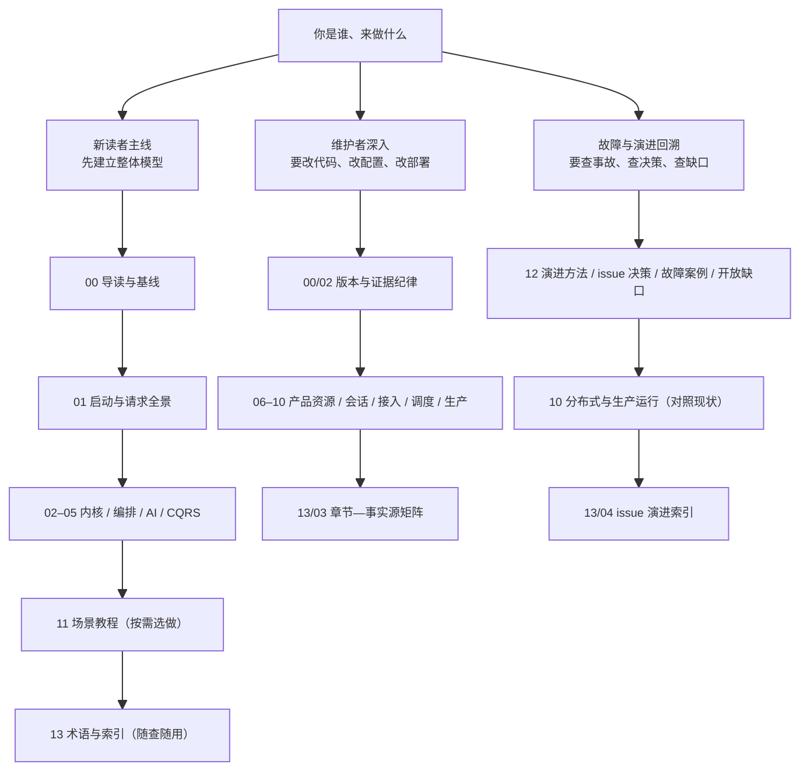
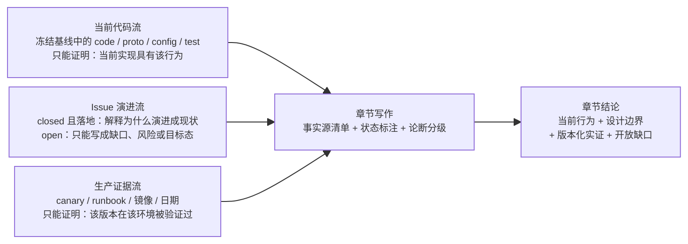

# 全书阅读指南：三条路线与证据纪律

> 版本与结论：本章描述 `current`；当前行为以 `f02aa690` 为准。全书按读者类型分三条路线阅读；每一章的论断都绑定一个冻结的上游 commit 和一种章节状态，先看清这两者再采信任何数字与结论。

## 设计抽象与事实源

- `docs/canon/overview.md:16`：上游 canon 声明的统一读写链路（Command → EventEnvelope → Domain Event → Projection → ReadModel），是本书 00–05 主线章节的组织脊柱。
- `docs/canon/architecture.md:9`：上游 canon 自称"基于当前仓库代码"描述设计，本书"论断必须绑定具体 commit"的纪律由此放大而来。
- `README.md:3`：上游对 Aevatar 的定位句（多 Agent 协作系统，Actor + Event 运行内核），是三条阅读路线分流的事实起点。

## 先建立模型

这本书不是平铺的 wiki，而是一张有入口、有方向的路由表。全书共 14 个目录（`00`–`13`）、72 篇实质章节，按阅读视角分四层：主线（`00`–`05`）回答"系统当前是什么样"，深入（`06`–`10`）回答"产品、集成与生产怎么运转"，实践（`11`）回答"怎么亲手跑一遍"，演进与参考（`12`–`13`）回答"为什么变成这样、去哪查证"（设计文档按"主线 / 深入 / 实践演进与参考"三层划分，这里的四层只是把演进与参考展开陈述的阅读视角）。骨架与篇目由本仓库的[重构设计文档](../superpowers/specs/2026-07-25-aevatar-review-restructure-design.md) §5 冻结，逐章落地清单见[目标章节清单](../migration/2026-07-25-target-chapters.md)。

读者只有三种典型来意，对应三条路线：

三条路线的取舍逻辑：

- **新读者主线**沿"一次请求的生命周期"自顶向下：先在 `01` 看到 Host、API、Conversation、Turn、SSE 如何串联，再到 `02`–`05` 逐层下钻内核、编排、AI 执行与读侧。中途想动手就跳进 `11` 的教程，做完再回来。
- **维护者深入**默认你已经认可整体模型，直接从 `06`–`10` 的产品与生产语义切入；每一章的事实源清单就是你的代码入口，`13/03` 章节—事实源矩阵（`13/` 参考层落地后可直接跳转）是反向索引。
- **故障与演进回溯**从 `12` 开始：演进方法、按主题归档的 issue 决策、已退役组件、长期有效的故障案例、开放缺口都在这一层，必要时回到 `10` 对照生产现状。

## 沿一条链路走读

这本书最特殊的一条"链路"不在 Aevatar 运行时里，而在写作过程里：一个论断从证据到章节结论，必须走完三条独立证据流的汇合。理解它，就理解了为什么章节里的每个数字都绑定一个具体 commit。

三条证据流互不替代：

- **当前代码流**是唯一能为 `current` 论断背书的一手来源。代码与 canon 冲突时，以代码描述当前行为，并把冲突登记为 canon drift。
- **Issue 演进流**回答"为什么"。issue 的 open / closed 状态本身不证明实现状态：closed issue 找不到落地代码时不得进入当前设计；open issue 再重要也只能写成缺口或目标态。
- **生产证据流**回答"在哪被验证过"。生产 canary 只证明绑定 commit / 镜像 / 日期的那个部署版本，不能外推到当前 HEAD。

作为读者，你不需要重走这条链路，但你可以随时抽查它：每章开头的「设计抽象与事实源」就是该章最关键证据的索引，章末折叠的「论断—证据映射」是完整清单。证据等级与对账规则的完整定义在 [00/02 版本、证据与章节状态](02-version-evidence-and-status.md)。

## 为什么是它，不是别的

**为什么不写成跟随 HEAD 的活文档？** 这是最常见的替代方案：文档描述"最新代码"，读者默认永远新鲜。代价是论断无法审计——三个月后没人知道"当前"指的是哪一天，数量、端口、模块清单这类易漂移信息会静默失效。本书的选择是把每个论断冻结到一个 commit（frontmatter 的 `upstream_commit`）加一个核验日期（`verified_at`），换取任何结论都可回指、可重验。不变量是"可回指性"：宁可让文档显式过期，也不让它隐性说谎。代价是真实的：上游每次演进都需要重新核验与同步，这正是 `13` 参考层和章节—事实源矩阵存在的理由。

**为什么不按"教程 + 参考"两段式组织？** 另一种常见组织是前半教程、后半 API 参考。Aevatar 的复杂度不在 API 表面，而在职责边界（Envelope 与 StateEvent 之分、definition 与 run actor 之分、写侧事实与读侧投影之分）。纯教程会让读者"会跑但不知道为什么"，纯参考会让读者"知道每个零件但看不到整机"。所以本书把设计主线（`00`–`05`）置于教程（`11`）之前，教程只承担"把主线亲手验证一遍"的职责。

**为什么状态分四级而不是"新 / 旧"两级？** 两级标签会强迫"mixed"章节二选一：要么把历史包袱伪装成现状，要么把仍有效的主体连同历史一起打入冷宫。四级状态允许一章主体当前有效、同时显式隔离地携带历史或目标态片段，这是演进密集型项目的常态。

## 协议与状态深入

每篇实质章节的 frontmatter 是一份小契约，三个字段决定你该如何采信正文：

| 字段 | 含义 | 读者动作 |
|---|---|---|
| `status` | 本章论断的整体时效等级 | 决定能否当作使用指南 |
| `upstream_commit` | 论断绑定的冻结上游提交 | 对照事实源时用它定位代码 |
| `verified_at` | 本章最近一次证据核验日期 | 距今越久，越应先抽查事实源 |

四种状态的语义（定义见[重构设计文档](../superpowers/specs/2026-07-25-aevatar-review-restructure-design.md) §6.3）：

| 状态 | 含义 | 典型分布 |
|---|---|---|
| `current` | 当前设计与可用能力，可直接当使用指南 | `00`–`11` 的绝大多数章节 |
| `mixed` | 主体当前有效，但含明确隔离的历史或目标态片段 | 含退役边界、生产 canary 或待落地能力的章节 |
| `historical` | 只保留长期设计教训，不可作为使用指南 | `12` 的演进方法与退役组件 |
| `target` | 尚未落地，只存在于演进层 | `12/05` 开放缺口 |

两条硬性规则：`current` 章节不得让 open issue 或 Proposed ADR 主导正文；`historical` 与 `target` 章节不进入新读者默认主线——所以你在主线路线里读到的每一章，都承诺"主体可采信"。`mixed` 与 `current` 的区别只在于：前者要求你注意章内明确标注的隔离段（"历史/已移除""目标态"字样），后者不需要这种警惕。

**教程到哪里结束，维护者细节从哪里开始？** `11` 的五篇教程（跑通最小 workflow、分支与工具、Team Member、Channel 与文件、Automation 排障）以"可复现"为终点：每篇给你一个能跑通的最小路径，不解释全部旋钮。教程中任何一个"想改默认行为"的念头，就是进入维护者路线的信号——资源与身份语义去 `06`，会话与多轮去 `07`，接入与凭证边界去 `08`，调度与密钥去 `09`，拓扑、授权、可观测性去 `10`。教程负责"会跑"，`06`–`10` 负责"敢改"。

## 最小示例

> Demo status：`verified-static`（纯阅读与对照操作，不需要启动任何服务；本仓库已把冻结基线物化在本地的 `.git/aevatar-frozen/` 下）

验证任意一章的事实基线，三步：

1. **读 frontmatter**。打开章节文件，记录 `upstream_commit`（已按新契约重写的章节一律为 `f02aa690bbebb9cabeac30a553d737486b0eb661`；迁移窗口内尚未重写的旧章没有 frontmatter，见「边界与演进」的诚实提醒）与 `verified_at`。
2. **读事实源清单**。章节开头「设计抽象与事实源」列出 1–3 条上游相对路径 + 行号锚点，例如本章的 `docs/canon/overview.md:16`。
3. **对照冻结基线**。在本仓库的 `.git/aevatar-frozen/<commit>/` 下打开对应路径，确认该行内容确实支撑章节论断；行号不得超出文件实际行数。本书的自动门禁（`check-md.sh`）对每一章做同样的校验：路径必须存在于冻结基线、行号锚点不得越界。

如果你在一章里发现论断找不到事实源、或事实源行号对不上内容，那不是你的理解问题，而是该章的缺陷——请按缺陷反馈。

## 边界与演进

- **当前**：本章描述的是 2026-07-25 冻结的新骨架——14 个目录、72 篇实质章节、四级状态、三条证据流。该骨架由[重构设计文档](../superpowers/specs/2026-07-25-aevatar-review-restructure-design.md)批准，篇目以[目标章节清单](../migration/2026-07-25-target-chapters.md)为准。
- **历史**：旧结构（`00`–`12`、85 篇、含"方案区/已知问题/周复盘"平行层）已退役；旧章节只有仍准确且有解释价值的内容迁入新结构，其余由 Git 历史归档。迁移期间的过渡说明见旧 `PLAN.md` 与迁移账本，不作为阅读入口。
- **迁移中的诚实提醒**：72 章逐篇落地期间，部分链接可能短暂指向尚未写出的章节（本章的路线图即包含这类前向引用）；这是迁移窗口的已知状态，最终验收会移除该宽限。若你读到的章节仍是旧骨架内容，以章内 frontmatter 与事实源清单是否存在来判断它是否已按新契约重写。
- **开放缺口**：`12/05` 汇总 open issues 与 canon drift；它们不预先创建 `current` 章节，待代码落地后再评估提升。

## 读完应能回答

1. 作为新读者 / 维护者 / 排查故障的人，我分别该按哪条路线读？
2. `mixed` 和 `current` 的区别是什么？为什么 `historical` 和 `target` 不进新读者主线？
3. 为什么章节里的数字和论断都绑定一个具体 commit，而不是跟随上游 HEAD？
4. 教程（`11/`）读完后，维护者视角的细节从哪里接着读？
5. 给我任意一章，我如何用三步验证它的事实基线？

论断—证据映射

| 论断 | 等级 | 证据 |
|---|---|---|
| Aevatar 的统一读写链路是 Command → EventEnvelope → Domain Event → Projection → ReadModel，本书主线按此组织 | E2 | `docs/canon/overview.md:16` |
| 上游 canon 以"当前仓库代码"为描述基准，绑定 commit 的写法是对该立场的强化 | E2 | `docs/canon/architecture.md:9` |
| Aevatar 定位为多 Agent 协作系统（Actor + Event 内核 + Workflow YAML 编排） | E2 | `README.md:3` |
| 全书骨架为 14 个目录、72 篇实质章节，分主线 / 深入 / 实践 / 演进与参考四层 | 本仓库设计契约 | [重构设计文档 §5](../superpowers/specs/2026-07-25-aevatar-review-restructure-design.md)、[目标章节清单](../migration/2026-07-25-target-chapters.md) |
| 四种章节状态的语义与"current 不得被 open issue 主导、historical/target 不进主线"两条规则 | 本仓库设计契约 | [重构设计文档 §6.3](../superpowers/specs/2026-07-25-aevatar-review-restructure-design.md) |
| 三条证据流（当前代码 / issue 演进 / 生产证据）独立汇合为章节结论，生产证据不得外推 HEAD | 本仓库设计契约 | [重构设计文档 §7、§8.1](../superpowers/specs/2026-07-25-aevatar-review-restructure-design.md) |

