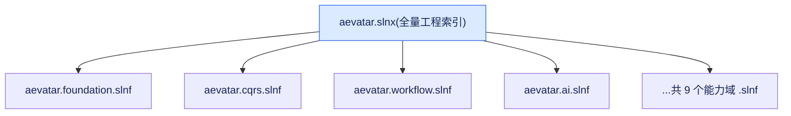
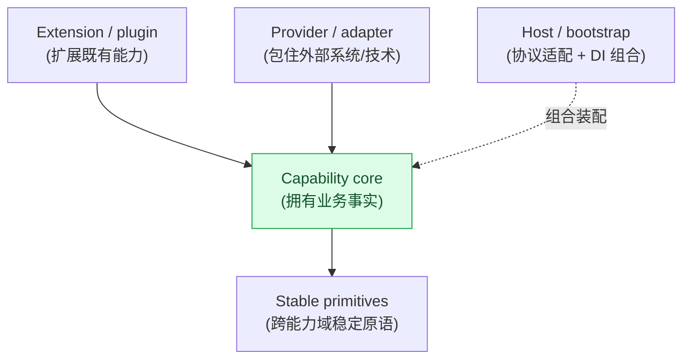

# 仓库地图：从 `aevatar.slnx` 到能力域工作面

## 本篇涉及的设计抽象

> 以下论断均可回指 `~/Code/aevatar` 源码验证,但本篇用设计语言描述,不贴文件路径/行号。

## 先看哪张图

`aevatar.slnx` 是全量工程索引；9 个 `aevatar.*.slnf` 是按能力域切出来的工作面。读仓库时不要把 `.slnf` 当成 IDE 个人收藏夹，它们表达的是“我今天要改哪个能力域，就只打开这组项目和对应测试”的边界。

这和 `module-placement-map` 的顺序是一致的：先找事实拥有者，再找写入口，再找读侧，最后才看 provider/bootstrap。也就是说，项目地图不是从文件名前缀硬猜职责，而是从 actor/domain owner、Application command/query、Projection/readmodel、Infrastructure/provider、Host/bootstrap 这些位置来定位。

## SolutionSliceTable

| 工作面 | 当前项目数 | 主要覆盖 | 怎么用 |
|---|---:|---|---|
| `aevatar.slnx` | 全量 | `src/`、`agents/`、`test/`、docs 资源 | 做全仓构建、全局搜索、改跨域契约时打开。 |
| `aevatar.foundation.slnf` | 16 | Foundation runtime、Core、VoicePresence 及对应测试 | 改 Actor/Runtime/Stream、状态守卫、语音 presence 等稳定原语时打开。 |
| `aevatar.cqrs.slnf` | 8 | CQRS Core、Projection Core、Foundation Projection 及对应测试 | 改命令骨架、Projection lifecycle、readmodel store 抽象时打开。 |
| `aevatar.workflow.slnf` | 15 | Workflow Core/Application/Host/Projection、AGUI adapter、Maker extension、Workflow 测试 | 改 YAML 编排、run actor、step module、实时输出时打开。 |
| `aevatar.ai.slnf` | 10 | AI abstractions/core、LLM providers、部分 tool providers、AI 测试 | 改 LLM 调用、tool discovery、role/tool 基础能力时打开。 |
| `aevatar.capabilities.slnf` | 15 | Mainnet 组合、Configuration、Capabilities、Bootstrap、Workflow Host、Scripting 入口片段 | 看默认生产入口和能力装配时打开。 |
| `aevatar.distributed.slnf` | 9 | Foundation Runtime 的 Local/Orleans/Streaming/Kafka/Hosting 组合 | 改分布式 runtime provider、transport、hosting glue 时打开。 |
| `aevatar.agents.slnf` | 3 | Authoring、Scheduled、Device 这类 agents 能力 | 改 agents 目录下的独立业务 GAgent 时打开。 |
| `aevatar.channels.slnf` | 5 | Channel abstractions、NyxId relay、Channel runtime、Channel tests | 改 IM/channel runtime 协议和测试时打开。 |
| `aevatar.platforms.slnf` | 5 | Lark/Telegram platform agents 及测试 | 改具体平台适配器时打开。 |

为什么按能力域拆 solution filter，而不是只保留一个大 solution？

1. `aevatar.slnx` 保留全局一致性，适合最终构建和跨域影响面检查。
2. `.slnf` 保留局部工作面，适合让改动者只加载当前能力域的核心项目、provider 和测试。
3. 这些切片大多跨越“抽象、核心、provider、host、test”，正好对应一条能力的完整闭环，而不是按技术层孤立拆开。
4. 对 review 来说，`.slnf` 也是边界提示：如果改 Workflow 却必须打开 AI、CQRS、Foundation 以外的大量无关项目，通常说明依赖方向需要重新检查。

## ProjectLayerMap

下表覆盖当前 `src/` 下 98 个 `.csproj`。层级口径来自 `module-placement-map`：Stable primitives 只放跨能力域稳定原语；Capability core 拥有业务事实；Extension/plugin 扩展既有能力；Provider/adapter 包住外部系统或技术实现；Host/bootstrap 只做协议适配、DI 组合和运行参数配置。

| 项目 | 层 / 能力域 | 职责 | 依赖约束 |
|---|---|---|---|
| `Aevatar.AGUI.Contracts` | Boundary contract / AGUI | AGUI 输出和边界 DTO 契约。 | 只承载协议形状，不拥有 Workflow 或 AI 事实。 |
| `Aevatar.AI.Abstractions` | Stable AI contract | LLM、tool、role 相关抽象。 | 上层能力依赖抽象；provider 不反向改写业务语义。 |
| `Aevatar.AI.Core` | AI capability core | `RoleGAgent`、ChatRuntime、tool loop 等 AI 执行核心。 | 可依赖 Foundation 与 AI abstractions；不硬绑具体 LLM provider。 |
| `Aevatar.AI.Infrastructure.Local` | Provider/adapter | 本地 AI 基础设施实现。 | 仅作技术适配，不成为业务事实源。 |
| `Aevatar.AI.LLMProviders.MEAI` | Provider/adapter | Microsoft.Extensions.AI provider。 | Provider 只实现抽象，不让 Application 按 provider 分叉。 |
| `Aevatar.AI.LLMProviders.NyxId` | Provider/adapter | NyxId LLM 接入。 | NyxId payload 在 adapter 边界映射成内部契约。 |
| `Aevatar.AI.LLMProviders.Tornado` | Provider/adapter | Tornado LLM 接入。 | 与其他 provider 并列，不能成为唯一业务路径。 |
| `Aevatar.AI.Projection` | Projection/readmodel | 通用 AI 事件 reducer 和投影扩展。 | 只处理通用 AI event shape；能力 readmodel 归 owning capability。 |
| `Aevatar.AI.ToolProviders.AevatarInvocation` | Extension/provider | Aevatar 内部调用类工具。 | 跨能力调用走 typed command/event 或公开契约。 |
| `Aevatar.AI.ToolProviders.AgentCatalog` | Extension/provider | Agent catalog 工具。 | catalog 查询不能替代 registry/admission 权威。 |
| `Aevatar.AI.ToolProviders.Binding` | Extension/provider | tool binding 能力。 | binding 只描述工具接入，不拥有 run/session 事实。 |
| `Aevatar.AI.ToolProviders.Channel` | Extension/provider | Channel 工具调用。 | Channel 事实归 channel/conversation owner；工具只做适配。 |
| `Aevatar.AI.ToolProviders.ChannelAdmin` | Extension/provider | Channel 管理工具。 | 管理动作必须走授权后的 typed surface。 |
| `Aevatar.AI.ToolProviders.ChronoStorage` | Extension/provider | ChronoStorage 工具接入。 | 外部存储不决定业务完成态。 |
| `Aevatar.AI.ToolProviders.Lark` | Extension/provider | Lark 工具接入。 | Lark SDK payload 停在 provider 边界。 |
| `Aevatar.AI.ToolProviders.MCP` | Extension/provider | MCP 工具接入。 | MCP 工具暴露需受 role/tool allowlist 约束。 |
| `Aevatar.AI.ToolProviders.NyxId` | Extension/provider | NyxId 工具接入。 | 外部身份和服务结果映射为内部 typed contract。 |
| `Aevatar.AI.ToolProviders.Ornn` | Extension/provider | Ornn 技能工具接入。 | skill 执行结果只有经 owning actor commit 后才成事实。 |
| `Aevatar.AI.ToolProviders.Scripting` | Extension/provider | Scripting 工具接入。 | 调用 Scripting 能力时走其 Application/command 边界。 |
| `Aevatar.AI.ToolProviders.ServiceInvoke` | Extension/provider | 服务调用工具。 | 不提供绕过 capability admission 的通用后门。 |
| `Aevatar.AI.ToolProviders.Skills` | Extension/provider | Skills 工具接入。 | skill discovery 与执行策略不能泄漏进 AI core。 |
| `Aevatar.AI.ToolProviders.Telegram` | Extension/provider | Telegram 工具接入。 | 平台 payload 停在 provider/adapter 层。 |
| `Aevatar.AI.ToolProviders.ToolSetRegistry` | Extension/provider | Tool set registry 工具。 | registry 查询不替代 command admission。 |
| `Aevatar.AI.ToolProviders.Web` | Extension/provider | Web 工具接入。 | 网络 I/O 不进入 AI core 的稳定语义。 |
| `Aevatar.AI.ToolProviders.Workflow` | Extension/provider | Workflow 工具接入。 | Workflow 调用必须回到 Workflow Application/command surface。 |
| `Aevatar.Authentication.Abstractions` | Boundary contract / Auth | 鉴权抽象与身份契约。 | 业务能力消费 typed identity，不消费外部 payload bag。 |
| `Aevatar.Authentication.Hosting` | Host/bootstrap | 鉴权 middleware 与 host 注册。 | Host 组合鉴权，不持有业务事实。 |
| `Aevatar.Authentication.Providers.NyxId` | Provider/adapter | NyxId 鉴权 provider。 | NyxId 细节停在 provider 边界。 |
| `Aevatar.Bootstrap.Extensions.AI` | Host/bootstrap | AI 能力 bootstrap 扩展。 | 只负责注册组合，不写 AI 业务流程。 |
| `Aevatar.Bootstrap` | Host/bootstrap | 默认 host 能力组合。 | 组合能力，不成为新 domain owner。 |
| `Aevatar.CQRS.Core.Abstractions` | Stable primitives / CQRS | command、dispatch、receipt 抽象。 | 只放通用命令骨架，不放业务 case。 |
| `Aevatar.CQRS.Core` | Stable primitives / CQRS | CQRS command skeleton 实现。 | ACK/dispatch 语义保持通用，业务完成态由 owning actor 决定。 |
| `Aevatar.CQRS.Projection.Core.Abstractions` | Stable primitives / Projection | projection lifecycle 抽象。 | 不定义具体 capability readmodel。 |
| `Aevatar.CQRS.Projection.Core` | Stable primitives / Projection | Projection scope/session/materialization 核心。 | scope actor 是运行态事实源；Host 不保留影子注册表。 |
| `Aevatar.CQRS.Projection.Providers.Elasticsearch` | Provider/adapter | Elasticsearch readmodel provider。 | 搜索存储是物化目标，不决定业务权威。 |
| `Aevatar.CQRS.Projection.Providers.InMemory` | Provider/adapter | InMemory readmodel provider。 | 只适合开发测试默认，不作为生产容量边界。 |
| `Aevatar.CQRS.Projection.Providers.Neo4j` | Provider/adapter | Neo4j graph readmodel provider。 | 图查询来自已提交事实的投影。 |
| `Aevatar.CQRS.Projection.Runtime.Abstractions` | Stable primitives / Projection runtime | Projection runtime 抽象。 | runtime contract 不携带业务 DTO。 |
| `Aevatar.CQRS.Projection.Runtime` | Stable primitives / Projection runtime | Projection runtime 实现。 | 复用 Projection Core 生命周期，不开第二套链路。 |
| `Aevatar.CQRS.Projection.Stores.Abstractions` | Stable primitives / Projection store | readmodel store 抽象。 | store contract 表达持久化语义，不表达业务完成。 |
| `Aevatar.Capabilities` | Capability composition | 平台能力组合入口。 | 只组织能力注册，不抢 owning capability 的事实。 |
| `Aevatar.ChatRouting.Abstractions` | Boundary contract / ChatRouting | chat route policy 抽象。 | route policy 是配置权威，不是 hot-path 转发 actor。 |
| `Aevatar.ChatRouting.Core` | Capability core / ChatRouting | chat routing core 逻辑。 | 入口边界解析瞬时决策，不持久化 run 事实。 |
| `Aevatar.Configuration` | Host/config boundary | 配置读取与绑定。 | 配置可注入 provider/host，不成为业务状态。 |
| `Aevatar.Foundation.Abstractions` | Stable primitives / Foundation | Agent、Actor、Runtime、Stream、Store 抽象。 | 只收稳定跨域原语。 |
| `Aevatar.Foundation.Core` | Stable primitives / Foundation | `GAgentBase`、pipeline、StateGuard、run context。 | 不复刻 Workflow 编排能力。 |
| `Aevatar.Foundation.ExternalLinks.WebSocket` | Provider/adapter | WebSocket external link。 | 传输适配不拥有 actor/domain fact。 |
| `Aevatar.Foundation.Projection` | Stable projection contract | Foundation 级 readmodel 公共字段和能力接口。 | 只放最小公共投影语义。 |
| `Aevatar.Foundation.Runtime.Hosting` | Host/bootstrap | runtime provider host 注册。 | 选择 runtime，不让上层依赖具体实现。 |
| `Aevatar.Foundation.Runtime.Implementations.Local` | Provider/adapter / Runtime | Local ActorRuntime 实现。 | Local/InMemory 仅作开发测试基线。 |
| `Aevatar.Foundation.Runtime.Implementations.Orleans.Streaming` | Provider/adapter / Runtime | Orleans streaming 实现。 | 保持 `IActorRuntime` 等同一组原语。 |
| `Aevatar.Foundation.Runtime.Implementations.Orleans.Transport.KafkaProvider` | Provider/adapter / Runtime | Kafka transport provider。 | transport 只承载 envelope 转发，不改业务主链。 |
| `Aevatar.Foundation.Runtime.Implementations.Orleans` | Provider/adapter / Runtime | Orleans ActorRuntime 实现。 | 分布式下仍保证 actorId 级串行与单激活语义。 |
| `Aevatar.Foundation.Runtime.Persistence.Implementations.Garnet` | Provider/adapter / Persistence | Garnet 持久化实现。 | 持久化 provider 不拥有业务完成态。 |
| `Aevatar.Foundation.Runtime` | Stable primitives / Runtime | runtime 通用层、stream、store、observability。 | 通用 runtime 能力不引入业务流程。 |
| `Aevatar.Foundation.VoicePresence.Abstractions` | Boundary contract / VoicePresence | voice presence 抽象。 | raw media 不进入 committed event/readmodel。 |
| `Aevatar.Foundation.VoicePresence.MiniCPM` | Provider/adapter / VoicePresence | MiniCPM voice provider。 | provider 映射媒体/控制流，不持业务事实。 |
| `Aevatar.Foundation.VoicePresence.OpenAI` | Provider/adapter / VoicePresence | OpenAI voice provider。 | provider 与 MiniCPM 并列，不改变 voice port 语义。 |
| `Aevatar.Foundation.VoicePresence` | Capability core / VoicePresence | voice presence 核心逻辑。 | 控制事实 actor-owned；媒体流保持 volatile port。 |
| `Aevatar.Mainnet.Host.Api` | Host/bootstrap | 默认生产入口、HTTP/SSE/WS 组合。 | Host 只做协议适配和能力装配。 |
| `Aevatar.Scripting.Abstractions` | Boundary contract / Scripting | scripting contract。 | 定义能力边界，不运行脚本业务事实。 |
| `Aevatar.Scripting.Application` | Application / Scripting | scripting command/query facade。 | 外部入口先到 Application，不绕进 actor state。 |
| `Aevatar.Scripting.Core` | Capability core / Scripting | script actor/domain owner。 | scripting facts 归 scripting GAgent。 |
| `Aevatar.Scripting.Hosting` | Host/bootstrap | scripting host 注册与边界适配。 | Host 不编排脚本业务流程。 |
| `Aevatar.Scripting.Infrastructure` | Provider/adapter / Scripting | Roslyn、artifact loading、技术端口实现。 | 编译和 I/O 细节不泄漏进 Application contract。 |
| `Aevatar.Scripting.Projection` | Projection/readmodel / Scripting | scripting readmodel 和投影。 | 只消费 committed scripting facts。 |
| `Aevatar.Studio.Application.Abstractions` | Boundary contract / Studio | Studio application contract。 | UI/product 契约不改下层 capability 权威。 |
| `Aevatar.Studio.Application` | Application / Studio | Studio 产品 command/query facade。 | 组合下层能力端口，不绕过它们的 admission。 |
| `Aevatar.Studio.Domain` | Capability core / Studio | Studio domain facts。 | 不重新定义 Workflow/Scripting/Registry 权威。 |
| `Aevatar.Studio.Hosting` | Host/bootstrap | Studio endpoint 和 DI 注册。 | Host 只暴露产品入口。 |
| `Aevatar.Studio.Infrastructure` | Provider/adapter / Studio | Studio persistence/external adapter。 | 外部系统 payload 映射后再进入 Application。 |
| `Aevatar.Studio.Projection` | Projection/readmodel / Studio | Studio readmodel。 | readmodel 是查询副本，不授权写命令。 |
| `Aevatar.GAgentService.Abstractions` | Boundary contract / GAgentService | registry/service contract。 | actor id 与 admission 语义保持 typed contract。 |
| `Aevatar.GAgentService.Application` | Application / GAgentService | registry command/query facade。 | admission 与 list query 分开。 |
| `Aevatar.GAgentService.Core` | Capability core / GAgentService | registry/scope owner core。 | registry facts 归明确 modeled authority。 |
| `Aevatar.GAgentService.Governance.Abstractions` | Boundary contract / Governance | governance contract。 | contract 不携带 provider 细节。 |
| `Aevatar.GAgentService.Governance.Application` | Application / Governance | governance command/query facade。 | command admission 不走 readmodel shortcut。 |
| `Aevatar.GAgentService.Governance.Core` | Capability core / Governance | governance domain owner。 | governance facts 由 core/actor 拥有。 |
| `Aevatar.GAgentService.Governance.Hosting` | Host/bootstrap / Governance | governance host 注册。 | 只做 endpoint/DI composition。 |
| `Aevatar.GAgentService.Governance.Infrastructure` | Provider/adapter / Governance | governance persistence/adapter。 | 技术实现不改变 core 契约。 |
| `Aevatar.GAgentService.Governance.Projection` | Projection/readmodel / Governance | governance readmodel。 | readmodel 来自 committed governance facts。 |
| `Aevatar.GAgentService.Hosting` | Host/bootstrap / GAgentService | service endpoint 和 DI 注册。 | Host 不持 registry 权威状态。 |
| `Aevatar.GAgentService.Infrastructure` | Provider/adapter / GAgentService | registry persistence/provider。 | provider 不替代 registry owner。 |
| `Aevatar.GAgentService.Projection` | Projection/readmodel / GAgentService | registry readmodel。 | 查询副本不能授权 command admission。 |
| `Aevatar.Workflow.Abstractions` | Boundary contract / Workflow | workflow contract。 | 只定义边界 DTO 和抽象。 |
| `Aevatar.Workflow.Application.Abstractions` | Boundary contract / Workflow Application | workflow Application contract。 | Host 依赖此层，不依赖 Core internals。 |
| `Aevatar.Workflow.Application` | Application / Workflow | chat、resume、signal、query facade。 | 命令先到 Application，再 dispatch 到 owning actor。 |
| `Aevatar.Workflow.Core` | Capability core / Workflow | `WorkflowGAgent`、`WorkflowRunGAgent`、step modules、execution state。 | Workflow facts 归 actor；不反向依赖 Maker plugin。 |
| `Aevatar.Workflow.Host.Api` | Host/bootstrap / Workflow | Workflow HTTP/SSE/WS 入口。 | 只做协议适配，不执行 workflow business logic。 |
| `Aevatar.Workflow.Infrastructure` | Provider/adapter / Workflow | workflow IO 和 adapter 实现。 | 技术细节停在 infrastructure。 |
| `Aevatar.Workflow.Integration.AI` | Extension/integration | Workflow 与 AI 能力集成。 | 集成层不让 Workflow Core 依赖具体 provider。 |
| `Aevatar.Workflow.Presentation.AGUIAdapter` | Presentation adapter / Workflow | envelope 到 AGUI/run-event 映射。 | 实时输出复用 projection 输入，不直接读写 state。 |
| `Aevatar.Workflow.Projection` | Projection/readmodel / Workflow | current-state、artifact、timeline、graph 投影。 | 只消费 workflow actor committed facts/envelope。 |
| `Aevatar.Workflow.Sdk` | Boundary SDK / Workflow | client-facing SDK。 | SDK 不拥有 server-side facts。 |
| `Aevatar.Workflow.Studio` | Integration / Workflow + Studio | Workflow 到 Studio 的产品集成。 | 集成下层端口，不建立第二套 workflow authority。 |
| `Aevatar.Workflow.Extensions.Hosting` | Extension/bootstrap / Workflow | workflow extension 注册入口。 | extension 通过 module pack 注册，不改 Core 反向依赖。 |
| `Aevatar.Workflow.Extensions.Maker` | Extension/plugin / Workflow | `maker_recursive`、`maker_vote` 模块。 | Maker 是 Workflow 插件，不是独立 host/capability。 |
| `Aevatar.Workflow.Extensions.Schedules` | Extension/plugin / Workflow | schedule/trigger 扩展模块。 | 定时触发回到 owning actor event，不直接改状态。 |

## 读这张地图时的几个判断

1. 文件名前缀只能帮你初筛，真正的落点要看事实拥有者。比如 `Aevatar.Workflow.Presentation.AGUIAdapter` 听起来像 presentation，但它的约束来自 Projection：实时输出共享 envelope 输入，而不是直接把 actor state 推给前端。
2. Host 项目不是业务层。`Aevatar.Mainnet.Host.Api` 和 `Aevatar.Workflow.Host.Api` 都应该只做协议、鉴权、DI、配置和输出适配。
3. Provider 项目不是事实源。NyxId、Lark、Telegram、Elasticsearch、Neo4j、Garnet、Kafka 这类名字出现时，默认先问“它映射到哪个内部 typed contract”，不要让外部 payload 进入核心层。
4. Extension/plugin 不能偷偷长成第二套主链。Maker 的落点是 `Aevatar.Workflow.Extensions.Maker`，它贡献 Workflow module，不反向支配 Workflow Core。

## 最小使用路径

- 要理解一条请求怎么流过系统：先看 `overview`，再按 `aevatar.workflow.slnf` 打开 Workflow 工作面。
- 要改 Actor/Runtime/Stream：从 `aevatar.foundation.slnf` 开始，必要时再打开 `aevatar.distributed.slnf`。
- 要改 readmodel 或实时输出：从 `aevatar.cqrs.slnf` 和 `aevatar.workflow.slnf` 的 Projection 项目交叉看。
- 要接新 LLM 或工具：先看 `aevatar.ai.slnf`，再确认 provider 结果是否需要通过 owning capability commit 成事实。
- 要改生产入口：看 `aevatar.capabilities.slnf` 和 `Aevatar.Mainnet.Host.Api`，但不要把业务流程写进 Host。
