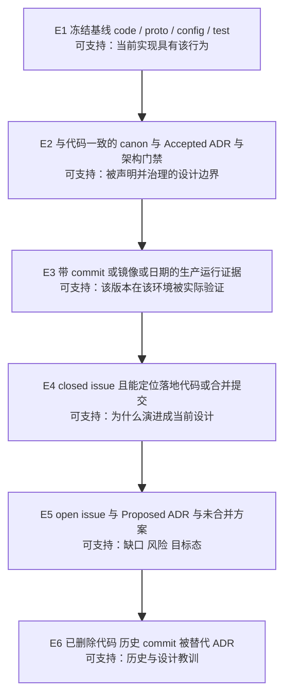
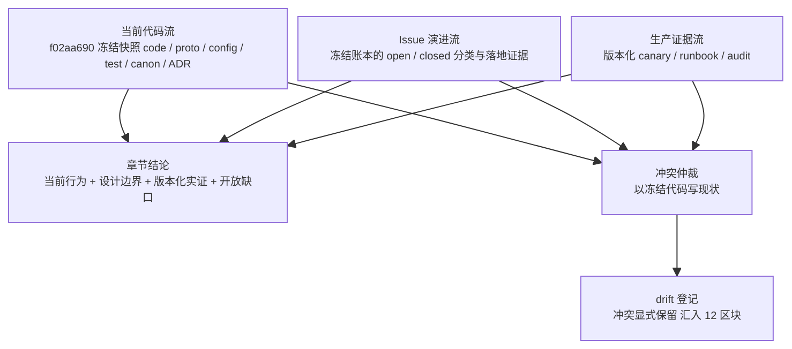
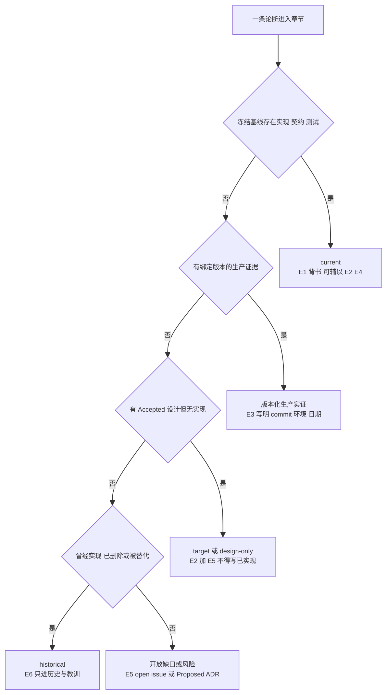

# 版本基线与证据等级：全书论断的可信度规则

> 版本与结论：本章描述 `current`；当前行为以 `f02aa690` 为准。本章是全书的"元规则"：之后每一章的每一条论断都必须能回答"你的证据等级是多少"；当 code / canon / issue / 生产四类事实冲突时，以冻结基线代码描述现状，并把冲突登记为 drift，而不是合成一个更整齐但不真实的结论。

## 设计抽象与事实源

- `AGENTS.md:34`：上游冻结基线的"事实源唯一"条款——跨请求/跨节点的一致性事实必须有唯一权威来源，不依赖进程内偶然状态。本书把同一条款搬到文档侧：全书"当前实现"的事实源只有一个，即冻结基线快照。
- `AGENTS.md:39`：上游"治理前置"条款——架构规则必须可自动化验证，避免依赖口头约定。本书的证据规则不靠自觉，落成四项门禁（结构、链接、Mermaid、占位符）。
- `docs/adr/0034-workflow-saga-compensation-protocol.md:3`：ADR frontmatter 的 `status: proposed` 头。status 头是 ADR 治理状态的权威载体；一个 proposed 实例恰好证明"存在 ADR 文件"不等于"已被治理接受的设计边界"。

## 先建立模型：E1–E6 证据等级

本书把每条论断的证据分成六档。等级的意义在于**限定论断允许说什么**：证据等级不够，论断就必须降级（改写成 target / 缺口 / 历史），不允许补全想象。

上图从 E1 到 E6 的顺序不是"可信度排行榜"，而是**论断权限的边界**。三条关键语义：

- **只有 E1 能为 `current` 背书。** E2 / E4 可以补充设计约束与演进原因，但不能单独支撑"当前实现如此"。这是全书使用频次最高的一条规则。
- **E2 的判定靠治理状态，不靠文件存在。** canon 以 status 头声明 active（实例：`docs/canon/architecture.md:3` 的 `status: active`）；ADR 以 status 头区分 accepted 与 proposed。`docs/adr/0034-workflow-saga-compensation-protocol.md:3` 是 proposed，因此 ADR-0034 的内容在本书中只能按 E5（目标态 / 提案）使用，不能当作既定设计边界。
- **E3 永远绑定版本。** 生产证据必须写明 commit / 镜像 / 日期 / 环境，结论只覆盖"那个版本在那个环境"，不外推。

这套等级与上游"变更必须可验证"（`AGENTS.md:14`）的条款同构：上游要求代码变更可验证，本书要求文档论断可验证。

## 沿一条链路走读：三条独立证据流

一条章节结论不是单一来源的产物，而是三条**相互独立**的证据流汇合的结果。独立意味着：任何一条流都不能代替另一条流作证，任何两条流冲突都不能被悄悄抹平。

三条流各自回答一个不同的问题：

- **当前代码流**回答"f02aa690 现在是什么"。它是现状的唯一权威。
- **Issue 演进流**回答"为什么变成这样、哪些问题仍未解决"。issue 的 open / closed 状态**本身不证明实现状态**——closed 无落地证据不得进 current，open 只能写成缺口 / 风险 / 目标态。
- **生产证据流**回答"哪个部署版本曾在真实环境中证明了什么"。canary 结论是版本化的，绑定 commit / 镜像 / 日期 / 环境，**不得外推到当前 HEAD**。

四类事实（code / canon / issue / 生产）冲突时的仲裁顺序是固定的：正文用冻结基线代码描述当前行为；issue 说已修但代码不支持的，归为 superseded 或 drift；canon 与代码冲突的，登记 canon drift 到 12 区块。**正文保留冲突本身**，不强行合成一个更整齐但不真实的结论——这是本书对"诚实"的操作化定义。

## 为什么是它，不是别的

**为什么冻结单一基线，而不是"写作时看一眼 live HEAD"？** 因为论断必须可回放。live HEAD 每天都在动，今天核验为真的句子明天就失去含义；读者无法复现作者的核验过程。冻结基线 f02aa690bbebb9cabeac30a553d737486b0eb661 物化为只读快照后，每条 current 论断的 E1 锚点都可以被任何人、在任何时间重新打开核对——这正是上游"事实源唯一"条款（`AGENTS.md:34`）在文档侧的对应物。代价是明显的：基线之后上游的新进展本书一律不认，必须以 re-baseline 的显式事件整体前进。

**为什么 issue tracker 状态不能当作实现真相？** 因为 closed 的语义本身就是多义的。本书迁移期对 154 个近期 closed issue 逐个分类（账本见本仓库 docs/migration/2026-07-25-issue-evidence-ledger.md），结果除了 landed-current（113 个）之外，还有 landed-superseded、design-only、ops-verified、duplicate、failed/abandoned、administrative 等类别——一个 closed 标记背后可能是"已实现"、"曾实现已删除"、"只落了文档"、"只是运维验证"甚至"看板操作"。若把 closed 直接读成"已实现"，这五类都会被误判。

**为什么不用"最新生产状态"当事实源？** 因为生产证明的是被部署的那个版本，不是仓库 HEAD。把 canary 结论外推到 HEAD，本质上是把 E3 冒充 E1。

**为什么证据规则要落成门禁而不是写作倡议？** 上游"治理前置"条款（`AGENTS.md:39`）已经给出答案：依赖口头约定的规则一定会在 deadline 前让步。本书把"引用的上游路径必须在冻结树真实存在、行号锚点不超界"做成机械校验，就是让 FI-001 式的立场——AI 产物默认不可信，须经验证——在文档流水线上可执行。

## 协议与状态深入

### 冻结基线协议：执行期间不移动

- 全书共用一个基线 commit：f02aa690bbebb9cabeac30a553d737486b0eb661，以只读快照形式物化，写作过程对快照**只读引用，零写权限**。
- 每章 frontmatter 的 `upstream_commit` 与 `verified_at` 是核验凭证：声明"这一章的 current 论断是在哪个基线、哪一天核验的"。
- **执行期间不移动基线。** 若上游必须前进，re-baseline 是一个显式事件：更换 commit、重新生成全部易漂移信息（数量、模块清单、默认端口、API 字段）、重核全书 verified_at。不允许"顺手用一下新 HEAD"式的悄悄移动——那会让不同章节的 current 指向不同事实。
- **正文同步例外（2026-08-03 登记）**：章节正文可随上游 HEAD（当前 `d9db826eb`，feature/integrate 末端）前进并声明"正文同步目标"，frontmatter 的 `upstream_commit`/`verified_at` 仍冻结在 f02aa690/2026-07-25 作为审查基线。采用该模式的章节必须在版本结论中同时注明两个基线（见 [01/01](../01/01-quick-start.md)、[07/02](../07/02-nyxid-chat-actor-model-and-progress.md)）；易漂移信息仍须按冻结基线核验，正文与冻结账本冲突处显式标注"以 HEAD 为准"。
- 易漂移信息一律从固定基线重新生成或核验，不凭记忆转写。

### 一条论断该写什么状态：决策树

注意决策树的顺序：先问实现（E1），再问生产（E3），再问设计（E2/E5），再问历史（E6），最后才落到开放缺口。**任何一级答"是"就停**，不允许用后面等级的材料把前面等级的"否"包装成"是"。

### 三种 demo 状态语义

每章最小示例必须标注三档之一，且只允许标注真实达到的那一档：

- `verified-static`：请求、YAML、字段和路径已按当前代码静态核验，但未实际运行。需要真实凭证、外部服务或生产权限而无法执行的 demo **一律**归此档，并说明缺失前提。
- `verified-local`：在本地实际运行过，正文记录命令和结果。
- `verified-production-versioned`：有指定版本、日期和环境的生产证据。

反例清单同样重要：编译通过、HTTP 202 Accepted、模型自述"已跑通"、历史 canary 记录，**都不能**冒充本次端到端运行结果。

## 最小示例

> Demo status：`verified-static`
>
> 缺失前提：issue 状态取自冻结账本成员（cutoff 时刻的静态记录），本示例未访问 live GitHub；未启动任何服务，全部证据为冻结树内的静态文件核验。

拿一条具体论断演示分层取证：**"定时调用凭证的 durable 语义是 vault 引用（typed reference），不再持久化 raw bearer。"**

**第一步，E1 定现状。** 在冻结基线打开 `src/platform/Aevatar.GAgentService.Core/Schedules/scheduled_dispatch_state.proto:260`：`ScheduledServiceInvocationAuthState` 的凭证来源已收敛为 `oneof source`，其中 `:262` 的 `durable = 6` 是 `ScheduledServiceInvocationDurableCredentialReferenceState` 类型——一个引用，不是 token 本体。同 message 内 `:257` 的旧字段 `durable_sender_bearer_token = 2` 标记 deprecated，注释明确它是只读哨兵：reducer 不得把旧事件里的 raw bearer 拷入当前状态或运行时 dispatch。E1 成立，论断可以写 current。

**第二步，E2 定设计边界。** `docs/adr/0037-scheduled-invocation-credential-source-model.md:3` 的 status 头是 accepted，且 `:52` 写明"存来源/引用，不存 raw token"。这证明"typed reference、不落 secret"不只是某次提交的偶然形态，而是被治理接受的设计约束。

**第三步，E4 定演进原因。** closed issue #2688（标题即"定时调用凭证：修订 ADR-0037——durable 语义更正为 vault 引用（硬前置）"）解释了这次语义更正为什么发生。但注意冻结账本把 #2688 分类为 **design-only**：它的交付物是 ADR 修订这份文档本身，不是运行时代码。这恰好演示了本章的禁区——**"issue 关闭即证明实现"是错误推断**。#2688 的 closed 证明的是"语义更正被治理接受"（E4 演进原因 + E2 设计边界），而"当前实现具有该行为"始终由 proto 的 E1 背书。

**第四步，演示论断降级。** 若把论断升级为"fire 时 durable reference 已兑换为短 token"，E1/E2 就不够了：ADR-0037 自己把兑换行为划给后续阶段（`:39` 的 Decision 条目与 `:132` 的 Phase 3），proto 只能证明 state 里存的是引用。在找到兑换链路的实现证据之前，这个升级版论断只能写 target——这一步只演示降级规则本身，不对兑换链路在当前基线的实现状态下结论。

## 边界与演进

- **current**：E1–E6 等级表、三条证据流与冲突仲裁、冻结基线协议、三种 demo 状态——这些是全书执行期的有效规则，本身在冻结基线与本书迁移账本上可核验。
- **生产实证**：本书允许 E3 进入正文，但只以版本化形式（commit / 镜像 / 日期 / 环境）出现；本章不列举具体 canary，各章自行按版本化格式登记。
- **open gap**：drift 与缺口不是被消灭，而是被显式安置——canon drift 与各章开放缺口集中汇入 12 区块；E5 材料只能以缺口 / 风险 / 目标态身份进正文。
- **historical**：E6（已删除代码、历史 commit、被替代 ADR）只进入历史演进与设计教训，不为任何现状论断背书；被替代组件的退役叙事见 12 区块相应章节。

## 读完应能回答

1. 一条 `current` 论断最低需要什么等级的证据？为什么 E2 / E4 不能单独支撑 current？
2. code / canon / issue / 生产四类事实冲突时，正文怎么写、冲突登记到哪里？
3. 为什么 closed issue 不能单独证明实现？能用冻结账本中的 #2688 说明 closed 的多义性吗？
4. 生产 canary 结论怎样写才合法？为什么不能外推到当前 HEAD？
5. 三种 demo 状态各自的语义是什么？哪些"看似成功"的信号不能冒充运行结果？

论断—证据映射

| 论断 | 等级 | 证据 |
|---|---|---|
| 全书"当前实现"事实源唯一，即冻结基线快照 | E1（上游条款） | `AGENTS.md:34` |
| 证据规则必须自动化验证而非口头约定 | E1（上游条款） | `AGENTS.md:39`、`AGENTS.md:14` |
| ADR 以 status 头承载治理状态；proposed 不构成设计边界 | E1 | `docs/adr/0034-workflow-saga-compensation-protocol.md:3` |
| canon 以 status 头声明 active | E1 | `docs/canon/architecture.md:3` |
| 定时调用凭证来源收敛为 oneof，durable 是 typed reference | E1 | `src/platform/Aevatar.GAgentService.Core/Schedules/scheduled_dispatch_state.proto:260,262` |
| 旧 raw bearer 字段退役为 deprecated 只读哨兵 | E1 | `src/platform/Aevatar.GAgentService.Core/Schedules/scheduled_dispatch_state.proto:257` |
| durable 语义更正为 vault 引用已被治理接受 | E2 | `docs/adr/0037-scheduled-invocation-credential-source-model.md:3,52` |
| durable reference 的 fire 兑换属后续阶段，现论断只能写 target | E2 | `docs/adr/0037-scheduled-invocation-credential-source-model.md:39,132` |
| #2688 closed 的交付物是 ADR 修订，分类 design-only | E4 | 本仓库冻结账本 docs/migration/2026-07-25-issue-evidence-ledger.md（cutoff 时刻静态成员行） |
| E1–E6 等级表与三流冲突仲裁规则 | E2（本书设计规范） | 本仓库 docs/superpowers/specs/2026-07-25-aevatar-review-restructure-design.md 第 7、8 节 |

