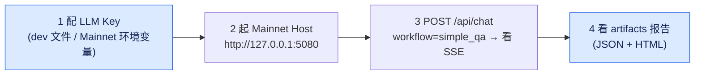
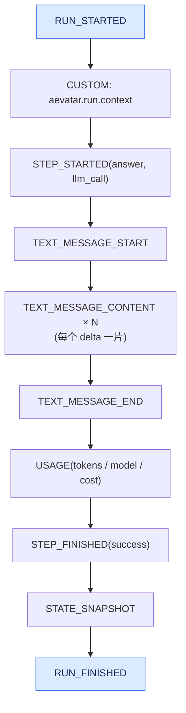

# Quick Start:从零跑起来 + simple_qa + 看 SSE/报告

## 本篇涉及的设计抽象

> 以下论断均可回指 `~/Code/aevatar` 源码验证,但本篇用设计语言描述,不贴文件路径/行号。

---

## 这篇解决什么

读者照着做完,能在本地:



1. 配好 LLM Key(知道 dev 和 Mainnet 的边界)。
2. 起 Mainnet Host,看到它监听 `http://127.0.0.1`。
3. 用 `simple_qa` workflow 发一次 chat 请求,看到 SSE 流逐帧滚出来。
4. 在 `artifacts/workflow-executions/` 找到这次运行的 JSON + HTML 报告。

> ⚠️ **边界声明**:`POST /api/chat` 在 Mainnet Host 的 README 被标注为“不再是 `aevatar app` 的官方运行契约”(scope-first `/api/scopes/{scopeId}/...` 是当前 app 契约)。但 `/api/chat` 作为**框架层 workflow 能力**仍由 `Aevatar.Workflow.Host.Api` 提供,是理解 aevatar workflow 运行态最快的一条路,所以本篇 Quick Start 用它。后续 [01/02](../01/02-chat-api-and-sse.md) 会展开 scope-first 与 chat 的关系。

---

## 第 1 步:配 LLM Key

aevatar 的 secrets 加载见 `AevatarConfigLoader`。它有**两套 store**,由 host 决定用哪套:

| 场景 | 用哪个 store | Key 怎么放 |
|---|---|---|
| 本地开发 / CLI / Workflow.Host | 本地文件 store(`~/.aevatar/secrets.json`) | 加密文件(AES-256-GCM,master key 在 macOS Keychain 或 `~/.aevatar/masterkey.bin`) |
| **Mainnet Host(生产)** | **环境变量 store(只读)** | `AEVATAR_` 前缀环境变量;`MainnetHostBuilderExtensions` 强制 `AllowLocalFileSecretsStore = false` |

API Key 的解析顺序(`AevatarSecretsStore.GetApiKey`),从高到低:

1. `LLMProviders:Providers:{name}:ApiKey`(agent-framework 格式)
2. `LLMProviders:{name}:ApiKey`
3. `{PROVIDER}_API_KEY`(如 `OPENAI_API_KEY`)

默认 provider 名由 `LLMProviders:Default` 决定。

**最小可跑做法(本地开发)**:如果你只是想跑通 `simple_qa`,最省事的是给 Workflow Host 用环境变量:

```bash
export AEVATAR_LLMProviders__Default="openai"
export AEVATAR_OPENAI_API_KEY="sk-..."
```

> 这两个变量会被 `AddEnvironmentVariables("AEVATAR_")` 捕获,`AEVATAR_` 前缀被剥掉后即标准配置路径。Mainnet Host 用同样的环境变量机制,只是**不允许**本地 `secrets.json` 文件回退。

---

## 第 2 步:起 Mainnet Host

入口在 `Program` 实际只有四行:

```csharp
builder.AddAevatarMainnetHost();
var app = builder.Build();
app.MapAevatarMainnetHost();
app.Run();
```

`AddAevatarMainnetHost()` 做了大量装配:强制顺序启动 hosted service(注释引用了一次 2026-06-03 的 CrashLoopBackOff 事故)、加载分布式 Orleans、组合 platform / tool provider / 认证等。本地开发不需要全部理解,先跑起来。

**最简启动**(本地,监听 `http://127.0.0.1`):

```bash
dotnet run --project ~/Code/aevatar/src/Aevatar.Mainnet.Host.Api
```

端口来自 `MainnetHostBuilderExtensions` 的 `LocalDevelopmentListenUrl = "http://127.0.0.1:5080"`;`ConfigureMainnetListenUrls` 在非容器环境下用这个 URL,除非你用 `ASPNETCORE_URLS` 或 `--urls` 覆盖。启动成功后,日志里会看到 `Now listening on: http://127.0.0.1`。

> 另外两种启动方式见 `src/Aevatar.Mainnet.Host.Api/README.md`:
> - `bash src/Aevatar.Mainnet.Host.Api/boot.sh`:后台启动 + 端口清理 + mode 标志,默认 `local` 模式;
> - `ASPNETCORE_ENVIRONMENT=PersistentLocal dotnet run ...`:Orleans + Garnet 持久化,接近生产语义。

---

## 第 3 步:发一次 simple_qa 请求,看 SSE 流

`workflows/simple_qa.yaml` 是仓库自带的最小 workflow:

```yaml
name: simple_qa
roles:
  - id: assistant
    name: Assistant
    system_prompt: "You are a helpful assistant."
steps:
  - id: answer
    type: llm_call
    role: assistant
```

一个 `assistant` 角色 + 一个 `llm_call` 步骤,没有路由、没有分支。它被 `WorkflowParser` 解析成 `WorkflowDefinition`,运行时派生一个 `WorkflowRunGAgent`,这个 run actor 创建一个 run-scoped `assistant` role actor 去调 LLM。

发请求(`POST /api/chat`,协议见 canon `chat-api`):

```bash
curl -N http://127.0.0.1:5080/api/chat \
  -H "Content-Type: application/json" \
  -d '{
    "prompt": "用一句话介绍 Actor 模型",
    "workflow": "simple_qa"
  }'
```

`curl -N` 关闭缓冲,让你实时看到 SSE 帧。请求体字段:

| 字段 | 必填 | 含义 |
|---|---|---|
| `prompt` | 是 | 用户输入 |
| `workflow` | 否 | 已注册的 workflow 名;不填走默认路由 `auto` |
| `source` | 否 | typed source,如 `{ "kind": "definition_actor", "definitionActor": { "actorId": "..." } }` |
| `workflowYamls` | 否 | 内联 YAML bundle,优先级最高 |

选择优先级:`workflowYamls` > `workflow` > 默认 `auto` > `source.definitionActor.actorId`。

### SSE 帧类型(逐帧)

事件类型常量在 `WorkflowRunEventTypes`(这是 SSOT)。`GetEventType` 把 proto `WorkflowRunEventEnvelope.EventOneofCase` 一一映射到这些常量。一次 `simple_qa` 运行,你会依次看到:



逐帧含义:

- `RUN_STARTED`:运行开始,`runId` 服务端生成(见 [01/03](../01/03-run-semantics.md))。
- `CUSTOM: aevatar.run.context`:运行上下文快照,携带 actorId / commandId / projection 信息。
- `STEP_STARTED`:`answer` 步骤开始。
- `TEXT_MESSAGE_START` → `TEXT_MESSAGE_CONTENT × N` → `TEXT_MESSAGE_END`:LLM 流式输出;每个 `delta` 是一个 token 片段,**分片数量和文本以本机实跑为准**(取决于模型、温度、请求)。
- `USAGE`:token 用量(这个常量在 `chat-api.md` 清单里没列,但代码里有)。
- `STEP_FINISHED`:步骤完成。
- `STATE_SNAPSHOT`:run 收敛后的状态快照,由 CQRS 通用交互服务经 `WorkflowRunFinalizeEmitter` 发出。
- `RUN_FINISHED`:运行结束。

> **完整事件类型清单**(`WorkflowRunEventTypes`):`RUN_STARTED`、`RUN_FINISHED`、`RUN_ERROR`、`RUN_STOPPED`、`STEP_STARTED`、`STEP_FINISHED`、`TEXT_MESSAGE_START`、`TEXT_MESSAGE_CONTENT`、`TEXT_MESSAGE_END`、`STATE_SNAPSHOT`、`TOOL_CALL_START`、`TOOL_CALL_END`、`USAGE`、`CUSTOM`。
>
> `chat-api.md` 还列了一个 `HUMAN_INPUT_REQUEST`,它出现在 canon 的投影流清单里,但不是 `WorkflowRunEventTypes` 的 typed 常量——在统一事件模型里,人工交互通过 `CUSTOM` 子类型(`aevatar.step.request` / `aevatar.step.completed` / `aevatar.workflow.waiting_signal`)表达。

### WebSocket 版

同样的能力也走 WebSocket(`GET /api/ws/chat`)。客户端发 `{ "type": "chat.command", "requestId": "...", "payload": { "inputParts": [...] } }`,服务端依次回 `command.ack` → 若干 `agui.event`(每个对应一个 SSE 帧)→ 结束。文本帧和二进制帧都支持,回复帧类型匹配入站帧类型。

---

## 第 4 步:看运行报告

每次 workflow run 结束后,`FileSystemWorkflowRunReportExporter` 会在 `<repo>/artifacts/workflow-executions/` 写两个文件:

```
~/Code/aevatar/artifacts/workflow-executions/workflow-execution-20260616-120000.json
~/Code/aevatar/artifacts/workflow-executions/workflow-execution-20260616-120000.html
```

文件名规则:`workflow-execution-<yyyyMMdd-HHmmss>.{json,html}`,时间戳是运行时间。

- **JSON**:camelCase 缩进序列化的 `WorkflowRunReport`,字段含 `WorkflowName`、`CommandId`、`Success`、`DurationMs`、`Usage`(tokens/model/cost/latency)、`Summary`(步骤统计)、`Steps`(每步详情)、`Timeline`(事件时间线)等。
- **HTML**:自包含暗色主题页面,标题 `Workflow Execution Report`,带 Overview / Summary / Input / Final Output / Topology / Steps / Role Replies / Timeline 等区块。

> 导出由 `WorkflowRunReportExportOptions.Enabled` 开关控制;关闭则不写文件。输出目录默认 `Path.Combine(AevatarPaths.RepoRoot, "artifacts", "workflow-executions")`,`AevatarPaths.RepoRoot` 向上找 `aevatar.slnx` / `.git` / `Directory.Build.props` 定位仓库根。
>
> 这是**文件侧报告**,和投影侧的 `WorkflowRunInsightReportArtifactProjector` 是两回事:前者是本地文件,后者是 CQRS 读侧 artifact。两者关系会在 [05/04](../05/04-workflow-projection.md) 展开。

---

## 验收检查

做完这四步,你应该能回答:

1. Mainnet Host 默认监听哪个端口?(`http://127.0.0.1:5080`)
2. Mainnet Host 能不能读本地 `secrets.json`?(不能,强制 `AllowLocalFileSecretsStore = false`)
3. `simple_qa` 的 YAML 长什么样?(1 个 role + 1 个 `llm_call` step)
4. `TEXT_MESSAGE_CONTENT` 之前和之后分别是哪个帧?(`TEXT_MESSAGE_START` → `TEXT_MESSAGE_CONTENT`×N → `TEXT_MESSAGE_END`)
5. 运行报告写在哪?(`<repo>/artifacts/workflow-executions/workflow-execution-<timestamp>.{json,html}`)

⟦AI:AUTO-LOOP⟧
