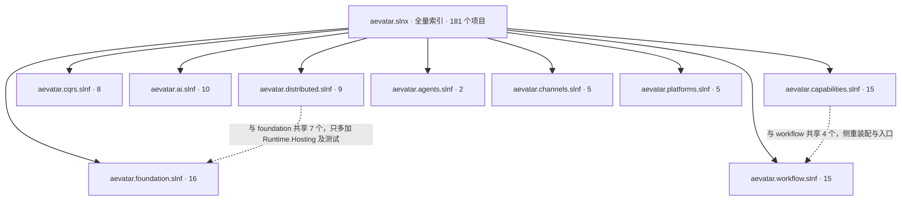
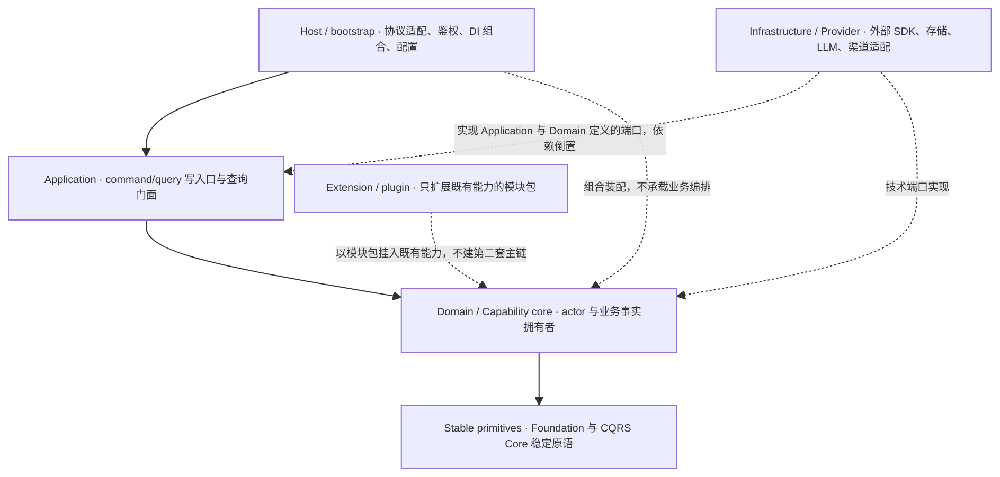
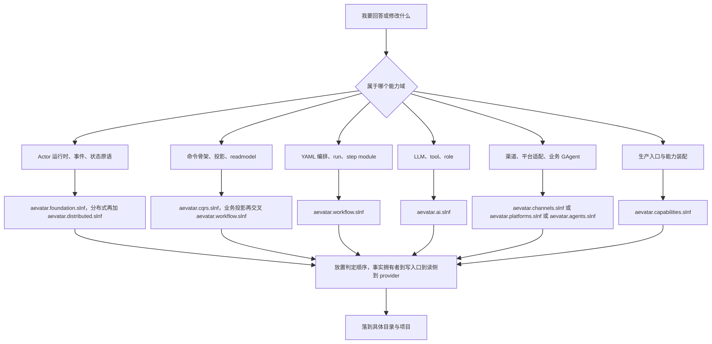

# 仓库地图：100+ 项目面前如何选阅读面

> 版本与结论：本章描述 `current`；当前结构以 `f02aa690` 为准。核心结论有两条：其一，仓库用 1 个全量 `aevatar.slnx` 加 9 个按能力域切分的 `.slnf` 过滤器组织 100+ 项目，读代码的正确姿势是"先选工作面，再进目录"，而不是从全量索引硬啃；其二，所有项目落点服从 `Domain / Application / Infrastructure / Host` 严格分层与五档 tier 放置规则，项目名前缀只是初筛，真正的定位依据是"这个事实归谁拥有"。

## 设计抽象与事实源

- `aevatar.slnx:46`：`/src/` folder 的起点；`aevatar.slnx` 以 folder 分组（`/agents/`、`/src/`、`/src/workflow/`、`/test/` 等）收录全量项目，是本章"全量索引"论断的载体。
- `docs/canon/module-placement-map.md:32`：Tier 速查表的开头；五档 tier（Stable primitives / Capability core / Extension/plugin / Provider/adapter / Host/bootstrap）是本章判断"一个项目属于哪一层"的权威口径。
- `AGENTS.md:4`：顶级架构要求第一条，规定 `Domain / Application / Infrastructure / Host` 严格分层、`API` 仅做宿主与组合，是本章分层依赖方向图的直接依据。

## 先建立模型

### 全量索引与九个工作面

`aevatar.slnx` 是全量工程索引，收录 agents、src、test、tools 四个区的项目；9 个 `aevatar.*.slnf` 是 solution filter，每个都在文件内显式指向 `aevatar.slnx`（例如 `aevatar.workflow.slnf:3` 的 `"path": "aevatar.slnx"`），再从全量集合里挑出一个能力域的工作子集。

以下计数全部属于 `f02aa690` 这个冻结基线，是"此刻的规模快照"，不是永恒架构；项目会增删，计数会漂移（生成命令见章末证据映射）：

三个读图要点：

1. **过滤器是工作面，不是划分**。9 个 `.slnf` 之间存在刻意的重叠（以下均为 `f02aa690` 实测集合运算）：`aevatar.distributed.slnf` 与 `aevatar.foundation.slnf` 共享 7 个项目（Foundation 契约/核心/运行时一族，含 Orleans、Orleans.Streaming、KafkaProvider 三个实现项目——它们 foundation 自己就有），distributed 实际只**多加** `Aevatar.Foundation.Runtime.Hosting` 及其测试 2 个项目，同时少收 VoicePresence 一族与 Foundation 契约/核心测试；`aevatar.capabilities.slnf` 与 `aevatar.workflow.slnf` 共享 4 个项目（`Aevatar.Workflow.Host.Api`、`Aevatar.Workflow.Extensions.Hosting`、`Aevatar.Scripting.Application`、`Aevatar.Foundation.Runtime.Implementations.Local`）。重叠是特性——每个工作面都要能独立构成"抽象 + 核心 + provider + host + 测试"的完整闭环。
2. **过滤器也不覆盖全集**。`agents/` 目录下实测 24 个 `.csproj`，但被 `aevatar.agents.slnf`、`aevatar.channels.slnf`、`aevatar.platforms.slnf` 三个过滤器收录的只有 7 个；其余 17 个（如 `Aevatar.GAgents.Registry`、`Aevatar.GAgents.NyxidChat` 等）在 `f02aa690` 处只能通过 `aevatar.slnx` 全量面触达。此外 `src/Aevatar.BackendConsole.Hosting` 与 `test/Aevatar.Integration.Slow.Tests` 也未被 `aevatar.slnx` 收录——慢测是刻意排除（由独立慢测门禁拥有，见下文"协议与状态深入"），BackendConsole.Hosting 则是本基线实测观察到的一个例外，其职责可见 `docs/canon/backend-console.md`。
3. **每个 `.slnf` 都连带自己的测试项目**。例如 `aevatar.workflow.slnf` 的 15 个项目里含 3 个 test 项目；改某个能力域时，对应测试就在同一个工作面内，不需要跨面找。

### 三大目录区的职责划分

`AGENTS.md` 的"项目结构与模块组织"一节（`AGENTS.md:131` 起）只显式划分了 `src/`、`test/`、`docs/`、`tools/ci/`、`apps/aevatar-console-web/` 的职责，**没有 `agents/` 条目**。因此下表的口径要分清来源：`src/`、`test/` 的职责描述出自该节；`agents/` 的职责描述是本章对冻结树目录内容与命名的实测归纳，不是上游文档的明文规定：

| 目录 | 职责 | `f02aa690` 基线计数 |
|---|---|---|
| `src/` | 生产代码，按能力与分层组织（`Aevatar.Foundation.*`、`Aevatar.AI.*`、`src/workflow/` 下的 `Aevatar.Workflow.*`、`src/platform/` 下的 `Aevatar.GAgentService.*` 等） | 106 个 `.csproj`，2308 个 `.cs` |
| `agents/` | 独立业务 GAgent 项目（channel、registry、catalog、scheduled、平台适配等），`Aevatar.GAgents.*` 命名（实测归纳，见上文说明） | 24 个 `.csproj` |
| `test/` | 与 `src/`、`agents/` 对应的测试项目（单元、集成、API、慢测） | 51 个 `.csproj`，1232 个 `.cs` |

`src/` 与 `agents/` 的分界，从目录实测看不是"新旧"，而更像是**事实拥有者的位置**（这是本章的归纳判读，不是上游明文）：`src/` 里的能力族（Workflow、Scripting、Studio、GAgentService）自带完整的 Domain/Application/Projection/Infrastructure/Host 分层；`agents/` 里的项目则是围绕单一业务事实（chat history、user memory、device、scheduled dispatch 等）的 actor 拥有者及其直接适配，多数没有独立 Host。周边还有 `apps/aevatar-console-web/`（前端控制台）、`workflows/`（示例 YAML 定义）、`tools/ci/`（CI 门禁脚本），它们不进 solution 主链。

### 分层与依赖方向

`AGENTS.md:4` 规定的严格分层是 `Domain / Application / Infrastructure / Host`，配合 `docs/canon/module-placement-map.md` 的五档 tier，可以画出全仓统一的依赖方向图。方向的不变量是：**依赖只能指向更稳定的一侧；Infrastructure 实现 Application/Domain 定义的端口，而不是被它们引用；Host 只做组合装配**。

以 Workflow 能力族为例把图坐实：`Aevatar.Workflow.Core`（Domain，`WorkflowGAgent` / `WorkflowRunGAgent` 与 step module 所在）依赖 `Aevatar.Foundation.*` 稳定原语；`Aevatar.Workflow.Application` 提供 chat / resume / signal / query 门面；`Aevatar.Workflow.Infrastructure` 实现 IO 与适配；`Aevatar.Workflow.Host.Api` 只做 HTTP/SSE/WS 协议适配；`Aevatar.Workflow.Extensions.Maker` 以模块包挂入，不反向支配 Core。

## 沿一条链路走读

"选阅读面"本身是一条决策链：从你要回答的问题出发，先定能力域选 `.slnf`，再按放置判定顺序定层，最后才落到具体目录。

判定顺序来自 `docs/canon/module-placement-map.md` 第一节：**先找权威事实拥有者**（稳定业务事实归 actor/GAgent，查询副本归 readmodel），**再选写入口**（外部请求进 Application command/query surface），**再选读侧**（默认读 readmodel），**最后才看 provider/bootstrap**。这个顺序同时是阅读顺序和 review 顺序——判断一个 PR 是否放错了位置，走的也是这四步。

常见问题的速查答案：

| 你的问题 | 打开哪个面 | 先看哪里 |
|---|---|---|
| 一条请求怎么流过系统 | `aevatar.workflow.slnf` | `Aevatar.Workflow.Host.Api` 入口到 `Aevatar.Workflow.Application` 到 `Aevatar.Workflow.Core` |
| 改 Actor / Stream / 状态守卫 | `aevatar.foundation.slnf` | `src/Aevatar.Foundation.Core`，分层定义见 `docs/canon/architecture.md` |
| 改分布式 runtime provider | `aevatar.distributed.slnf` | `src/Aevatar.Foundation.Runtime.Implementations.Orleans` |
| 改 readmodel 或实时输出 | `aevatar.cqrs.slnf` 交叉 `aevatar.workflow.slnf` | `src/Aevatar.CQRS.Projection.Core` 与 `src/workflow/Aevatar.Workflow.Projection` |
| 接新 LLM 或工具 | `aevatar.ai.slnf` | `src/Aevatar.AI.Abstractions` 定契约，`src/Aevatar.AI.LLMProviders.Tornado` 等看既有 provider 形态 |
| 改生产入口 | `aevatar.capabilities.slnf` | `src/Aevatar.Mainnet.Host.Api`，但业务流程不得写进 Host |
| 改某个业务 GAgent | 先在 `aevatar.slnx` 全量面定位 | `agents/` 下多数项目未被任何 `.slnf` 收录，需走全量索引 |

## 为什么是它，不是别的

**为什么是全量 slnx + 过滤器，而不是多个独立 solution？** 多个独立 `.sln` 会让跨域契约变更（例如 Foundation 改一个接口、Workflow 与 Scripting 都要跟着改）失去统一的编译验证面，项目引用也容易被复制成多份漂移。`aevatar.slnx` 保留"一次 `dotnet build` 验证全仓一致性"的能力；`.slnf` 只是同一份项目集合上的视图，不复制任何项目定义，因此零漂移成本。代价是过滤器列表需要人工维护——新增项目不会自动进入任何工作面，这正是上面"17 个 agents 项目不在任何过滤器内"现象的根源。

**为什么按能力域切，而不是按技术层切（一个 solution 装所有 Application、一个装所有 Infrastructure）？** 因为改动的事务边界是能力域：改 Workflow 的 run 语义时，需要同时动 Core、Application、Projection、Host.Api 和对应测试，它们在同一条闭环里；按技术层切会把每一次能力改动都变成跨 solution 操作。按能力域切还有一个 review 红利：`.slnf` 构成依赖方向的自检——如果改 Workflow 却必须打开大量 AI、CQRS 之外的项目，通常说明依赖方向出了问题。

**为什么不干脆只留一个大 solution？** 100+ 项目全量加载对 IDE 与本地反馈速度都是负担；过滤器的存在让"只编译当前能力域 + 它的测试"成为默认动作，而分片构建门禁（见下节）保证各分片始终可独立构建。

## 协议与状态深入

仓库地图不是静态清单，它由一组可自动化验证的治理协议维持（全部在 `AGENTS.md` 中有强制条款）：

- **solution 归属唯一**：`tools/ci/test_solution_ownership_guard.sh` 校验测试项目只由 `aevatar.slnx` 或慢测守卫拥有（`AGENTS.md:150`）。这解释了为什么 `test/Aevatar.Integration.Slow.Tests` 刻意不在 `aevatar.slnx` 里——它由 `tools/ci/slow_test_guards.sh:26` 单独 `dotnet test`，避免慢测拖住全量反馈。
- **分片可独立构建**：`tools/ci/solution_split_guards.sh` 执行 Foundation / AI / CQRS / Workflow / Hosting 的分片构建门禁（`AGENTS.md:149`），即"工作面可独立闭环"不只是阅读约定，而是 CI 强制。
- **分层依赖有机器守卫**：`tools/ci/architecture_guards.sh` 等门禁把"禁止跨层反向依赖""禁止中间层进程内事实态"等条款落成静态检查，分层图里的每一条箭头方向都有对应的强制面，而非口头约定。
- **契约演进方式固定**：新增状态、事件、持久化载荷先定义 `.proto` 再接入实现（`AGENTS.md:129`）；这意味着读任何能力族时，其 typed contract 的权威形态在 proto 与 Abstractions 项目里，不在实现类里。

对读者而言，这组协议的实际意义是：**目录结构与分层方向可以作为可靠导航使用**——如果某处看起来违反了这张图，更可能是你发现了一个真实的待修缺口，而不是地图本身只是"建议"。

## 最小示例

> Demo status：`verified-static`

场景：我想加一个新的 workflow primitive（一个新的 step `type`，例如一个人工审批之外的新控制流原语）。

1. **定能力域**：primitive 是 workflow 编排核心语义，打开 `aevatar.workflow.slnf`（15 个项目，含 3 个测试项目），不需要全量面。
2. **定 tier 与落点**：按放置判定顺序——新原语会改变 workflow run 的执行事实，事实拥有者是 `WorkflowRunGAgent`，属于 Capability core。两条分支：
   - 若它是**内建原语**（所有 workflow 可用的核心语义）：在 `src/workflow/Aevatar.Workflow.Core/Modules` 新增 module 类，并在 `src/workflow/Aevatar.Workflow.Core/WorkflowCoreModulePack.cs:8` 声明的内建注册表里登记 `step type` 字符串（`conditional`、`while`、`llm_call` 等现有原语都注册在这里）。
   - 若它是**可选扩展**（只服务特定产品面）：在 `src/workflow/extensions/` 下新建模块包项目，实现 `IWorkflowModulePack`（契约见 `src/workflow/Aevatar.Workflow.Core/IWorkflowModulePack.cs:9`，内建与扩展共用同一 pack 模型），参照 `src/workflow/extensions/Aevatar.Workflow.Extensions.Maker` 的形态。扩展不得反向支配 Core，也不得另建第二套 workflow actor 模型。
3. **定测试面**：同工作面内的 `test/Aevatar.Workflow.Application.Tests`（行为经 Application 门面验证）；若走扩展分支，参照 `test/Aevatar.Workflow.Extensions.Maker.Tests`。
4. **定文档面**：`docs/canon/workflow-primitives.md` 按原语逐条登记作用、参数与最小 YAML；`workflows/` 下有既有示例 YAML 可对照参数写法。
5. **验证面**：`dotnet build aevatar.workflow.slnf` 加分片构建门禁，不需要全量构建即可得到第一道反馈。

本示例为静态走查：所有落点与行号均在冻结树 `f02aa690` 中逐一核实存在，但未实际执行 `dotnet build` / `dotnet test`（需要 .NET SDK 与还原依赖，超出本章验证范围）。

## 边界与演进

- **计数时效**：本章所有数字（181 个 slnx 项目、9 个过滤器、src 106 / test 51 / agents 24 个 `.csproj`、各 `.slnf` 项目数）都是 `f02aa690` 基线的实测快照，由章末证据映射中的命令生成。它们描述规模量级，不构成架构承诺；任何后续 commit 都可能改变它们。旧版章节 `00/02-repo-map.md` 中的计数（如 src 98 个项目、agents.slnf 3 个项目）与本基线实测不符，应以本章为准。
- **当前实现 vs 目标态**：`AGENTS.md` 与 canon 文档中的分层、门禁条款是强制规则且多数有 CI 守卫，但 `aevatar.slnx` 未收录 `src/Aevatar.BackendConsole.Hosting`、17 个 `agents/` 项目无过滤器覆盖，属于本基线实测存在的"清单维护滞后"现象，读仓库时以目录实测为准、以过滤器为导航辅助。
- **issue 与报告类文件**：仓库根存在 `IMPLEMENT_REPORT.md` 等过程性文档，其陈述的完成度不等于实现状态；本章所有结构性论断均以冻结树中的代码、solution 文件与 canon 文档为证据，未采纳任何 issue 状态作为实现证明。
- **open gap**：`.slnf` 覆盖无自动化新鲜度门禁（实测存在未覆盖项目），新增项目是否进过滤器依赖人维护；是否需要"过滤器完整性守卫"在本基线未见对应 canon 或 CI 条款，属待论证项。

## 读完应能回答

1. 面对"我要懂 workflow"这类问题，应该打开哪个 `.slnf`、按什么顺序读哪几个项目？
2. `aevatar.slnx` 与 9 个 `.slnf` 各自承担什么职责，为什么说过滤器是"工作面"而不是对项目的划分？
3. `src/`、`agents/`、`test/` 三个目录的职责分界是什么，为什么 `agents/` 下多数项目要走全量索引才能看到？
4. 判断一个新项目应该放进哪一层时，四步放置判定顺序是什么，依赖方向的不变量是什么？
5. 为什么本章的项目计数不能当作长期有效的事实引用？

论断—证据映射

| 论断 | 等级 | 证据 |
|---|---|---|
| 仓库以 1 个全量 slnx + 9 个能力域 slnf 组织 | E1 | 冻结树根目录 `ls *.sln*`：`aevatar.slnx` + `aevatar.{agents,ai,capabilities,channels,cqrs,distributed,foundation,platforms,workflow}.slnf` |
| 每个 slnf 显式指向 aevatar.slnx | E1 | `aevatar.workflow.slnf:3`（`"path": "aevatar.slnx"`），其余 8 个同构 |
| slnx 收录 181 个项目、按 folder 分组 | E1 | `aevatar.slnx:2`（`/agents/`）、`aevatar.slnx:46`（`/src/`）、`aevatar.slnx:164`（`/test/`）；`grep -c '<Project ' aevatar.slnx` → 181 |
| 各 slnf 项目数（16/9/8/15/10/15/2/5/5） | E1 | 对 `f02aa690` 执行 `grep -c '\.csproj' aevatar.<name>.slnf`，逐个核对清单内容 |
| src 106 csproj / 2308 .cs，test 51 / 1232，agents 24 | E1 | `find <F>/src -name '*.csproj' \| wc -l` → 106；`find <F>/src -name '*.cs' \| wc -l` → 2308；test、agents 同法（`<F>` 为冻结树根） |
| slnf 之间刻意重叠，不构成划分 | E1 | 对两两 slnf 项目清单做 `comm` 集合运算：`aevatar.distributed.slnf` ∩ `aevatar.foundation.slnf` = 7 个（含 Orleans / Orleans.Streaming / KafkaProvider，foundation 自身已收），distributed 仅多加 `Aevatar.Foundation.Runtime.Hosting` 及其测试；`aevatar.capabilities.slnf` ∩ `aevatar.workflow.slnf` = 4 个（`Aevatar.Workflow.Host.Api`、`Aevatar.Workflow.Extensions.Hosting`、`Aevatar.Scripting.Application`、`Aevatar.Foundation.Runtime.Implementations.Local`） |
| agents/ 24 个项目中仅 7 个被三个过滤器覆盖 | E1 | `aevatar.agents.slnf`（2 个）+ `aevatar.channels.slnf`（3 个 agents 项目）+ `aevatar.platforms.slnf`（2 个 agents 项目），与 `find <F>/agents -name '*.csproj'` → 24 对比 |
| slnx 未收录 BackendConsole.Hosting 与慢测项目 | E1 | 脚本对比 slnx `<Project Path>` 与冻结树实际 csproj：差集含 `src/Aevatar.BackendConsole.Hosting`、`test/Aevatar.Integration.Slow.Tests` 及 10 个 `tools/ci/tests` fixture；慢测由 `tools/ci/slow_test_guards.sh:26` 独立执行 |
| 严格分层 Domain/Application/Infrastructure/Host，依赖倒置 | E1 | `AGENTS.md:4`、`AGENTS.md:8` |
| 五档 tier 与放置判定顺序 | E1 | `docs/canon/module-placement-map.md:23`（判定顺序）、`docs/canon/module-placement-map.md:32`（Tier 速查表） |
| Workflow 能力族分层落点（Core/Application/Infrastructure/Host/Projection/Extension） | E1 | `docs/canon/module-placement-map.md:47`；目录实测 `src/workflow/` |
| 测试项目归属由门禁强制，慢测刻意排除 | E1 | `AGENTS.md:150`（`tools/ci/test_solution_ownership_guard.sh`）、`tools/ci/slow_test_guards.sh:26` |
| 分片构建门禁保证工作面独立闭环 | E1 | `AGENTS.md:149`（`tools/ci/solution_split_guards.sh`） |
| 新增 workflow primitive 的内建落点与注册表 | E1 | `src/workflow/Aevatar.Workflow.Core/WorkflowCoreModulePack.cs:8`（`ModuleRegistrations` 注册表声明起点）、`src/workflow/Aevatar.Workflow.Core/Modules`（module 类目录） |
| 内建与扩展共用 IWorkflowModulePack 契约 | E1 | `src/workflow/Aevatar.Workflow.Core/IWorkflowModulePack.cs:9`（注释：built-in 与 extension 共用同一 pack 模型）、`src/workflow/extensions/Aevatar.Workflow.Extensions.Maker` |
| src/ 与 test/ 的职责划分 | E1 | `AGENTS.md:131`–`AGENTS.md:136`（项目结构与模块组织；该节不含 agents/ 条目） |
| agents/ 的职责划分（独立业务 GAgent、围绕单一业务事实） | 归纳（基于 E1 目录实测） | `find <F>/agents -name '*.csproj'` → 24 个项目清单与命名（`Aevatar.GAgents.*`）实测；上游 `AGENTS.md` 该节未明文规定 agents/ 职责，正文已标注为实测归纳 |

