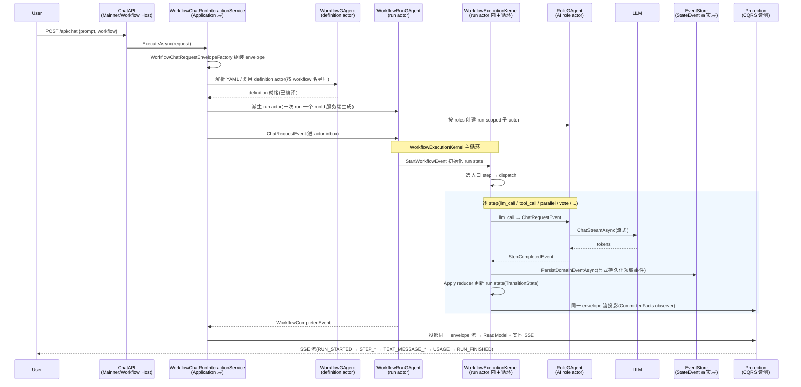

# 主线全景图:一次 chat 请求怎么流过整个系统

## 关键代码(事实源,以 ~/Code/aevatar 为准)

- `README.md`「主线:一次 Chat 请求的生命周期」节:全书贯穿的主线 mermaid 时序图 + 阶段落点表。
- `docs/canon/architecture.md` 第 57-71 行:「核心主链路(框架最关键理解)」五步:统一消息传输 → Runtime Actor 语义 → 统一路由执行 → 领域事实显式持久化 → 统一读侧投影。
- `docs/canon/architecture.md` 第 161-169 行:CQRS 与 Projection 落点,scope actor 基类(`ProjectionScopeGAgentBase` / `ProjectionMaterializationScopeGAgentBase` / `ProjectionSessionScopeGAgentBase`)。
- `docs/canon/cqrs-projection.md`:Command → Event → Actor 决策 → 持久化 → Projection → ReadModel 的完整链路。
- `src/workflow/Aevatar.Workflow.Application/Runs/WorkflowChatRunInteractionService.cs` 第 8 行、第 30 行:`WorkflowChatRunInteractionService.ExecuteAsync(...)` 是 `/api/chat` 进入 Application 层的入口。
- `src/workflow/Aevatar.Workflow.Application/Runs/WorkflowChatRequestEnvelopeFactory.cs`:把 HTTP chat 请求组装成发给 workflow actor 的 envelope。
- `src/workflow/Aevatar.Workflow.Core/WorkflowGAgent.cs` 第 17 行:`WorkflowGAgent`(definition actor),持有 YAML + 编译结果。
- `src/workflow/Aevatar.Workflow.Core/WorkflowRunGAgent.cs` 第 36 行、第 948 行、第 977 行、第 1006 行:`WorkflowRunGAgent`(run actor),构造 `WorkflowExecutionKernel`,在 `On<StepCompletedEvent>` reducer 上推进步骤。
- `src/Aevatar.AI.Core/RoleGAgent.cs` 第 4-6 行、第 30 行、第 458 行:`RoleGAgent` 处理 `ChatRequestEvent` → 流式调 LLM → 发 `TextMessageStart → Content* → End` AG-UI 事件。
- `src/Aevatar.Foundation.Abstractions`(EventEnvelope / IStateStore / IEventStore / IActorRuntime / IActorDispatchPort):核心抽象层,事实层 vs 运行时消息层的边界。

---

## 这张图解决什么

这是全书的「地图」。读者读完应该能回答一个问题:**「我想看 X,应该去哪个文件?」**。

aevatar 把一次 chat 请求的生命周期切成了清晰的层:Host(API 协议出口)→ Application(编排)→ Core(definition/run actor + 执行内核)→ AI(role actor + LLM)→ CQRS Projection(读侧)。每一层的职责、为什么这么分、代码落在哪,都在下面这张图和表里。

> **为什么这么分层** —— 这是这张图最该讲清楚的。`docs/canon/architecture.md` 第 57-71 行把核心主链路总结成五步,这张图就是那五步在一个具体请求上的实例化。

---

## 端到端时序图

---

## 每个箭头:发生了什么 / 业务含义 / 代码落点 / 继续阅读

| 箭头 | 发生了什么 / 业务含义 | 代码落点 | 继续阅读 |
|---|---|---|---|
| `User → API: POST /api/chat` | HTTP SSE 入口;协议见 canon | `src/workflow/Aevatar.Workflow.Infrastructure/CapabilityApi/ChatEndpoints.cs` | `01/02-chat-api-and-sse.md` |
| `API → App: ExecuteAsync` | HTTP 层只做协议出口,把请求交给 Application 编排 | `WorkflowChatRunInteractionService.cs` | `01/03-run-semantics.md` |
| `App 组装 envelope` | 把 prompt/workflow/source 组装成发给 actor 的 `EventEnvelope` | `WorkflowChatRequestEnvelopeFactory.cs` | `03/02-event-envelope-vs-state-event.md` |
| `App → WF: definition` | 按 workflow 名寻址/创建 definition actor,复用已编译的 YAML | `src/workflow/Aevatar.Workflow.Core/WorkflowGAgent.cs` | `02/02-definition-and-run-actors.md` |
| `App → Run: 派生 run actor` | 一次运行一个 run actor,`runId` 服务端生成 | `src/workflow/Aevatar.Workflow.Core/WorkflowRunGAgent.cs` | `01/03-run-semantics.md` |
| `Run → Role: 创建子 actor` | 按 `roles` 创建 run-scoped role actor(AI 身份 + 能力授权) | `src/Aevatar.AI.Core/RoleGAgent.cs` | `04/01-role-gagent.md` |
| `App → Run: ChatRequestEvent` | 请求进入 run actor 的 inbox(Actor 邮箱串行) | `WorkflowRunGAgent.cs`(ChatRequestEvent handler) | `03/01-agent-actor-runtime.md` |
| `Run → Kernel: StartWorkflow` | 执行内核初始化 run state、写 input 变量、选入口 step | `src/workflow/Aevatar.Workflow.Core/Execution/WorkflowExecutionKernel.cs` | `02/03-execution-kernel.md` |
| `Kernel → Role: llm_call` | 把 `llm_call` 步骤派给 role actor,包成 `ChatRequestEvent` | `RoleGAgent.cs`(ChatRequestEvent handler) | `02/04-step-modules-catalog.md` |
| `Role → LLM: ChatStreamAsync` | role actor 流式调 LLM Provider(MEAI/NyxId/Tornado) | `RoleGAgent.cs`(ChatStreamAsync) | `04/02-llm-providers.md` |
| `LLM → Role: tokens` | LLM 流式回 token;role 发 `TextMessageStart → Content* → End` | `RoleGAgent.cs`(注释说明 AG-UI 事件序列) | `04/01-role-gagent.md` |
| `Role → Kernel: StepCompletedEvent` | 步骤完成事件回到 run actor;内核推进到下一步 | `WorkflowRunGAgent.cs`(`On<StepCompletedEvent>`)、`:1224`(`ApplyStepCompleted` reducer) | `02/03-execution-kernel.md` |
| `Kernel → Store: PersistDomainEventAsync` | **只有显式持久化后**,领域事件才进 EventStore 成为事实 | `GAgentBase`(PersistDomainEventAsync);`docs/canon/architecture.md:69` | `03/04-state-guard-and-event-sourcing.md` |
| `Kernel → Proj: 投影` | 同一条 committed envelope 流被投影为多个分支(SSE/报告/ReadModel) | `docs/canon/architecture.md:65`、`:161-169` | `05/01-projection-overview.md` |
| `Run → App: WorkflowCompletedEvent` | run 收敛,通知 Application | `WorkflowRunGAgent.cs` | `01/03-run-semantics.md` |
| `Proj → User: SSE 流` | 投影产出实时 SSE 帧 + 物化 ReadModel | `ChatSseResponseWriter.cs`;`WorkflowRunEventTypes.cs` | `00/03-quick-start.md`、`05/02-two-projection-modes.md` |

---

## 为什么这么分层(对应核心主链路五步)

`docs/canon/architecture.md` 第 57-71 行把框架主线总结成五步,这张图是它的实例化:

1. **统一消息传输契约**(`architecture.md:61`):外部 command、内部 signal、reply、业务事件,都以 `EventEnvelope.payload` 形式进入 Actor 消息流。图里 `ChatRequestEvent`、`StepCompletedEvent`、`WorkflowCompletedEvent` 都是 envelope payload。
2. **Runtime 赋予 Actor 语义**(`architecture.md:62`):`IActorRuntime` / `IActor` 在 Stream 之上提供创建、寻址、激活、邮箱串行、父子拓扑;`IActorDispatchPort` 负责定向投递。图里 run actor → role actor 是父子拓扑。
3. **统一路由执行**(`architecture.md:63`):`PublishAsync` / `SendToAsync` 构造 `PublicationRoute.topology` 或 `DirectRoute`;`GAgentBase` 合并静态 `[EventHandler]` 与动态 `IEventModule`。图里 Kernel 推进步骤就是这条。
4. **领域事实显式持久化**(`architecture.md:69`):有状态 Actor **只有**调用 `PersistDomainEventAsync(...)` 后,领域事件才进 `EventStore`。这是 EventEnvelope(运行时消息)和 StateEvent(事实层)的分界 —— `03/02-event-envelope-vs-state-event.md` 专门讲这条最容易踩的边界。
5. **统一读侧投影**(`architecture.md:65`):同一条 Actor envelope 流被投影成多个输出分支。图里 SSE 流、运行报告、ReadModel 共享同一投影输入 —— 这是 aevatar 区别于普通 Agent 框架的关键设计,`05/02-two-projection-modes.md` 展开。

---

## 最容易误解的两个边界(后续专门讲)

读这张图时,这两个地方最容易踩坑,先标记出来:

1. **EventEnvelope ≠ StateEvent**(`architecture.md:71`):图里 actor 之间流动的 `ChatRequestEvent` / `StepCompletedEvent` 是运行时消息(envelope),不是事件溯源的事实。事实层是 `StateEvent` + `EventStore`,只有 `PersistDomainEventAsync` 后才进入。→ `03/02-event-envelope-vs-state-event.md`

2. **SSE 流是投影,不是 State 直射**(`architecture.md:67`):`Proj → User: SSE 流` 这条线是 workflow run-event 事件投影,不是把写侧 `State` 直接映射到前端。写侧 State 是运行态;读侧建议由投影生成独立只读模型(CQRS)。→ `05/02-two-projection-modes.md`

---

## 怎么用这张图

- **想跑起来看一遍** → `00/03-quick-start.md`
- **想看 API 协议细节** → `01/02-chat-api-and-sse.md`
- **想写 workflow** → `02/01-yaml-grammar.md` → `02/03-execution-kernel.md`
- **想理解 Actor/Event 内核** → `03/01-agent-actor-runtime.md` → `03/02-event-envelope-vs-state-event.md`
- **想理解读侧投影** → `05/01-projection-overview.md` → `05/02-two-projection-modes.md`

⟦AI:AUTO-LOOP⟧
