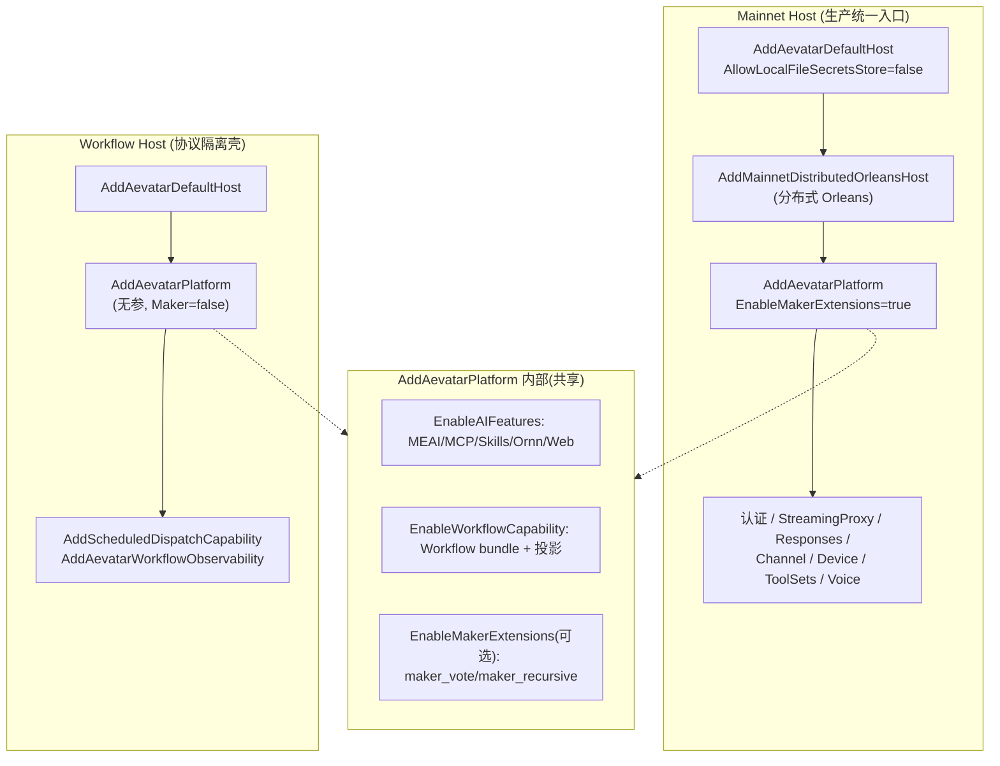

# Mainnet vs Workflow Host 边界 + AddAevatarPlatform 组合过程

## 关键代码(事实源,以 ~/Code/aevatar 为准)

- `src/Aevatar.Mainnet.Host.Api/Program.cs` 第 1-12 行:Mainnet 入口,四行装配。
- `src/Aevatar.Mainnet.Host.Api/Hosting/MainnetHostBuilderExtensions.cs` 第 72-304 行:`AddAevatarMainnetHost()` 的完整 DI 组合顺序;第 310-347 行:`MapAevatarMainnetHost()` 端点映射。
- `src/Aevatar.Mainnet.Host.Api/Hosting/MainnetHostBuilderExtensions.cs` 第 102-112 行:强制 `AllowLocalFileSecretsStore = false`。
- `src/Aevatar.Mainnet.Host.Api/Hosting/MainnetHostBuilderExtensions.cs` 第 115-119 行:`AddAevatarPlatform(options => EnableMakerExtensions = true)`。
- `src/workflow/Aevatar.Workflow.Host.Api/Program.cs` 第 1-33 行:Workflow Host 入口,极简(只 `AddAevatarDefaultHost` + `AddAevatarPlatform()` 无参 + 观测 + 调度)。
- `src/workflow/extensions/Aevatar.Workflow.Extensions.Hosting/AevatarPlatformHostBuilderExtensions.cs` 第 17-28 行:`AevatarPlatformCompositionOptions`(`EnableMakerExtensions` 默认 false);第 32-123 行:`AddAevatarPlatform(...)` 条件装配;第 119-120 行:`EnableMakerExtensions` → `AddWorkflowMakerExtensions()`;第 125-134 行:校验 Maker 依赖 Workflow。
- `src/workflow/extensions/Aevatar.Workflow.Extensions.Maker/ServiceCollectionExtensions.cs` 第 6-12 行:`AddWorkflowMakerExtensions()` → `AddWorkflowModulePack<MakerModulePack>()`。
- `src/Aevatar.Bootstrap/Hosting/WebApplicationBuilderExtensions.cs` 第 60-96 行:`AddAevatarDefaultHost(...)`;第 11-56 行:`AevatarDefaultHostOptions`(`AllowLocalFileSecretsStore`);第 119-184 行:`UseAevatarDefaultHost(...)`。
- `src/Aevatar.Bootstrap/ServiceCollectionExtensions.cs` 第 12-36 行:`AddAevatarBootstrap(...)`(config + HttpClient + ActorRuntime + connector builders)。
- `docs/canon/overview.md` 第 33-49 行:§3 宿主与能力装配 mermaid + 约束;第 51-66 行:§4 Maker 插件边界;第 99-112 行:§7 架构守卫。
- `docs/adr/0002-mainnet-architecture.md` 第 144-204 行:分层架构;第 701-705 行:§8.3 Mainnet 装配顺序。

---

## 两个 Host 是什么

aevatar 有两个 Host 项目,都是 ASP.NET Core 的薄壳:

| Host | 项目 | 定位 | 入口行数 |
|---|---|---|---|
| **Mainnet Host** | `src/Aevatar.Mainnet.Host.Api` | 默认统一生产入口,装配全部能力 | `Program.cs` 第 1-12 行 |
| **Workflow Host** | `src/workflow/Aevatar.Workflow.Host.Api` | 只做 workflow run 控制/查询的协议隔离壳 | `Program.cs` 第 1-33 行 |

`docs/canon/overview.md` 第 33-49 行的 mermaid 把它们的装配画成对照:Mainnet → `AddAevatarDefaultHost()` + `AddAevatarPlatform(EnableMakerExtensions=true)`;Workflow Host → `AddAevatarDefaultHost()` + `AddAevatarPlatform()`(无参)。

关键判断:**Host 只做协议适配与能力组合,不承载核心业务流程**。业务流程在 `WorkflowGAgent` / `WorkflowRunGAgent` / `WorkflowExecutionKernel` 里,Host 只负责把它们装配起来并暴露 HTTP/WS 端点。

---

## Mainnet Host 装配顺序

`AddAevatarMainnetHost()`(`MainnetHostBuilderExtensions.cs` 第 72-304 行)是一个很长的装配方法,按顺序做:

| 行号 | 做什么 |
|---|---|
| 第 78-100 行 | ServiceProvider fail-fast(`ValidateOnBuild`/`ValidateScopes`)+ 强制顺序启动 hosted service(注释引用 2026-06-03 CrashLoopBackOff 事故) |
| 第 102-112 行 | `AddAevatarDefaultHost(...)` + **`AllowLocalFileSecretsStore = false`**(生产 secrets 只走 `AEVATAR_` 环境变量) |
| 第 113-114 行 | `AddMainnetDistributedOrleansHost()`(分布式 Orleans)+ 监听 URL 配置 |
| 第 115-119 行 | `AddAevatarPlatform(options => { EnableMakerExtensions = true; ConfigureAIFeatures = ...; })` |
| 第 120-121 行 | `AddGAgentServiceCapabilityBundle()` + `AddStudioCapability()` |
| 第 123-143 行 | 认证(NyxId/Aevatar)、StreamingProxy、ChannelRuntime、Device、Scheduled、StatusDashboard |
| 第 148-154 行 | ChatRouting + 投影文档存储 |
| 第 158-166 行 | Voice `voice-dev` 授权策略 |
| 第 167-204 行 | Responses/Messages/ChatCompletions OpenAI 兼容入口 |
| 第 206-265 行 | Tool providers(Lark/Telegram/NyxId/Web/ChronoStorage) |
| 第 266-301 行 | `AddToolSetRegistry`(`workspace.default` / `lark.self_notify` / `NyxIdConnectedServices`) |

`MapAevatarMainnetHost()`(第 310-347 行)映射全部端点:default files、NyxId chat、ChatRoute admin、StreamingProxy、Responses/Messages/ChatCompletions、Channel callback、Device events、OAuth、Skill runner、Status,以及条件 voice(`/ws/voice/{actorId}`,第 335-344 行)。

---

## Workflow Host 装配(极简对照)

`src/workflow/Aevatar.Workflow.Host.Api/Program.cs`(第 1-33 行)比 Mainnet **小得多**:

```csharp
builder.AddAevatarDefaultHost(...);      // 第 19-24 行
builder.AddAevatarPlatform();             // 第 25 行,无参 → EnableMakerExtensions 默认 false
builder.Services.AddScheduledDispatchCapability(...);  // 第 26 行
builder.AddAevatarWorkflowObservability();              // 第 27 行
app.UseAevatarDefaultHost();              // 第 31 行
```

它**没有**:分布式 Orleans、认证 provider、StreamingProxy、Responses/Messages/ChatCompletions 入口、Channel runtime、Maker 扩展、tool-set 组合。它只挂 workflow 观测 + 调度,靠 `UseAevatarDefaultHost` 的 `AutoMapCapabilities` 暴露能力端点。头部注释(第 1-10 行)说明它只保留 run 控制/查询,旧的 `/api/chat`、`/api/ws/chat` 已不是正式运行契约。

这就是"协议隔离壳"的含义:它把 workflow 能力隔离成可以独立部署的进程,但不重复 Mainnet 的能力装配。

---

## AddAevatarPlatform 组合过程

`AddAevatarPlatform(...)` 定义在 `AevatarPlatformHostBuilderExtensions.cs` 第 32-123 行,是能力装配的核心。`AevatarPlatformCompositionOptions`(第 17-28 行)控制开关:

| 开关 | 默认 | 含义 |
|---|---|---|
| `EnableAIFeatures` | true | MEAI providers / MCP / skills / Ornn / web / workflow tools / scripting tools(第 43-61 行) |
| `EnableWorkflowCapability` | true | workflow 能力 bundle + 投影 readmodel + health + scheduled-dispatch(第 63-114 行) |
| `EnableScriptingCapability` | true | scripting 能力 bundle(第 116-117 行) |
| `EnableMakerExtensions` | **false** | Maker 插件(`maker_vote` / `maker_recursive` 模块,第 119-120 行) |

校验(第 125-134 行):`EnableMakerExtensions` 要求 `EnableWorkflowCapability`,否则抛异常 —— Maker 是 Workflow 的插件,不能脱离 Workflow 单独存在。

---

## Maker 为什么从"独立 Host"降级成"Mainnet 插件"

`docs/canon/overview.md` §3(第 45-49 行)明确三条约束:

1. Mainnet **必须**注册 `EnableMakerExtensions=true`。
2. Workflow Host **可不加载** Maker 插件。
3. **不再保留 Maker 独立 Host 与 `/api/maker/*` API**。

`AddWorkflowMakerExtensions()`(`ServiceCollectionExtensions.cs` 第 6-12 行)的实现非常薄:只是 `services.AddWorkflowModulePack<MakerModulePack>()`,把 `maker_vote` 和 `maker_recursive` 两个模块挂进 workflow 的 `IWorkflowModulePack` 体系。Maker 不再有独立 Host、独立 API、独立 `AddMakerCapability` 方法。

`docs/canon/overview.md` §7(第 99-112 行)的架构守卫会 CI 强制这条:禁止 `AddMakerCapability()` / `/api/maker/*` 回归,强制 Mainnet 通过 `AddAevatarPlatform(...EnableMakerExtensions=true...)` 装配 Maker。`docs/adr/0002-mainnet-architecture.md` §8.3(第 701-705 行)记录了 Mainnet 的装配顺序基线。

**为什么这么做**:Maker 本质上是两个 workflow 步骤模块,不是独立系统。让它成为 Workflow 插件而非独立 Host,消除了平行"第二系统",符合 aevatar "单一主干,插件扩展" 的架构哲学。

---

## DI 注册对比图



Mainnet 多出来的部分(分布式 Orleans、认证、StreamingProxy、Responses/ChatCompletions 入口、Channel、ToolSets)都是**协议适配和生产能力**,不是 workflow 业务逻辑。这条边界由代码结构强制:Host 项目不包含 `WorkflowGAgent` / `WorkflowExecutionKernel` 等业务类,它们在 `Aevatar.Workflow.Core`。

---

## 验收

读完这篇,应该能回答:

1. 两个 Host 各自装配什么?(Mainnet 全量;Workflow Host 极简 run 控制)
2. `AddAevatarPlatform` 的 `EnableMakerExtensions` 在哪个 Host 为 true?(只 Mainnet,`MainnetHostBuilderExtensions.cs` 第 117 行)
3. Maker 为什么不是独立 Host?(是两个 workflow 步骤模块,overview.md §3 第 45-49 行禁止独立 Host + `/api/maker/*`)
4. "Host 不承载核心业务流程"怎么被代码强制?(业务类在 `Aevatar.Workflow.Core`,Host 只做装配 + 端点映射)

⟦AI:AUTO-LOOP⟧
