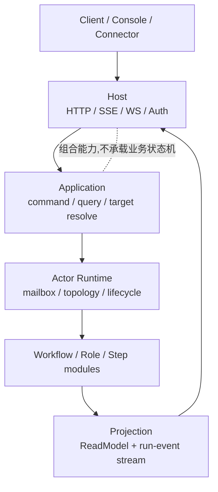
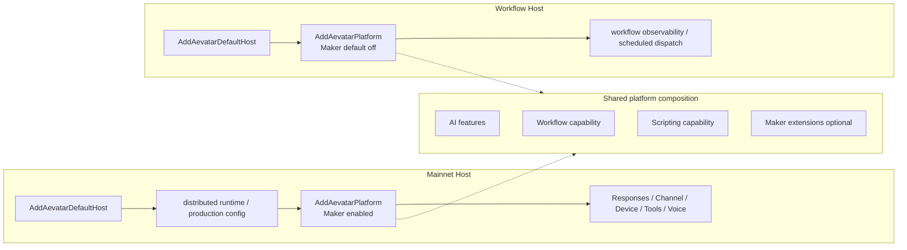
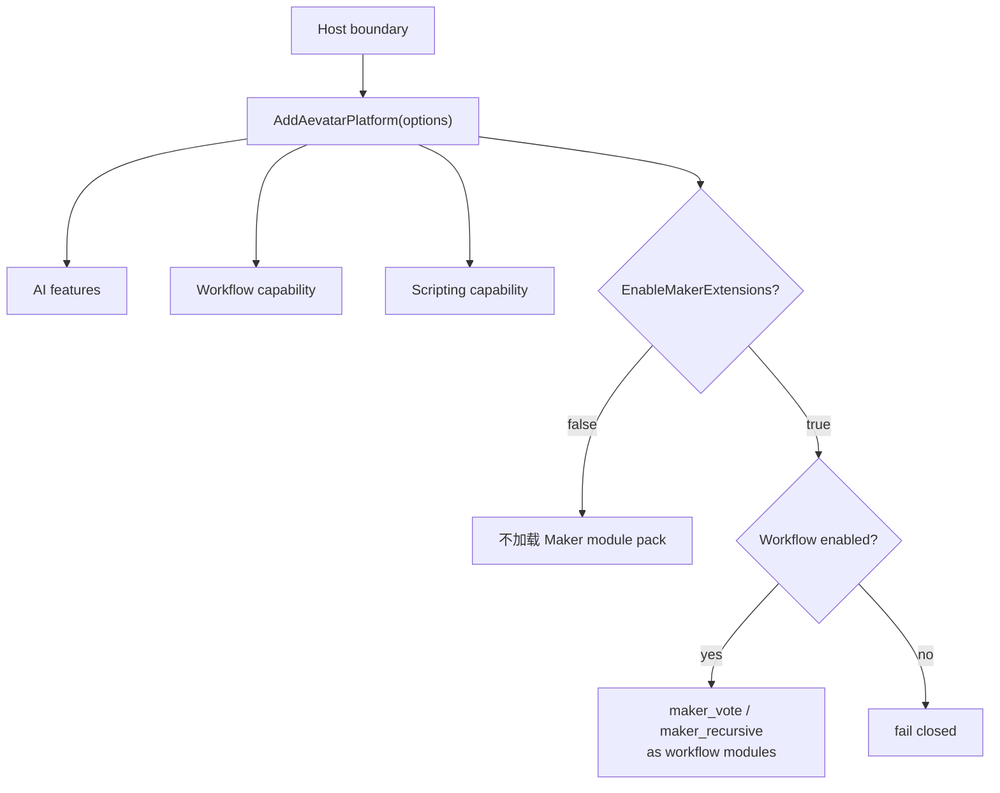

# Host 是协议出口和能力组合

## 关键代码(事实源,以 ~/Code/aevatar 为准)

- `docs/canon/overview.md`: 当前架构基线、Host 职责、Maker 插件边界和架构守卫。
- `src/Aevatar.Mainnet.Host.Api/Hosting/MainnetHostBuilderExtensions.cs`: Mainnet Host 的生产装配入口和端点映射。
- `src/workflow/extensions/Aevatar.Workflow.Extensions.Hosting/AevatarPlatformHostBuilderExtensions.cs`: `AddAevatarPlatform(...)` 的能力开关和 Maker 依赖校验。

---

## 先抓主语:Host 不是业务流程

读 01 章时先把边界摆正:Host 是 **协议出口 + 能力组合层**。它负责把 HTTP/SSE/WS、认证、运行时、Workflow、工具和生产配置装起来,但不应该在 Host 里写 workflow 的业务状态机。

这个边界来自事实源 1 的分层口径:Host 做协议适配、能力组合、运行参数配置;流程推进、Actor 状态和投影读侧属于下面的 Application / Domain / Projection 层。

换句话说,Host 能决定“这个进程暴露哪些协议、启用哪些能力、连到哪套运行时”,但不应该决定“某个 step 下一步怎么走”。后者归 workflow 模块和 run actor。

---

## Mainnet Host 和 Workflow Host 的分工

两个 Host 都是薄壳,差别在能力组合:

| 维度 | Mainnet Host | Workflow Host |
|---|---|---|
| 默认定位 | 生产统一入口 | Workflow 能力隔离入口 |
| 能力范围 | 全量生产能力:认证、Responses、ChatCompletions、Channel、Device、StreamingProxy、ToolSets、Workflow、Maker | 更窄:Workflow run 控制、查询、观测和调度 |
| Maker | 通过 `EnableMakerExtensions=true` 装进 Workflow 插件体系 | 默认不加载 Maker |
| 读法 | “把平台入口装完整” | “把 workflow 能力单独跑起来” |

这张图的重点不是“Mainnet 比 Workflow 多了多少行配置”,而是“二者共享同一套平台组合函数,只是在 Host 边界选择不同能力面”。Mainnet 是默认生产入口,Workflow Host 是更窄的能力隔离壳。

---

## `AddAevatarPlatform(...)` 是组合开关

`AddAevatarPlatform(...)` 可以理解成 Host 和 Workflow 能力之间的插座。事实源 3 里有几个关键开关:

| 开关 | 默认语义 | Host 读法 |
|---|---|---|
| `EnableAIFeatures` | 注册 AI provider、MCP、Skills、Ornn、Web 等能力 | 默认需要 |
| `EnableWorkflowCapability` | 注册 Workflow 能力、投影、health、调度 | 默认需要 |
| `EnableScriptingCapability` | 注册 scripting 能力 | 默认需要 |
| `EnableMakerExtensions` | 把 Maker 模块包接入 Workflow 模块体系 | 默认关闭,Mainnet 显式打开 |

Maker 的边界也在这里被钉住:启用 Maker 时必须同时启用 Workflow。也就是说 Maker 不是平行于 Workflow 的第二套系统,而是 Workflow 的插件扩展。

这就是“Maker 从独立 Host 降级成 Mainnet 插件”的设计含义:它不是削弱能力,而是把能力放回正确层级。模块属于 Workflow,入口属于 Host。

---

## 为什么这比“源码位置索引”更重要

如果从实现位置开始读,很容易把 Mainnet Host 看成一张长长的注册清单,然后迷失在每个 service 的注册顺序里。更稳的读法是:

1. 先确认 Host 边界:协议和组合在 Host,业务状态机不在 Host。
2. 再看能力面:Mainnet 是生产全集,Workflow Host 是能力隔离壳。
3. 最后看插件关系:Maker 是 Workflow module pack,由 Mainnet 选择性装配。

这个顺序能解释架构守卫为什么禁止 Maker 独立 Host、`/api/maker/*` 回流和 Workflow 反向依赖 Maker。守卫不是形式主义,它是在保护“Host 只组合能力,插件不反向绑架核心”的边界。

---

## 验收

读完这篇,应该能回答:

1. Host 的职责是什么?协议出口、能力组合、运行参数配置。
2. Mainnet Host 和 Workflow Host 的核心区别是什么?Mainnet 是生产统一入口,Workflow Host 是较窄的 Workflow 能力隔离入口。
3. Maker 为什么不是独立 Host?它是 Workflow module pack,通过 `AddAevatarPlatform(...)` 的开关进入 Mainnet。
4. 为什么不能用注册清单当正文主线?因为注册清单让读者追实现位置,而不是先理解层级边界。

⟦AI:AUTO-LOOP⟧
