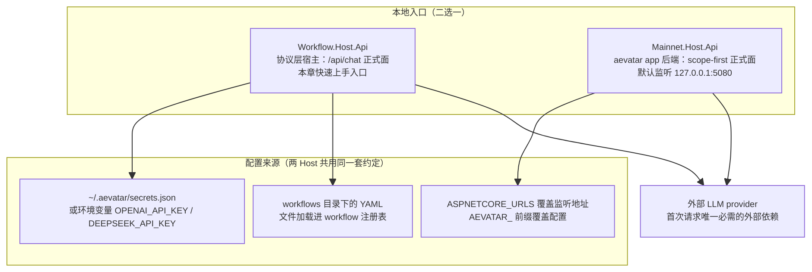
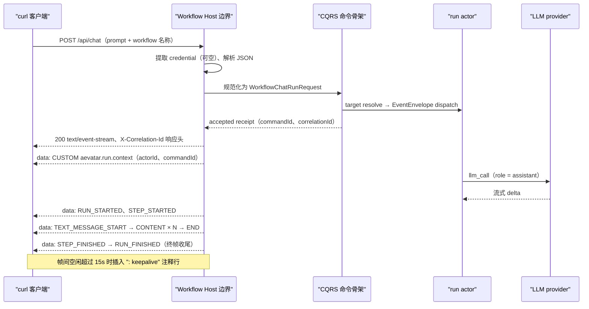

# 快速上手:本地启动 Host 并完成第一次请求

> 版本与结论:本章描述 `current`（正文同步目标为上游 HEAD `d9db826eb`，frontmatter 审查基线仍为冻结 `f02aa690`）。核心结论:框架学习面的本地入口是 `Aevatar.Workflow.Host.Api` 的 `POST /api/chat`(SSE);Mainnet Host 是 `aevatar app` 的产品后端,其正式契约是 scope-first,`POST /api/chat` 由 `MainnetChatEndpoints` facade 提供——workflow 类请求仍转发给 Workflow capability 实现,带 assistant `type` 的请求转发给 NyxID Chat v1,契约地位已退役。

## 设计抽象与事实源

- `src/workflow/Aevatar.Workflow.Host.Api/README.md:3`:Workflow Host 自我定位为"协议层宿主,只做 HTTP/SSE/WebSocket 适配与依赖组合"——支撑本章"快速上手选哪个 Host"的脊柱判断。
- `src/Aevatar.Mainnet.Host.Api/README.md:5`:Mainnet Host 本地直接 `dotnet run` 默认监听 `http://127.0.0.1:5080`,外部 `ASPNETCORE_URLS` / `--urls` 优先——支撑端口与配置契约,取代旧章沿用的数字口径。
- `workflows/simple_qa.yaml:1`:仓库自带最小 workflow(一个 `assistant` role + 一个 `llm_call` step)——支撑首次请求体里 `workflow: "simple_qa"` 的名称解析目标。

## 先建立模型

快速上手要先回答一个问题:仓库里有两个可执行 Host,应该起哪一个?

- `Aevatar.Workflow.Host.Api` 是**协议层宿主**:不承载业务编排,只做协议适配与依赖组合,`/api/chat`(SSE)与 `/api/ws/chat`(WebSocket)是它的正式面。它依赖面最小,是观察框架运行内核最短的链路。
- `Aevatar.Mainnet.Host.Api` 是 `aevatar app` 的**唯一后端 API 面**,用户面 contract 已收敛为 scope-first(`/api/scopes/{scopeId}/...`);其 README 明确声明旧的 `/api/chat`、`/api/ws/chat` 不再是 `aevatar app` 的正式运行时 contract(`src/Aevatar.Mainnet.Host.Api/README.md:214`)。
- 两个 Host 都经 `AddAevatarPlatform()` 装配,但 `POST /api/chat` 的实现不同:Workflow Host 直接挂载 Workflow Chat capability 的 `ChatEndpoints` 路由组(SSE),挂载由开关控制——`POST /api/chat` 被包进 `if (mapChatPost)`(`src/workflow/Aevatar.Workflow.Infrastructure/CapabilityApi/ChatEndpoints.cs:36-40`;Workflow Host 上 `GET /api/ws/chat` 在块外不受影响),开关由 `AddWorkflowCapabilityBundle(options.MapWorkflowChatPost)` 传入(`src/workflow/extensions/Aevatar.Workflow.Extensions.Hosting/AevatarPlatformHostBuilderExtensions.cs:121`,默认 `true`)。Mainnet 显式 `MapWorkflowChatPost=false`(`src/Aevatar.Mainnet.Host.Api/Hosting/MainnetHostBuilderExtensions.cs:144`)让整个路由组都不挂载,改由 `MainnetChatEndpoints` facade 提供同一路径(`src/Aevatar.Mainnet.Host.Api/Chat/MainnetChatEndpoints.cs:37`):form 或无 `type` 的 JSON 转发给 `WorkflowCapabilityEndpoints.HandleChatPostAsync`,带 `type`(`text`/`task.stop`/`step.retry`/...)的请求转发给 NyxID Chat v1。所以 `/api/chat` 在 Mainnet 上仍然物理存在,但 Workflow Chat 只是其中契约已退役的一个分支。

本地组成与配置来源:



端口契约要分清两个层级:

- Mainnet 的 `http://127.0.0.1:5080` 是**代码常量**(`src/Aevatar.Mainnet.Host.Api/Hosting/MainnetHostBuilderExtensions.cs:90`),是仓库给出的契约。
- Workflow Host 项目内没有 `launchSettings.json`、没有 `appsettings.json`、组合代码也不调用 `UseUrls`,所以仓库**没有为它钉死端口**:不显式配置时由 ASP.NET Core 默认监听地址决定,以启动日志 `Now listening on:` 为准;建议用 `ASPNETCORE_URLS` 显式固定,demo 才有确定性。

workflow 名称解析方面,`workflow: "simple_qa"` 命中的是**文件加载注册表**:workflow capability 启动时会把若干目录注册为 YAML 来源,其中包含仓库根的 `workflows` 目录(`src/workflow/Aevatar.Workflow.Infrastructure/DependencyInjection/WorkflowCapabilityServiceCollectionExtensions.cs:79-86`;仓库根定位见 `src/Aevatar.Configuration/AevatarPaths.cs:108`)。所以从仓库根启动 Host,`workflows/simple_qa.yaml` 自动可引用,不需要拷贝到 `~/.aevatar`。

## 沿一条链路走读

一次 `POST /api/chat` 在框架内部的完整链路(Host README 的运行语义,`src/workflow/Aevatar.Workflow.Host.Api/README.md:63`):

1. **Host 边界**:提取 caller credential(缺失按"无凭证"处理,不是错误;格式非法的 bearer 才报 400 `INVALID_CALLER_CREDENTIAL`,见 `src/workflow/Aevatar.Workflow.Infrastructure/CapabilityApi/WorkflowCallerCredentialExtractor.cs:221`),再按 Content-Type 分派 JSON 或 multipart 解析。
2. **规范化**:输入被规范化为应用命令模型 `WorkflowChatRunRequest`。
3. **CQRS 命令骨架**:`target resolve -> command context -> envelope -> dispatch port -> accepted receipt`;命令被包装成 `EventEnvelope` 投递给新创建的 run actor。
4. **accepted 即开流**:收到 accepted receipt 后,Host 在响应头写入 `X-Correlation-Id`(`src/workflow/Aevatar.Workflow.Infrastructure/CapabilityApi/CapabilityTraceContext.cs:32`),把响应切换为 SSE,并先写一帧 `CUSTOM: aevatar.run.context`(携带 `actorId` / `workflowName` / `commandId`,构造点见 `src/workflow/Aevatar.Workflow.Infrastructure/CapabilityApi/ChatEndpoints.cs:776`)。
5. **运行帧**:run actor 驱动 `llm_call` 步骤,envelope 流被投影为 SSE 帧持续回推。
6. **终态收尾**:终止事件(`RUN_FINISHED` / `RUN_ERROR`)之后,本次请求收尾(`src/workflow/Aevatar.Workflow.Host.Api/README.md:79`)。



注意上图是**职责时序**而不是逐帧承诺:中间帧的确切序列(是否有 `USAGE`、`STATE_SNAPSHOT`,文本分几片)取决于运行管线与模型,以实跑为准;有强保证的只有首帧(`aevatar.run.context`)与终帧(终止事件之一)。

## 为什么是它,不是别的

**为什么快速上手用 Workflow Host 的 `/api/chat`,而不是直接上 Mainnet 的 scope-first 契约?**

- scope-first 路径的前置概念多:scope、binding、revision 激活、NyxID 认证 token,每一层都是产品治理概念;第一课就学它,会把"框架怎么跑"淹没在"产品怎么管"里。
- `/api/chat` 的最小请求只有两个字段(`prompt` + `workflow`),匿名即可调用,且一条请求直接暴露框架的三件内核:CQRS 命令骨架、run actor、SSE 投影流。学习收益与前置成本的比值最高。
- 不变量与代价:这条路径学到的是**框架层协议**——canon 文档的标题是"Chat API 能力说明(Mainnet 与 Workflow)"(`docs/canon/chat-api.md:7`),同一份说明同时覆盖 Mainnet 面与框架面。它不是任何产品的规范 API;迁到产品面时,scope-first 的治理概念仍然要重新学。这是有意的取舍:本章优化的是"最快看到运行内核",不是"最快接入 app"。

**为什么不图省事,直接在 Mainnet 上调 `/api/chat`?** 它虽然仍物理存在(facade 转发),但两个理由不选它:契约上它已被 Mainnet README 声明退役,把第一课的肌肉记忆建立在一个遗留面上会误导后续章节;环境上 Mainnet 默认认证开启,免认证调试必须 `ASPNETCORE_ENVIRONMENT=Development` 并显式关闭认证开关(该开关只在 Development 生效),日常启动推荐走 `src/Aevatar.Mainnet.Host.Api/boot.sh` 注入一组 Development-only 默认值——这些都偏离"最小依赖面"的目标。

## 协议与状态深入

### SSE 线格式

SSE 写出器的实现(`src/workflow/Aevatar.Workflow.Infrastructure/CapabilityApi/ChatSseResponseWriter.cs`)给出了精确的线格式契约:

- 响应头:`Content-Type: text/event-stream; charset=utf-8`、`Cache-Control: no-store`、`Pragma: no-cache`、`X-Accel-Buffering: no`(第 44-47 行)。
- 每帧就是一行 `data: <JSON>` 加空行(第 56 行);**没有 `event:` 行**,事件类型不看 SSE 的 event 字段,而是看 JSON 里出现了哪个 oneof 字段——帧体统一是 `WorkflowRunEventEnvelope` 的 protobuf JSON 映射(`src/workflow/Aevatar.Workflow.Application.Abstractions/Runs/workflow_run_events.proto:22-41`),camelCase 字段名,例如 `{"runStarted": {...}}`、`{"textMessageContent": {"delta": "..."}}`、`{"custom": {"name": "aevatar.run.context", ...}}`。
- 心跳:帧间空闲每 15 秒写一行 `: keepalive` 注释(第 17-18 行),用来穿过默认 60 秒空闲超时的反向代理;注释行对消费者是惰性的,客户端解析时应忽略。

### 事件类型词汇

事件类型常量的单一事实源是 `WorkflowRunEventTypes`(`src/workflow/Aevatar.Workflow.Application.Abstractions/Runs/WorkflowRunEventTypes.cs:5-18`):`RUN_STARTED` / `RUN_FINISHED` / `RUN_ERROR` / `RUN_STOPPED` / `STEP_STARTED` / `STEP_FINISHED` / `TEXT_MESSAGE_START` / `TEXT_MESSAGE_CONTENT` / `TEXT_MESSAGE_END` / `STATE_SNAPSHOT` / `TOOL_CALL_START` / `TOOL_CALL_END` / `USAGE` / `CUSTOM`。canon 清单里的 `HUMAN_INPUT_REQUEST` 不属于这组 typed 常量,人工交互经 `CUSTOM` 子类型(`aevatar.step.request` / `aevatar.workflow.waiting_signal` 等)表达。

### 身份词汇纪律(全书统一)

一次请求会同时出现多个 id,它们**永不互换**:

| 标识 | 语义 | 在本次链路中的出处 |
|---|---|---|
| `actorId` | 状态所有者:本次新建的 run actor | `aevatar.run.context` 帧;accepted receipt |
| `commandId` | 追踪这一次命令 | `aevatar.run.context` 帧;accepted receipt |
| `correlationId` | 追踪消息链 | 响应头 `X-Correlation-Id` |
| `runId` | 标识这一次执行 | `RUN_STARTED` 帧的 `runId` 字段(`workflow_run_events.proto:43-46`) |
| `conversationId` | 拥有多轮历史的会话 | `aevatar.chat.context` 帧(receipt 携带 chat context 时先于 run.context 发出;调用点时序 `ChatEndpoints.cs:341-343` 与 `:352-353`,帧构造点 `:802`) |
| `turnId` | 标识一次用户回合 | 同上帧(`workflow_run_events.proto:159-164`) |

`actorId + commandId` 是客户端后续观察 run 输出与读模型查询的会话句柄:`commandId` 负责追踪,`actorId` 负责定位(`src/workflow/Aevatar.Workflow.Host.Api/README.md:77`)。任何 `accepted` 语义都只应理解为"请求已被系统接受并可追踪",不代表领域事件已提交、不代表读模型已可见。

### 失败形态

Host 边界错误(415 `UNSUPPORTED_MEDIA_TYPE`、400 `INVALID_CHAT_INPUT` / `PROMPT_REQUIRED`、404 `WORKFLOW_NOT_FOUND` 等)在 SSE 开流**之前**以普通 JSON 错误响应返回;一旦开流,运行期失败以 `RUN_ERROR` 帧收尾,不再改 HTTP 状态码。

## 最小示例

> Demo status:`verified-static`。缺失前提:本机没有 LLM 凭证、本章撰写时未实际启动服务;以下帧形态全部来自 SSE 写出器、事件类型常量与 proto 的静态核实,不代表一次真实运行的逐帧记录。

前置:.NET SDK(`global.json:3` 钉 `10.0.100`,`rollForward: latestFeature`)与仓库 `~/Code/aevatar`。

**第 1 步:配 LLM 凭证。** Workflow Host 依赖 `~/.aevatar/` 下的 `config.json` / `secrets.json` / `connectors.json`,LLM API Key 也可从环境变量 `DEEPSEEK_API_KEY` / `OPENAI_API_KEY` 读取(`src/workflow/Aevatar.Workflow.Host.Api/Program.cs:8-9`)。最小做法:

```bash
export OPENAI_API_KEY="sk-..."   # 或 DEEPSEEK_API_KEY
```

**第 2 步:启动 Workflow Host。** 不显式配置端口时以启动日志 `Now listening on:` 为准;为了 demo 确定,显式钉端口:

```bash
cd ~/Code/aevatar
ASPNETCORE_URLS=http://127.0.0.1:5000 \
  dotnet run --project src/workflow/Aevatar.Workflow.Host.Api
```

**第 3 步:发第一次请求。**

```bash
curl -N http://127.0.0.1:5000/api/chat \
  -H "Content-Type: application/json" \
  -d '{"prompt":"用一句话介绍 Actor 模型","workflow":"simple_qa"}'
```

`curl -N` 关闭输出缓冲,让帧逐条滚出。请求体选择优先级:`workflowYamls`(inline bundle)> `workflow`(注册表名称)> 都不传时默认路由 `auto`;复用已绑定 actor 用 typed `source.definitionActor.actorId`。

**第 4 步:核对期望帧形态**(字段名为 protobuf JSON 的 camelCase,值以实跑为准):

```text
data: {"custom":{"name":"aevatar.run.context","payload":{...actorId、commandId...}}}

data: {"runStarted":{"threadId":"...","runId":"..."}}

data: {"stepStarted":{"stepName":"answer"}}

data: {"textMessageContent":{"messageId":"...","delta":"Actor"}}        ← 分 N 片

data: {"stepFinished":{"stepName":"answer"}}

data: {"runFinished":{...}}                                            ← 终帧,连接收尾
```

**第 5 步(可选):读侧核对。** `GET /api/workflows` 应列出含 `simple_qa` 在内的已注册 workflow;用第 4 步首帧拿到的 `actorId` 查询该 run 的读模型视图:

```bash
curl http://127.0.0.1:5000/api/workflow-actors/{actorId}/current-state
```

> ⚠️ **README 滞后提示**:Workflow Host README 仍写旧的 `GET /api/actors/{actorId}`(`src/workflow/Aevatar.Workflow.Host.Api/README.md:80`),该行滞后于端点代码——端点重构已把 accepted status link 与 HTTP 查询面统一迁移到 current-state readmodel 资源(退役注释见 `src/workflow/Aevatar.Workflow.Infrastructure/CapabilityApi/ChatEndpoints.cs:765` 与 `src/workflow/Aevatar.Workflow.Infrastructure/CapabilityApi/ChatQueryEndpoints.cs:128-129`),真实映射只有 `GET /api/workflow-actors/{actorId}/current-state`(`src/workflow/Aevatar.Workflow.Infrastructure/CapabilityApi/ChatQueryEndpoints.cs:36`),旧形态路由在冻结树中没有任何 `MapGet` 映射,实跑必 404。**以端点代码为准。**

## 边界与演进

- **current(本章全部内容)**:Workflow Host 的协议层定位、`/api/chat` 请求/帧契约、端口与配置来源、`simple_qa` 的文件加载解析。
- **产品面(current,非本章主题)**:Mainnet 的正式契约是 scope-first(`/api/scopes/{scopeId}/workflow/draft-run`、`/binding`、`/invoke/chat:stream` 等,`src/Aevatar.Mainnet.Host.Api/README.md:137`),本地有三种 profile:脚本默认 `local`(全临时态,重启即清空)、`PersistentLocal`(Orleans + Garnet 保 actor 态,读侧仍临时)、`Distributed`(Kafka + Elasticsearch + Neo4j)。
- **historical**:Mainnet 上的 `/api/chat`、`/api/ws/chat`、`/api/workflows/resume|signal|stop` 作为 `aevatar app` 运行时 contract 已退役(`src/Aevatar.Mainnet.Host.Api/README.md:214`);Mainnet 的 `POST /api/chat` 现由 `MainnetChatEndpoints` facade 提供,Workflow Chat capability 的路由组不再直接挂载(`MapWorkflowChatPost=false`)。框架面上这些端点仍由 Workflow Host 正式提供,结构切换前 Quick Start 的"起 Mainnet 调 `/api/chat`"口径因此被本章替换。
- **open gap**:Workflow Host 没有仓库钉死的监听地址契约(无 `launchSettings.json` / `UseUrls`),端口只能以启动日志或显式 `ASPNETCORE_URLS` 为准;文档无法给出"默认端口"的硬承诺。

## 读完应能回答

1. 快速上手应该启动哪个 Host?为什么是它而不是 Mainnet Host?
2. Mainnet Host 本地默认监听地址是什么、由哪个代码常量决定?Workflow Host 的端口又由什么决定?
3. 一次 `/api/chat` 请求,响应的第一帧和最后一帧各是什么?accepted receipt 的语义边界在哪里?
4. `actorId`、`commandId`、`runId`、`correlationId`、`conversationId`、`turnId` 各标识什么,分别从哪一帧或哪个响应头读到?
5. 为什么说 `/api/chat` 是框架学习面而不是 `aevatar app` 的规范 API?

<details>
<summary>论断—证据映射</summary>

| 论断 | 等级 | 证据 |
|---|---|---|
| Workflow Host 是协议层宿主,只做 HTTP/SSE/WebSocket 适配与依赖组合 | E1 | `src/workflow/Aevatar.Workflow.Host.Api/README.md:3` |
| Mainnet 本地默认监听 `http://127.0.0.1:5080`,外部 URL 配置优先 | E1 | `src/Aevatar.Mainnet.Host.Api/README.md:5`、`src/Aevatar.Mainnet.Host.Api/Hosting/MainnetHostBuilderExtensions.cs:90` |
| Mainnet 是 app 唯一后端 API 面,契约收敛为 scope-first | E1 | `src/Aevatar.Mainnet.Host.Api/README.md:137` |
| Mainnet 上 `/api/chat` 等旧端点不再是 app 正式运行时 contract | E1 | `src/Aevatar.Mainnet.Host.Api/README.md:214` |
| `POST /api/chat` 在 Workflow Host 由 capability 路由组挂载(开关 `MapWorkflowChatPost` 默认开);Mainnet 显式关并改由 `MainnetChatEndpoints` facade 提供(workflow 类请求仍转发同一实现) | E1 | `src/workflow/extensions/Aevatar.Workflow.Extensions.Hosting/AevatarPlatformHostBuilderExtensions.cs:121`、`src/workflow/Aevatar.Workflow.Infrastructure/CapabilityApi/ChatEndpoints.cs:36-40`、`src/Aevatar.Mainnet.Host.Api/Hosting/MainnetHostBuilderExtensions.cs:144`、`src/Aevatar.Mainnet.Host.Api/Chat/MainnetChatEndpoints.cs:37`、`:50-96` |
| 仓库根 `workflows` 目录被注册为 YAML 文件来源,`simple_qa` 可按名引用 | E1 | `src/workflow/Aevatar.Workflow.Infrastructure/DependencyInjection/WorkflowCapabilityServiceCollectionExtensions.cs:79-86`、`src/Aevatar.Configuration/AevatarPaths.cs:108`、`workflows/simple_qa.yaml:1-9` |
| LLM Key 来自 `~/.aevatar` secrets 或 `DEEPSEEK_API_KEY` / `OPENAI_API_KEY` | E1 | `src/workflow/Aevatar.Workflow.Host.Api/Program.cs:8-9` |
| 缺失 Authorization 头按"无凭证"处理而非错误 | E1 | `src/workflow/Aevatar.Workflow.Infrastructure/CapabilityApi/WorkflowCallerCredentialExtractor.cs:221` |
| 命令走 CQRS 骨架 target resolve → envelope → dispatch → accepted receipt | E1 | `src/workflow/Aevatar.Workflow.Host.Api/README.md:63` |
| SSE 响应头(含 `Pragma: no-cache`)、`data:` 帧格式、15s `: keepalive` 心跳 | E1 | `src/workflow/Aevatar.Workflow.Infrastructure/CapabilityApi/ChatSseResponseWriter.cs:17-18,44-47,56` |
| 帧体是 `WorkflowRunEventEnvelope` 的 protobuf JSON,事件类型看 oneof 字段 | E1 | `src/workflow/Aevatar.Workflow.Application.Abstractions/Runs/workflow_run_events.proto:22-41` |
| accepted 后先发 `aevatar.run.context`(actorId/workflowName/commandId) | E1 | `src/workflow/Aevatar.Workflow.Infrastructure/CapabilityApi/ChatEndpoints.cs:776`、`src/workflow/Aevatar.Workflow.Application.Abstractions/Runs/workflow_run_events.proto:153-157` |
| `aevatar.chat.context` 携带 scopeId/conversationId/turnId/stateVersion,且先于 run.context 发出 | E1 | `src/workflow/Aevatar.Workflow.Infrastructure/CapabilityApi/ChatEndpoints.cs:341-343,352-353,802`、`src/workflow/Aevatar.Workflow.Application.Abstractions/Runs/workflow_run_events.proto:159-164` |
| `X-Correlation-Id` 响应头在 accepted 时写入 | E1 | `src/workflow/Aevatar.Workflow.Infrastructure/CapabilityApi/CapabilityTraceContext.cs:32` |
| 事件类型常量 SSOT(14 个 typed 常量) | E1 | `src/workflow/Aevatar.Workflow.Application.Abstractions/Runs/WorkflowRunEventTypes.cs:5-18` |
| `RUN_STARTED` payload 携带 `threadId` / `runId` | E1 | `src/workflow/Aevatar.Workflow.Application.Abstractions/Runs/workflow_run_events.proto:43-46` |
| `actorId + commandId` 是观察句柄;accepted 只表示"已接受可追踪" | E1 | `src/workflow/Aevatar.Workflow.Host.Api/README.md:77` |
| 单次请求在终止事件(`RUN_FINISHED`/`RUN_ERROR`)后收尾 | E1 | `src/workflow/Aevatar.Workflow.Host.Api/README.md:79` |
| canon 统一说明 Chat API 能力(Mainnet 与 Workflow) | E1 | `docs/canon/chat-api.md:7` |
| 读模型查询真实路由是 `GET /api/workflow-actors/{actorId}/current-state` | E1 | `src/workflow/Aevatar.Workflow.Infrastructure/CapabilityApi/ChatQueryEndpoints.cs:36` |
| 旧 `/api/actors/{actorId}` 查询形态已退役,README 第 80 行口径滞后于端点代码 | E1 | `src/workflow/Aevatar.Workflow.Infrastructure/CapabilityApi/ChatEndpoints.cs:765`、`src/workflow/Aevatar.Workflow.Infrastructure/CapabilityApi/ChatQueryEndpoints.cs:128-129` |
| SDK 版本钉 `10.0.100` | E1 | `global.json:3` |

</details>
