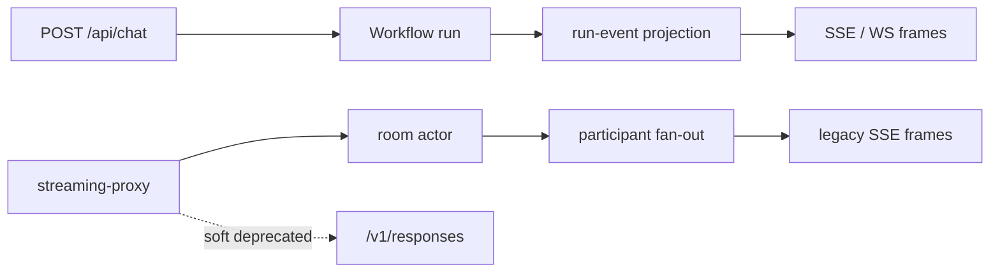
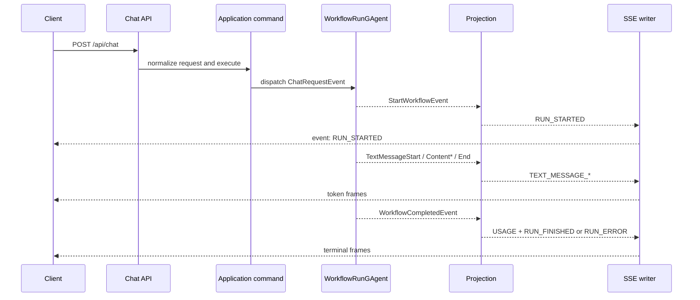
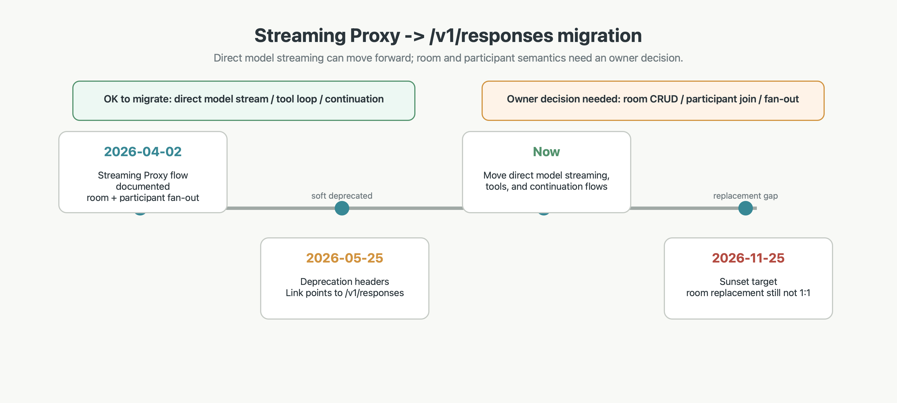

# `/api/chat`、SSE 帧和 streaming-proxy 迁移边界

## 关键代码(事实源,以 ~/Code/aevatar 为准)

- `docs/canon/chat-api.md`: `/api/chat`、`/api/ws/chat`、输入模型、输出事件和恢复/信号接口。
- `src/workflow/Aevatar.Workflow.Application.Abstractions/Runs/WorkflowRunEventTypes.cs`: Workflow run-event 的共享事件类型源。
- `docs/2026-04-02-streaming-proxy-flow.md`: streaming-proxy 软废弃、Sunset、room/participant 迁移缺口。

---

## 先分清两条流

这里有两个容易混淆的入口:

| 入口 | 本质 | 适合什么 |
|---|---|---|
| `POST /api/chat` | 启动或复用一次 Workflow run,用 SSE 接收 run-event 投影 | Workflow 编排、step 状态、LLM 文本增量、工具事件、人工交互 |
| streaming-proxy | 旧的 room-based 多 participant fan-out | 历史兼容的 room、participant、message stream |

事实源 1 说明 `/api/chat` 和 `/api/ws/chat` 走同一套执行链路,只是传输协议不同。事实源 3 说明 streaming-proxy 已软废弃,直接模型 streaming / tool / continuation 应迁向 `/v1/responses`,但 room 和 participant 语义没有无损替代。

---

## `/api/chat` 请求怎么被解释

最小请求可以只有 `prompt`。如果传更多字段,选择顺序按事实源 1 的契约理解:

| 输入 | 语义 |
|---|---|
| `workflowYamls` | inline YAML bundle,优先级最高 |
| `workflow` | 已注册 workflow 名称 |
| 空 workflow/source/bundle | 外部 API 边界默认路由到 `auto` |
| `source.definitionActor.actorId` | 复用已绑定 workflow actor |

不要把顶层 `agentId` 当成 canon 契约。Actor 身份走 typed `source` 子消息,这样 Host 边界可以先把外部 JSON 归一化成应用命令,再进入 CQRS/Actor 主链路。

---

## 简化 SSE 帧表

事实源 2 是事件类型的共享源。消费方不需要背实现文件,只要按生命周期分组理解:

| 分组 | 帧 | 读法 |
|---|---|---|
| run 生命周期 | `RUN_STARTED`、`RUN_FINISHED`、`RUN_ERROR`、`RUN_STOPPED` | 一次 run 的开始、终止和异常收敛 |
| step 生命周期 | `STEP_STARTED`、`STEP_FINISHED` | workflow step 的执行进度 |
| 文本流 | `TEXT_MESSAGE_START`、`TEXT_MESSAGE_CONTENT`、`TEXT_MESSAGE_END` | LLM 文本增量,start 和 end 包住多段 content |
| 工具流 | `TOOL_CALL_START`、`TOOL_CALL_END` | 工具调用的开始和结束 |
| 状态和扩展 | `STATE_SNAPSHOT`、`USAGE`、`CUSTOM` | 收敛快照、用量、媒体/人工交互/等待信号等扩展事件 |

`CUSTOM` 不是“随便塞字符串”的后门,而是把还没有独立顶层帧的领域事件收束在统一 envelope 下。比如人工交互、媒体分片、等待 signal,都应该先按事实源 1 的子类型口径消费。

---

## SSE 时序图

这条链路的设计重点是:Host 不直接拼业务事件,SSE 输出来自投影后的 `WorkflowRunEventEnvelope`。这能让 HTTP SSE 和 WebSocket 共享同一套运行事件模型。

---

## streaming-proxy 到 `/v1/responses` 的迁移

事实源 3 的迁移口径可以压缩成一句话:能迁的是“直接模型流式 / tool / continuation”,不能直接迁的是“room CRUD / participant join-post / room fan-out”。

| 语义 | streaming-proxy | `/v1/responses` |
|---|---|---|
| 直接模型流式 | 有 | 可迁移 |
| tool / continuation | 有 | 可迁移 |
| room CRUD | 有 | 无一一对应 |
| participant join/post | 有 | 无一一对应 |
| room fan-out | 有 | 无一一对应 |

⚠️ streaming-proxy 的 room/participant 迁移缺口需要架构 owner 确认。当前文档只能把缺口标出来,不能把 `/v1/responses` 写成这些语义的无损替代。

---

## 验收

读完这篇,应该能回答:

1. `/api/chat` 是什么?它是 Workflow run 的 HTTP + SSE 入口。
2. `TEXT_MESSAGE_CONTENT` 应该怎么看?它是 start/end 包住的文本增量帧。
3. streaming-proxy 为什么不能直接等同 `/v1/responses`?因为 room、participant 和 fan-out 语义没有一一对应替代。
4. 哪个迁移点必须带风险标注?streaming-proxy room/participant 缺口,需架构 owner 确认。

⟦AI:AUTO-LOOP⟧
