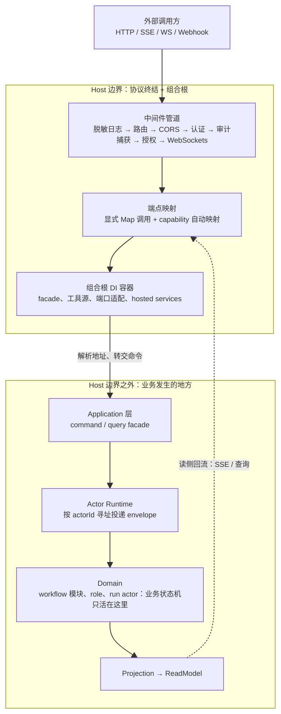
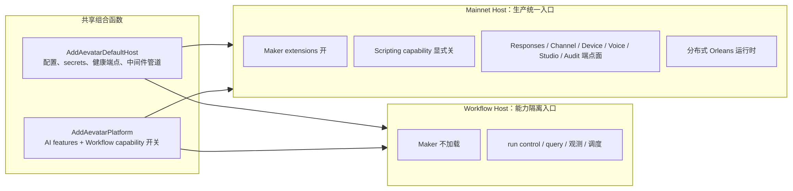
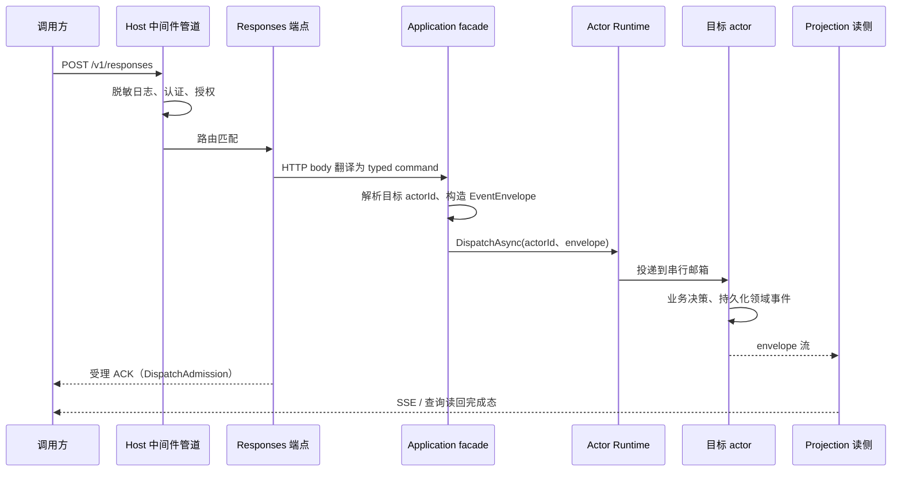

# Host 与组合：协议终结与能力装配的边界

> 版本与结论：本章描述 `current`；当前行为以 `f02aa690` 为准。核心结论：Host 只做三件事——协议终结、横切中间件（认证/授权/审计/脱敏日志）、组合根；业务编排（workflow 推进、会话历史、run 状态机）一律不在 Host。Mainnet Host 是生产统一入口，Workflow Host 是共享同一套组合函数的窄能力入口。

## 设计抽象与事实源

- `docs/canon/overview.md:76`：canon 对 Host 层的职责定义——协议适配、能力组合、运行参数配置；同文第 80 行的禁止项明确 Host/API 不编排业务流程，这是整章的不变量来源。
- `src/Aevatar.Mainnet.Host.Api/Hosting/MainnetHostBuilderExtensions.cs:91`：Mainnet 的组合根——`AddAevatarMainnetHost` 完成全部服务注册，第 437 行的 `MapAevatarMainnetHost` 穷举全部显式端点；Mainnet 的"能力面"在这一个文件里被完整定义。
- `src/workflow/Aevatar.Workflow.Host.Api/Program.cs:20`：Workflow Host 入口——与 Mainnet 共享 `AddAevatarDefaultHost` 与 `AddAevatarPlatform`（第 26 行），但不装 Maker、不暴露 Responses/Channel 等端点面；全文 49 行，是"窄能力入口"的直接证据。

## 先建立模型：Host 边界内只有三类东西

把 Host 拆开看，边界之内只有三类内容，没有第四类：

1. **中间件管道**（协议横切）：共享管道由 `UseAevatarDefaultHost` 统一装配——脱敏请求日志在最外层（框架默认的 request logging 会记录带凭证查询串的原始 URL，必须先压住），其后依次是路由、CORS、认证（有注册 scheme 才挂载）、端点审计捕获、授权（无条件挂载，保证无认证 scheme 时 `[Authorize]` 仍返回 401/403 而非 500）、WebSockets（按开关）。见 `src/Aevatar.Bootstrap/Hosting/WebApplicationBuilderExtensions.cs:135`。
2. **端点映射**（协议终结）：端点有两个来源——Host 显式调用 `Map*` 方法列出的端点（Mainnet 的全部显式端点集中在 `MapAevatarMainnetHost`），以及 capability 的自映射（`AddAevatarCapability` 注册服务时同时登记一个端点映射回调，`UseAevatarDefaultHost` 末尾的 `MapAevatarCapabilities` 统一执行，重复注册会被拒绝）。见 `src/Aevatar.Bootstrap/Hosting/WebApplicationBuilderExtensions.cs:198` 与 `src/Aevatar.Capabilities/AevatarCapabilityHostExtensions.cs:47`。
3. **组合根**（DI 容器）：facade、工具源、端口适配、hosted services、选项验证器的注册全部发生在 Host 的组合函数里。组合根还决定启动拓扑与运行参数（监听地址、secrets 策略、hosted services 启动顺序）。

三类内容有一个共同性质：它们都可以"不知道业务是什么"而完成工作。中间件不知道请求属于哪个 workflow；端点只翻译协议；组合根只接线。业务状态机在 Host 边界之外。



### 两个 Host：一套组合函数，两种能力面

Mainnet Host 与 Workflow Host 不是两套代码，而是同一套共享组合函数（`AddAevatarDefaultHost` + `AddAevatarPlatform`）的两次不同调用。差别全部体现在开关与追加装配上：

| 维度 | Mainnet Host | Workflow Host |
|---|---|---|
| 定位 | 生产统一入口 | Workflow 能力隔离入口 |
| 入口形状 | `Program.cs` 的 Host 专属调用仅两行：`AddAevatarMainnetHost()` + `MapAevatarMainnetHost()`，形状被架构守卫强制 | 49 行 `Program.cs` 直接调用共享组合函数 |
| 平台开关 | Maker 显式开、Scripting 显式关（`src/Aevatar.Mainnet.Host.Api/Hosting/MainnetHostBuilderExtensions.cs:136`） | 平台默认：Maker 关、Scripting 关 |
| 显式端点面 | Responses / Messages / ChatCompletions、Channel、Device、Voice、Studio、CQRS Observatory、Status 等 | 无 Host 专属显式端点，只有健康端点 + capability 自映射（如 scheduled-dispatch） |
| 运行时 | 追加组合分布式 Orleans silo 与 ES 投影索引 reconcile | 入口未组合分布式 silo 扩展 |
| secrets 策略 | 禁止本地文件 secrets store，secrets 只能来自 `AEVATAR_` 前缀环境变量 | 保持默认，允许本地配置文件 |



两个开关值得单独强调。**Maker** 是 `AddAevatarPlatform` 的可选插件：`EnableMakerExtensions=true` 时要求 Workflow capability 同时开启，否则组合函数直接抛异常（fail-closed），见 `src/workflow/extensions/Aevatar.Workflow.Extensions.Hosting/AevatarPlatformHostBuilderExtensions.cs:139`。**Scripting**（进程内 Roslyn 编译执行租户 C#）平台默认关闭，Mainnet 再显式写死关闭——注释明确说这是为了防止平台默认值未来变动时被静默重新启用。

## 沿一条链路走读：POST /v1/responses 穿过 Host

以 Mainnet 的 `POST /v1/responses` 为例，看 Host 在哪一步止步：



逐步对应到代码事实：

1. **中间件止步于协议**：认证（NyxId）、授权、审计捕获只回答"这个请求是谁、能不能进"，不回答"这个 run 该怎么走"。
2. **端点止步于翻译**：端点（`src/Aevatar.Mainnet.Host.Api/Responses/ResponsesEndpoints.cs:39`）把 HTTP body 翻译成 typed command 后转交 Application 层 facade，自己不碰 actor、不读会话状态。
3. **facade 止步于投递**：facade 解析目标会话的 `actorId`、用 envelope 工厂构造消息、调用 `dispatchPort.DispatchAsync(actorId, envelope)`（`src/platform/Aevatar.GAgentService.Application/Responses/ResponsesCommandFacade.cs:964`）。这是 Host/Application 侧对 actor 的唯一动作——**按地址投递**。
4. **业务只发生在 actor 邮箱里**：workflow 推进、LLM 会话历史、工具循环全部在目标 actor 的串行邮箱中决策并持久化为领域事件。
5. **完成态只从读侧回来**：调用方先拿到受理 ACK；真正的完成必须经过 projection 更新的 ReadModel，再经 SSE/查询端点读回。

身份词汇在这条链路上是严格的：**`actorId` 标识状态所有者；Host 路由只解析地址、不拥有状态**。这条纪律有守卫背书：架构守卫禁止 Host/Application 工程对 `actorId` 做 `StartsWith`/`Split`/`Substring` 等字符串解析来决定 source/type 分支，违者构建失败（`tools/ci/architecture_guards.sh:1290`）。地址的语义解释权属于 actor 自己的 binding 查询与 typed target resolver，不属于路由层。

## 为什么是它，不是别的

**为什么是两个共享组合函数的 Host，而不是一个全能 Host 或每能力一个 Host？** 一个全能 Host 意味着 workflow 能力想单独部署就必须背上网关级的端点表面积（Channel webhook、Device 入站、Voice 实时媒体）；每个能力一个 Host 则意味着认证、脱敏日志、健康探针这些协议横切逻辑在每个进程里复制一遍、漂移 N 次。当前方案用"共享组合函数 + 每 Host 选择能力面"换取部署形态自由，代价是组合根本身变长（Mainnet 组合根约 570 行）且能力面可能漂移——所以架构守卫直接强制两个 Host 的 `Program.cs` 形状（Mainnet 必须走 `AddAevatarMainnetHost` 且 `EnableMakerExtensions=true`），并禁止已删除的旧统一 Host 工程复活（`tools/ci/architecture_guards.sh:66`）。守卫不是形式主义，它是在替"组合根可读性"这个被牺牲的变量站岗。

**为什么端点分"显式映射 + capability 自映射"两路？** Host 专属端点（Responses、Channel 回调等）显式列出，使 Mainnet 的对外表面积可以一眼穷举、一眼审计；跨 Host 共享能力（如 scheduled-dispatch）随包自带端点映射，装在哪个 Host 就在哪个 Host 生效，避免同一条路由在两个入口里手写两遍。代价是完整枚举一个 Host 的端点面需要读两处，这是已知的可发现性成本。

**为什么 Maker 是平台开关而不是独立 Host？** canon 的口径是 Maker 属于 Workflow 模块体系（提供 `maker_recursive`、`maker_vote` 模块），不拥有自己的协议入口；独立 Host 与 `/api/maker/*` 已移除且被守卫禁止回流（`docs/canon/overview.md:53`）。把 Maker 放回插件层后，"入口属于 Host、模块属于 Workflow"的层级不再被反向绑架。

## 协议与状态深入

- **受理 ≠ 完成（ACK 分层）**：facade 的投递只返回 `DispatchAdmission`；代码注释明确记录了旧模式（投递后立即读 readmodel 充当完成）被废除的原因——accepted ACK 不能升级为 observed completion，完成必须经显式观测/读侧路径到达（`src/platform/Aevatar.GAgentService.Application/Responses/ResponsesCommandFacade.cs:948`）。Host 侧能承诺的最强语义是"已受理"，业务事实只能从 actor committed state 的投影读出。
- **认证安全语义是 Host 职责**：NyxId identity assertion 的一次性保证必须跨副本成立——Development/Testing 用确定性 in-memory replay guard，其余环境强制 Garnet 分布式实现（`src/Aevatar.Mainnet.Host.Api/Hosting/MainnetHostBuilderExtensions.cs:229`）。负载均衡下断言仍一次性，这是协议层不变量，由组合根按环境装配。
- **端点 fail-closed**：voice 实时能力未配置 provider 时，Host 映射返回 503 的 stand-in 端点，而不是映射真实 handler 让每个请求在 DI 解析处炸成 500（`src/Aevatar.Mainnet.Host.Api/Hosting/MainnetHostBuilderExtensions.cs:468`）。能力缺失应该表现为明确的协议应答，不是未处理异常。
- **启动拓扑是组合的一部分**：hosted services 必须顺序启动。2026-06-03 生产事故中，并行启动让一批 grain-calling 启动服务抢在 Orleans silo 到达 Active 之前发出 grain 调用，全部失败并导致 CrashLoopBackOff；顺序启动按注册序保证 Kestrel 先绑探针端口、silo 先到 Active、grain 调用随后（`src/Aevatar.Mainnet.Host.Api/Hosting/MainnetHostBuilderExtensions.cs:106`）。这条不变量不住在任何业务代码里，它是纯 Host 组合知识。

## 最小示例：静态核验"某能力属于哪个 Host"

> Demo status：`verified-static`

给定任意一个能力或端点，按下面四步在冻结树上静态判定归属（全部命令本章已实际执行，不需要启动任何进程）：

```bash
#1) Mainnet 显式端点面：MapAevatarMainnetHost 就是端点清单
rg -n 'app\.Map' src/Aevatar.Mainnet.Host.Api/Hosting/MainnetHostBuilderExtensions.cs

#2) capability 自映射端点：谁注册了能力、映射了哪些端点
rg -n 'AddAevatarCapability' src/

#3) Workflow Host 的全部组合：49 行，直接通读
cat src/workflow/Aevatar.Workflow.Host.Api/Program.cs

#4) 形状守卫：两个 Host 的组合形状被 CI 强制
rg -n 'AddAevatarMainnetHost|EnableMakerExtensions' tools/ci/architecture_guards.sh
```

判定规则：端点出现在 (1) ⇒ Mainnet 专属；端点由 (2) 中某个 capability 的映射回调注册 ⇒ 属于所有组合了该 capability 的 Host；(3) 中不出现的能力面 ⇒ Workflow Host 不暴露。

两个实测样例：`/v1/responses` 只在 (1) 出现（由 `MapResponsesApiEndpoints` 映射）⇒ Mainnet 专属；scheduled-dispatch 端点由 `AddAevatarPlatform` 内部的 capability 注册（`src/workflow/extensions/Aevatar.Workflow.Extensions.Hosting/AevatarPlatformHostBuilderExtensions.cs:120`）⇒ 两个 Host 都暴露。

缺失前提说明：运行期验证（真实请求、SSE 流、分布式寻址）需要 NyxID 凭证、分布式运行时与投影存储，超出本静态 demo 范围，故状态为 `verified-static`。

## 边界与演进

- **当前（current）**：本章描述的双 Host 结构、共享组合函数、开关语义、actorId 寻址纪律、ACK 分层均以 `f02aa690` 代码与 canon 为准。
- **历史（historical）**：旧统一 Host 工程（`Aevatar.Host.Api` / `Aevatar.Host.Gateway`）已删除，守卫扫描解决方案与目录，一旦复活即构建失败（`tools/ci/architecture_guards.sh:66`）；Maker 独立 Host 与 `/api/maker/*` 端点已移除（`docs/canon/overview.md:53`）。
- **生产实证**：2026-06-03 hosted services 顺序启动事故以组合根注释形式绑定在代码中（见"协议与状态深入"），仅作为该注释所记录事件的版本化结论引用，不外推到当前运行环境。
- **Open gap**：组合根约 570 行且端点映射分两路，完整枚举端点面的可发现性成本目前由读者承担；平台选项（如 SystemSkills 开关）从配置直读的组合方式，使"配置键 → 能力面"的映射暂无单一事实表。

## 读完应能回答

1. Host 的三项职责是什么？canon 明确禁止 Host 做哪件事？
2. 给定任意一个 HTTP 端点，如何静态判断它由哪个 Host 暴露？
3. Mainnet Host 与 Workflow Host 共享什么、各自的差异面是什么？
4. 一个请求穿过 Host 时，Host 在哪一步止步？业务状态在哪里、由谁推进？
5. `actorId` 在这条链路里扮演什么角色？为什么 Host 不得解析 `actorId` 字符串做分支？

<details>
<summary>论断—证据映射</summary>

| 论断 | 等级 | 证据 |
|---|---|---|
| Host 职责 = 协议适配、能力组合、运行参数配置 | E1 | `docs/canon/overview.md:76` |
| Host/API 编排业务流程被 canon 明确禁止 | E1 | `docs/canon/overview.md:80` |
| Mainnet Program.cs 只有组合调用 | E1 | `src/Aevatar.Mainnet.Host.Api/Program.cs:5` |
| Mainnet 组合根集中定义全部服务注册 | E1 | `src/Aevatar.Mainnet.Host.Api/Hosting/MainnetHostBuilderExtensions.cs:91` |
| Mainnet 显式端点面在 MapAevatarMainnetHost 穷举 | E1 | `src/Aevatar.Mainnet.Host.Api/Hosting/MainnetHostBuilderExtensions.cs:437` |
| Mainnet 强制 Maker 开、Scripting 关 | E1 | `src/Aevatar.Mainnet.Host.Api/Hosting/MainnetHostBuilderExtensions.cs:136` |
| Mainnet 禁止本地文件 secrets store | E1 | `src/Aevatar.Mainnet.Host.Api/Hosting/MainnetHostBuilderExtensions.cs:130` |
| Workflow Host 共享组合函数、能力面窄 | E1 | `src/workflow/Aevatar.Workflow.Host.Api/Program.cs:20` |
| Maker 依赖 Workflow capability，缺失即抛异常 | E1 | `src/workflow/extensions/Aevatar.Workflow.Extensions.Hosting/AevatarPlatformHostBuilderExtensions.cs:139` |
| Maker 独立 Host 与 /api/maker/* 已移除 | E1 | `docs/canon/overview.md:53` |
| 中间件管道顺序：脱敏日志在最外层 | E1 | `src/Aevatar.Bootstrap/Hosting/WebApplicationBuilderExtensions.cs:135` |
| capability 端点自动映射机制 | E1 | `src/Aevatar.Bootstrap/Hosting/WebApplicationBuilderExtensions.cs:198`、`src/Aevatar.Capabilities/AevatarCapabilityHostExtensions.cs:47` |
| 端点 → facade → 按 actorId 投递 envelope | E1 | `src/Aevatar.Mainnet.Host.Api/Responses/ResponsesEndpoints.cs:39`、`src/platform/Aevatar.GAgentService.Application/Responses/ResponsesCommandFacade.cs:964` |
| 受理 ACK ≠ 完成，完成必须经读侧路径 | E1 | `src/platform/Aevatar.GAgentService.Application/Responses/ResponsesCommandFacade.cs:948` |
| Host/Application 禁解析 actorId 字符串做分支 | E1 | `tools/ci/architecture_guards.sh:1290` |
| 一次性断言在非 dev 环境强制 Garnet 分布式实现 | E1 | `src/Aevatar.Mainnet.Host.Api/Hosting/MainnetHostBuilderExtensions.cs:229` |
| voice 未配置时映射 fail-closed 503 | E1 | `src/Aevatar.Mainnet.Host.Api/Hosting/MainnetHostBuilderExtensions.cs:468` |
| hosted services 顺序启动（2026-06-03 事故） | E1 | `src/Aevatar.Mainnet.Host.Api/Hosting/MainnetHostBuilderExtensions.cs:106` |
| 旧统一 Host 工程禁止复活 | E1 | `tools/ci/architecture_guards.sh:66` |
| scheduled-dispatch 端点走 capability 自映射 | E1 | `src/workflow/extensions/Aevatar.Workflow.Extensions.Hosting/AevatarPlatformHostBuilderExtensions.cs:120` |

</details>
