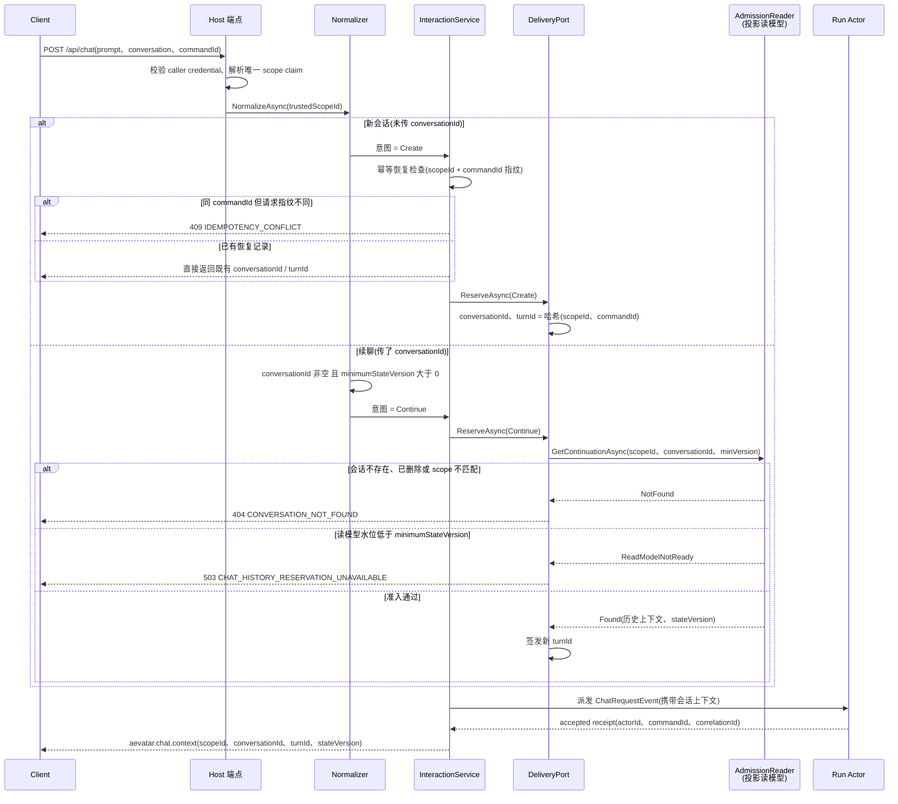

# Chat / Conversation / Turn 服务端身份契约

> 版本与结论：本章描述 `current`；当前行为以 `f02aa690` 为准。核心结论：**conversation 与 turn 的身份由服务端签发并绑定 caller scope，客户端只能引用、不能自选**；续聊不是"带上 conversationId 就行"，而是一次有拒绝路径的准入判定（continuation admission）。

## 设计抽象与事实源

- `docs/canon/chat-api.md:322`：`command.ack` 只是 CQRS dispatch 管线的 accepted receipt，`actorId + commandId` 是观察句柄——身份句柄由服务端在接受时签发，本章的身份所有权讨论从这里出发。
- `src/workflow/Aevatar.Workflow.Infrastructure/CapabilityApi/ChatEndpoints.cs:786`：服务端把 `ScopeId / ConversationId / TurnId / StateVersion` 打包成 `aevatar.chat.context` 帧回传给客户端——这是 conversation/turn 身份对外的唯一签发点。
- `agents/Aevatar.GAgents.ChatHistory/chat_history_messages.proto:67`：`ChatConversationState` 用 `scope_id + conversation_id + turns` 表达"一个会话的多轮历史"这一状态所有权边界。

## 先建立模型

### 五个身份词汇，永不互换

aevatar 的 chat 链路上同时存在五种标识符，它们的生命周期、签发者、用途完全不同。混用它们（比如把 `sessionId` 当 `conversationId` 用）是这条链路上最常见的集成错误：

| 标识符 | 标识什么 | 谁签发 | 谁引用 | 生命周期 |
|---|---|---|---|---|
| `conversationId` | 一个会话的**多轮历史** | 服务端（Create 时由 `scopeId + commandId` 确定性哈希得出） | 客户端续聊时回传 | 跨多次 run，直到会话被删除 |
| `turnId` | **一次用户回合**（一问一答） | 服务端（Create 时确定性哈希；Continue 时新生成） | 历史归档与读模型内部 | 随单次 run 的终态归档 |
| `runId` | **一次 workflow 执行** | 服务端（run actor 创建时绑定） | resume/signal/stop 控制面 | 单次执行，终态后只读 |
| `actorId` | **状态所有者**（run actor / conversation actor 的地址） | 服务端（runtime 创建 actor 时） | 控制面定位 + 状态查询 | 与所持有的状态同寿 |
| `commandId` / `correlationId` | **消息追踪**（一次命令及其因果链） | 客户端可提供 seed，缺省由服务端生成 | 全链路 envelope 传播 | 单次命令及其派生消息 |

三句话记住区别：**conversation 拥有历史，run 拥有执行，session 什么都不拥有**。`sessionId` 只是客户端自定义的分组标签——`HttpChatInput.SessionId` 的注释明确写着它独立于 Chat History 的 conversation 身份；缺省时服务端用 `correlationId` 兜底（`src/workflow/Aevatar.Workflow.Application/Runs/WorkflowChatRequestEnvelopeFactory.cs:15`），它不触发任何历史读写。

### 身份所有权静态图

```mermaid
%%{init: {"maxTextSize": 100000, "flowchart": {"useMaxWidth": false, "nodeSpacing": 10, "rankSpacing": 50}, "themeVariables": {"fontSize": "10px"}}}%%
flowchart LR
    Client["客户端<br/>只持有服务端签发的句柄"]
    Host["Host /api/chat 端点<br/>协议出口与 caller claim"]
    Norm["ChatRunRequestNormalizer<br/>wire 输入规范化"]
    Svc["WorkflowChatRunInteractionService<br/>命令编排与幂等恢复"]
    Port["ChatTurnHistoryTerminalDeliveryPort<br/>会话身份签发与预留"]
    Conv["ChatConversationGAgent<br/>会话历史状态所有者"]
    Run["WorkflowRunGAgent<br/>run 执行状态所有者"]

    Client -->|"POST /api/chat<br/>prompt + conversation 意图"| Host
    Host -->|"scopeId 取自 scope claim<br/>body 里的 scopeId 被忽略"| Norm
    Norm -->|"Create / Continue 意图"| Svc
    Svc -->|"ReserveAsync 预留终态归档"| Port
    Port -->|"签发 conversationId 与 turnId"| Conv
    Svc -->|"派发命令、run actor 绑定 runId"| Run
    Port -.->|"accepted 后回传<br/>aevatar.chat.context 帧"| Client
```



读图要点：**所有箭头里没有一个身份是客户端生成的**。客户端在两个方向上都只是"持有者"——请求时持有上一轮拿到的 `conversationId`，响应时从 `aevatar.chat.context` 帧领取本轮的 `conversationId / turnId / stateVersion`。

`Create` 意图下 `conversationId` 与 `turnId` 都是 `SHA256(scopeId, commandId, …)` 三元组（`turnId` 哈希另含 `turn` 判别符）截断后的确定性编码（`agents/Aevatar.GAgents.ChatHistory/ChatHistoryActorIds.cs:18` 与 `:21`）。这不是为了好读，而是为了**幂等**：同一个 scope 用同一个 `commandId` 重试 Create，得到的是同一个会话身份，而不是一个新会话。

## 沿一条链路走读

### 新会话 vs 续聊请求的准入时序（含拒绝路径）

"续聊准入（continuation admission）"指：一个携带 `conversation.conversationId` 的请求，要被接受为该会话的下一轮，必须通过的一串判定。任何一环失败都有独立的错误码与 HTTP 状态：



两条路径的不变量不同：

- **Create 的不变量是幂等**。`commandId` 是客户端提供的幂等键（`HttpChatInput.CommandId` 的注释直说它是 retryable create 的 idempotency identity），服务端在派发前查恢复记录：同 `(scopeId, commandId)` 且请求指纹一致 → 重放既有身份；指纹冲突 → `409 IDEMPOTENCY_CONFLICT`（`src/workflow/Aevatar.Workflow.Application/Runs/WorkflowChatRunInteractionService.cs:275`）。
- **Continue 的不变量是水位与归属**。准入读取器在投影读模型上逐条判定：文档存在、未删除、`ScopeId` 序一致、`ConversationId` 序一致、`StateVersion` 达到 `minimumStateVersion`、且确有消息内容（`src/Aevatar.Studio.Infrastructure/ActorBacked/ProjectionChatConversationContinuationAdmissionReader.cs:43` 到 `:54`）。`minimumStateVersion` 是客户端声明"我至少看到过哪个版本"的乐观并发水位——读模型还没投影到那里时，服务端拒绝续聊而不是用残缺的上下文硬跑。

准入通过后，读模型里最近 ≤ 24 条消息被组装成 `WorkflowConversationExecutionContext`（截断时置 `Truncated`），随命令注入 workflow 执行输入（`src/workflow/Aevatar.Workflow.Application/Runs/WorkflowChatRequestEnvelopeFactory.cs:39`）——历史不只是归档，而是真实参与下一轮执行。

## 为什么是它，不是别的

### 为什么身份必须服务端拥有，而不是客户端自选

最直观的替代方案是"客户端自己起 conversationId，服务端照单全收"。这条路的代价：

1. **幂等无法落地**。Create 的确定性哈希让"同一 scope + 同一 commandId"恒等于"同一会话"，重试、双击、网络重放都安全。客户端自选 id 意味着服务端要么信任客户端不撞车，要么在写入路径上加全局唯一性检查——把成本从签发时挪到了每次写入时。
2. **scope 隔离形同虚设**。准入判定要求读模型文档的 `ScopeId` 与 caller claim 解析出的 scope 序一致；跨 scope 引用别人的 `conversationId` 只会得到 `404 CONVERSATION_NOT_FOUND`，与不存在的会话无法区分——这是有意的信息隐藏。如果 id 由客户端命名，"猜别人的会话 id"就从不可能变成字典攻击。
3. **turn 与 run 脱钩**。turnId 由归档侧签发（Continue 时新生成），runId 由执行侧绑定，两者只在 delivery 记录里汇合。客户端若自选 turnId，归档的幂等追加（同 turnId 同 payload 判重）就失去锚点。

### 为什么准入读的是投影读模型，而不是直接查 conversation actor

续聊准入发生在命令派发**之前**，此时目标 conversation actor 可能尚未激活；直接查 actor 会把一次只读判定变成一次 actor 激活 + 邮箱排队，成本高且引入了不必要的写侧耦合。读投影的代价是**水位滞后**——这正是 `minimumStateVersion` 存在的原因：客户端用上次拿到的 `stateVersion` 声明自己的最低可见水位，读模型没到就拒绝（`503`），而不是悄悄用过期历史续聊。这是一个显式的"可用性换一致性"决策。

### 为什么 scope 只信 claim 不信 body

`POST /api/chat` 要求恰好一个 `scope_id` / `workflow.scope_id` claim，零个 → `403`，多个 → `403`，未认证 → `401`（`src/workflow/Aevatar.Workflow.Infrastructure/CapabilityApi/ChatEndpoints.cs:1030` 到 `:1035`）。`HttpChatInput.ScopeId` 字段被保留但注释明确标注为被忽略的 legacy 字段。normalizer 里 `trustedScopeId` 恒优先于 body 值（`src/workflow/Aevatar.Workflow.Infrastructure/CapabilityApi/ChatRunRequestNormalizer.cs:224`）。会话身份是 `scopeId` 的哈希派生物，scope 一旦被伪造，整条所有权链就失去根基——所以 scope 必须来自认证主体，这是全章信任链的根。

## 协议与状态深入

### 签发协议：`aevatar.chat.context`

accepted 之后、业务事件流之前，服务端先写一帧 `aevatar.chat.context`，payload 是 `WorkflowChatContextPayload`（`scope_id / conversation_id / turn_id / state_version`，见 `src/workflow/Aevatar.Workflow.Application.Abstractions/Runs/workflow_run_events.proto:159` 到 `:164`）。客户端续聊时必须回传其中的 `conversationId`，并把 `stateVersion` 作为下一轮的 `minimumStateVersion`——这是这个协议里唯一的"客户端义务"。

### 观察截止：accepted 不等于可观测（2026-08-04 补充）

Workflow chat 被 accepted 后，首个 projection-backed 业务帧必须在 **30 秒**内到达（`WorkflowRunBehaviorOptions.AcceptedObservationTimeout`，默认 30s）；超时则 interaction 抛出 typed observation timeout（`CommandObservationTimeoutException`），external adapter 输出 `RUN_OBSERVATION_TIMEOUT` terminal error 并关闭 stream。`keepalive` 只维持传输连接，**不表示业务进展、不延长 deadline**（`docs/adr/0015-agui-sse-projection-session-pipeline.md` 2026-08-03 update #3170）。

### 归档协议：turn 的幂等追加

run 终态后，delivery actor 把这一轮（user 文本 + assistant 文本 + 终态）作为 `ChatTurn` 追加给 `ChatConversationGAgent`。会话 actor 的追加判定（`agents/Aevatar.GAgents.ChatHistory/ChatConversationGAgent.cs:28` 起）：

- 同 `turnId` 同 payload → 视为重放，直接确认（幂等）；
- 同 `turnId` 不同 payload → `CONFLICT` 拒绝；
- 轮数达到 `MaxTurns = 250` → `MAX_TURNS_EXCEEDED` 拒绝；
- 缺 scope / conversation / turnId、会话已删除或终态未指定等 → `INVALID` 拒绝。

追加成功才把 `Sequence = Turns.Count + 1` 写入 `ChatTurnAppendedEvent`——**turn 的顺序号也是服务端分配的**，客户端无法插队。

### 控制面是另一套身份

resume / signal / stop 不属于 conversation 协议，它们定位的是 run：必须同时给出 `actorId + runId`，服务端校验 actor 绑定的 run 与请求一致，不一致返回 `409 RunBindingMismatch`（`src/workflow/Aevatar.Workflow.Infrastructure/CapabilityApi/ChatEndpoints.cs:451` 起）。canon 的建议原话是"显式传递 `actorId + runId (+ stepId)`，不要依赖服务端内存映射"。这再次印证身份词汇纪律：续聊用 `conversationId`，控制执行用 `actorId + runId`，两者永不相认。

## 最小示例

> Demo status：`verified-static` —— 判定规则全部逐条来自冻结代码路径与错误映射表，未实际启动服务；真实请求还需有效 bearer 与唯一 scope claim。跨层行为另有集成测试覆盖（`test/Aevatar.Integration.Tests/WorkflowChatConversationContinuationCrossLayerTests.cs:37`）。

请求 shape（`HttpChatInput`）：

```json
{
  "prompt": "接着上面继续分析",
  "commandId": "cmd-2026-07-25-001",
  "conversation": {
    "conversationId": "chatc-9f2c…",
    "minimumStateVersion": 7
  }
}
```

静态判定表（假设 caller 持有唯一 scope claim `scope-alpha`）：

| # | 场景 | 判定 | 结果 |
|---|---|---|---|
| A | 不带 `conversation`，`commandId=cmd-1` 首次 Create | 服务端签发 `chatc-<hash(scope-alpha, cmd-1)>` 与新 turn | accepted，`aevatar.chat.context` 回传身份 |
| B | 与 A 完全相同的请求重试 | 幂等恢复记录命中、指纹一致 | 返回与 A 相同的 `conversationId / turnId`，不新建会话 |
| C | 同 `commandId=cmd-1` 但 prompt 不同 | 恢复记录指纹冲突 | `409 IDEMPOTENCY_CONFLICT` |
| D | 续聊：`conversationId` 属于 `scope-alpha`，读模型 `StateVersion=9 ≥ 7` | 准入通过，签发新 turnId，注入历史上下文 | accepted |
| E | 同 D 但 `conversationId` 属于 `scope-beta` | 读模型文档 `ScopeId` 序比较失败，按 NotFound 处理 | `404 CONVERSATION_NOT_FOUND`（不泄露会话存在性） |
| F | 续聊：`minimumStateVersion=12`，读模型才投影到 `9` | 水位不足，ReadModelNotReady | `503 CHAT_HISTORY_RESERVATION_UNAVAILABLE` |
| G | 续聊：不传 `minimumStateVersion` | normalizer 判定 `is not > 0` | `503 CHAT_HISTORY_RESERVATION_UNAVAILABLE` |
| H | 续聊：`conversationId` 为空白串 | normalizer 判定无效 | `400 INVALID_CONVERSATION_ID` |

状态码映射见 `src/workflow/Aevatar.Workflow.Infrastructure/CapabilityApi/ChatRunStartErrorMapper.cs:26` 到 `:28`。

## 边界与演进

- **当前（current）**：本章全部论断以冻结基线代码为准。身份服务端签发、续聊准入、scope 信任链、turn 幂等追加均有 E1 证据。
- **上游同步审查记录（issue #120，`024b959a4f90..d8012534e147`）**：结论是**无需更新本章契约模型**。区间内的提交只强化 NyxID direct Responses / Messages / Chat Completions 共用的 `LlmSessionGAgent` 流式 run 记录边界：执行侧把 chunk、tool 与 terminal fact 发回 session actor，由 `responseId + runId + sequence` 做幂等接受，并保证 cancel flush 落成 typed fact（`docs/canon/llm-streaming.md:38` 到 `:49`、`docs/canon/nyxid-responses-direct.md:120` 到 `:133`）。该区间没有改动本章的 `conversationId / turnId` 服务端签发、continuation admission、caller scope 准入或 `ChatTurn` 终态归档协议，因此正文模型、图和示例保持不变；把 Responses 的 recorder/finalizer 语义并入本章反而会混淆 LLM session run 与 chat conversation 两个状态所有权边界。本条作为该同步 issue 的耐久审查结论。
- **演进（为什么变成这样）**：上游 issues #2834、#2915、#2920 是本契约成型的直接动因（本仓库 docs/migration 下的 2026-07-25 issue 证据账本中，三行均分类为 landed-current 并各自带 E1 锚点）。#2834 把 `POST /api/chat` 的 conversation 契约重构为"后端拥有 `conversationId` 与 `turnId`"——本章的所有权模型即其落地；#2920 修复"续聊只归档消息、不把历史注入执行"——即上文 `ConversationContext` 注入链路；#2915 修复 LLM delta 未投影到 SSE，属于同一 chat 表面的投影链路闭合，不改变身份契约本身。三者解释了"为什么是服务端拥有 + 准入 + 注入"这个组合，但实现状态以本章 E1 为准，不由 issue 状态证明。
- **历史/已移除**：HTTP body 里的 `scopeId` 是 legacy 字段，当前被显式忽略；`sessionId` 从来不是 conversation 身份。请求传输、ACK 与终态观察的全链路地图见 [请求与流式生命周期](04-request-streaming-lifecycle.md)。
- **开放缺口**：`MaxTurns = 250` 触顶后的产品行为（开新会话还是截断）在代码里只有拒绝，没有自动迁移策略；跨 scope 的会话迁移不存在——删除即 `ConversationDeletedEvent`，续聊一律 404。

## 读完应能回答

1. 客户端能自己指定 `conversationId` 开新会话吗？为什么不能？
2. 一个续聊请求被接受为某会话的下一轮，需要通过哪些判定？每条失败对应什么错误码？
3. `conversationId`、`turnId`、`runId`、`actorId`、`commandId` 分别标识什么、由谁签发？
4. 为什么续聊准入读投影读模型而不是直接查 conversation actor？`minimumStateVersion` 补偿了什么？
5. `POST /api/chat` 的 scope 从哪里来？body 里传 `scopeId` 会发生什么？

<details>
<summary>论断—证据映射</summary>

| 论断 | 等级 | 证据 |
|---|---|---|
| `command.ack` 只是 accepted receipt，actorId+commandId 是观察句柄 | E1 | `docs/canon/chat-api.md:322` |
| `aevatar.chat.context` 帧回传 scopeId/conversationId/turnId/stateVersion | E1 | `src/workflow/Aevatar.Workflow.Infrastructure/CapabilityApi/ChatEndpoints.cs:786`、`src/workflow/Aevatar.Workflow.Application.Abstractions/Runs/workflow_run_events.proto:159` |
| Create 的 conversationId/turnId 是 scopeId+commandId 的确定性哈希 | E1 | `agents/Aevatar.GAgents.ChatHistory/ChatHistoryActorIds.cs:18`、`agents/Aevatar.GAgents.ChatHistory/ChatHistoryActorIds.cs:21` |
| Continue 时服务端签发新 turnId | E1 | `agents/Aevatar.GAgents.ChatHistory/ChatTurnHistoryTerminalDeliveryPort.cs:61` |
| commandId/correlationId 缺省由服务端生成 | E1 | `src/workflow/Aevatar.Workflow.Application/Runs/WorkflowChatRunInteractionService.cs:45` |
| Create 幂等恢复：指纹冲突返回 IdempotencyConflict | E1 | `src/workflow/Aevatar.Workflow.Application/Runs/WorkflowChatRunInteractionService.cs:275` |
| Continue 前置校验：conversationId 非空且 minimumStateVersion > 0 | E1 | `src/workflow/Aevatar.Workflow.Infrastructure/CapabilityApi/ChatRunRequestNormalizer.cs:271`、`src/workflow/Aevatar.Workflow.Application/Runs/WorkflowChatRunInteractionService.cs:389` |
| 准入判定：文档存在、未删除、scope 序一致、水位达标、有消息 | E1 | `src/Aevatar.Studio.Infrastructure/ActorBacked/ProjectionChatConversationContinuationAdmissionReader.cs:43`、`src/Aevatar.Studio.Infrastructure/ActorBacked/ProjectionChatConversationContinuationAdmissionReader.cs:48` |
| 历史上下文（≤24 条、可截断）注入 workflow 执行输入 | E1 | `src/workflow/Aevatar.Workflow.Application/Runs/WorkflowChatRequestEnvelopeFactory.cs:39`、`src/Aevatar.Studio.Infrastructure/ActorBacked/ProjectionChatConversationContinuationAdmissionReader.cs:11` |
| scope 必须来自唯一 claim，body scopeId 被忽略 | E1 | `src/workflow/Aevatar.Workflow.Infrastructure/CapabilityApi/ChatEndpoints.cs:1030`、`src/workflow/Aevatar.Workflow.Infrastructure/CapabilityApi/ChatCapabilityModels.cs:87`、`src/workflow/Aevatar.Workflow.Infrastructure/CapabilityApi/ChatRunRequestNormalizer.cs:224` |
| 错误码到 HTTP 映射（404/503/409） | E1 | `src/workflow/Aevatar.Workflow.Infrastructure/CapabilityApi/ChatRunStartErrorMapper.cs:26-28` |
| turn 追加幂等/冲突/250 轮上限/序号服务端分配 | E1 | `agents/Aevatar.GAgents.ChatHistory/ChatConversationGAgent.cs:24`、`agents/Aevatar.GAgents.ChatHistory/ChatConversationGAgent.cs:61` |
| 会话状态所有权：scope_id + conversation_id + turns | E1 | `agents/Aevatar.GAgents.ChatHistory/chat_history_messages.proto:67` |
| 控制面 resume 必须 actorId+runId+stepId 且绑定匹配 | E1 | `src/workflow/Aevatar.Workflow.Infrastructure/CapabilityApi/ChatEndpoints.cs:451`、`docs/canon/chat-api.md:274` |
| sessionId 独立于 conversation 身份、缺省用 correlationId 兜底 | E1 | `src/workflow/Aevatar.Workflow.Infrastructure/CapabilityApi/ChatCapabilityModels.cs:97`、`src/workflow/Aevatar.Workflow.Application/Runs/WorkflowChatRequestEnvelopeFactory.cs:15` |
| 跨层续聊行为有集成测试覆盖 | E1 | `test/Aevatar.Integration.Tests/WorkflowChatConversationContinuationCrossLayerTests.cs:37` |
| `d8012534e147` 只强化 Responses `LlmSession` recorder/finalizer，不改变 conversation/turn 契约 | E1 | `docs/canon/llm-streaming.md:38`、`docs/canon/nyxid-responses-direct.md:120`、`src/platform/Aevatar.GAgentService.Application/Responses/LlmRunCore.cs:35` |

</details>
