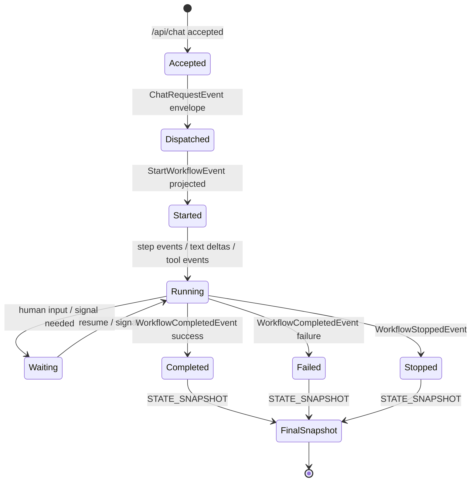
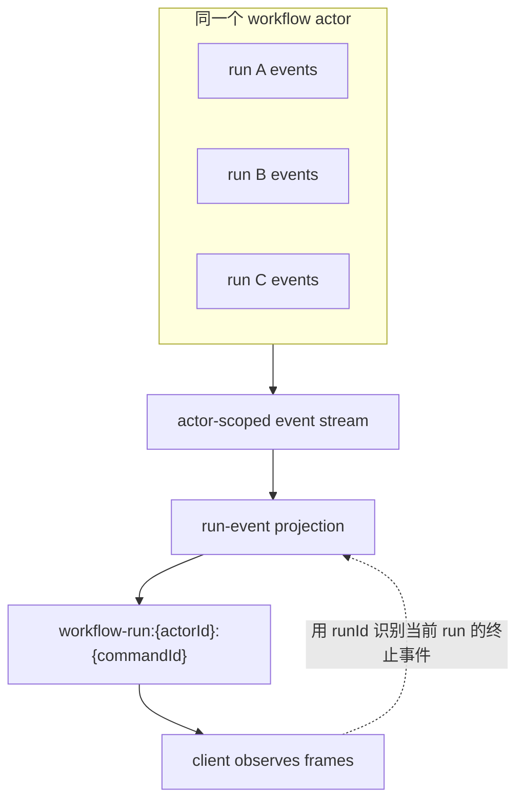

# Run 语义:标识、生命周期和事件流边界

## 关键代码(事实源,以 ~/Code/aevatar 为准)

- `README.md`: Run 语义的四条重要规则,包括默认不按 run 隔离事件流。
- `docs/canon/workflow-runtime.md`: 从 `/api/chat` 到 run actor、kernel、投影和 SSE 的完整链路。
- `docs/canon/llm-streaming.md`: `actorId/runId/commandId/sessionId/messageId` 等会话标识和实时输出生命周期。

---

## 先记住四句话

Run 语义最容易误解,因为它不像传统“一个 HTTP 请求等于一个私有响应流”的模型。按事实源 1,先记住四句话:

1. 同一 Actor 多次运行时,默认不按 run 隔离事件流。
2. 单次请求只在当前 runId 的终止事件到达时结束。
3. `RUN_STARTED` 由 `StartWorkflowEvent` 投影统一生成。
4. `runId` 和内部 `sessionId` 都由服务端生成。

这四句话共同指向一个设计:客户端观察的是 Actor 维度上的运行事件投影,而不是 Host 临时造出来的“请求私有管道”。

---

## 标识语义表

| 标识 | 谁拥有语义 | 怎么读 |
|---|---|---|
| `actorId` | Actor Runtime / Workflow actor binding | 定位目标 Actor,不是 runId |
| `runId` | Workflow run binding | 业务 run 维度,用于判断当前 run 是否终止 |
| `commandId` | Application command context | 一次交互命令维度,也是实时观察句柄的一部分 |
| `correlationId` | Command propagation | 跨组件追踪维度,默认可与 commandId 同值但语义独立 |
| `sessionId` | Chat request envelope | chat 会话维度,未传时由服务端回退生成 |
| `messageId` | run-event mapper | 单条文本/消息流维度,用于拼接增量 |

这里的关键不是“哪个字段在哪一行生成”,而是字段之间不要互相冒充。`actorId` 用来定位 Actor,`runId` 用来识别业务执行,`commandId` 用来追踪这次命令和观察流。

---

## run 生命周期



事实源 2 的主链路可以这样读:

```text
POST /api/chat
  -> Application command
  -> target resolve + observation lifecycle
  -> ChatRequestEvent envelope
  -> WorkflowRunGAgent
  -> WorkflowExecutionKernel
  -> domain events
  -> Projection
  -> WorkflowRunEventEnvelope
  -> SSE / WS
```

终止不是 Host 说“我写完响应了”,而是投影流里出现当前 runId 的终止语义。终止后还可能有 `STATE_SNAPSHOT`,用于把收敛后的状态事实交给消费方。

---

## 为什么默认不按 run 隔离



默认不按 run 隔离的意思不是“runId 没用”,而是“隔离边界不应该被理解成 Host 维护的进程内 `runId -> sink` 字典”。事实源 3 的实时生命周期强调通过显式句柄、投影 session 和 sink 绑定来观察事件,跨请求事实不能藏在中间层内存里。

这也是为什么客户端要同时关心 `actorId`、`commandId` 和 `runId`:前两个帮助定位和观察,后一个帮助判断本次业务 run 是否收敛。

---

## RunManager/latest-wins 边界

⚠️ `RunManager/latest-wins` 需要架构 owner 确认。它属于 Foundation 运行上下文管理口径,不应被本文直接解释成 Workflow SSE 的 run 隔离策略,也不应拿来替代 `actorId + commandId + runId` 的观察语义。

在 owner 明确前,这篇只做保守结论:

1. Workflow run-event 默认按 Actor 维度观察,客户端用当前 runId 的终止事件收敛。
2. Host 和中间层不应发明进程内 run 映射来“修正”这个语义。
3. `RunManager/latest-wins` 如果要进入用户可见协议说明,需要由架构 owner 明确它和 Workflow run 投影之间的关系。

---

## 验收

读完这篇,应该能回答:

1. `runId` 是客户端传的吗?不是,服务端生成或绑定。
2. 为什么默认不按 run 隔离事件流?因为观察对象是 Actor 维度的事件投影,不是 Host 临时私有管道。
3. 客户端怎么知道请求结束?看到当前 runId 的终止事件,再处理收敛快照。
4. `RunManager/latest-wins` 能不能直接当成 Workflow SSE 隔离策略?不能,需要架构 owner 确认。

⟦AI:AUTO-LOOP⟧
