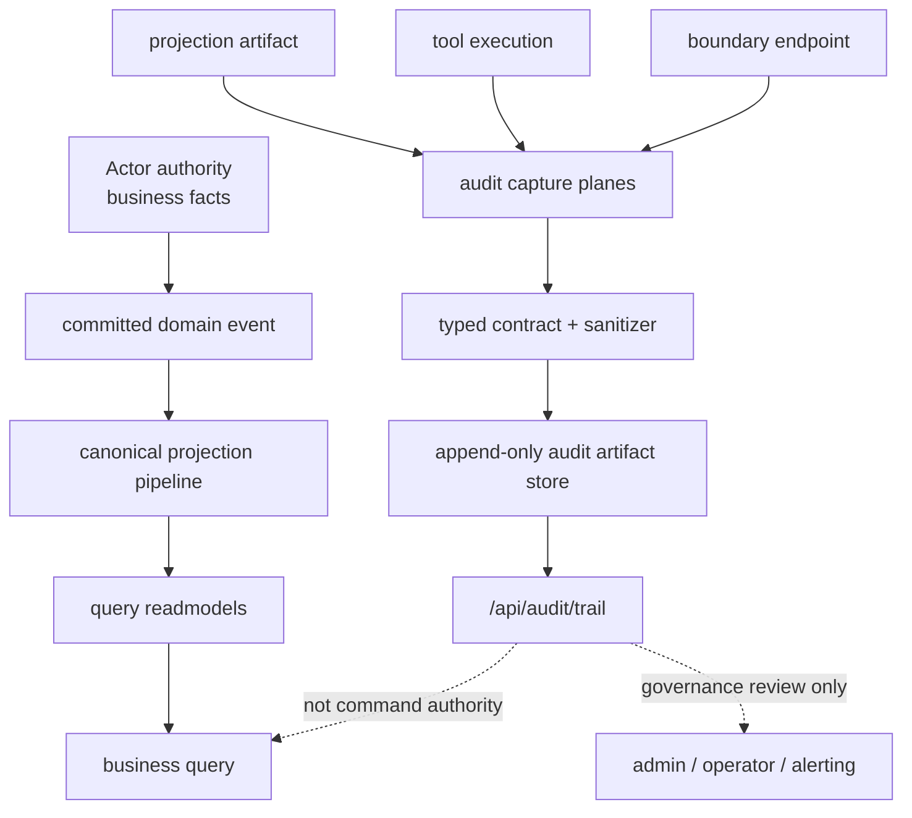
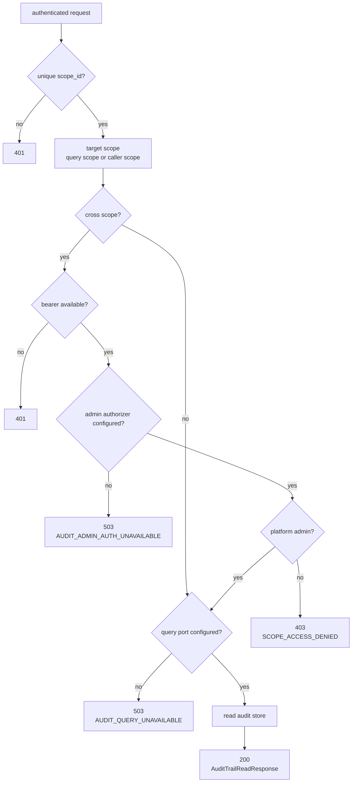
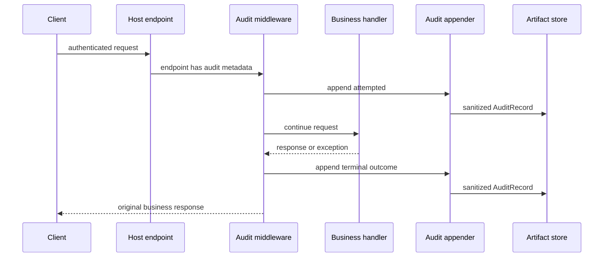

# 平台 Audit Trail:治理日志、读接口与采集边界

## 事实源/设计抽象(以 ~/Code/aevatar 为准)

- `docs/canon/audit-trail.md`:定义 audit trail 的性质,它是 append-only governance artifact store,不是 readmodel、trace 或第二条投影链。
- `src/Aevatar.Audit.Hosting/AuditTrailEndpoints.cs`:实现 `/api/audit/trail` 和 `/api/audit/actor-resolutions` 的 HTTP 读面、scope 默认值、跨 scope 管理员授权和 503 失败语义。
- `src/Aevatar.Audit.Abstractions/audit_messages.proto`:定义 audit record 的强类型字段、capture plane、actor identity、outcome、target、correlation 与 committed fact reference。

同时核对了 audit core 的 store / sanitizer、endpoint audit middleware、tool execution audit middleware 和相关测试。本篇讲已经实现的查询与采集边界,不把源码文件列表当正文主线。

---

## 先定性:audit trail 不是业务读模型

Audit trail 回答的是治理问题:谁在什么身份下触发了什么动作,系统在哪个采集面记录了它,触碰了什么资源,结果是 accepted / denied / error / success 之类的哪一种。它不回答“业务当前状态是什么”,也不参与 command 决策。

这点很关键。aevatar 的业务事实仍然走 Actor + Event Sourcing + Projection + ReadModel 主链。audit trail 只是把安全相关事实写成追加式治理 artifact,给审计、排障、合规和后续告警使用。



所以后面做自动告警时,正确姿势是把 audit trail 当“治理日志事实源”,而不是拿它去补业务状态、回放事件、或者在 query-time 拼装一套新的 readmodel。

---

## 已暴露的 HTTP 接口

当前 mainnet host 已经装配 audit core 和 audit capability bundle。默认本地入口可按 mainnet host 的监听地址访问,常见开发地址是 `http://127.0.0.1:5080`。

### `GET /api/audit/trail`

这个接口读取 audit artifact store。最常用场景是查调用方自己 scope 内最近的审计记录。

| 参数 | 含义 |
|---|---|
| `scope` | 可选。省略时默认使用调用方 token 里的唯一 `scope_id`。跨 scope 查询需要平台管理员。 |
| `auditActorId` | 可选。按 HMAC 派生后的审计 actor id 过滤。 |
| `identityKeyId` | 可选。按身份哈希 key 版本过滤,用于 key rotation 后的历史定位。 |
| `from` / `to` | 可选。按发生时间过滤,使用 ISO-8601 时间。 |
| `cursor` | 可选。分页游标,来自上一页 `nextCursor`。 |
| `take` | 可选。默认 100,最大 500;传 0 或负数会回到默认值。 |

响应结构是刻意收窄过的读面:

```json
{
  "records": [
    {
      "id": "audit-...",
      "scopeId": "scope-...",
      "auditActorId": "actor-...",
      "identityKeyId": "key-2026-07",
      "action": "scope-service.create.accepted",
      "outcome": "Accepted",
      "occurredAtUtc": "2026-07-06T03:12:45Z",
      "resourceType": "scope-service",
      "resourceId": "svc-...",
      "correlationId": "trace-or-request-id"
    }
  ],
  "readTimestampUtc": "2026-07-06T03:12:46Z",
  "queryWatermark": "2026-07-06T03:12:45Z",
  "nextCursor": "..."
}
```

`readTimestampUtc` 表示这次查询什么时候读的;`queryWatermark` 表示这页结果对应的已知写入水位。它们是新鲜度提示,不是强一致承诺。`nextCursor` 存在时继续翻页。

最小查询示例:

```bash
BASE=http://127.0.0.1:5080
TOKEN=...

curl -sS -G "$BASE/api/audit/trail" \
  -H "Authorization: Bearer $TOKEN" \
  --data-urlencode "from=2026-07-06T00:00:00Z" \
  --data-urlencode "take=100" | jq
```

跨 scope 查询示例:

```bash
BASE=http://127.0.0.1:5080
ADMIN_TOKEN=...

curl -sS -G "$BASE/api/audit/trail" \
  -H "Authorization: Bearer $ADMIN_TOKEN" \
  --data-urlencode "scope=scope-bob" \
  --data-urlencode "take=100" | jq
```

### `POST /api/audit/actor-resolutions`

这个接口只给平台管理员使用,作用是把外部身份一次性解析成 audit 查询可以用的 `auditActorId`。它不会把 raw subject 放进 audit 查询 URL,也不会在响应里返回原始 subject。

```bash
BASE=http://127.0.0.1:5080
ADMIN_TOKEN=...

curl -sS "$BASE/api/audit/actor-resolutions" \
  -H "Authorization: Bearer $ADMIN_TOKEN" \
  -H "Content-Type: application/json" \
  -d '{"provider":"nyxid","subject":"user@example.test"}' | jq
```

响应示例:

```json
{
  "auditActorId": "actor-...",
  "identityKeyId": "key-2026-07",
  "readTimestampUtc": "2026-07-06T03:20:00Z"
}
```

`provider` 会按小写规范化;`provider` 和 `subject` 不能为空,也不能包含 `:`。这个限制让 canonical key 的段边界明确,避免把两个字段拼成含糊身份。

---

## 授权和失败语义

Audit read 面的失败语义比较“硬”,这是好事。它宁可返回 503 或 403,也不 fallback 到 event store、readmodel 或 actor state 旁路读取。



具体规则可以按下面这张表记:

| 场景 | 结果 |
|---|---|
| 调用方没有唯一 `scope_id` | `401`。没有明确租户边界,不进入 query。 |
| 不传 `scope` | 默认查调用方自己的 scope,不调用管理员授权。 |
| 传了不同 `scope` | 必须带 bearer,并通过 platform admin authorizer。 |
| 跨 scope 但没有 bearer | `401`。 |
| 跨 scope 但不是平台管理员 | `403`。 |
| 管理员授权能力没装 | `503 AUDIT_ADMIN_AUTH_UNAVAILABLE`。 |
| audit query port 没装 | `503 AUDIT_QUERY_UNAVAILABLE`。 |
| actor identity hasher 没装 | actor resolution 返回 `503 AUDIT_ACTOR_HASHER_UNAVAILABLE`。 |

这套语义的设计理由很直接:audit 是治理读面,缺少授权或缺少正式 query port 时不能“想办法查出来”。否则就会把最不该旁路的安全日志做成旁路系统。

---

## 三个采集面

已经实现的 audit 能力不是单一 HTTP log,而是多个 capture plane 写入同一类强类型 audit record。

| 采集面 | 触发点 | 记录什么 | 不记录什么 |
|---|---|---|---|
| Boundary endpoint | 标注了 audit metadata 的 HTTP endpoint | 认证调用方、scope、operation、target、attempted 和 terminal outcome | 原始 token、cookie、headers、完整 body、未脱敏路由/查询值 |
| Tool execution | AI tool invocation middleware | tool 名称、调用方身份、scope、receipt / approval / destructive 等安全摘要、最终 outcome | full prompt、完整 tool args、完整 tool result、OAuth code、API key |
| Projection artifact | committed fact 进入投影 artifact sink | committed fact reference、actor / event / version 这类可审计定位信息 | 不重新推导业务事实,不建立第二条投影主链 |

Boundary endpoint 的一个细节很有价值:它会在业务处理前记录 `operation.attempted`,再在终端结果出来后记录一次 terminal record。401 未认证请求不会记录,因为没有可哈希的 actor identity;403、4xx、2xx 等认证后结果会按 outcome 分类。

Tool execution 的语义也很务实:middleware 在 `finally` 里追加 audit,所以工具执行成功、失败或抛错都能尽量落一条治理记录。audit append 失败不会反过来打断工具主链,只作为运维异常记录。



这也是告警系统应该使用 audit trail 的方式:按安全动作和 outcome 观察趋势,而不是把它当作请求日志全文搜索。

---

## 记录内容与脱敏边界

Audit record 采用 protobuf 契约,核心字段包括:

| 字段族 | 设计含义 |
|---|---|
| `scope_id` | 租户 / scope 边界。 |
| `audit_actor_id` + `identity_key_id` | HMAC 派生身份和 key 版本,用于跨 plane join 与 key rotation。 |
| `actor_kind` / `credential_source` | 调用主体类型与凭证来源。 |
| `operation_kind` / `operation_name` | 稳定操作分类和操作名。 |
| `sensitivity_level` | 安全敏感等级。 |
| `outcome` | success / denied / error / accepted / cancelled。 |
| `target` | 被触碰资源的安全摘要。 |
| `correlation` | trace、request、command、call、session、workflow run 等安全关联键。 |
| `committed_fact_ref` | 如果这条 audit 指向 committed fact,这里记录 actor、event type、state version 等引用。 |
| `annotations` | 少量 allowlist 注解,不是任意塞内容的垃圾袋。 |

脱敏不是“日志里少打印一点”的问题,而是契约层就不允许 raw subject 和 credential material 进入主模型。sanitizer 会拒绝缺少核心语义的记录,也会拒绝带有 secret-ish key 或 value 的 annotations,例如 authorization、bearer、token、secret、password、cookie、api_key、oauth、credential、private_key、raw_subject、full_prompt、tool_args、tool_result、raw_body、headers 等。

换句话说,audit trail 里应该能看到“某个审计身份做了某个安全相关动作”,不应该看到“这个人的邮箱、手机号、token、完整提示词或工具返回全文”。

---

## 配置与运维读法

Mainnet host 已经组合 audit 能力。运行态需要重点确认三件事:

1. `Audit:ActorIdentityHasher` 配置了 active key 和 key material。没有 hasher 时 actor resolution 会 503,tool / endpoint 审计也无法得到稳定 audit identity。
2. 正式环境需要 audit query port / artifact store。query port 缺失时 `/api/audit/trail` 明确 503,健康检查也应把 audit-trail 标为 degraded。
3. 开发和测试可以使用 in-memory audit trail store,但它只是反馈工具,不是生产事实源。

告警或运维脚本读取 audit trail 时,建议坚持这些约束:

| 建议 | 原因 |
|---|---|
| 用 `cursor` 做增量扫描 | 避免重复拉全量,也不要靠本地时间窗口猜测。 |
| 保存 `queryWatermark` 和最后处理游标 | 告警系统需要知道自己读到了哪个水位。 |
| 用 `auditActorId` 查询,不要把 raw subject 塞进 query | raw identity 应先通过 admin-only actor resolution 换成审计身份。 |
| 按 `action` / `outcome` / `resourceType` 建规则 | 这些是稳定摘要字段,适合自动告警。 |
| 把 503 当成平台能力退化告警 | 503 不是“没有日志”,而是正式读面不可用。 |

---

## 为什么这样设计

第一,append-only audit artifact 比普通应用日志更可治理。日志可能采样、裁剪、格式漂移;审计记录必须有 schema、identity key、outcome 和水位。

第二,它避免了 query-time replay 和 event-store 侧读。审计查询只读 audit artifact store,业务查询只读 readmodel,两者都不在请求路径里临时重建事实。

第三,它保护身份边界。外部身份只在受控解析点进入,进入 audit trail 后变成 HMAC 派生的 `auditActorId`。这让跨 plane join 可行,同时不把 raw subject 扩散到 URL、日志、readmodel 或告警系统。

第四,它为自动告警留下了足够稳定的接口。告警系统不需要懂 Actor 内部状态,只要消费 `GET /api/audit/trail` 的分页结果,按 operation / outcome / resource / scope / audit actor 做规则即可。

---

## 验收

读完这篇,应该能回答:

1. 现在怎么看 audit 日志?用 `GET /api/audit/trail`,默认查调用方 scope,跨 scope 需要平台管理员。
2. 怎么按外部用户查?管理员先用 `POST /api/audit/actor-resolutions` 把 provider + subject 换成 `auditActorId`,再查 trail。
3. audit trail 能不能当业务 readmodel?不能。它是 append-only governance artifact store。
4. 缺 query port 或 admin authorizer 时会怎样?返回 503,不 fallback 到旁路读取。
5. 自动告警应该依赖什么?分页游标、水位、action、outcome、resource、scope 和 audit actor,不要依赖 raw subject 或日志全文。

⟦AI:AUTO-LOOP⟧
