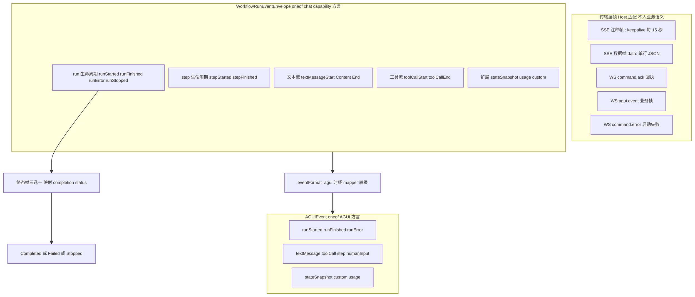
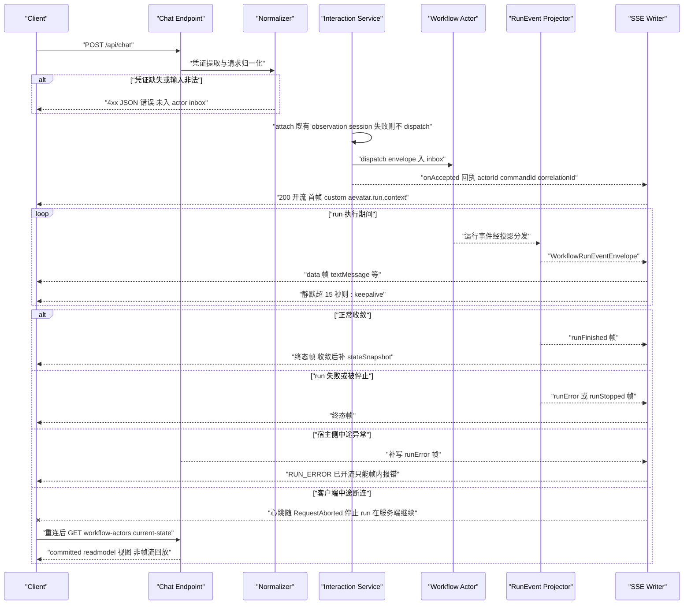
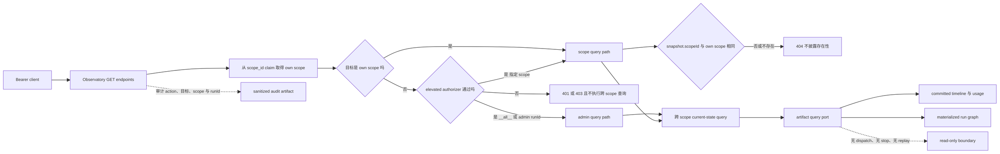

# 请求与流式生命周期：从 POST/WS 到终态观测

> 版本与结论：本章描述 `mixed`；当前行为以 `f02aa690` 为准。两条脊柱结论：
> 第一，`POST /api/chat` 与 `GET /api/ws/chat` 在入口就被归一化到同一条命令交互链路，传输协议只决定帧形态，不决定执行语义；
> 第二，dispatch 回执（HTTP 202、`aevatar.run.context` 首帧、`command.ack`）只承诺「可追踪」，
> 终态只能由帧流中的终态帧或 committed 读模型给出——两种 ACK 强度不可混用。
> 文末 streaming-proxy 段落为已软废弃的历史边界，与主线隔离。

## 设计抽象与事实源

- `src/workflow/Aevatar.Workflow.Infrastructure/CapabilityApi/ChatSseResponseWriter.cs:52`：`WriteAsync` 定义 chat SSE 数据帧形态（`data: ` + 单行 protobuf JSON），同文件的 15 秒 heartbeat 注释帧支撑「长 run 跨代理 idle 窗口存活」的连接生存性设计——本章帧形态脊柱。
- `docs/canon/llm-streaming.md:30`：用户可见实时生命周期统一表达为 `accepted/error -> outbound frames -> completion`，文本/AGUI 与 voice 共享该语义——本章「回执 ≠ 终态」的协议脊柱。
- `src/workflow/Aevatar.Workflow.Infrastructure/CapabilityApi/WorkflowRunObservatoryEndpoints.cs:15`：Observatory 在 endpoint 层区分 own-scope 与管理员 cross-scope / all-scope 读取，并为数据 GET 标注审计元数据；query service 仍只读 committed query models——本章「实时流 ≠ durable truth」的产品化落点。

## 先建立模型

### 入口归一化：协议是皮，链路是骨

两个入口在第一行代码之后就不再分家：HTTP POST 体（JSON 或 multipart）与 WebSocket 的 `chat.command` 帧都被喂给同一个归一化器，产出同一个 `WorkflowChatRunRequest`，再进入同一个交互端口的 `ExecuteAsync(request, onFrame, onAccepted)`。差异只剩三处：

| 维度 | POST + SSE | WebSocket |
|---|---|---|
| accepted 信号 | HTTP 200 开流 + `aevatar.run.context` CUSTOM 首帧 | `command.ack` 帧 |
| 业务帧 | `data: {envelope JSON}` 行 | `agui.event` 信封包裹同一份 envelope JSON |
| 启动失败 | 未开流前的 4xx/500 JSON | `command.error` 帧 |

归一化的深层证据在 scoped workflow 入口：同一条执行链路上还存在 `eventFormat` 协商，`workflow` 方言走原生 `WorkflowRunEventEnvelope`，`agui` 方言经 mapper 转成 `AGUIEvent` 再写出（见 `src/platform/Aevatar.GAgentService.Hosting/Endpoints/ScopeWorkflowEndpoints.cs:369`）。一次执行、多种帧方言，全部收束在同一个 projector 输出上——这正是 canon 里「禁止双轨实现」约束的落地。

### 帧类型与职责静态图



读这张图要抓住三个职责分层：

1. **传输层帧不携带业务语义**。`: keepalive` 是 SSE 注释行，EventSource 规范忽略它，它只为欺骗代理的 idle 计时器存在；WS 的 `command.ack` 是回执而不是事件。
2. **两个 oneof 是同一份运行事实的两种方言**。`WorkflowRunEventEnvelope`（定义于 `src/workflow/Aevatar.Workflow.Application.Abstractions/Runs/workflow_run_events.proto:22`）与 `AGUIEvent` 的帧族几乎一一对应，差别在 AGUI 额外承载 `HumanInputRequest/Response` 顶层帧与 `RunCompletionStatus` 终态枚举。
3. **终态是唯一被类型系统强制的收敛点**。completion policy 只认 `runFinished / runError / runStopped` 三种帧（见 `src/workflow/Aevatar.Workflow.Application/Runs/WorkflowRunCompletionPolicy.cs:16-31`），其余帧再多也不构成「结束」。注意两套枚举并不同名：投影侧终态是 `Completed / Failed / Stopped`，而 AGUI 方言的 `RunCompletionStatus` 是 `COMPLETED / FAILED / BLOCKED`——读者看到 `Stopped` 时应知道它属于 `WorkflowRunEventEnvelope` 方言，不是 AGUI 帧值。

## 沿一条链路走读



这张图刻意把四条分支画在同一层级，因为它们回答的是同一个问题：**每个阶段失败时，客户端拿到的是什么强度的信号？**

- **归一化失败**：同步 JSON 错误，HTTP 状态码表意（400/401/403/415），命令从未进入 actor inbox——这是「拒绝」，不是「执行失败」。
- **attach 失败**：observation session 是 cold 或不可 attach 时，按 canon 契约直接返回 start error，命令同样不进 inbox、不发 accepted（见 `docs/canon/cqrs-projection.md:72`）。宁可拒绝也不盲跑。
- **dispatch 之后**：回执已发，之后的一切成败只能在帧流内表达。HTTP 状态码已经烧成 200，宿主侧中途异常只能补写一帧 `runError`——这就是为什么「看 HTTP 状态判断 run 成败」在这条链路上是系统性错误。
- **断连**：连接死了不等于 run 死了。心跳泵监听 `RequestAborted` 自行停止，run 的生命周期归主泵所有，在服务端继续走向终态。

## 为什么是它，不是别的

**为什么 accepted 不回「执行结果」而只回「可追踪身份」？** 替代方案是同步 hold 住请求直到 run 完成再一次性返回。代价是结构性的：actor 模型下 dispatch 只是把 envelope 放入目标 actor 的 mailbox，actor turn 内不允许阻塞等待整段 LLM 流式执行；一个长 run 可达分钟级，同步 hold 会把 HTTP 连接、代理超时预算和客户端耐心全部绑死在执行时长上，并且让「排队被拒」与「执行失败」共用一个超时信号，无法区分。canon 把这条写成硬约束：accepted 回执「只承诺可追踪，不承诺 committed / observed」（见 `docs/canon/cqrs-projection.md:70`）。resume/signal 入口的代码注释说得更白——dispatch 只证明了 workflow actor 的 inbox 准入，不证明 continuation 已被应用（见 `src/workflow/Aevatar.Workflow.Infrastructure/CapabilityApi/ChatEndpoints.cs:481-483`），所以这些入口返回 202 + 指向 current-state 读模型的 `statusUrl`，而不是 200 + 结果体。

**为什么用心跳注释帧，而不是调大代理超时？** chat SSE 部署在默认 proxy-read-timeout 60 秒的 nginx ingress 之后，这是**两次读之间的 idle 超时**。LLM 单轮推理可能静默超过 60 秒，代理会在 run 健康的情况下掐断连接。替代方案「调大 ingress 超时」影响面是整个站点的所有长连接，且只是把阈值推后，不消灭问题。15 秒一次的 `: keepalive` 注释行把「永不静默超过 60 秒」变成 writer 自己的不变量；注释行对 EventSource 消费者惰性，不污染帧语义。writer 还用一把写锁把数据帧与心跳帧串行化，保证心跳字节永远不会插进数据帧中间。

**为什么观测流不当事实源？** 因为帧流的投递保证是 best-effort：live sink 在背压或写异常下会被 detach，主处理链路不为一个慢消费者停下来（见 `docs/canon/llm-streaming.md:403`）。如果允许客户端把 SSE 帧流当 durable truth，那么一次 detach 就成了「事实丢失」。正确的分层是：actor 持久化事件是事实源，projection 物化的 current-state 读模型是 committed 视图，帧流只是 attached 期间的实时观测窗口。参照系是 NyxIdChat 的更严格实现——它的会话投影只消费 committed envelope，显式 replay 还带 sequence + payload fence 去重（见 `docs/canon/llm-streaming.md:339`）；chat capability 侧没有等价的断线续传机制，这是当前边界，不是缺陷隐瞒。

## 协议与状态深入

### 身份词汇：谁标识执行，谁追踪消息

| 标识 | 语义 | 事实源归属 |
|---|---|---|
| `actorId` | workflow actor 的地址维度，定位执行体 | actor runtime |
| `runId` | 一次业务执行的标识，**不作 actor 地址或会话键** | run binding |
| `commandId` | 一次 run 命令的标识；live 会话流键 `workflow-run:{actorId}:{commandId}` 的后半 | command context |
| `correlationId` | 消息追踪维度，默认可与 `commandId` 同值但语义独立 | command context |
| `sessionId` | chat 会话维度，请求侧传入或服务端 fallback | command payload |

这张表的纪律（逐条定义见 `docs/canon/llm-streaming.md:295-301`）在生命周期各阶段兑现为：accepted 回执携带 `actorId + commandId + correlationId + workflowName`（见 `src/workflow/Aevatar.Workflow.Application.Abstractions/Runs/WorkflowChatRunModels.cs:305`）；resume/signal 必须显式携带 `actorId + runId`，禁止中间层维护 `runId -> actorId` 内存映射。

### ACK 强度阶梯

按强度从弱到强，本链路一共五种信号，任何一种都不能向上冒充：

1. **同步 JSON 错误（4xx/5xx）**：拒绝。命令未入 inbox。
2. **202 Accepted + statusUrl**：dispatch-only 入口（command、resume、signal）的 inbox 准入回执。**评审红线：202 不得读作「已提交」或「已成功」**，它连「actor 已开始处理」都不承诺，只承诺「信封已按 mailbox 语义投递，可凭 statusUrl 追踪」。
3. **`aevatar.run.context` 首帧 / `command.ack`**：交互式入口的 accepted 信号，强度与 2 相同，只是载体从 HTTP 状态码换成帧。
4. **终态帧 `runFinished / runError / runStopped`**：帧流内的终态观测，映射为 `Completed / Failed / Stopped`。这是**观测**层的终态。
5. **current-state 读模型**：committed projection 物化视图（`GET /api/workflow-actors/{actorId}/current-state`，见 `src/workflow/Aevatar.Workflow.Infrastructure/CapabilityApi/ChatQueryEndpoints.cs:36`），是断线后重建状态的唯一权威路径。**评审红线：会话观测流本身不是 durable truth**；4 与 5 的区别是「实时观测到终态」与「从 committed 视图读到终态」，断线场景只有 5 可用。

### 帧序列不变量

- 交互式入口的第一帧永远是上下文帧：`aevatar.chat.context`（可选，含 scope/conversation/turn）后接 `aevatar.run.context`（含 actorId/workflowName/commandId）。客户端凭它们把后续帧归因到具体 run，不必解析 HTTP 层。
- 文本增量严格被 `textMessageStart` / `textMessageEnd` 包裹，多段 `textMessageContent` 共享 `messageId`。
- 终态帧之后还会补一帧 `stateSnapshot`：interaction service 在 run 收敛后统一触发 finalize emitter 发出，携带 projection completion 状态与可选快照。它出现在终态帧**之后**，因此不能作为终止信号。
- SSE 数据帧只有 `data:` 行；writer 不写 `event:` 也不写 `id:` 字段（帧类型靠 JSON 内 oneof 字段名区分）。这直接决定了下一条边界。

### 重连边界

SSE 规范定义的 `Last-Event-ID` 续传握手在当前 chat 链路上**不存在**：writer 只写 `data:` 与注释行，没有事件 id 可回执。断线后的客户端语义是「放弃本帧流，转向读模型重建视图」，而不是「从断点续传」。WS 同理——连接关闭即会话观测结束。这不是疏漏的措辞，而是从 writer 实现可直接验证的当前边界；NyxIdChat 的显式 replay + fence 证明系统内存在更严格的范式，但它尚未推广到 chat capability 入口。

### Observatory：把 committed 观测做成只读产品面

`bd9975c8` 初版 Observatory 只有 own-scope 列表、详情和 graph；这是**历史状态**。`f02aa690` 当前面向 run 检查的只读数据面已经扩展为七个 bearer-protected GET：`/me`，`/runs`，`/runs/{runId}`，`/runs/{runId}/graph`，两个 `/admin/runs/{runId}` 入口，以及 `/resolve-scope`。详情组合 current-state 摘要与 committed run-report 的 timeline / usage / step trace，graph 复用已物化的 run 子图。它没有订阅 live sink，也不从 actor write model 旁路取数，因此展示的是**最终一致的已物化视图**，不是断线前帧流的逐 token 回放。



普通调用者不提供 `scope`（或显式给出自己的 scope）时走 own-scope 路径：列表在 source query 带 `ScopeId` 并二次过滤；详情与 graph 先用 scope-stamped current-state 做所有权门，再读 runId-only artifact。因而普通调用者用本路径探测外部 run 时，与不存在 run 一样得到 404。若请求明确指向其他 scope，endpoint 必须先解析 bearer 的平台管理员身份；缺 bearer 返回 401，非 elevated 返回 403，而且拒绝发生在任何跨 scope query 之前。

管理员通过授权门后有三种读取方式：给普通 runs/detail/graph 入口传 `scope=<id>`；列表传 `scope=__all__`；或在不知道所属 scope 时使用 admin detail/graph 让 current-state 按 runId 解析归属。`/resolve-scope?email=...` 也是 admin-only，用用户目录把邮箱解析为候选 scope；`/me` 则返回调用者 scope 与管理员能力，供页面选择模式。管理员路径扩大的是**授权后的读取集合**，没有取消 bearer、只读或 query-port-only 边界。

每个数据入口都声明 endpoint audit metadata：run 列表、详情和 graph 使用 Confidential，scope 邮箱解析使用 Restricted；审计摘要只拼接清洗后的 route、`scope` 与 `runId`，不把 bearer 写入摘要。这里需要同时保留两条边界：审计记录谁读取了什么，不授予访问权；管理员授权必须在跨 scope query 之前完成，不能靠事后审计补救越权读取。

**为什么不让 Observatory 直接复用实时帧流？** 实时流适合低延迟，但 attached sink 会断开且没有 replay cursor；历史查看需要可重复读取、可按 scope 授权的 committed 结果。反过来，读模型可能尚未物化 run report：此时详情诚实退化为 current-state summary、空 timeline 与零 usage，而不是伪造「尚无事件」。因此 Observatory 补齐的是 durable inspection，不改变 accepted、终态帧或 current-state 的 ACK 强度，也不把 eventually consistent 页面提升为执行事实源。

## 最小示例

> Demo status：`verified-static`
> 以下帧序列从 `workflow_run_events.proto` 的 oneof 定义、protobuf JSON 格式化规则（默认值省略、Int64Value 序列化为字符串、camelCase 字段名）与 writer 的 `data: {payload}\n\n` 写出格式静态推导，未对运行中的 host 实际发起请求——缺失前提是可运行的 Workflow Host 与 LLM 凭证。

一次 `POST /api/chat`（prompt「用一句话介绍 aevatar」，单 llm_call step）的 SSE 帧序列：

```text
data: {"timestamp":"1785000000000","custom":{"name":"aevatar.run.context","payload":{"@type":"type.googleapis.com/aevatar.workflow.runs.WorkflowRunContextPayload","actorId":"wf-2f3f9c","workflowName":"intro-chat","commandId":"cmd-71ab"}}}

data: {"timestamp":"1785000000120","runStarted":{"threadId":"wf-2f3f9c","runId":"run-8b34"}}

data: {"timestamp":"1785000000131","stepStarted":{"stepName":"answer"}}

data: {"timestamp":"1785000000450","textMessageStart":{"messageId":"msg:cmd-71ab","role":"assistant"}}

data: {"timestamp":"1785000000510","textMessageContent":{"messageId":"msg:cmd-71ab","delta":"aevatar 是一个"}}

data: {"timestamp":"1785000000580","textMessageContent":{"messageId":"msg:cmd-71ab","delta":"基于 actor 模型的"}}

: keepalive

data: {"timestamp":"1785000002330","textMessageContent":{"messageId":"msg:cmd-71ab","delta":"智能体编排框架。"}}

data: {"timestamp":"1785000002401","textMessageEnd":{"messageId":"msg:cmd-71ab"}}

data: {"timestamp":"1785000002420","stepFinished":{"stepName":"answer"}}

data: {"timestamp":"1785000002433","usage":{"available":true,"promptTokens":128,"completionTokens":24,"totalTokens":152,"model":"..."}}

data: {"timestamp":"1785000002440","runFinished":{"threadId":"wf-2f3f9c","result":{"@type":"type.googleapis.com/aevatar.workflow.runs.WorkflowRunResultPayload","output":"aevatar 是一个基于 actor 模型的智能体编排框架。"}}}

data: {"timestamp":"1785000002501","stateSnapshot":{"snapshot":{"@type":"type.googleapis.com/aevatar.workflow.runs.WorkflowProjectionStateSnapshotPayload","actorId":"wf-2f3f9c","commandId":"cmd-71ab","projectionCompleted":true,"snapshotAvailable":true}}}
```

同一次请求走 WS 时，帧序列相同，但每帧套一层传输信封，且 accepted 独立成帧：

```json
{"type":"command.ack","requestId":"req-1","correlationId":"cmd-71ab","payload":{"commandId":"cmd-71ab","actorId":"wf-2f3f9c","workflow":"intro-chat"}}
{"type":"agui.event","requestId":"req-1","correlationId":"cmd-71ab","payload":{"timestamp":"1785000000120","runStarted":{"threadId":"wf-2f3f9c","runId":"run-8b34"}}}
```

注意 WS 信封名虽叫 `agui.event`，payload 装的仍是 `WorkflowRunEventEnvelope` 的 JSON——信封常量定义见 `src/workflow/Aevatar.Workflow.Infrastructure/CapabilityApi/ChatWebSocketMessageContracts.cs:8-10`。真正的 `AGUIEvent` 方言只在 scoped workflow 入口以 `eventFormat=agui` 或 gagent draft-run 端点出现，由 AGUI 专用 writer 以同样的 `data: ` 行形态写出（见 `src/platform/Aevatar.GAgentService.Hosting/Sse/AGUISseWriter.cs:36-42`）。

## 边界与演进

**当前实现（current）**：入口归一化、双帧方言、心跳保活、ACK 强度阶梯、终态帧收敛，以及区分 own-scope 与管理员 cross-scope / all-scope 的只读 Observatory，均为 `f02aa690` 可验证的行为。Observatory 只消费 committed query models，不改变实时请求链路。

**历史 / 已隔离（legacy）**：streaming-proxy（`/api/scopes/{scopeId}/streaming-proxy/...`）是 room-based 多 participant fan-out 的旧链路，已软废弃，sunset 日期 2026-11-25，所有响应携带 `Deprecation` / `Sunset` / `Link: rel="successor-version"` 头（见 `docs/2026-04-02-streaming-proxy-flow.md:5`）。它的 `messages:stream` 是「长连接订阅房间消息流」的另一种流式形态，与本章主链路的「一次 run 一条观测流」语义不同；room CRUD、participant join/post、room fan-out 均不能被 `/v1/responses` 无损替代。旧章的流式协议与 run 语义已合并进本章；会话身份边界另见 [Chat / Conversation / Turn 服务端身份契约](03-chat-conversation-turn-contract.md)，未落地的断线续传与 retention 契约只在 [开放缺口](../12/05-open-gaps-and-canon-drift.md) 中登记。

**Open gap**：chat capability 入口无断线续传（无 `id:` / `Last-Event-ID`），断线恢复完全依赖 current-state 读模型；系统内已存在更严格的 replay + fence 范式（NyxIdChat），是否推广到 chat 入口未见落地证据。

**演进方向**：canon 已声明媒体输出将从 `CUSTOM(aevatar.media.chunk)` 收敛为显式顶层帧类型、WS 边界将评估二进制载荷协商——属于目标态表述，当前基线中媒体分片仍以 CUSTOM 帧承载。

## 读完应能回答

1. 客户端收到 HTTP 202 或 `command.ack` 时，能合法地断言什么、不能断言什么？
2. 为什么 run 执行期间的宿主异常只能以 `runError` 帧而不是 HTTP 500 表达？
3. SSE 帧流断开后，恢复 run 状态的权威路径是什么，为什么不能「续传帧流」？
4. `: keepalive` 注释帧解决的是什么具体问题，为什么不能用「调大代理超时」替代？
5. `WorkflowRunEventEnvelope` 与 `AGUIEvent` 是什么关系，客户端在哪条入口会遇到后者？
6. 普通调用者与管理员分别能走哪些 Observatory 读取路径；401、403 与 404 各自表达哪一道边界？
7. Observatory 为什么不能用于判断实时帧是否完整，审计记录又为什么不能替代事前授权？

<details>
<summary>论断—证据映射</summary>

| 论断 | 等级 | 证据 |
|---|---|---|
| POST 与 WS 入口归一化到同一 ExecuteAsync 链路 | E1 | `src/workflow/Aevatar.Workflow.Infrastructure/CapabilityApi/ChatEndpoints.cs:34`、`src/workflow/Aevatar.Workflow.Infrastructure/CapabilityApi/ChatWebSocketRunCoordinator.cs:46` |
| SSE 数据帧形态为 `data: ` + 单行 JSON，心跳为 15 秒 `: keepalive` 注释行 | E1 | `src/workflow/Aevatar.Workflow.Infrastructure/CapabilityApi/ChatSseResponseWriter.cs:17-18`、`src/workflow/Aevatar.Workflow.Infrastructure/CapabilityApi/ChatSseResponseWriter.cs:52-56` |
| 心跳为对抗 nginx 60 秒 proxy-read idle 超时而存在 | E1 | `src/workflow/Aevatar.Workflow.Infrastructure/CapabilityApi/ChatSseResponseWriter.cs:10-16` |
| accepted 回执只承诺可追踪，不承诺 committed / observed | E1 | `docs/canon/cqrs-projection.md:70` |
| resume dispatch 只证明 inbox 准入，不证明 continuation 已应用 | E1 | `src/workflow/Aevatar.Workflow.Infrastructure/CapabilityApi/ChatEndpoints.cs:481-483` |
| attach 不可用时命令不进 inbox、不发 accepted | E1 | `docs/canon/cqrs-projection.md:72` |
| 终态帧三选一并映射 completion status | E1 | `src/workflow/Aevatar.Workflow.Application/Runs/WorkflowRunCompletionPolicy.cs:16-31` |
| `AGUIEvent` oneof 帧族与 `RunCompletionStatus` 终态枚举 | E1 | `src/Aevatar.AGUI.Contracts/agui_events.proto:15-44` |
| AGUI writer 同样以 `data: ` 行写出 | E1 | `src/platform/Aevatar.GAgentService.Hosting/Sse/AGUISseWriter.cs:36-42` |
| eventFormat 协商 workflow / agui 双方言共享执行链 | E1 | `src/platform/Aevatar.GAgentService.Hosting/Endpoints/ScopeWorkflowEndpoints.cs:369` |
| WS 出站信封只有 command.ack / agui.event / command.error 三型 | E1 | `src/workflow/Aevatar.Workflow.Infrastructure/CapabilityApi/ChatWebSocketMessageContracts.cs:8-10` |
| accepted 回执携带 actorId + workflowName + commandId + correlationId | E1 | `src/workflow/Aevatar.Workflow.Application.Abstractions/Runs/WorkflowChatRunModels.cs:305-309` |
| 身份语义表（actorId/runId/commandId/correlationId/sessionId） | E1 | `docs/canon/llm-streaming.md:295-301` |
| sink 背压 / 写异常触发 detach，观测流为 best-effort | E1 | `docs/canon/llm-streaming.md:403` |
| 断线后权威恢复走 current-state 读模型端点 | E1 | `src/workflow/Aevatar.Workflow.Infrastructure/CapabilityApi/ChatQueryEndpoints.cs:36` |
| NyxIdChat committed-only 投影 + 显式 replay fence | E1 | `docs/canon/llm-streaming.md:339` |
| 实时生命周期统一为 accepted/error -> frames -> completion | E1 | `docs/canon/llm-streaming.md:30` |
| run 收敛后统一补发 STATE_SNAPSHOT 帧 | E1 | `docs/canon/llm-streaming.md:448` |
| streaming-proxy 软废弃与 sunset 边界 | E1 | `docs/2026-04-02-streaming-proxy-flow.md:5` |
| 用户可见 run-event 类型族（RUN_STARTED 等常量） | E1 | `src/workflow/Aevatar.Workflow.Application.Abstractions/Runs/WorkflowRunEventTypes.cs:5-18` |
| 当前数据面为七个 bearer-protected GET，包含 caller、own/cross-scope、admin run 与 scope resolution | E1 | `src/workflow/Aevatar.Workflow.Infrastructure/CapabilityApi/WorkflowRunObservatoryEndpoints.cs:59-135` |
| own-scope 与 cross-scope intent 分流，跨 scope 查询前必须通过 elevated authorizer | E1 | `src/workflow/Aevatar.Workflow.Infrastructure/CapabilityApi/WorkflowRunObservatoryEndpoints.cs:171-265`、`:328-394` |
| 管理员可按 `__all__` 列表或按 runId 解析所属 scope，仍只依赖 current-state / artifact query ports | E1 | `src/workflow/Aevatar.Workflow.Application/Observatory/WorkflowRunObservatoryQueryService.cs:16-30`、`:62-107` |
| own-scope 列表按 scope 查询并二次过滤；详情先做所有权门再读取 artifact | E1 | `src/workflow/Aevatar.Workflow.Application/Observatory/WorkflowRunObservatoryQueryService.cs:33-59`、`:127-155` |
| endpoint 审计目标与摘要只包含清洗后的 route、scope 和 runId | E1 | `src/workflow/Aevatar.Workflow.Infrastructure/CapabilityApi/WorkflowRunObservatoryEndpoints.cs:412-453` |
| committed view DTO 明示 state version / refresh stamp 与 eventually consistent 边界 | E1 | `src/workflow/Aevatar.Workflow.Application.Abstractions/Observatory/IWorkflowRunObservatoryQueryService.cs:45-66` |

</details>
