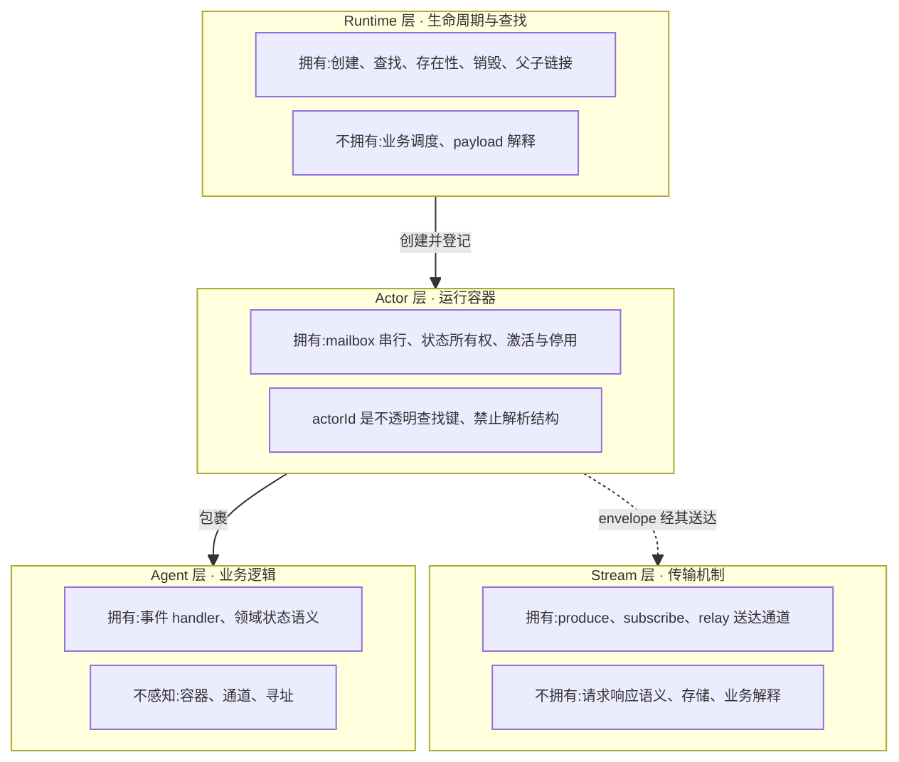
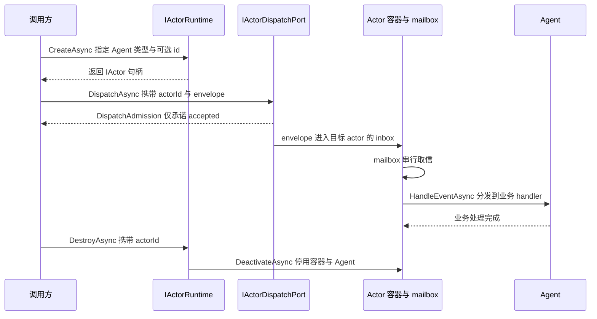

# Agent / Actor / Runtime:三层分离与传输底座

> 版本与结论:本章描述 `current`;当前行为以 `f02aa690` 为准。核心结论:Agent、Actor、Runtime 是三层职责互不重叠的抽象——业务逻辑、运行容器、生命周期与查找;Stream 是三者之下的传输机制,不是 RPC 通道,也不是存储。

## 设计抽象与事实源

- `src/Aevatar.Foundation.Abstractions/IActorRuntime.cs:3`:Runtime 契约注释把自身职责限定为 "lifecycle, topology, and lookup"——创建、查找、链接、销毁,接口中不存在任何业务调度语义。
- `src/Aevatar.Foundation.Abstractions/README.md:66`:契约层自述 `EventEnvelope` 是"Actor 之间通过 stream 传递的统一包络",确立 Stream = 传输机制、Envelope = 传输外壳的边界。
- `src/Aevatar.Foundation.Abstractions/runtime_actor_identity.proto:24`:actor 的持久化身份是稳定 kind token 而非运行时偶发的 CLR 类型名,说明 actorId 对契约层只是一个不透明的查找键,身份语义另有载体。

## 先建立模型

这套分层的要点是"谁拥有什么":每一层都有自己独占的职责,且不得越界代管相邻层的东西。

- **Agent(业务逻辑单元)**:拥有事件 handler 与领域状态的语义。它知道自己收到某种 payload 后要做什么,但不感知自己跑在哪个容器里、消息经哪条通道送达。
- **Actor(运行容器)**:拥有 mailbox 与状态所有权。同一个 actor 的消息经 mailbox 串行处理;actor 还持有激活/停用状态与父子拓扑。`actorId` 是不透明标识——它是查找键,禁止解析其字符串结构来推断类型、归属或路由信息。
- **Runtime(生命周期与查找)**:拥有 actor 的创建、查找、存在性检查、销毁与父子链接。Local 与 Orleans 是两种实现,业务面对的协议不变。它不是业务调度器:它不决定"该给谁发什么业务消息",也不解释 envelope 的领域含义。
- **Stream(传输机制)**:拥有事件的送达通道——produce、subscribe、relay 三种能力。它不对业务暴露请求-响应语义,不承担持久化,不解释 payload。



边界关系:Runtime 创建并登记 Actor;Actor 包裹 Agent;Actor 之间的 envelope 经 Stream 传输。业务代码只与 Agent、Actor 句柄、Runtime 契约说话,设计上不应直接操作 Stream(`IStream` 虽为公开接口);Stream 的存在对业务逻辑是透明的替换点。

## 沿一条链路走读

一个 actor 从创建到停用,经过三条不同的契约边界:生命周期走 `IActorRuntime`,消息投递走 dispatch port,容器内部走 mailbox 串行。注意时序图里两条返回线的语义差异:创建返回的是容器句柄,投递返回的只是准入回执。



链路要点:

1. **创建**:`CreateAsync` 支持泛型、`Type`、kind token 三种入口,id 缺省时由 runtime 自动生成;调用方拿到的是 `IActor` 句柄,不是 Agent 本体。
2. **投递**:投递不走 `IActorRuntime`,而走 `IActorDispatchPort`;其返回的 `DispatchAdmission` 只表示 envelope 已被 runtime/inbox 边界受理(accepted-for-dispatch),不表示 handler 已执行、事实已提交、读模型已观察到。
3. **停用**:`DestroyAsync` 是生命周期终点,容器先经 `DeactivateAsync` 停用自身与内嵌 Agent。mailbox 的串行性保证同一个 actor 任一时刻只处理一条消息,这是状态所有权的执行基础。

## 为什么是它,不是别的

**替代方案:让业务对象直接订阅 Stream,按请求-响应方式互相调用。** 这是最常见的直觉设计,也正是本章分层要避免的。它的代价是:

- 生命周期失守:谁创建、谁销毁、同名实体是否已存在,会散落进每个业务对象的代码里,且随 Stream 实现不同而不同。
- 串行保证失守:业务对象直接挂在订阅回调上,并发消息会并发进入同一状态,状态所有权形同虚设;mailbox 串行必须有个明确的所有者,这个所有者就是 Actor 容器。
- 标识耦合:一旦允许从 id 字符串解析类型或路由,身份就与命名格式绑死,rename 即破坏。上游 `docs/adr/0019-stable-agent-kind-identity.md` 记录过同类教训:持久化身份曾是 CLR 类型名,每次类型改名/移动都变成破坏性迁移;现在的决策是身份用稳定 kind token 承载,actorId 退回不透明查找键。
- 传输不可替换:Stream 若兼具 RPC 语义,业务就绑死在某个通道实现上;把 Stream 压成纯 produce/subscribe/relay 的传输机制后,Local 与 Orleans 两套 runtime 可以共用同一组业务协议。

分层的不变量因此是:**业务语义只在 Agent,串行与状态所有权只在 Actor,生命周期与查找只在 Runtime,送达语义只在 Stream。** 任何一层越界,上面四条代价就会以某种形式回来。

## 协议与状态深入

- **Runtime 契约的全集**:`src/Aevatar.Foundation.Abstractions/IActorRuntime.cs` 只有八个方法——三种创建、销毁、按 id 查找、存在性检查、链接与解除链接。没有"按条件查询 actor 列表",没有"向某类 actor 广播业务命令":查找是单点按 id 的,业务路由语义在别处(发布/订阅与 route 契约)表达。这正是"Runtime 不是业务调度器"的接口证据。
- **actorId 的不透明性**:契约层所有方法把 id 当作 `string` 键,没有任何 API 暴露或要求 id 的内部结构。持久化侧的身份另有载体:`runtime_actor_identity.proto` 中的 `RuntimeActorIdentity.kind` 是 `<module>.<entity>` 形态的稳定业务 kind token,且明确"永不版本化"——schema 演进走 proto3 字段规则或状态版本迁移机制,不走 kind 改名。
- **准入不等于完成**:`src/Aevatar.Foundation.Abstractions/IActorDispatchPort.cs:55` 的契约注释写明,完成只意味着 accepted-for-dispatch 并带稳定 command id,不意味着 handled、committed 或被读模型观察到。`accepted` 与 `committed` 的区分是 Foundation 的通用口径,本章只建立入口这一侧。
- **Stream 的接口形态**:`src/Aevatar.Foundation.Abstractions/IStream.cs` 只有 `ProduceAsync`、`SubscribeAsync` 与 relay binding 管理。接口里不存在 request/reply 原语,这从契约层面排除了"把 Stream 当 RPC"的用法;它也不继承任何存储接口——契约不承诺留存(具体通道实现可有自己的保留期),持久化是 EventStore 的职责。
- **容器的激活面**:`src/Aevatar.Foundation.Abstractions/IActor.cs` 暴露 `ActivateAsync` / `DeactivateAsync` / `HandleEventAsync` 与父子查询——容器对内的核心是"把 envelope 分发给内嵌 Agent",对外只暴露激活状态与拓扑,不暴露 Agent 的业务方法。

## 最小示例

> Demo status:`verified-static`

以下为编译期契约层面的静态走读,用 `IActorRuntime` 接口签名说明"创建 / 查找 / 投递"三件事的边界。未实际运行的原因:需要真实的 runtime 实现(Local 或 Orleans)与 DI 容器装配,属于环境前提,不影响契约结论。

```csharp
// 静态走读:创建、查找、投递分属不同契约,语义各不相同
IActorRuntime runtime = GetRuntime();          // Local 或 Orleans 实现,业务不感知差异

// 1) 创建:生命周期归 Runtime;id 缺省自动生成,返回容器句柄而非 Agent 本体
IActor actor = await runtime.CreateAsync<MyAgent>();

// 2) 查找:actor.Id 是不透明键——只用于 Get/Exists 的相等匹配,禁止解析其结构
IActor? same = await runtime.GetAsync(actor.Id);
bool exists = await runtime.ExistsAsync(actor.Id);

// 3) 投递:不属于 IActorRuntime,走 IActorDispatchPort;
//    返回的 admission 只承诺 accepted-for-dispatch,不承诺 handled / committed / 读模型已观察
DispatchAdmission admission = await dispatchPort.DispatchAsync(actor.Id, envelope);

// 4) 销毁:生命周期终点,同样归 Runtime
await runtime.DestroyAsync(actor.Id);
```

三件事的分工一眼可见:创建与销毁(1、4)是 Runtime 的生命周期职责;查找(2)是 Runtime 的单点寻址职责;投递(3)刻意不在 Runtime 上,且其回执语义被刻意压缩为"准入"。

## 边界与演进

- **当前实现(current)**:契约层如上所述,`src/Aevatar.Foundation.Abstractions/README.md` 明确该层不含运行时实现;两套实现分别位于 `src/Aevatar.Foundation.Runtime.Implementations.Local` 与 `src/Aevatar.Foundation.Runtime.Implementations.Orleans`,业务面对的 actor 协议不变。
- **历史教训(historical)**:持久化 actor 身份曾是 CLR 全限定类型名,rename/move 即成为破坏性迁移;ADR 0019 决策以稳定 kind token 取代之,`runtime_actor_identity.proto` 中旧字段已 `reserved`。
- **开放缺口(open gap)**:kind-based 创建入口 `CreateByKindAsync` 在接口默认实现中抛 `NotSupportedException`,能力取决于具体 runtime 覆写;`state_schema_version` 的消费契约按上游 proto 注释指向 issue #500,本章不外推其落地状态。

## 读完应能回答

1. Agent、Actor、Runtime 各自拥有什么、不拥有什么?为什么业务代码不应直接操作 Stream?
2. 为什么说 Stream 不是 RPC 通道?它的接口形态从契约上排除了哪种用法?
3. actorId 为什么必须当作不透明标识?actor 的持久化身份由什么承载?
4. `DispatchAsync` 返回是否意味着业务 handler 已执行完?它与 committed 之间隔着什么?
5. Runtime 是不是业务调度器?它的八个方法各自属于哪类职责?

<details>
<summary>论断—证据映射</summary>

| 论断 | 等级 | 证据 |
|---|---|---|
| Runtime 职责限于 lifecycle / topology / lookup,接口无业务调度语义 | E1 | `src/Aevatar.Foundation.Abstractions/IActorRuntime.cs:3` |
| EventEnvelope 是 Actor 之间经 stream 传递的统一包络,Stream 是传输机制 | E1 | `src/Aevatar.Foundation.Abstractions/README.md:66`、`src/Aevatar.Foundation.Abstractions/IStream.cs:21` |
| 投递完成只承诺 accepted-for-dispatch,不等于 handled / committed / 已投影 | E1 | `src/Aevatar.Foundation.Abstractions/IActorDispatchPort.cs:55` |
| 持久化身份是稳定 kind token 而非 CLR 类型名,actorId 是不透明查找键 | E1 | `src/Aevatar.Foundation.Abstractions/runtime_actor_identity.proto:24`、`docs/adr/0019-stable-agent-kind-identity.md` |
| Actor 容器拥有激活/停用、envelope 分发与父子拓扑 | E1 | `src/Aevatar.Foundation.Abstractions/IActor.cs:19` |
| Local 与 Orleans 是 Runtime 的两种实现,契约层不含实现 | E1 | `src/Aevatar.Foundation.Abstractions/README.md:14`、`src/Aevatar.Foundation.Runtime.Implementations.Local`、`src/Aevatar.Foundation.Runtime.Implementations.Orleans` |

</details>
