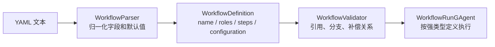
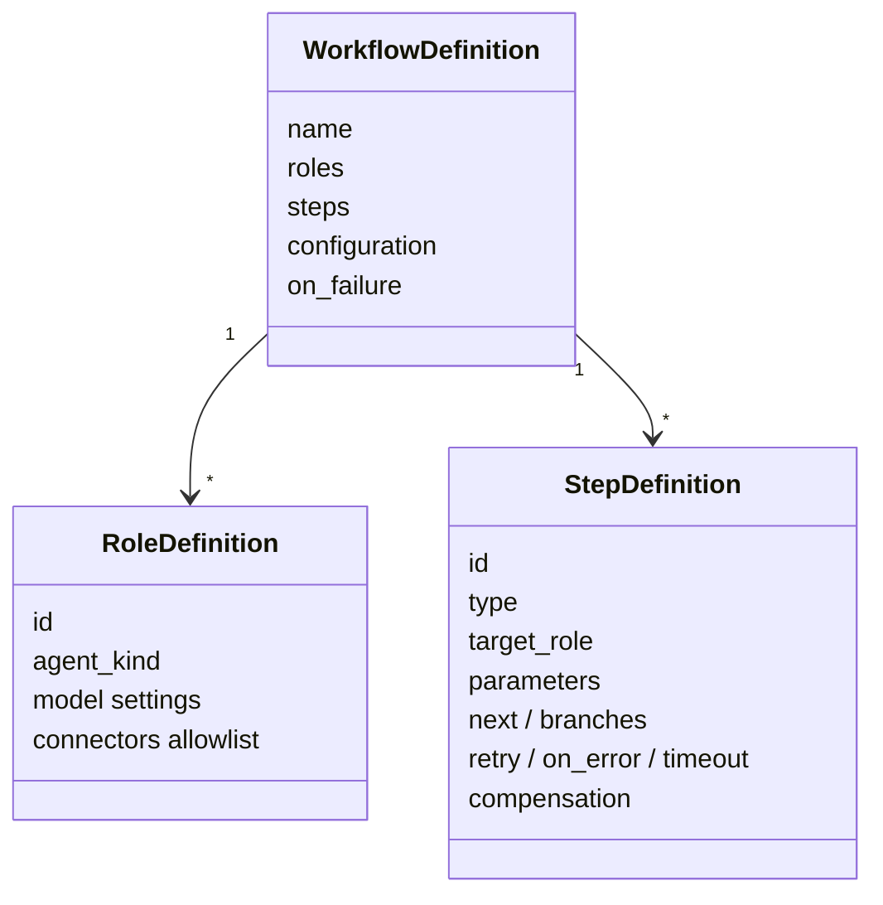

# Workflow YAML 语法：声明一张可执行的图

## 事实源/设计抽象(以 ~/Code/aevatar 为准)

- `src/workflow/Aevatar.Workflow.Core/Primitives/WorkflowDefinition.cs:11-186`: workflow 顶层结构、角色结构、运行配置和分支取后继规则。
- `src/workflow/Aevatar.Workflow.Core/Primitives/StepDefinition.cs:6-109`: step 契约、重试、错误策略、超时和 `compensation` 引用。
- `src/workflow/Aevatar.Workflow.Core/Primitives/WorkflowParser.cs:19-164`: YAML 解析、snake_case 约定、step type 默认值与参数提升。

---

## 一句话模型

Workflow YAML 不是脚本语言，而是一张声明式执行图：`roles` 定义谁能做事，`steps` 定义图上的节点和边，`configuration` 与失败策略定义运行时边界。解析器把宽松的 YAML 写法归一化成强类型 `WorkflowDefinition`，后续的 definition actor、run actor 和 kernel 都只看这个模型。





## 最小骨架

一个合法 workflow 至少要有名字、角色和步骤。没有显式 `type` 时，parser 会按当前契约把 step 当成 `llm_call` 处理；为了让文档和人工审核更稳定，示例仍建议显式写出 `type`。

```yaml
name: simple_qa
roles:
  - id: assistant
    name: Assistant
    system_prompt: "You are a helpful assistant."
steps:
  - id: answer
    type: llm_call
    role: assistant
```

`roles` 是能力和授权边界，不是运行线程。一个 role 可以配置模型参数，也可以声明 `connectors` allowlist；真正的外部连接定义在 host 配置里，详见 `02/07-connectors.md`。

## steps 是执行图的节点

每个 step 至少需要一个稳定的 `id`。`type` 决定由哪个模块处理，`parameters` 提供模块输入，`next` 和 `branches` 决定图怎么继续走。

```yaml
steps:
  - id: classify
    type: switch
    on: "{{input.kind}}"
    branches:
      invoice: extract_invoice
      resume: screen_resume
      _default: ask_human

  - id: extract_invoice
    type: llm_call
    role: invoice_extractor
    next: submit_approval
```

后继解析遵循一个稳定顺序：先查命中的 `branches`，再查 `_default`，再看显式 `next`，最后才落到 YAML 中的下一个 step。这样既能写线性流程，也能在关键节点改成条件图。

```mermaid
flowchart TD
    Done["step 完成"] --> Key{"有 branch key?"}
    Key -->|命中 branches[key]| Branch["跳到匹配分支"]
    Key -->|未命中| Default{"有 _default?"}
    Default -->|有| Dst["跳到默认分支"]
    Default -->|无| Next{"有 next?"}
    Next -->|有| Explicit["跳到 next"]
    Next -->|无| Index["按 YAML 顺序取下一个 step"]
```

## 参数可以写得更顺手

YAML 面向人和 LLM 生成器，所以 parser 接受两类写法：

- 模块参数写在 `parameters` 下，最接近强类型模型。
- 常用参数直接写在 step 根级，parser 再提升进 `parameters`。

```yaml
steps:
  - id: wait_a_bit
    type: delay
    duration_ms: 5000
```

这类语法糖只改变输入形状，不改变执行语义。模块最终仍收到归一化后的参数表。

## retry / on_error / timeout

`retry` 是当前 step 的本地重试策略；`on_error` 是重试耗尽后的前向恢复策略；`timeout_ms` 由 kernel 转成 durable timeout 事件处理。

```yaml
steps:
  - id: call_external
    type: connector_call
    role: coordinator
    connector: github_router
    operation: list_repos
    retry:
      max_attempts: 3
      backoff: exponential
      delay_ms: 1000
    on_error:
      strategy: fallback
      fallback_step: report_unavailable
    timeout_ms: 30000
```

这里的恢复仍然是执行图的一部分：fallback step 也是普通 step，会继续进入同一个 kernel 主循环。

## compensation 是显式反向动作

`compensation` 不是自动推断的“撤销”。它只是一个 step id 引用，表示当前 step 成功后，如果 workflow 后续进入补偿阶段，run actor 可以按补偿 ledger 反向调度对应动作。

```yaml
steps:
  - id: charge_card
    type: connector_call
    role: payment_worker
    connector: payment_gateway
    operation: charge
    compensation: refund_card

  - id: refund_card
    type: connector_call
    role: payment_worker
    connector: payment_gateway
    operation: refund
```

⚠️ `compensation` 目标不应被当作正向路径上的普通后继来双重执行；它属于 saga 补偿阶段，状态机细节见 `02/03-execution-kernel.md`。

## 读 YAML 时先看三件事

1. `roles`：谁可以调用模型、工具或 connector。
2. `steps[].type`：每个节点由哪类模块处理。
3. `next` / `branches` / `compensation`：正向图和失败后的反向动作是否清楚。

## 验收

1. YAML 的最小合法骨架是什么？`name`、`roles`、`steps`。
2. 分支取后继的顺序是什么？命中分支、默认分支、显式 `next`、YAML 顺序。
3. `compensation` 是什么？显式声明的补偿 step 引用，不是自动生成的逆操作。

⟦AI:AUTO-LOOP⟧
