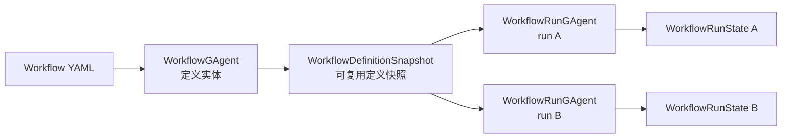
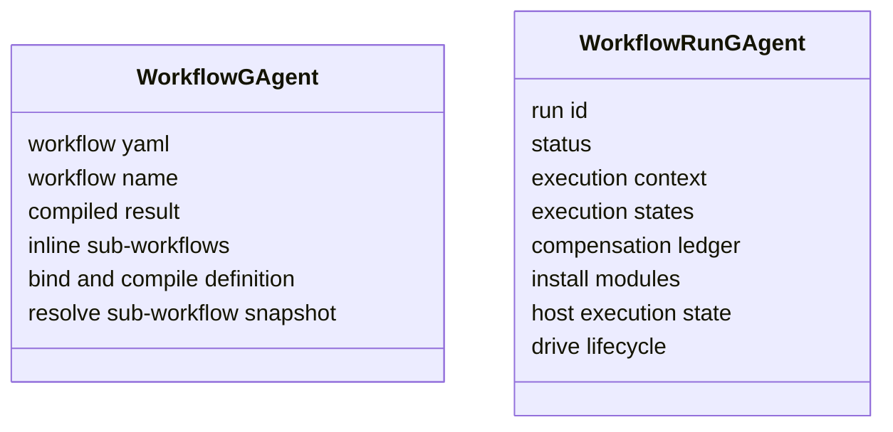
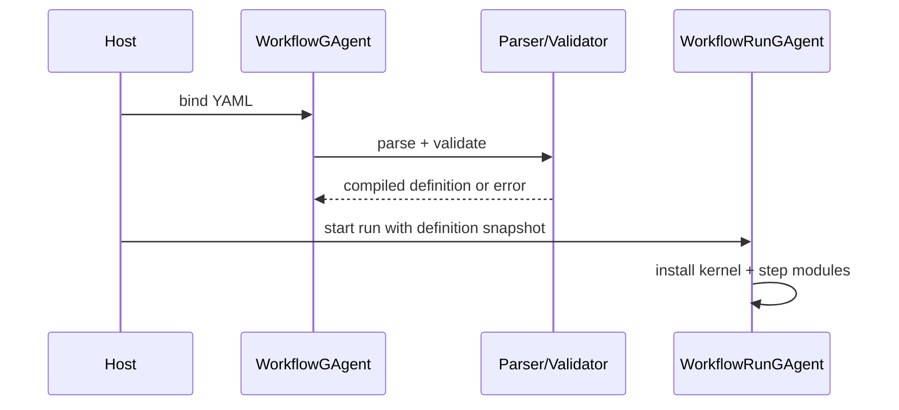
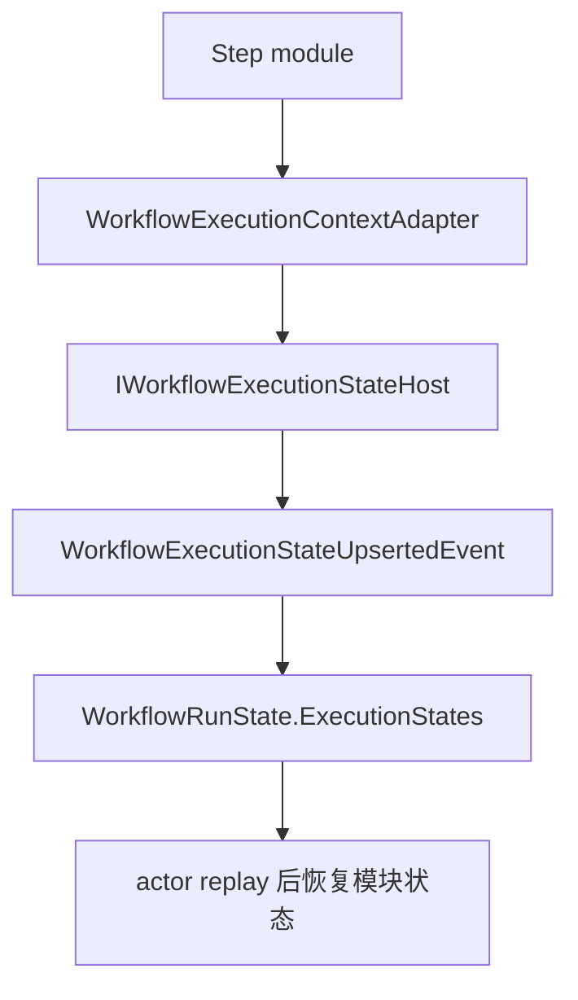

# WorkflowGAgent 与 WorkflowRunGAgent：定义实体和运行实体

## 事实源/设计抽象(以 ~/Code/aevatar 为准)

- `src/workflow/Aevatar.Workflow.Core/WorkflowGAgent.cs:16-224`: definition actor 的绑定、编译和子 workflow 定义快照服务。
- `src/workflow/Aevatar.Workflow.Core/WorkflowRunGAgent.cs:35-168`: run actor 的状态宿主接口、运行状态和执行上下文入口。
- `docs/canon/workflow-runtime.md:56-82`: workflow definition actor 与 run actor 的职责边界。

---

## 一句话模型

`WorkflowGAgent` 管“这个 workflow 是什么”，`WorkflowRunGAgent` 管“这一次运行发生了什么”。前者保存 YAML、编译结果和定义版本；后者保存 run id、执行上下文、模块状态、补偿 ledger 和最终结果。

## 为什么要拆成两个 actor

这不是为了多一层抽象，而是为了把两个业务实体分开：

| 维度 | definition actor | run actor |
|---|---|---|
| 生命周期 | 跟 workflow 定义绑定，可多次复用 | 跟一次 run 绑定，结束后成为运行事实 |
| 状态内容 | YAML、编译状态、内联子 workflow | 当前步骤、变量、模块状态、补偿、终态 |
| 主要失败 | YAML 不合法、重复绑定到不同定义 | 步骤失败、超时、补偿失败、停止 |
| 对外语义 | “这个流程定义能不能用” | “这次流程执行到哪里了” |

如果把它们合在一起，definition 的版本事实和 run 的事件事实会互相污染：同一份定义被多次运行时，状态归属也会变得不清楚。

## definition actor 不执行步骤

definition actor 的价值是把 YAML 变成稳定、可引用的定义事实。它可以拒绝不合法定义，也可以为父 workflow 解析子 workflow 快照，但它不调模块、不处理 step completion，也不保存 current step。

## run actor 是执行事实唯一归属

run actor 实现执行状态宿主接口。kernel、bridge module 和具体 step module 都不应该把执行事实藏在进程局部变量里；它们通过 host 读写 run actor 的 `ExecutionStates` 和 `ExecutionContext`。

这样做的结果是：进程重启、actor replay、durable timeout 回来之后，当前步骤和模块私有状态仍然有权威来源。

## 子 workflow 为什么也走 definition 快照

子 workflow 调用不是把 YAML 字符串临时塞进模块里执行。父 run 请求 definition actor 解析子 workflow 定义快照，再由 run actor 编排子 run。这个方向保证了两个边界：

- definition 事实仍归 definition actor。
- 子 run 的运行事实仍归自己的 run actor。

## 设计取舍

这套拆分牺牲了一点直观性：读者需要同时理解 definition actor 和 run actor。但它换来的是更清楚的状态所有权：可复用定义不被单次执行污染，单次执行也不依赖进程内映射表来保存上下文。

## 验收

1. `WorkflowGAgent` 持有什么？YAML、编译结果、定义快照相关事实。
2. `WorkflowRunGAgent` 持有什么？一次运行的状态、上下文、模块状态、补偿和终态。
3. 模块状态为什么要落到 run actor？因为 run actor 是执行事实的唯一权威，replay 后仍可恢复。

⟦AI:AUTO-LOOP⟧
