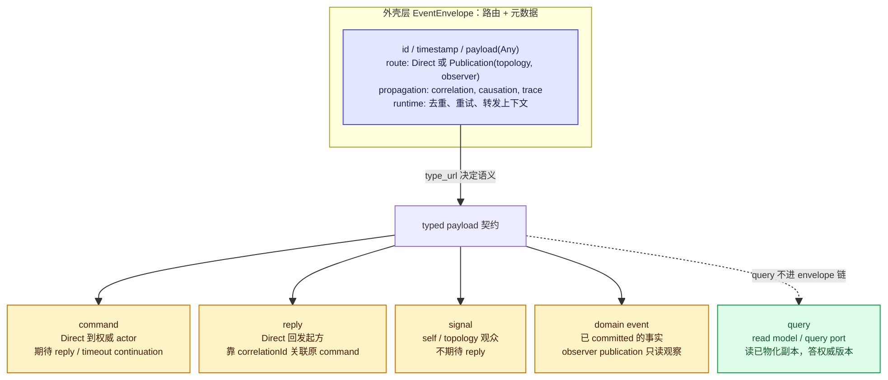
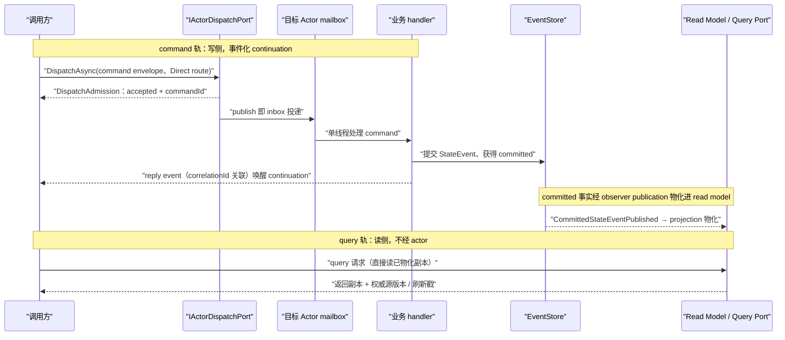

# Envelope 消息语义 —— command / reply / signal / domain event / query 的分野

> 版本与结论：本章描述 `current`；当前行为以 `f02aa690` 为准。核心结论一句话：`EventEnvelope` 只是传输外壳（路由 + 元数据），消息语义由 typed payload 契约定义；五类消息里只有 query 不进入 actor 消息链路，它由读模型回答。

## 设计抽象与事实源

- `src/Aevatar.Foundation.Abstractions/agent_messages.proto:44`：`EventEnvelope` 的全部字段只有 `id / timestamp / payload(google.protobuf.Any) / route / propagation / runtime` —— 外壳里没有"消息类型"字段，语义完全由 `payload` 里 packed 的 typed proto 决定。
- `src/Aevatar.Foundation.Abstractions/EnvelopeRouteSemantics.cs:43`：路由的 `oneof` 只解释出三种形态 —— `Direct`（指向单个 actorId）与 `Publication`（topology 观众 / observer 观众）—— 路由回答"送到谁"，不回答"这是什么消息"。
- `AGENTS.md:52`：仓库级不变量"统一包络不等于统一语义"—— Envelope 可承载 `command / reply / internal signal / domain event / query`，是否可持久化、可投影、可对外观察必须由消息契约显式定义。

## 先建立模型

先把两层分开：**外壳层**（EventEnvelope，负责送达与追踪）和**语义层**（payload 的 typed 契约，决定这条消息"期待什么、改变什么"）。一个 proto 消息被 `Any.Pack` 进 `payload`，它的 `type_url` 就是语义身份证；同一个外壳骨架，根据 payload 契约落入五种语义之一：

- **command**：期待处理方做出业务反应，调用方以 reply event 或超时事件 continuation 化地继续推进。路由通常是 `Direct` 指向权威 actor。
- **reply**：对某次 command 的回应事件，靠 `propagation.correlation_id / causation_event_id` 关联回原请求；它是业务协议的一环，不是同步返回值。
- **signal（internal signal）**：控制语义（超时、重试、自我继续、拓扑通知），**不期待 reply**；自我继续同样走 inbox 投递，不存在内联快捷路径。
- **domain event**：actor 已提交、已发生的事实增量。它经 `EventStore` 提交成为 `StateEvent` 后以 observer publication（`CommittedStateEventPublished`）向外广播，供 projection 与观察者消费；它只是"可观察的过去时"，不期待任何人回话。
- **query**：读侧语义。它**不是**发给 actor 的 envelope，不进任何 actor 的 mailbox；它由 read model / query port 直接回答，读的是 projection 物化出来的已 committed 事实副本。



三类判断捷径：看 `route` 的 oneof 知道"送到谁"；看 `payload` 的 `type_url` 知道"这是什么语义"；看 `propagation.correlation_id` 知道"它关联哪次请求"。外壳本身不承诺任何业务语义。

## 沿一条链路走读

下面把两条最容易被混用的轨道并排放：**command 轨**（写侧，走 actor）与 **query 轨**（读侧，走读模型）。注意两者从不交叉——query 不碰 actor mailbox，command 的 ACK 也不冒充 query 的新鲜度。



两个关键诚实点：

1. `DispatchAsync` 的返回只承诺 **accepted for dispatch + 稳定 commandId**——不承诺 handled、committed、read-model observed。更强保证必须通过 reply event 或读模型版本异步获得。
2. command 的调用方**不能在当前 turn 内同步等 reply**：发完请求事件就结束本 turn，由 reply event 或 timeout event 唤醒继续。这使"发消息再等同一条 reply"的链路天然不可能演化成伪 RPC。

## 为什么是它，不是别的

**替代方案 A：给 actor 加通用 query/reply RPC**（`Query*Requested -> *Responded` 或通用 request-reply client）。被明确否决，代价是：

- 破坏读写分离不变量——"读取另一个 actor 当前状态"一旦能用消息实现，读侧就会绕过 read model 去戳写侧权威，read model 的版本诚实性与最终一致语义被架空；
- 把 actor 的单线程 mailbox 变成查询热点——查询流量挤占业务事件的处理顺序；
- 让 stream 从"事件分发与观察"退化成 RPC 通道，违背 Stream 是传输机制而非 RPC 通道的边界。

**替代方案 B：在外壳上加一个 `message_type` 枚举字段，让 envelope 自己声明语义。** 被否决的理由与"核心语义强类型"不变量一致：枚举会鼓励"所有 envelope 都长一样、靠 switch 分流"的泛化协议，而 typed payload + `type_url` 天然带版本演进能力（proto field 演进是默认路径），且让"是否可持久化、可投影、可观察"由每个消息契约自己显式声明，而不是靠一个全局枚举兜住所有语义。`EventEnvelope` 只有 6 个字段（从 16 个收敛而来）正是这次收敛的结果：外壳只留路由与元数据，语义全部下沉 payload。

## 协议与状态深入

- **typed contract**：`payload` 是 `google.protobuf.Any`，`type_url` 前缀为 `type.googleapis.com/`（见证据映射）；路由只能落在 `Direct` / `TopologyPublication` / `ObserverPublication` 三种强类型形态上，`EnvelopeRouteSemantics` 的构造器与谓词方法把"徒手拼 route"收敛成受控入口。
- **ACK 语义**：唯一的同步回执是 `DispatchAdmission`（accepted、commandId、correlationId、时间戳）。`accepted` 永远不等于 `committed`；commandId 是追踪标识，actorId 是目标身份，二者禁止混用。
- **关联与对账**：reply / continuation 靠 `propagation.correlation_id` 与 `causation_event_id` 关联；内部触发事件必须携带最小充分相关键，由 actor 内做活跃态校验、拒绝陈旧事件。
- **幂等与重试**：`runtime.deduplication.operation_id` 与 `runtime.retry` 是外壳级传输上下文，服务于投递去重与重试对账，不属于业务语义。
- **失败恢复**：command 失败走 timeout event 唤醒的 continuation；query 侧的"读不到新鲜数据"靠 read model 诚实暴露权威源版本 / 刷新戳解决，禁止在 query 路径里同步补跑 projection 或回放 event store。
- **读侧版本**：read model 版本必须来自权威 actor 的 committed version 或等价水位；`accepted ACK` 与弱读结果不得暗示强一致。

## 最小示例

> Demo status：`verified-static`

一个 typed proto 消息如何被包进 Envelope。以冻结树中真实存在的 `aevatar.ChildAddedEvent`（`agent_messages.proto:170`）为 payload，静态展示外壳各字段的职责分工（以下 JSON 为 proto 的消息形态示意，未实际执行序列化）：

```json
{
  "id": "cmd-01JEXAMPLE",
  "timestamp": "2026-07-25T08:00:00Z",
  "payload": {
    "@type": "type.googleapis.com/aevatar.ChildAddedEvent",
    "childId": "actor-9f2"
  },
  "route": {
    "publisherActorId": "actor-parent-01",
    "direct": { "targetActorId": "actor-child-9f2" }
  },
  "propagation": {
    "correlationId": "cmd-01JEXAMPLE",
    "causationEventId": "evt-parent-880"
  },
  "runtime": {
    "sourceActorId": "actor-parent-01",
    "deduplication": { "operationId": "op-add-child-880" }
  }
}
```

读法：`payload.@type` 的 `type_url`（`type.googleapis.com/` + proto 全名）声明这是哪条 typed 契约；`route.direct.targetActorId` 说明它 Direct 投递给单个 actor（command 形态）；`propagation.correlationId` 是未来 reply 回来的挂钩；`runtime` 里的字段只服务投递去重与追踪，不构成业务语义。若换成 `publication.observer` 路由 + `CommittedStateEventPublished` payload，同一副外壳就变成 domain event 的观察广播——外壳不变，语义由 payload 契约决定。

未执行理由：本 demo 只展示 proto 契约的静态字段映射，不依赖运行时、凭证或外部服务；所有字段名均逐一对照冻结树 `agent_messages.proto` 核实。

## 边界与演进

- **current**：外壳 6 字段 + 三种路由形态 + accepted-only ACK，以及"禁止 generic actor query/reply""查询始终走 readmodel""禁止 stream request-reply 冒充 RPC""禁止 query-time replay"均为仓库级强制条款。
- **historical**：`EventEnvelope` 曾承载 16 个字段，后收敛为 6 个语义字段（proto 注释记为 "8 semantic fields (reduced from 16)"，按字段编号实际为 6 项）；dispatch 侧契约曾暗示 actor-turn 完成，后经 iter149/issue1132 收敛为 accepted-only 准入语义。
- **open gap**：query 的具体端口形态（各 read model 的 query port 定义）属于 05 块 CQRS 与读侧章节范围，本章只确立"query 不进 actor 消息链"的边界。
- **设计待论证**：无。

## 读完应能回答

1. `EventEnvelope` 是领域事件或 event store 吗？—— 都不是；它是传输外壳（路由 + 元数据 + typed payload 引用），领域事实是 payload 语义 + `EventStore` 提交后的 `StateEvent`。
2. command 与 signal 的期待有何不同？—— command 期待 reply / timeout continuation，signal 不期待任何回话。
3. 调用方拿到 `DispatchAdmission` 意味着什么？—— 只意味着 accepted for dispatch + 稳定 commandId；不等于 handled、committed 或 read-model observed。
4. query 为什么不由 actor 的 request-reply 回答？—— 通用 actor query/reply 被仓库级条款禁止；查询只读 read model 已物化的 committed 副本，actor 没有通用查询 RPC。
5. reply 如何找到它对应的那次 command？—— 靠 `propagation.correlation_id / causation_event_id` 关联，而不是靠同步返回值或 actorId 字符串。

<details>
<summary>论断—证据映射</summary>

| 论断 | 等级 | 证据 |
|---|---|---|
| EventEnvelope 只有 id/timestamp/payload/route/propagation/runtime 六个字段，语义由 payload 的 Any 决定 | E1 | `src/Aevatar.Foundation.Abstractions/agent_messages.proto:44` |
| 路由 oneof 只有 Direct 与 Publication(topology/observer) 三种形态，是寻址而非语义 | E1 | `src/Aevatar.Foundation.Abstractions/EnvelopeRouteSemantics.cs:43` |
| Envelope 可承载 command/reply/internal signal/domain event/query，但语义必须由消息契约显式定义（统一包络不等于统一语义） | E1 | `AGENTS.md:52` |
| 禁止 generic actor query/reply；查询默认只落到 read model | E1 | `AGENTS.md:55` |
| 禁止用 stream request-reply 冒充 RPC；先发再等 reply 必须改为 read model 查询或 continuation 化事件协议 | E1 | `AGENTS.md:56` |
| 对外查询默认只能读取 readmodel | E1 | `AGENTS.md:79` |
| query 与 command 的 actor 边界必须分清：读已提交事实走 read model，不发 query 消息给 actor | E1 | `AGENTS.md:113` |
| DispatchAsync 的完成只承诺 accepted-for-dispatch + 稳定 commandId，不承诺 handled/committed/observed | E1 | `src/Aevatar.Foundation.Abstractions/IActorDispatchPort.cs:58` |
| DispatchAdmission 的字段形态（accepted、commandId、correlationId、ackedAt） | E1 | `src/Aevatar.Foundation.Abstractions/IActorDispatchPort.cs:6` |
| type_url 前缀为 `type.googleapis.com/` | E1 | `src/Aevatar.Foundation.Abstractions/Compatibility/ProtobufContractCompatibility.cs:11` |
| ChildAddedEvent 是真实存在的 proto 消息（最小示例 payload） | E1 | `src/Aevatar.Foundation.Abstractions/agent_messages.proto:170` |
| 外壳从 16 字段收敛、dispatch 曾暗示 handled 后收敛为 accepted-only | E1 | `src/Aevatar.Foundation.Abstractions/agent_messages.proto:42`、`src/Aevatar.Foundation.Abstractions/IActorDispatchPort.cs:50` |

</details>
