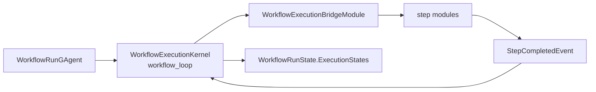
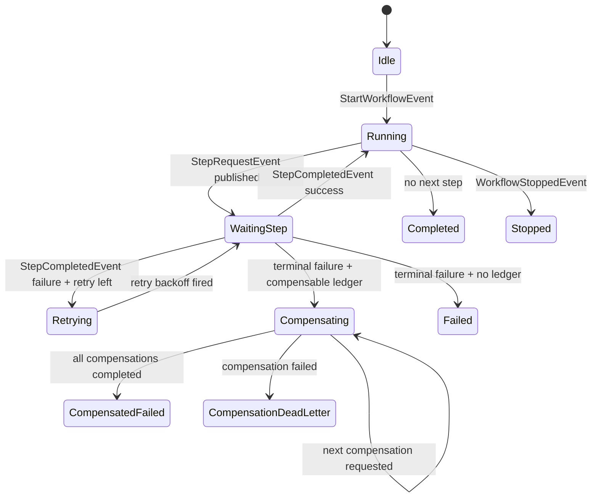
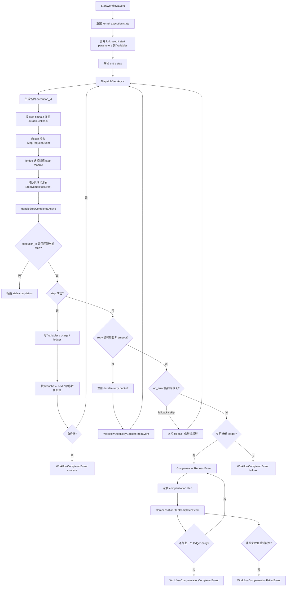
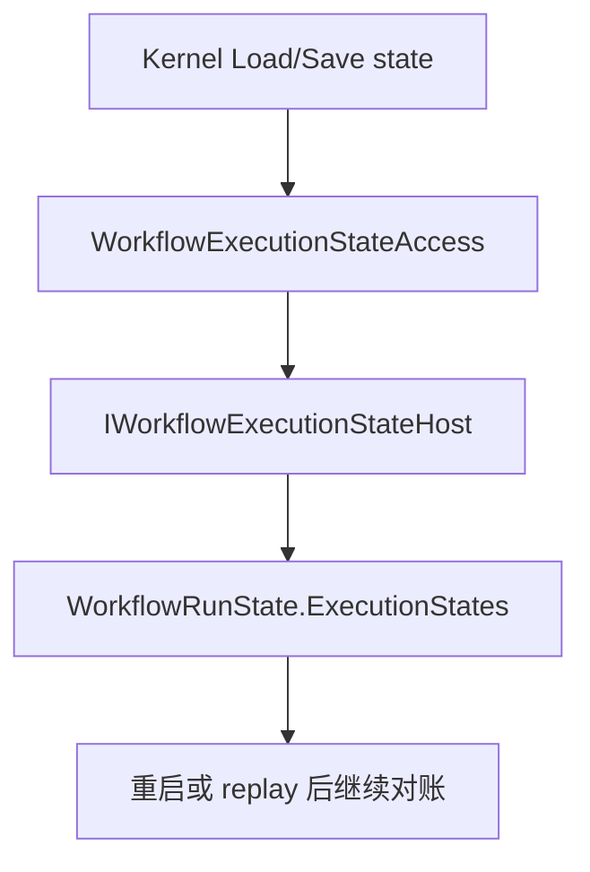
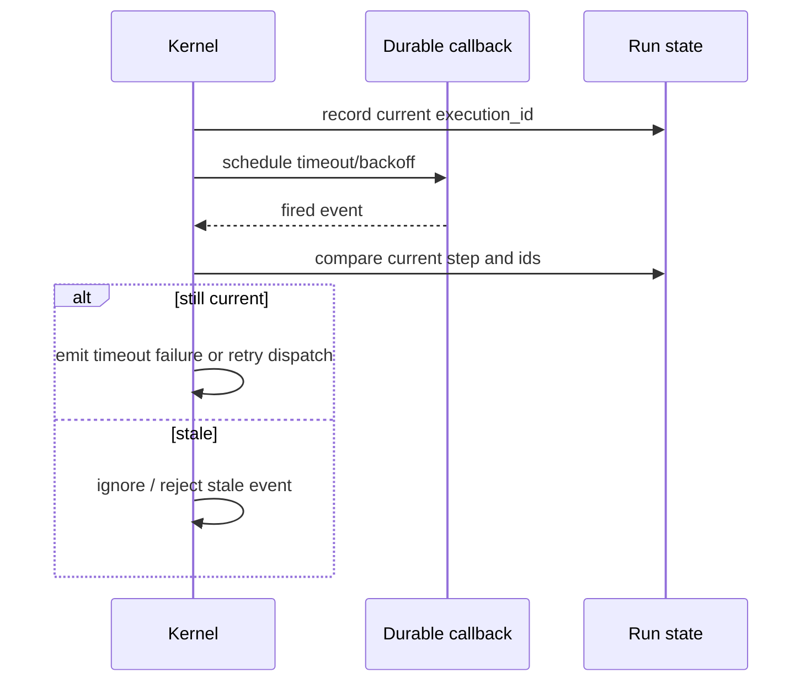
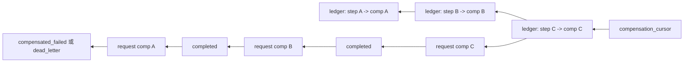

# WorkflowExecutionKernel：run actor 内部的主循环

## 事实源/设计抽象(以 ~/Code/aevatar 为准)

- `WorkflowExecutionKernel`: kernel 事件入口、启动、step dispatch、completion、retry、timeout 和补偿请求处理。
- `WorkflowRunGAgent`: run actor 内的补偿 ledger、cursor、dead-letter 与恢复逻辑。
- `workflow_state`: `WorkflowRunState` 中 execution states、compensable ledger 和 saga 状态字段。

---

## 一句话模型

`WorkflowExecutionKernel` 是 `workflow_loop` primitive 的实现，但用户不在 YAML 里写它。它被 run actor 自动安装，用事件驱动方式推进当前 step、变量、重试、timeout 和 saga 补偿。真正的执行事实仍在 run actor state 里，kernel 只是主循环控制器。

## 完整主循环

下面这张图是读 `02/03` 的主干：所有路径都回到同一个 actor-owned loop，不靠后台线程偷偷推进。

## actor-owned execution state

kernel 自己也有状态，但它不放在 kernel 对象字段里当权威。current step、当前输入、变量表、retry 计数、timeout callback、execution id 和补偿 execution id 都通过 execution state 存在 run actor 中。

这就是为什么 timeout 和 retry 都可以是 durable 的：callback 回来时只带一个事件，kernel 再用 actor state 判断它是否仍然有效。

## retry 与 timeout 是事件化的

retry 不等于线程 sleep。失败后如果还能重试，kernel 记录 retry attempt，再注册 durable backoff；backoff fired event 回到同一个 actor 后重新 dispatch。timeout 也是同样的形状：注册 timeout lease，fired 后转成失败的 `StepCompletedEvent`，再进入统一失败分支。

## ⚠️ saga 补偿状态按事实理解

补偿不是另起一个全局 saga coordinator。run actor 自己持有 `compensable_ledger`、`compensation_cursor`、`saga_status`、`compensation_execution_id` 和 dead-letter 字段。失败进入补偿阶段时，kernel 只负责发布下一条 `CompensationRequestEvent`；每个补偿 step 仍然通过同一个 dispatch/complete 机制执行。

⚠️ 当前事实是“已成功、且声明了补偿的 step”才会进入补偿 ledger；补偿按反向顺序串行执行，失败耗尽后进入 durable dead-letter 状态，而不是静默吞掉。

两个容易漏的事实补充(已核对源码):

- **ledger 是两阶段的**:补偿 ledger entry 有 `Provisional → Confirmed` 两态(`CompensableLedgerEntryStatus`)。dispatch 补偿时先记 `Provisional`,该补偿成功完成、cursor 前移后才算 `Confirmed`——这让 replay 时能正确区分“补偿已派发”和“补偿已完成”。
- **`OutcomeUncertain` 故意不补偿**:终态 step 因 timeout 等被标 `OutcomeUncertain`(副作用是否发生不确定)时,**不进 ledger、不补偿**——盲目补偿一个可能根本没成功的 step 会造成更大破坏。这是合理但容易忽略的边界。
- saga 状态枚举是 `WorkflowSagaStatus.CompensationDeadLetter`(单数);补偿协议**代码已全量落地**,但 ADR-0034 头仍是 `status: proposed`(canon 滞后,见 [08/04 P1-1](../08/04-todo-list.md))。

## stale completion 为什么重要

每次 dispatch 都生成新的 `execution_id`。step completion 回来时，kernel 比对当前 step 的 execution id；不匹配说明这是旧派发、旧 timeout 或旧补偿的迟到消息，不能改写当前状态。这个保护让重试、timeout 和补偿可以共享同一条事件通道。

## 验收

1. `workflow_loop` 是用户 YAML step 吗？不是，它是 run actor 自动安装的 kernel。
2. kernel 主循环的闭环是什么？dispatch step、等待 completion、校验 id、推进后继或失败分支。
3. ⚠️ saga 状态归谁？归 run actor 的 `WorkflowRunState`，不是外部 coordinator。

⟦AI:AUTO-LOOP⟧
