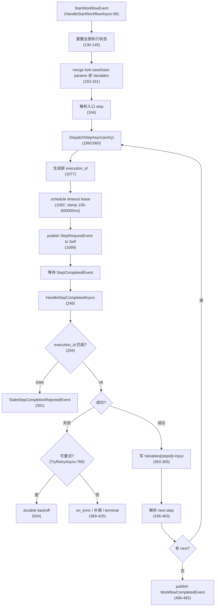

# WorkflowExecutionKernel 主循环:current step / variables / retry / timeout

## 关键代码(事实源,以 ~/Code/aevatar 为准)

- `src/workflow/Aevatar.Workflow.Core/Execution/WorkflowExecutionKernel.cs` 第 14 行:`class WorkflowExecutionKernel : IEventModule<IEventHandlerContext>`;第 36 行:`Name => "workflow_execution_kernel"`;第 37 行:`Priority => 0`;**这个 kernel 就是 `workflow_loop` primitive**,由 `WorkflowRunGAgent.cs:977` 自动注入。全文 1882 行。
- 第 39 行:`CanHandle`(`StartWorkflowEvent`/`CompensationRequestEvent`/`CompensationStepCompletedEvent`/`StepCompletedEvent`/`WorkflowStoppedEvent`/`WorkflowStepTimeoutFiredEvent`/`WorkflowStepRetryBackoffFiredEvent`)。
- 第 99 行:`HandleStartWorkflowAsync`;第 130-145 行:重置全部执行状态;第 153-161 行:merge fork-seed/start params 进 `Variables`;第 164 行:解析入口 step;第 189 行:`DispatchStepAsync(entry)`。
- 第 1060 行:`DispatchStepAsync`;第 1077 行:每 dispatch 生成新 `execution_id`;第 1092/1153 行:schedule step timeout lease(`ScheduleStepTimeoutLeaseAsync`,clamp `100..600_000` ms,第 1163 行);第 1099 行:publish `StepRequestEvent` to Self。
- 第 246 行:`HandleStepCompletedAsync`;第 294 行:reject stale `execution_id`;第 436-463 行:解析 next step;第 466-482 行:dispatch next 或 publish `WorkflowCompletedEvent`。
- 第 766 行:`TryRetryAsync`;第 785 行:max_attempts clamp 1-10;第 792-795 行:backoff clamp ≤60s;第 830/934 行:durable retry backoff。
- 第 192 行:`HandleTimeoutFiredAsync`;第 233-239 行:超时 → failed `StepCompletedEvent`。
- 第 1294 行:`LoadState`(`WorkflowExecutionStateAccess.Load`,`ModuleStateKey = "workflow_execution_kernel"`,第 16 行);第 1297 行:`SaveStateAsync`。
- `src/workflow/Aevatar.Workflow.Core/Execution/WorkflowExecutionStateKeys.cs` 第 1-24 行:`Engine(name)→"engine/{name}"`、`Component(name)→"components/{name}"`、`Step(stepId)→"steps/{stepId}"`。
- `src/workflow/Aevatar.Workflow.Core/Execution/WorkflowExecutionStateAccess.cs` 第 1-33 行:`Load/LoadMany/Save/Clear` 委托 `ctx.LoadState/SaveState/ClearState`。

---

## kernel 是什么

`WorkflowExecutionKernel`(`WorkflowExecutionKernel.cs`)**就是 `workflow_loop` primitive**。它是一个 `IEventModule<IEventHandlerContext>`(第 14 行),`Name = "workflow_execution_kernel"`(第 36 行),`Priority = 0`(第 37 行,最先执行),由 `WorkflowRunGAgent` 在第 977 行自动注入。它不是用户在 YAML 里写的步骤,而是引擎内部的主循环调度器。

它处理的全部事件(`CanHandle`,第 39 行):`StartWorkflowEvent`、`CompensationRequestEvent`、`CompensationStepCompletedEvent`、`StepCompletedEvent`、`WorkflowStoppedEvent`、`WorkflowStepTimeoutFiredEvent`、`WorkflowStepRetryBackoffFiredEvent`。

---

## 主循环:启动 → dispatch → 完成 → 推进

---

## actor-owned execution state

kernel 的全部状态存在 `WorkflowExecutionKernelState` protobuf 里,通过 `LoadState`/`SaveStateAsync` 落到 run actor 的 `WorkflowRunState.ExecutionStates["workflow_execution_kernel"]`。

状态字段(`HandleStartWorkflowAsync` 第 130-145 行重置清单):
`Active`、`RunId`、`CurrentStepId`、`CurrentStepInput`、`CurrentStepInputFileRefs`、`InputFileRefs`、`Variables`、`RetryAttemptsByStepId`、`TimeoutsByStepId`、`RetryBackoffsByStepId`、`ExecutionIdsByStepId`、`IdempotencyByStepId`、`CompensationExecutionIdsByStepId`、`Usage`、`CurrentStepDispatchPending`、`CurrentStepTimeoutCallbackId`。

**关键设计**:current step / variables / retry / timeout 全部在 **actor-owned execution state** 里,不在进程内存。这保证 run actor 重启后能恢复执行进度(Event Sourcing)。

---

## retry / timeout 机制

**retry**(`TryRetryAsync`,第 766 行):
- `step.Retry.MaxAttempts` clamp 1-10(第 785 行)
- timeout 错误不重试(第 777 行)
- `fixed`/`exponential` backoff,clamp ≤60s(第 792-795 行)
- durable backoff:通过 `ScheduleSelfDurableTimeoutAsync` → `WorkflowStepRetryBackoffFiredEvent`(`StartRetryBackoffAsync` 第 934 行,handler `HandleRetryBackoffFiredAsync` 第 830 行)

**timeout**(`HandleTimeoutFiredAsync`,第 192 行):
- 匹配后 publish failed `StepCompletedEvent`,reason `TIMEOUT after {ms}ms`(第 233-239 行)
- timeout lease 在 dispatch 时 schedule(`ScheduleStepTimeoutLeaseAsync`,第 1153 行),clamp `100..600_000` ms(第 1163 行)

---

## 状态 key 命名

`WorkflowExecutionStateKeys.cs`(第 1-24 行)定义命名约定:
- `Engine(name)` → `"engine/{name}"`
- `Component(name)` → `"components/{name}"`
- `Step(stepId)` → `"steps/{stepId}"`

kernel 自己用 `ModuleStateKey = "workflow_execution_kernel"`(第 16 行)。

---

## stale completion 保护

每次 `DispatchStepAsync` 生成新 `execution_id`(第 1077 行),存入 `state.ExecutionIdsByStepId`。`HandleStepCompletedAsync`(第 294 行)校验完成事件的 `execution_id` 是否匹配当前 step 的;不匹配 → `StaleStepCompletionRejectedEvent`(第 301 行)。这防止旧步骤的延迟完成污染当前步骤。

---

## 验收

1. `workflow_loop` 是用户写的步骤吗?(不是,是 `WorkflowExecutionKernel`,自动注入,第 36 行)
2. kernel 状态存在哪?(`WorkflowRunState.ExecutionStates["workflow_execution_kernel"]`,actor-owned)
3. retry 的 max_attempts 范围?(1-10,第 785 行)
4. stale completion 怎么防护?(每次 dispatch 新 `execution_id`,完成时校验,第 294 行)

⟦AI:AUTO-LOOP⟧
