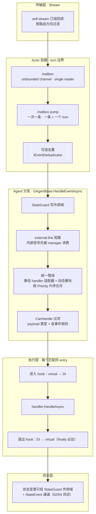
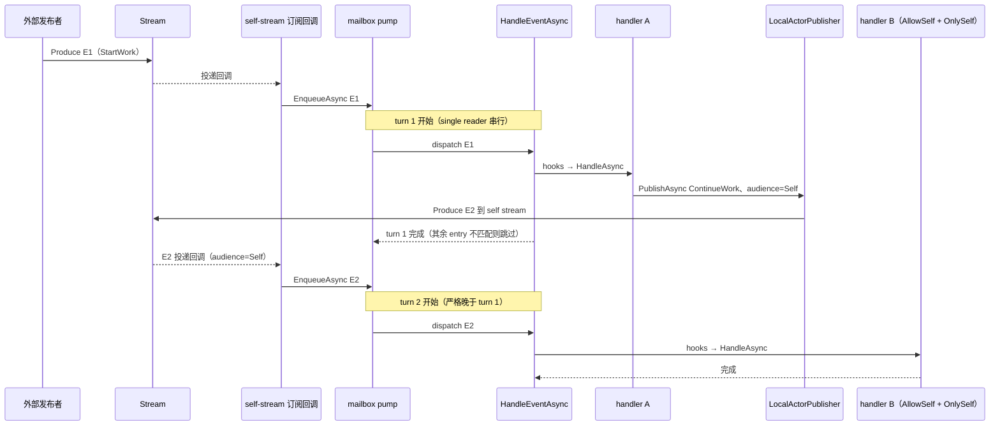

# GAgent 事件处理管线：一条消息进入 actor 之后

> 版本与结论：本章描述 `current`；当前行为以 `f02aa690` 为准。两条最重要的结论：
> 其一，静态 `[EventHandler]` 方法与动态 `IEventModule` 模块**不是两套链路**，而是被归一成同一条
> 按 `Priority` 升序排序的管线，共享同一套过滤、异常与 hook 语义；其二，actor 给自己的消息
> （自我继续）**必须重新走 inbox**，框架不存在内联自我调用的快捷路径——一次 mailbox 处理就是一个
> turn，turn 是串行、观测与失败隔离的原子边界。

## 设计抽象与事实源

- `src/Aevatar.Foundation.Core/GAgentBase.cs:121`：`HandleEventAsync` 是 agent 侧统一分发入口——StateGuard 写作用域、合并管线、双 hook 通道、fail-fast 策略都在这一个方法里闭合，是整章的脊柱。
- `src/Aevatar.Foundation.Abstractions/EventModules/IEventModule.cs:13`：`IEventModule<TContext>` 是管线 entry 的统一契约（`Name` / `Priority` / `CanHandle` / `HandleAsync`）；静态 handler 也被适配成这个契约，动态模块原生实现它。
- `src/Aevatar.Foundation.Abstractions/Attributes/EventHandlerAttribute.cs:10`：静态 handler 与动态 `IEventModule` 按 `Priority` 交错进入同一管线，并由 attribute 定义 self-handling 边界。

## 先建立模型

一条消息进入 actor 之后，要经过四个职责不同的层，每层只有一句话的职责：

1. **传输层（Stream）**：Stream 是送达通道。actor 激活时订阅自己的 stream，订阅回调按路由方向（direct / Self / Parent / 转发）过滤后，把匹配的 `EventEnvelope` 塞进 mailbox。传输层不理解业务事件类型。
2. **turn 边界（mailbox）**：mailbox 是一个 single-reader 的无界 channel，pump 协程一次只取一条、处理完才取下一条。**一条 envelope 的完整处理 = 一个 turn**，这是 actor 串行所有权的实现方式。
3. **分发层（GAgentBase）**：turn 内调用 `HandleEventAsync`。它打开 StateGuard 写作用域，先给 external-link 内部信号一个短路机会，然后把 envelope 交给统一管线：静态 `[EventHandler]` 方法经适配器、动态 `IEventModule` 模块原生，两者合并成一个按 `Priority` 升序的数组，逐个 `CanHandle` 过滤、逐个执行。
4. **状态层**：handler 是允许改写 actor 状态的执行区，但状态变更必须经 StateGuard 把守的作用域与 StateEvent 通道（细节属于 02/04 章）。hook 与回调只是观测面，不是状态变更的合法通道。



### 静态 handler 与动态订阅：两种注册方式，一条管线

**静态 handler** 是写在 Agent 类上的方法，靠 `[EventHandler]` 标记，框架在首次使用时按类型反射发现并缓存。发现规则有三条（`src/Aevatar.Foundation.Core/Pipeline/EventHandlerDiscoverer.cs:53`），三条共享同一个前提——方法必须恰好是单参数：

- 标了 `[EventHandler]` 且唯一参数是 `IMessage` 子类的方法，处理该类型事件；
- 标了 `[AllEventHandler]` 且唯一参数为 `EventEnvelope` 的方法，看到所有 envelope 本身；
- 名为 `HandleAsync` / `HandleEventAsync`、且同样满足单参数（非抽象 `IMessage`）的方法，即使没标 attribute 也按约定兜底纳入（Priority 0）。

`[EventHandler]` 上还有三个与匹配相关的开关：`Priority`（小值先执行，默认 0）、`AllowSelfHandling`（是否处理自己发布的事件，默认 false）、`OnlySelfHandling`（只处理 audience 为 Self 的事件，默认 false）（`src/Aevatar.Foundation.Abstractions/Attributes/EventHandlerAttribute.cs:12`）。另有 `EndpointName` 开关控制端点展示名，属 01 块宿主暴露话题，本章不展开。

**动态订阅**是运行期注册的 `IEventModule<IEventHandlerContext>` 实例，通过 `RegisterModule` / `RegisterModuleAsync` / `SetModules` / `SetModulesAsync` 增删（`src/Aevatar.Foundation.Core/GAgentBase.cs:252`）。模块自己声明 `Priority` 与 `CanHandle`，可以实现成跨 agent 复用的可插拔能力（例如 voice presence、路由包装）；实现 `ILifecycleAwareEventModule` 的模块还会随 agent 激活初始化、随停用在逆序中销毁，初始化失败会回滚已启动的模块。

**归一**发生在管线构建时：每个静态 handler 被包进一个 `StaticHandlerAdapter`（它实现同一个 `IEventModule` 契约，并把反射调用编译成缓存的强类型委托），与动态模块拼成一个数组后按 `Priority` 升序排序（`src/Aevatar.Foundation.Core/Pipeline/EventPipelineBuilder.cs:16`）。从此分发循环不区分 entry 是静态还是动态。管线数组构建一次后缓存，增删模块时整体失效重建。

### 前后 hook：两条通道，一个生命周期

每个匹配的 entry 执行前后各有一圈 hook，且是**两条通道**：

- **子类 virtual hook**：`OnEventHandlerStartAsync` / `OnEventHandlerEndAsync`，给 agent 自己做局部扩展；
- **DI 注入的 `IGAgentExecutionHook` 管线**：按 `Priority` 排序，拿到包含 envelope、handler 名、耗时、异常的上下文（`src/Aevatar.Foundation.Abstractions/Hooks/IGAgentExecutionHook.cs:16`），适合 tracing / metrics / 审计这类横切观测。

两处不对称值得记住：进入顺序是「virtual → DI」，退出顺序反过来是「DI → virtual」（栈式 enter/exit）；handler 异常默认中断管线，但 **DI hook 自身抛异常只记 warning、绝不影响分发**（`src/Aevatar.Foundation.Core/GAgentBase.cs:400`）。

## 沿一条链路走读

下面走读一次带自我继续的完整链路：外部发布者发来 `StartWork`，handler A 处理时给自己发一个 `ContinueWork`（audience = Self），handler B 在**下一个 turn** 接住它。



三个关键观察：

1. **自我继续不是方法调用**。handler A 里的 `PublishAsync(..., TopologyAudience.Self)` 只是把 E2 生产到自己的 stream（`src/Aevatar.Foundation.Runtime.Implementations.Local/Actors/LocalActorPublisher.cs:66`）；是 stream 的订阅回调把 E2 重新 `EnqueueAsync` 进 mailbox（`src/Aevatar.Foundation.Runtime.Implementations.Local/Actors/LocalActor.cs:79`）。E2 的处理必然是一个新 turn，严格晚于 turn 1 完成——mailbox 的 FIFO + single reader 保证了这一点。
2. **durable 回调同理**。`ScheduleSelfDurableTimeoutAsync` / `ScheduleSelfDurableTimerAsync` 先用 `SelfEventEnvelopeFactory` 造一个 audience=Self 的触发 envelope 交给回调调度器；触发时调度器把它生产到本 actor 的 stream（`src/Aevatar.Foundation.Runtime/Callbacks/InMemoryActorRuntimeCallbackScheduler.cs:164`），同样经 inbox 回流。超时信号与外部消息在 turn 边界上完全同权。
3. **自处理必须显式标 `AllowSelfHandling=true`，`OnlySelfHandling` 替代不了它**。`CanHandle` 的自发布者过滤（第 2 关）先于 `OnlySelfHandling` 检查（第 3 关）执行：默认 `AllowSelfHandling=false` 时，凡是 `PublisherActorId` 等于自己的 envelope 都在第 2 关被挡掉（`src/Aevatar.Foundation.Core/Pipeline/StaticHandlerAdapter.cs:34`），根本走不到第 3 关。所以只标 `OnlySelfHandling=true` 的 handler 永远收不到自我事件；正解是两个开关成对——`AllowSelfHandling=true` 放行自发布，`OnlySelfHandling=true` 再叠加收窄为「只收 audience=Self」。基线全库的真实用法都是成对出现（如 `src/Aevatar.AI.Core/RoleGAgent.cs:297`）。这套默认是防止广播回声意外自激的保险。

## 为什么是它，不是别的

**为什么静态 + 动态合成一条管线，而不是各跑一套链路？** 如果两条链路分立，优先级、异常策略、hook 观测面就会分叉：同一个 envelope 先过静态还是先过动态说不清，静态 handler 有 tracing 而动态模块没有。归一到同一个 `IEventModule` 契约后，顺序语义只剩一条规则（Priority 升序），异常语义只剩一套（fail-fast），观测面只剩一圈 hook。代价是两处工程复杂度：反射发现与委托编译要缓存（按类型缓存元数据、按 agent 缓存管线数组），动态增删模块要整体失效重建。这笔代价换来的是「管线行为可以纯静态推理」，值得。

**为什么自我继续必须走 inbox，而不是内联自我调用？** 内联调用（handler 里直接 `await this.OnContinueAsync(...)`）看似省一次排队，却同时破坏三样东西：单线程所有权（状态变更不再以消息为粒度串行化）、turn 边界（观测、去重、失败隔离都失去粒度）、可回放性（自我继续不再是事实流里的一条 envelope）。走 inbox 的代价是一次入队延迟和自处理的显式 opt-in；换来的是「actor 的一切状态变化都能按消息序列重放与审计」。这是 actor 模型的核心不变量，不是实现偏好。

**为什么 DI hook 是 best-effort 而不是 fail-fast？** hook 承载的是横切观测。如果 tracing 挂了能拖垮业务处理，观测面就成了可用性负资产。best-effort 的代价是 hook 失败只留下 warning、观测可能缺帧——这是有意的取舍：**hook 必须随时可以整个拿掉而业务行为不变**。由此推出本章红线：hook / 回调不得改写 actor 状态（状态变更必须经 StateGuard 把守的作用域与 StateEvent 通道），更不得承载业务主流程；把业务逻辑塞进 hook，等于让它绕过这条「可移除性」不变量。

## 协议与状态深入

**匹配协议**。`CanHandle` 按顺序看四件事：是否 `[AllEventHandler]`（直接匹配）；`AllowSelfHandling=false` 时发布者是不是自己（是则拒）；`OnlySelfHandling=true` 时 audience 是不是 Self（不是则拒）；payload 能否按 protobuf 契约兼容地解成 handler 的参数类型。四关全过才执行。顺序本身是协议的一部分：第 2 关先于第 3 关，意味着 `OnlySelfHandling` 是叠加在 `AllowSelfHandling` 之上的收窄开关，不能单独用来接收自我事件。

**Priority 协议**。数值小的先执行，静态与动态完全交错，这一点有测试锁定（`test/Aevatar.Foundation.Core.Tests/EventPipelineTests.cs:39`）。注意边界：合并用的是 `Array.Sort`，它不是稳定排序，**相同 Priority 的 entry 之间相对顺序不作承诺**——优先级相同的两段逻辑不应互相依赖先后。

**异常协议**。handler 抛异常后：先记错误日志、跑 `OnErrorAsync` hook，然后默认 rethrow 中断本条管线；子类可 override `ShouldSuppressHandlerException` 选择吞掉并继续后续 entry。无论成败，`finally` 里的 End hooks 必达。异常逃出 `HandleEventAsync` 后由 mailbox 的 turn 边界兜底：失败被记录、按需向调用方传播，**pump 不会死，后续 turn 照常**（`src/Aevatar.Foundation.Runtime.Implementations.Local/Actors/LocalActor.cs:213`）。

**静默丢弃协议**。整条管线没有任何 entry 匹配时，envelope 被静默丢弃、只留 Debug 日志（`src/Aevatar.Foundation.Core/GAgentBase.cs:188`）。这是显式设计（修复过「消息被悄悄吞掉无从排查」的真实问题），但它意味着发错事件类型不会报错。

**去重协议**。turn 入口先过可选的 `IEventDeduplicator`：能构造出去重键且已见过的 envelope 直接丢弃（`src/Aevatar.Foundation.Runtime.Implementations.Local/Actors/LocalActor.cs:195`）。

**传播协议**。自我继续的 envelope 会克隆 inbound envelope 的 Propagation（CorrelationId 等）（`src/Aevatar.Foundation.Core/Pipeline/SelfEventEnvelopeFactory.cs:25`），因此跨 turn 的链路追踪不会断。

**状态纪律（红线重申）**。`HandleEventAsync` 全程在 StateGuard 写作用域内（`src/Aevatar.Foundation.Core/GAgentBase.cs:123`）；有状态 agent 的 `State` setter 在作用域外直接抛 `InvalidOperationException`（`src/Aevatar.Foundation.Core/GAgentBase.TState.cs:33`）。hook 虽然碰巧也运行在这个作用域里，但「能写」不等于「该写」：hook 契约里没有状态变更语义，它的可移除性不变量禁止业务依赖它。

## 最小示例

> Demo status：`verified-static`

下面的推演不运行代码，结论完全来自冻结基线中 `CanHandle` 过滤规则、Priority 排序与 mailbox 语义的静态推导；未实际跑通的原因是 demo 需要装配 Local Runtime（DI、stream provider），属于集成环境前提。

```csharp
public sealed class DemoGAgent : GAgentBase<DemoState>
{
    // Priority 10：处理外部 StartWork，然后发起一次自我继续
    [EventHandler(Priority = 10)]
    public async Task OnStartAsync(StartWork evt)
    {
        // 状态变更经 StateEvent 通道（02/04 章），此处聚焦消息顺序
        await PublishAsync(new ContinueWork(), TopologyAudience.Self);
    }

    // Priority 20，AllowSelfHandling + OnlySelfHandling 成对：只接自我继续
    // （缺了 AllowSelfHandling=true，OnlySelfHandling 单独使用永远收不到自我事件）
    [EventHandler(Priority = 20, AllowSelfHandling = true, OnlySelfHandling = true)]
    public Task OnContinueAsync(ContinueWork evt)
    {
        // turn 2 才执行到这里
        return Task.CompletedTask;
    }
}
```

消息处理顺序的静态推演（E1 = 外部 `StartWork`，E2 = 自我继续 `ContinueWork`）：

| 步骤 | turn | 动作 | 依据 |
|---|---|---|---|
| 1 | — | E1 经 stream 订阅回调入 mailbox | 路由过滤后 `EnqueueAsync` |
| 2 | turn 1 | 管线按 Priority 排序：`OnStartAsync`(10) → `OnContinueAsync`(20) | 合并排序规则 |
| 3 | turn 1 | `OnContinueAsync.CanHandle(E1)`：E1 来自外部、第 2 关通过，但 `OnlySelfHandling=true` 而 E1 的 audience 不是 Self，第 3 关拒绝，跳过 | 匹配协议第 3 关 |
| 4 | turn 1 | `OnStartAsync` 执行（前后各一圈 hook），产出 E2 到 self stream | `PublishAsync` + Self 路由 |
| 5 | — | E2 经订阅回调入 mailbox，排在 turn 1 之后 | FIFO + single reader |
| 6 | turn 2 | `OnStartAsync.CanHandle(E2)`：E2 由本 actor 发布而 `OnStartAsync` 是默认 `AllowSelfHandling=false`，第 2 关即拒绝（走不到类型匹配），跳过 | 匹配协议第 2 关 |
| 7 | turn 2 | `OnContinueAsync.CanHandle(E2)`：`AllowSelfHandling=true` 放过第 2 关、audience=Self 通过第 3 关、类型匹配通过第 4 关，执行 | 四关全过的唯一 entry |
| 8 | turn 2 | turn 完成，无匹配剩余 | — |

两个反事实同样可以直接推出：若 `OnContinueAsync` 不标 `AllowSelfHandling`（无论是否标 `OnlySelfHandling`），步骤 7 都会在第 2 关被自发布者过滤挡下，E2 静默丢弃；若 handler A 试图内联 `await OnContinueAsync(...)` 代替 `PublishAsync`，则根本没有 E2——状态变化不再对应任何 envelope，回放与去重语义随之失效。

## 边界与演进

- **当前实现**：本章全部论断以 `f02aa690` 的 Local Runtime + `GAgentBase` 为准。Orleans 实现把同一条 agent 管线挂在 grain 上（`src/Aevatar.Foundation.Runtime.Implementations.Orleans/Grains/RuntimeActorGrain.cs:274` 最终同样调用 `HandleEventAsync`），串行 turn 由 Orleans 的 grain 调度模型提供，管线协议本身不变。
- **已知边界**：相同 Priority 的执行顺序不作承诺（非稳定排序）；无匹配 envelope 的静默丢弃只有 Debug 级痕迹；管线数组按 agent 缓存，增删模块整体重建，进行中的 turn 继续使用它进入时拿到的数组快照。
- **上游逃逸口**：`IEventModule.cs` 还定义了标记接口 `IRouteBypassModule`，供上层（AI 层路由包装器）让某些模块绕过路由过滤始终参与管线；那是 04 块的话题，本章不展开。
- **历史**：结构切换前的 GAgentBase 章节曾从「统一管线 + 双 hook」角度解释这一机制；本章按新契约把视角收紧到「一条消息进入 actor 之后」的完整链路，并补齐 turn 边界与自我继续。

## 读完应能回答

1. 一条 envelope 从 stream 到 handler 之间经过哪几层？turn 边界画在哪里、由什么机制保证？
2. 静态 `[EventHandler]` 与动态 `IEventModule` 如何共存？Priority 如何决定顺序，相同 Priority 呢？
3. 为什么 actor 给自己发消息必须重新走 inbox，而不是直接调用自己的 handler？
4. 默认情况下自己发布的事件能被自己的 handler 处理吗？需要哪个开关？只标 `OnlySelfHandling` 够不够？
5. handler 抛异常与 DI hook 抛异常，后果有何不同？为什么说把业务逻辑写进 hook 是红线？

<details>
<summary>论断—证据映射</summary>

| 论断 | 等级 | 证据 |
|---|---|---|
| `HandleEventAsync` 是统一分发入口，全程在 StateGuard 写作用域内 | E1 | `src/Aevatar.Foundation.Core/GAgentBase.cs:121-123` |
| 静态 handler 与动态模块归一成同一 `IEventModule` 契约、按 Priority 升序合并 | E1 | `src/Aevatar.Foundation.Core/Pipeline/EventPipelineBuilder.cs:16-26` |
| 交错排序有测试锁定 | E1 | `test/Aevatar.Foundation.Core.Tests/EventPipelineTests.cs:39` |
| 静态 handler 的三条发现规则共享单参数前提（attribute / all-event / 约定兜底） | E1 | `src/Aevatar.Foundation.Core/Pipeline/EventHandlerDiscoverer.cs:53-86` |
| `[EventHandler]` 的 Priority / AllowSelfHandling / OnlySelfHandling 开关 | E1 | `src/Aevatar.Foundation.Abstractions/Attributes/EventHandlerAttribute.cs:12-28` |
| 自事件默认在 `CanHandle` 第 2 关被过滤，`AllowSelfHandling=true` 才放行；`OnlySelfHandling` 是叠加的收窄开关（第 3 关），单独使用收不到自我事件 | E1 | `src/Aevatar.Foundation.Core/Pipeline/StaticHandlerAdapter.cs:31-38` |
| 基线真实用法中两个开关成对出现 | E1 | `src/Aevatar.AI.Core/RoleGAgent.cs:297` |
| 动态模块的注册 / 批量替换 API 与管线缓存失效 | E1 | `src/Aevatar.Foundation.Core/GAgentBase.cs:252-302` |
| 双 hook 通道与 enter/exit 顺序 | E1 | `src/Aevatar.Foundation.Core/GAgentBase.cs:160-185` |
| DI hook best-effort，失败只记 warning | E1 | `src/Aevatar.Foundation.Core/GAgentBase.cs:400-410` |
| 异常默认 fail-fast，ShouldSuppressHandlerException 可 opt-in | E1 | `src/Aevatar.Foundation.Core/GAgentBase.cs:174-175` |
| 无匹配 envelope 静默丢弃、Debug 日志 | E1 | `src/Aevatar.Foundation.Core/GAgentBase.cs:188-197` |
| mailbox 为 single-reader 无界 channel，一条一 turn，失败不杀 pump | E1 | `src/Aevatar.Foundation.Runtime.Implementations.Local/Actors/LocalActor.cs:13-17` 与 `src/Aevatar.Foundation.Runtime.Implementations.Local/Actors/LocalActor.cs:189-228` |
| audience=Self 的 envelope 经自 stream 订阅回流 inbox | E1 | `src/Aevatar.Foundation.Runtime.Implementations.Local/Actors/LocalActor.cs:79-82` |
| PublishAsync(Self) 生产到 self stream | E1 | `src/Aevatar.Foundation.Runtime.Implementations.Local/Actors/LocalActorPublisher.cs:66-68` |
| durable 回调触发时把触发 envelope 生产到本 actor stream | E1 | `src/Aevatar.Foundation.Runtime/Callbacks/InMemoryActorRuntimeCallbackScheduler.cs:147-165` |
| 自我继续 envelope 克隆 inbound Propagation | E1 | `src/Aevatar.Foundation.Core/Pipeline/SelfEventEnvelopeFactory.cs:25-31` |
| turn 入口的可选去重 | E1 | `src/Aevatar.Foundation.Runtime.Implementations.Local/Actors/LocalActor.cs:195-206` |
| State setter 由 StateGuard 把守，作用域外抛异常 | E1 | `src/Aevatar.Foundation.Core/GAgentBase.TState.cs:33` 与 `src/Aevatar.Foundation.Core/StateGuard.cs:23-28` |
| Orleans 实现复用同一 agent 管线 | E1 | `src/Aevatar.Foundation.Runtime.Implementations.Orleans/Grains/RuntimeActorGrain.cs:274` |

</details>
