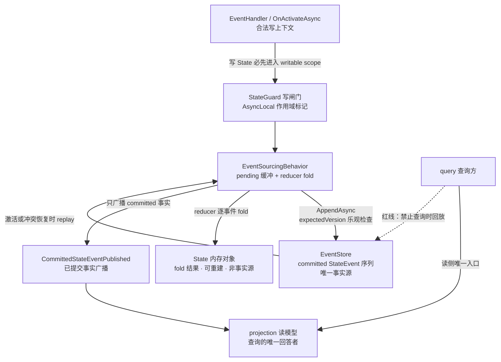
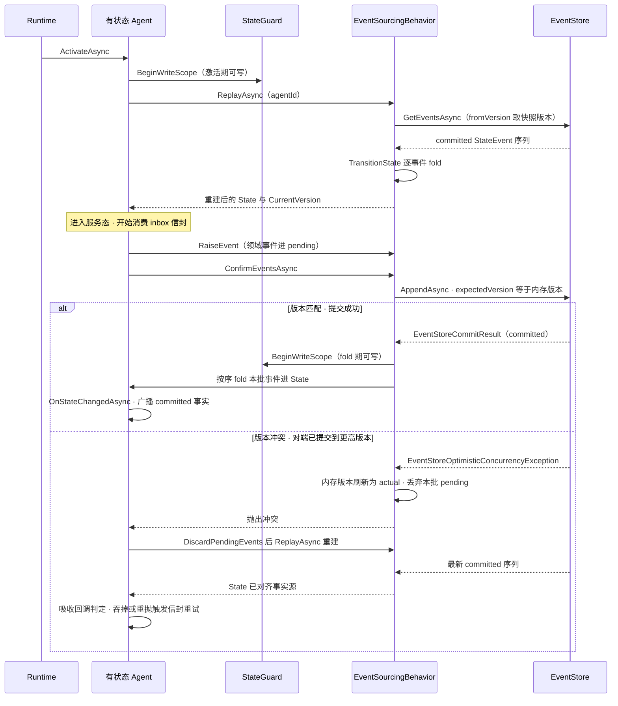
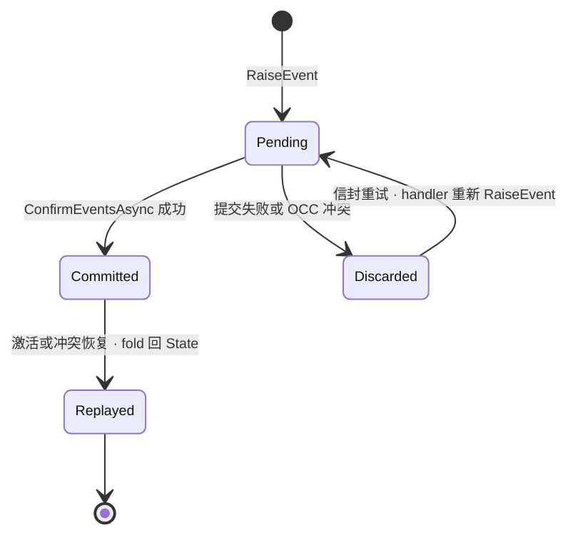

# 状态与事件溯源：StateEvent、reducer 与 StateGuard

> 版本与结论：本章描述 `current`；当前行为以 `f02aa690` 为准。核心结论两条：其一，有状态 Agent 的事实源是 EventStore 中 committed 的 StateEvent 序列，内存 State 只是这些事件经 reducer fold 出的可重建结果；其二，StateGuard 用 AsyncLocal 写闸门把"谁能写 State、何时写"收窄到框架掌握的三类作用域（事件处理、激活/replay、提交后 fold），其余上下文写 State 直接抛异常。

## 设计抽象与事实源

- `src/Aevatar.Foundation.Abstractions/Persistence/IEventStore.cs:17`：`AppendAsync` 以 `expectedVersion` 做乐观并发判定并返回 committed 记录——本章"committed StateEvent 是唯一事实增量"的协议锚点。
- `src/Aevatar.Foundation.Core/StateGuard.cs:14`：`AsyncLocal<bool>` 可写作用域标记——本章"State 写边界由运行时闸门强制"的机制锚点。
- `src/Aevatar.Foundation.Core/GAgentBase.TState.cs:29`：stateful Agent 的 `State` setter 受 `StateGuard` 保护，激活时先 replay 再进入业务生命周期——本章写边界与恢复顺序的主链锚点。

## 先建立模型

有状态 Agent 的世界里只有三种东西：事实、事实的折叠结果、以及守护折叠纪律的闸门。

- **事实**：StateEvent。它是 actor 状态的事实增量，一经 EventStore 提交即为 committed，不可变、带单调版本号，是唯一事实源。agent_messages.proto 中 StateEvent 契约只有六个字段：event_id、timestamp、version、event_type、event_data（Any 负载）、agent_id——它刻意不含"完整状态"，因为状态从来不是被保存的，而是被重放的。
- **折叠结果**：内存中的 State 对象。它是 reducer（`TransitionState` 纯函数）把 committed 事件逐条 fold 出来的当前视图。它可以丢、可以旧、可以重建；它的正确性永远以"从事实源重放到同一版本"为判据。
- **写边界**：StateGuard。它回答"谁能写、何时写"：只有框架打开的 writable scope（EventHandler 处理、OnActivateAsync、激活 replay、提交后 fold）内可以写 State；任何其它异步上下文（定时器回调、stream 订阅回调、外部 hook）写 State 会抛 `InvalidOperationException`。术语表中的"回调与状态"纪律正是由这道闸门从约定升级为强制的。

这张图同时画出三条评审红线，它们不是风格建议而是模型推论：

1. **EventStore 不是查询时的读模型**。`GetEventsAsync` 的合法消费方只有 replay（激活、OCC 冲突恢复）；查询语义由 projection 物化的读模型回答。把 event store 当查询时读模型用，等于让每个读者各自 fold 一遍事实，读侧便失去了独立演进与独立扩缩容的权利。
2. **accepted 永远不等于 committed**。信封被 inbox 准入（accepted）只表示"这封 EventEnvelope 会被处理"，不表示任何状态事实已落定；事实落定的唯一判据是 `AppendAsync` 成功返回 `EventStoreCommitResult`。
3. **状态不得绕过事件直接改写**。正确顺序永远是先构造领域事件、提交、成功后再 fold 回内存 State。框架甚至在提交前检查 pending 里不允许出现 TState 类型的"快照伪事件"，从协议上堵住"把整份状态当事件存"的捷径。

## 沿一条链路走读

一个有状态 actor 的一生：激活 → replay 重建 → 服务（处理信封并提交新事件）→ 可能撞上版本冲突 → 停用前冲刷。

时序里有三个顺序不能颠倒：

- **先 committed，后 fold**。内存 State 的变更发生在 `AppendAsync` 成功之后（`GAgentBase<TState>.PersistDomainEventsAsync` 中先 `ConfirmEventsAsync` 再 `TransitionState`）。因此不存在"事件没提交但 State 已改"的脏中间态；反过来，fold 或后续广播失败也不会动摇已经落定的事实。
- **冲突恢复先丢 pending，再 replay**。OCC 冲突说明对端（同一 agentId 的另一个写入者，例如迁移期的旧 activation）已用同一 expectedVersion 抢先提交。此时本批 pending 事件是基于过期状态算出的，必须丢弃，否则下一次提交会把它们静默混进新事实。丢弃后从事实源 replay，State 重新对齐，再由吸收回调决定：对端的提交是否已满足本命令的意图（是则吞掉冲突当作成功 no-op；否则重抛，由 runtime 的信封重试路径用新状态重新执行 handler）。
- **committed 事实广播只在 fold 之后**。`CommittedStateEventPublished` 携带本批 StateEvent 与 fold 后的 state_root 快照，projection 消费者收到的一定是"已提交事实 + 与之一致的当前视图"，不会收到半路失败的业务决定。

## 为什么是它，不是别的

**为什么事实源是 EventStore，而不是"直接改 State、定期存快照"？** 快照存档方案里，状态变化没有事实记录：崩溃恢复只能回到最后一份快照，两次快照之间的业务决定全部丢失；读侧拿不到增量，只能全量轮询；审计无从谈起。事件溯源把每一笔状态变化都变成带版本的不可变事实，恢复是与在线运行同一套 reducer 的重放——这保证"重建出的状态"与"在线跑出的状态"由同一段代码产生，不存在两套状态语义的漂移。代价是写路径多一次事件构造与提交，以及必须回答版本冲突；框架用乐观并发与冲突吸收协议把后者制度化。

**为什么是乐观版本检查（OCC），而不是悲观锁？** actor 模型本身已承诺同一 actor 的消息串行处理，正常服务期内根本不存在并发写——版本冲突只出现在异常窗口：activation 迁移期新旧实例并存、陈旧 pending 被重放提交。为这种低概率窗口持分布式锁，会把每次提交都加上锁获取的延迟与锁服务的可用性依赖。OCC 把冲突检测压到存储端一次原子 check-and-append（InMemory 实现是 lock 内的版本比对，Garnet 实现是 Lua 脚本内完成判定与写入），无冲突时零额外开销，有冲突时按协议丢弃、重建、重试。

**为什么 StateGuard 用 AsyncLocal 运行时闸门，而不是编译期约束？** "这段调用栈是否处于 handler/激活/fold 内"是一个随 async/await 跨越线程边界的动态属性，C# 类型系统表达不了。AsyncLocal 随 ExecutionContext 流动，恰好能在运行时拦住"从未进入合法写上下文的回调"对 State 的偷写，同时让框架自己的三条写路径（激活 replay、信封处理、提交后 fold）统一过同一道闸门。代价是违规只能在运行时发现——但对框架代码与业务 handler 来说，第一次踩线就会在开发/测试环境炸出异常，这已足够。

## 协议与状态深入

**提交协议**。`RaiseEvent` 只把领域事件放进 pending 缓冲，不落盘；`ConfirmEventsAsync` 把整批 pending 编上连续版本号（内存 CurrentVersion + i + 1），以内存版本为 `expectedVersion` 调 `AppendAsync`。存储端判定与写入不可分割：版本不匹配则整批拒绝并抛出携带 expected/actual 的 `EventStoreOptimisticConcurrencyException`，匹配则整批原子提交并返回 `EventStoreCommitResult`（含 latest_version 与 committed_events）。批内事件共享一次提交，要么全部 committed，要么全部不存在——没有部分提交。

**pending 事件的生命周期**可以用一张小状态机收束：

关键不变量：**同一逻辑事件只可能以两种身份存在——pending（未提交，随时可被丢弃）或 committed（已提交，永不消失）**。OCC 冲突时框架丢弃的是 pending 身份；信封重试会让 handler 基于 replay 后的新状态重新决定要不要再次 RaiseEvent。因此"重试导致事件重复提交"在协议上不成立：被丢弃的 pending 不是事实，重试产生的是新决策。

**快照与 compaction 是纯优化**。`PersistSnapshotAsync` 保存 fold 结果以缩短 replay 里程，其失败只记日志、绝不影响已提交事实；快照策略默认 Never。compaction 通过 `DeleteEventsUpToAsync` 删除 ≤ 某版本的历史事件以控制流长度。两者都不改变事实语义——快照可以被清空重来，事件流才是本。

**版本漂移防线**。replay 末尾会用 `GetVersionAsync` 探测存储端权威版本：若权威版本高于实际 fold 到的版本（事件序列尾部缺失，可能来自中断的写入或外部播种的存储），默认直接抛 `EventStoreVersionDriftException` 拒绝激活——宁可不可用，也不在缺失事实之上构建新的权威状态。只有宿主显式 opt-in `RecoverFromVersionDriftOnReplay` 才以权威版本激活并承担状态陈旧的代价。

**停用期兜底**。`DeactivateAsync` 冲刷 pending 时若撞上 OCC，会丢弃陈旧 pending、跳过快照、仍执行基础清理——停用不被一个已经过期的提交意图卡住。

## 最小示例

> Demo status：`verified-static`（静态推演：以下序列按 frozen 基线中 `AppendAsync` 的版本检查语义与 OCC 恢复协议逐步推导，未实际运行；真实运行需要 host 与 EventStore 实例。）

场景：`counter-1` 这个 agentId 的 EventStore 权威版本为 5。两个写入者 W1、W2（例如 Orleans 迁移期并存的新旧 activation，各自持有同一 agentId 的 EventSourcingBehavior）都已 replay 到内存版本 5，各自收到一封"加一"命令信封。

| 步骤 | 动作 | 存储端判定 | 结果 |
|---|---|---|---|
| 1 | W1 `RaiseEvent(Incremented)` → `ConfirmEventsAsync` → `AppendAsync(expected=5)` | current(5) == expected(5) | 提交成功，事件版本 6 committed，W1 内存版本刷新为 6，fold 后 State.count = 6 |
| 2 | W2 并发 `AppendAsync(expected=5)`（同一逻辑时刻） | current(6) != expected(5) | 整批拒绝，抛 `EventStoreOptimisticConcurrencyException(expected=5, actual=6)`，存储端无任何写入 |
| 3 | W2 冲突处理：内存版本刷新为 max(5, 6) = 6，丢弃本批 pending | — | W2 的"加一"意图不再以 pending 身份存在 |
| 4 | W2 吸收路径：`ReplayAsync` 从事实源重建 → State.count = 6（含 W1 的事实） | — | W2 内存状态与事实源对齐 |
| 5a | 吸收回调判定"对端的加一已满足本命令意图"→ 返回 true | — | 冲突被吞掉，视为成功 no-op，终态版本 6 |
| 5b | 或回调返回 false → 重抛 → runtime 信封重试，handler 基于 count=6 重新执行 → `AppendAsync(expected=6)` | current(6) == expected(6) | 新事件以版本 7 committed，终态版本 7、count = 7 |

推演结论：无论走 5a 还是 5b，**事件序列无空洞、无重复、无乱序**——版本号 6 只被提交一次；W1 与 W2 的最终内存状态都可由事实源 replay 验证。若 W2 在步骤 2 之后直接停用，`DeactivateAsync` 的 OCC 兜底同样丢弃 pending、不影响已 committed 的版本 6。

## 边界与演进

**当前实现（f02aa690）**。本章描述的全部机制——StateEvent 契约、event-first 提交、reducer fold、StateGuard 三作用域、OCC 与冲突吸收、版本漂移防线、快照/compaction 优化——均在 frozen 基线落地，InMemory 与 Garnet 两种 EventStore 实现都提供原子 check-and-append。

**StateGuard 的诚实边界**。AsyncLocal 随 ExecutionContext 流动意味着：在合法写上下文内 fire-and-forget 派生的后台任务会继承"可写"标记，闸门拦不住这种从合法上下文逃逸的写。纪律层面"回调不得绕过 StateGuard 改写状态"仍然有效，但这类违规要靠 review 与测试兜住，而非闸门本身。

**committed 事实广播是 live-forward-only**。projection 通道不做 attach 时回放；若读模型被清空而 actor 权威状态仍在，需用 `RepublishCommittedStateAsync` 以当前 committed 版本重发一次 state_root 让 current-state materializer 重建该行（契约要求消费者对版本幂等）。它不向 EventStore 追加任何事件——重建读模型不产生新事实。

**无跨 agent 事务**。OCC 与原子批提交的作用域都是单个 agentId 的事件流；跨 actor 的一致性由编排层（workflow / saga）以补偿而非事务实现，超出本章范围。

## 读完应能回答

1. 为什么内存 State 不是事实源？"恢复正确性"的判据是什么？
2. 一笔状态变化从 handler 决定到成为 committed 事实，必须经过哪些步骤、以什么顺序？
3. StateGuard 允许写 State 的三类作用域分别是什么？它拦得住什么、拦不住什么？
4. OCC 版本冲突后，为什么必须先丢弃 pending 再 replay，而不是直接刷新版本号重试？
5. 为什么查询不许走 EventStore 回放？accepted 与 committed 的界线划在哪一步？

论断—证据映射

| 论断 | 等级 | 证据 |
|---|---|---|
| StateEvent 契约（event_id/timestamp/version/event_type/event_data/agent_id） | E1 | `src/Aevatar.Foundation.Abstractions/agent_messages.proto:142` |
| AppendAsync 以 expectedVersion 做乐观并发并返回 committed 记录 | E1 | `src/Aevatar.Foundation.Abstractions/Persistence/IEventStore.cs:17` |
| State 的 protected setter 经 StateGuard.EnsureWritable 强制写闸门 | E1 | `src/Aevatar.Foundation.Core/GAgentBase.TState.cs:33` |
| StateGuard 用 AsyncLocal 标记可写作用域，越界写抛 InvalidOperationException | E1 | `src/Aevatar.Foundation.Core/StateGuard.cs:14` |
| 信封处理入口 HandleEventAsync 打开 writable scope | E1 | `src/Aevatar.Foundation.Core/GAgentBase.cs:123` |
| 激活时打开写闸门、先 ReplayAsync 再置 State | E1 | `src/Aevatar.Foundation.Core/GAgentBase.TState.cs:49` |
| 提交成功（ConfirmEventsAsync 返回）之后才 fold 事件进内存 State | E1 | `src/Aevatar.Foundation.Core/GAgentBase.TState.cs:222` |
| 提交时 expectedVersion 取内存 CurrentVersion，事件编连续版本号 | E1 | `src/Aevatar.Foundation.Core/EventSourcing/EventSourcingBehavior.cs:94` |
| OCC 时内存版本刷新为 max(内存, actual) 并丢弃本批 pending | E1 | `src/Aevatar.Foundation.Core/EventSourcing/EventSourcingBehavior.cs:165` |
| 冲突吸收路径：DiscardPendingEvents → ReplayAsync → 回调决定吞掉或重抛 | E1 | `src/Aevatar.Foundation.Core/GAgentBase.TState.cs:187` |
| TransitionState 是纯函数契约（apply event → new state） | E1 | `src/Aevatar.Foundation.Core/EventSourcing/IEventSourcingBehavior.cs:41` |
| 快照失败不得影响已提交事实（接口契约） | E1 | `src/Aevatar.Foundation.Core/EventSourcing/IEventSourcingBehavior.cs:28` |
| 提交前拒绝 TState 类型的快照伪事件 | E1 | `src/Aevatar.Foundation.Core/EventSourcing/EventSourcingBehavior.cs:296` |
| replay 末尾探测权威版本，漂移默认抛 EventStoreVersionDriftException | E1 | `src/Aevatar.Foundation.Core/EventSourcing/EventSourcingBehavior.cs:272` |
| InMemoryEventStore 在锁内做 current != expectedVersion 原子判定 | E1 | `src/Aevatar.Foundation.Runtime/Persistence/InMemoryEventStore.cs:38` |
| GarnetEventStore 用 Lua AppendScript 完成原子 check-and-append | E1 | `src/Aevatar.Foundation.Runtime.Persistence.Implementations.Garnet/GarnetEventStore.cs:16` |
| 停用期 OCC 兜底：丢弃 pending、跳过快照、仍走基础清理 | E1 | `src/Aevatar.Foundation.Core/GAgentBase.TState.cs:69` |
| committed 广播携带 state_root；RepublishCommittedStateAsync 用于读模型重建且不追加事件 | E1 | `src/Aevatar.Foundation.Core/GAgentBase.TState.cs:318` |

