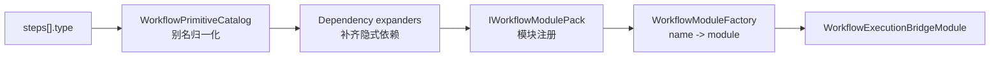
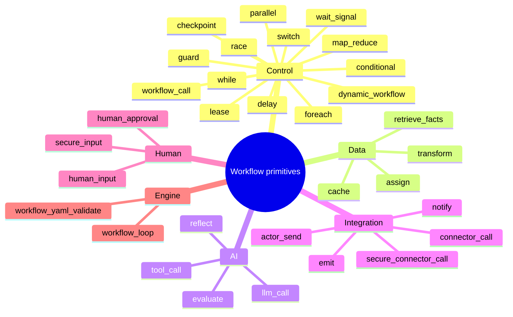
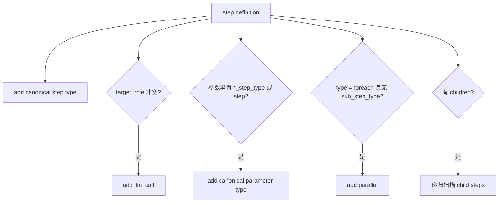
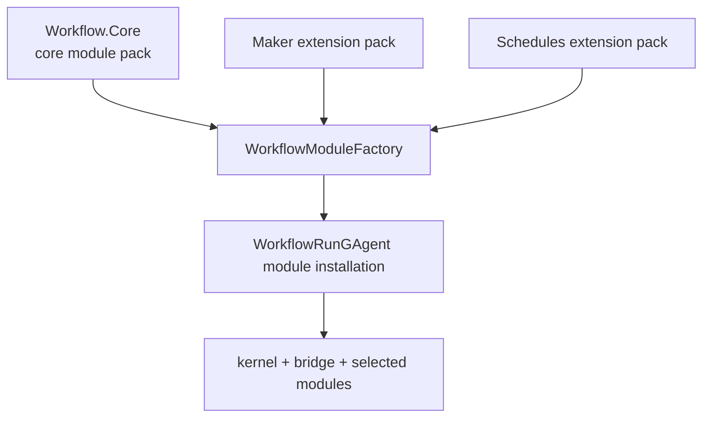

# 步骤模块全图：按能力读 30+ primitive

## 事实源/设计抽象(以 ~/Code/aevatar 为准)

- `WorkflowCoreModulePack`: Core 模块注册表与 dependency expander 注册。
- `WorkflowPrimitiveCatalog`: step type 别名归一化、内建 primitive 集合与副作用 primitive 判断。
- `WorkflowStepTypeModuleDependencyExpander`: 编译期从 steps 和参数中展开隐式模块依赖。

---

## 一句话模型

`steps[].type` 不是 handler 名称索引，而是能力声明。编译后的 workflow 会被 module pack 和 dependency expander 转成一组需要安装的模块；运行时 bridge 再把 `StepRequestEvent` 交给对应模块。





## 按能力选模块

不要先问“这个类型在哪个文件里”，先问“我需要哪类能力”。

| 能力 | 适合的 primitive | 典型问题 |
|---|---|---|
| 路由和循环 | `conditional`、`switch`、`while`、`foreach` | 下一步去哪、是否重复、是否 fan-out |
| 并发和归并 | `parallel`、`race`、`map_reduce`、`vote` | 等全部、取首个、map 后 reduce、投票收敛 |
| 状态和数据 | `assign`、`transform`、`cache`、`retrieve_facts` | 写变量、变换文本/JSON、缓存、取事实 |
| AI 行为 | `llm_call`、`tool_call`、`evaluate`、`reflect` | 让角色回答、调工具、评分、自我改进 |
| 外部集成 | `connector_call`、`secure_connector_call`、`emit`、`notify`、`actor_send` | 调 host/HTTP/CLI/MCP、发事件、通知或发 actor 消息 |
| 人工介入 | `human_input`、`human_approval`、`secure_input` | 等人输入、审批、采集安全信息 |
| 引擎内部 | `workflow_loop`、`workflow_yaml_validate` | 主循环和 YAML 校验 |

## 别名是输入兼容层

别名让 YAML 更贴近日常表达，例如 `loop` 归一化成 `while`，`sub_workflow` 归一化成 `workflow_call`，`http_get` / `http_post` 这类写法归一化成 `connector_call`。归一化之后，执行层只看 canonical type。

```yaml
steps:
  - id: get_repo
    type: http_get
    connector: github_router
    operation: list_repo
```

这类写法的运行语义仍然落到 connector 模块，连接定义和权限见 `02/07-connectors.md`。

## ⚠️ 隐式依赖展开

`WorkflowStepTypeModuleDependencyExpander` 会从 step type 和参数里推导出需要安装的模块。这个推导是编译期便利，不是 YAML 里显式可见的节点：

- step 自己的 `type` 会加入模块集合。
- 有 `target_role` 的 step 会额外加入 `llm_call`。
- 参数键如果表示 step type，例如 `sub_step_type`、`vote_step_type` 或 `step`，对应值会按 canonical type 加入。
- `foreach` 没写 `sub_step_type` 时，会额外加入 `parallel`。
- 子 step 会递归扫描。



⚠️ 这意味着“模块被安装”不等于“YAML 里有一个同名 step”。读执行计划时要区分显式步骤图和隐式能力依赖。

## Core、扩展和插件的边界

Core pack 提供通用 workflow 能力。Maker、Schedules 这类扩展通过自己的 `IWorkflowModulePack` 加入，不要求 Core 反向引用插件实现。



这个方向和 `02/06-maker-plugin.md` 的插件边界一致：稳定核心负责模块机制，变化更快的能力放在扩展包里。

## 最小选型例子

```yaml
steps:
  - id: classify
    type: switch
    on: "{{input.kind}}"
    branches:
      invoice: extract_invoice
      resume: screen_resume

  - id: extract_invoice
    type: llm_call
    role: invoice_extractor

  - id: submit
    type: connector_call
    role: approval_builder
    connector: lark_approval
    operation: create
```

这段 YAML 需要的是路由、LLM 和 connector 三类能力；读者不需要先记住具体模块文件名。

## 验收

1. `steps[].type` 表达什么？表达能力选择，最终映射到 workflow 模块。
2. ⚠️ 有 `target_role` 的 step 会隐式加入什么？`llm_call` 模块依赖。
3. 为什么插件模块不应被 Core 反向引用？Core 只提供注册机制，插件通过 module pack 向 Core 贡献能力。

⟦AI:AUTO-LOOP⟧
