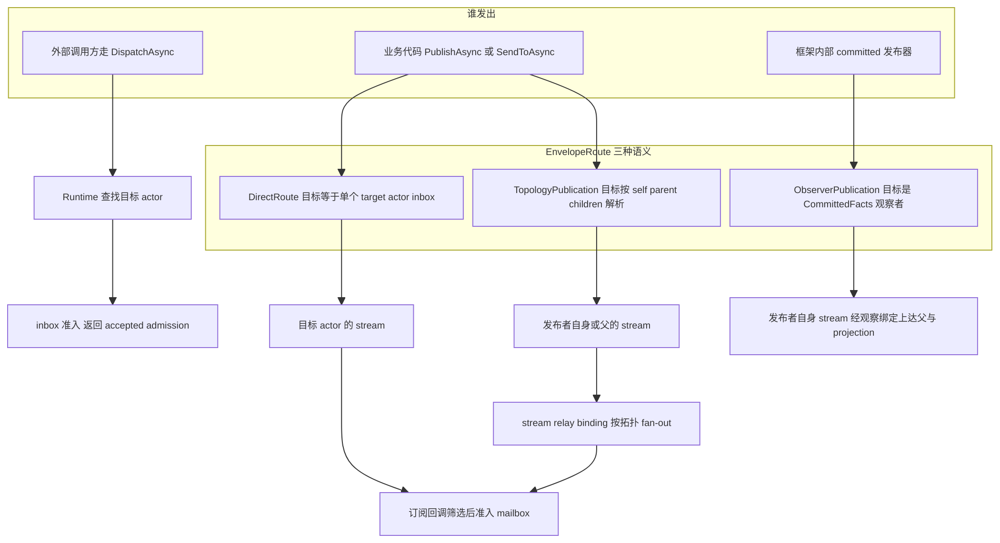
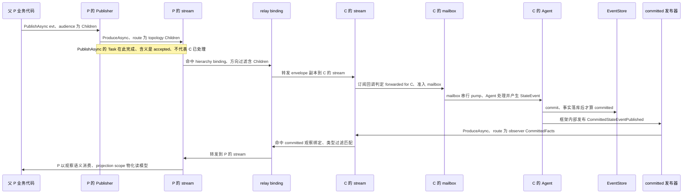

# Dispatch、路由与拓扑:消息怎么找到 Actor

> 版本与结论:本章描述 `current`;当前行为以 `f02aa690` 为准。核心结论三条:
> ① Runtime 负责 actor 的创建/查找/拓扑关系,Dispatch 只负责把 EventEnvelope 送过 inbox 边界并回执
> `accepted`,两者是分开的端口;② 路由只有三种语义 —— direct、topology、observer,publish 的真实含义
> 是"写入 stream、经订阅回调准入 inbox"的异步投递,既不是 fire-and-forget 广播,更不是 RPC;
> ③ actor 给自己的消息同样绕完整一圈(stream → 订阅 → mailbox),不存在内联自我调用快捷路径。

## 设计抽象与事实源

- `src/Aevatar.Foundation.Abstractions/IActorDispatchPort.cs:51`:Dispatch 端口契约 —— 完成只意味着
  "accepted-for-dispatch",显式声明不等于 handled、committed 或被读侧观察到;这是"投递≠处理"的脊柱。
- `src/Aevatar.Foundation.Abstractions/EnvelopeRouteSemantics.cs:5`:三种路由语义(direct / topology /
  observer)的唯一构造与判定入口,决定每条 envelope 的目标集合如何解析。
- `src/Aevatar.Foundation.Abstractions/EventEnvelopePublishOptions.cs:6`:publish 只允许 propagation 与
  去重两类窄覆盖,不开放任何执行语义开关 —— 从契约上佐证 publish 是投递,不是调用。

## 先建立模型

先把四个角色的职责钉死,再谈路由:

| 角色 | 职责 | 不负责 |
|---|---|---|
| Runtime(`IActorRuntime`) | actor 创建、查找、销毁,父子 Link/Unlink | 投递消息 |
| Dispatch(`IActorDispatchPort`) | 把 envelope 送过指定 actor 的 inbox 边界,回执 admission | 创建 actor、解析拓扑、等待处理完成 |
| Publisher(`IEventPublisher`) | 业务侧发布入口:按路由语义构造 envelope 并写入 stream | 直接触碰对端 mailbox |
| Stream | 传输与 relay fan-out(按 binding 的方向/类型过滤转发) | RPC 应答、存储 |

`IActorRuntime` 的契约面只有生命周期与拓扑(create / destroy / get / exists / link / unlink,见
`src/Aevatar.Foundation.Abstractions/IActorRuntime.cs:11`);`IActorDispatchPort` 只有一个方法
`DispatchAsync(actorId, envelope)`。Local 实现里 Dispatch 端口内部组合 Runtime 做查找
(`src/Aevatar.Foundation.Runtime.Implementations.Local/Actors/LocalActorDispatchPort.cs:20`),找到目标后调用
`AcceptDispatchedEnvelope` 写入 mailbox 即返回 admission —— 查找是 Runtime 的职责,准入才是 Dispatch
的职责,这条分界线在两个实现(Local / Orleans)里一致。

三种路由语义是 envelope 上 `EnvelopeRoute` 的 oneof
(`src/Aevatar.Foundation.Abstractions/agent_messages.proto:53`),目标集合的解析方式各不相同:

三条语义的目标解析规则(以 Local 实现为例,Orleans 同协议):

- **direct**:`SendToAsync` 把 envelope 写入**目标 actor 的 stream**
  (`src/Aevatar.Foundation.Runtime.Implementations.Local/Actors/LocalActorPublisher.cs:114`);目标在自己的
  订阅回调里核对 `target_actor_id == 自己` 才准入 inbox
  (`src/Aevatar.Foundation.Runtime.Implementations.Local/Actors/LocalActor.cs:71`)。
- **topology**:`PublishAsync` 按 audience 写入不同 stream —— Self / Children 写自己的 stream,Parent 写父
  的 stream,ParentAndChildren 两边都写
  (`src/Aevatar.Foundation.Runtime.Implementations.Local/Actors/LocalActorPublisher.cs:64`);向下扇出靠
  Link 时注册的 relay binding 完成(见下文时序图)。
- **observer**:只由框架内部的 committed 发布器发出(`ICommittedStateEventPublisher` 是 internal,
  `src/Aevatar.Foundation.Core/EventSourcing/ICommittedStateEventPublisher.cs:8`),audience 固定为
  `CommittedFacts`;业务代码拿不到这个端口,无法伪造一条观察通知。

## 沿一条链路走读

场景:父 P 已向子 C 执行过 `LinkAsync(P, C)`。Link 一次性落两处事实 —— P 记录 C 为 child、C 记录 P 为
parent(权威拓扑,Local 存 actor 字段、Orleans 存 grain state
`src/Aevatar.Foundation.Runtime.Implementations.Orleans/Grains/RuntimeActorGrainState.cs:16`),同时在
stream 层注册两条 relay binding:父→子的 hierarchy 转发、子→父的 committed 观察转发
(`src/Aevatar.Foundation.Runtime.Implementations.Local/Actors/LocalActorRuntime.cs:231`)。之后发生两件事:
P 向 children 广播一条业务消息;C 处理命令后 commit 了一条 StateEvent,框架发出 observer 通知。

这条链路把三条红线讲清楚了:

1. **Stream 不是 RPC 通道**。`PublishAsync` 返回的 Task 在 envelope 写入 stream 时完成;对端
   mailbox 的准入、Agent 的处理、StateEvent 的 commit 全部发生在那之后。想要"处理结果",协议答案不是
   同步等待,而是对端处理后另行发布一条消息回来。
2. **publish 不是同步调用**。Dispatch 端口的回执类型 `DispatchAdmission` 只有
   `Accepted / CommandId / AckedAt / ActorId / CorrelationId`,注释明确"does not mean handled, committed,
   or observed"(`src/Aevatar.Foundation.Abstractions/IActorDispatchPort.cs:51`)。`accepted` 永远不等于
   `committed`(术语表口径)。
3. **拓扑父子不是状态共享**。Link 建立的只是"消息往哪转发"的路由事实和 relay binding;父与子各自持有
   独立状态、独立 mailbox、独立 EventStore 流。父能看到子的 committed 事实,是因为框架代子发布了
   observer 通知,不是因为父能读子的状态。

## 为什么是它,不是别的

**为什么 accepted-only,而不是等到 handled 才返回?** 如果 Dispatch 等待 actor-turn 完成,发布者就被
最慢的消费者拖住,且"没送到"和"处理失败"两种故障无法区分 —— 前者该重试投递,后者该走业务补偿。把
回执收缩到 inbox 准入,投递可靠性(是否进 mailbox)与处理可靠性(是否 commit)各自有独立的失败语义。
框架注释记录了这次收缩:旧的 handled-dispatch 侧契约暗示 actor-turn 完成,已退役为 accepted-only
(`src/Aevatar.Foundation.Abstractions/IActorDispatchPort.cs:50`)。

**为什么自我消息也走 inbox,不做内联快捷路径?** `PublishAsync(evt, Self)` 与持久定时器的自我回调,
都是先构造一条 `TopologyAudience.Self` 路由的 envelope
(`src/Aevatar.Foundation.Core/Pipeline/SelfEventEnvelopeFactory.cs:22`),再写自己的 stream、经订阅回调
准入自己的 mailbox。如果允许 handler 栈内联调用自身,就会绕过 mailbox 的单线程串行化 —— 同一 actor
的状态变更不再按 turn 排队,去重、失败传播、链路追踪也全部失效。"自我继续走 inbox"是保持
actor turn 边界不变量的代价,不是浪费。

**为什么拓扑事实放在 runtime actor 身上,而不是外置一个 EventRouter?** 若拓扑由独立服务维护,
就会出现两份事实:router 认为 P-C 已链接,而 runtime 里 C 的 parent 还是空,Link 崩溃一半即永久不一致。
现在权威拓扑(谁是谁的父子)与 actor 生命周期同生共死,relay binding 只是它的执行投影;代价是
Link/Unlink 必须同时更新两处,这由 runtime 在一个方法内收口。

## 协议与状态深入

- **admission 契约**:`DispatchAdmission` 的 `CommandId` 取 envelope id(空则生成新 guid),
  `CorrelationId` 取 propagation 上的值、缺省回退为 CommandId
  (`src/Aevatar.Foundation.Abstractions/IActorDispatchPort.cs:24`)。目标不存在时 Local 抛
  `InvalidOperationException`,Orleans 在 grain 未初始化时拒绝
  (`src/Aevatar.Foundation.Runtime.Implementations.Orleans/Actors/OrleansActorDispatchPort.cs:26`)——
  即"查无此 actor"是投递前失败,不产生 accepted 回执。
- **publish 的窄覆盖**:`EventEnvelopePublishOptions` 只开放两类覆盖 —— propagation
  (correlation / causation / trace / baggage)与 delivery 的去重 operation id。没有"同步等待""优先级"
  "TTL"之类执行语义开关,这是刻意收窄:执行语义属于 runtime,不属于业务发布者。
- **去重与防环**:mailbox 准入前按 dedup key 去重;stream relay 用 forwarding visit chain 防止拓扑环里
  的无限转发,`TransitOnly` 模式的中转节点只转发不处理
  (`src/Aevatar.Foundation.Abstractions/Streaming/StreamForwardingRules.cs:10`)。
- **observer 通知的处置**:被转发的 observer envelope 可以进入父 actor 的 mailbox,但它是
  `CommittedStateEventPublished` 类型的观察帧,由 projection scope 等观察通道消费
  (projection 侧入口只认 observer publication,
  `src/Aevatar.CQRS.Projection.Core/Orchestration/ProjectionScopeGAgentBase.cs:120`),业务 handler 不会因
  匹配不到该 payload 类型而被触发。观察与业务在同一传输平面上靠路由语义隔离,而不是靠另一条物理通道。
- **orphan fallback 语义**:对无父节点 actor 发 `Parent`  audience 时,envelope 落回自己的 stream,但
  订阅回调识别"publisher 是自己"而跳过处理 —— 即静默丢弃,不会自我消费
  (`src/Aevatar.Foundation.Runtime.Implementations.Local/Actors/LocalActor.cs:88`)。

## 最小示例

> Demo status:`verified-static`(纯静态推演:依据 Local 实现的 audience 分支、relay binding 过滤规则与
> 订阅回调准入条件推导目标集合;未实际启动 runtime,因为本推演不依赖外部服务,结论可由源码逐行核对)

前置:P 为父,`LinkAsync(P, C1)`、`LinkAsync(P, C2)` 已完成;C1、C2 均无子节点。同一 payload `M`:

| 发布动作 | envelope 写入的 stream | 最终准入 inbox 的目标集合 |
|---|---|---|
| `SendToAsync(C1, M)`(direct) | C1 的 stream | `{C1}` |
| C1 执行 `PublishAsync(M, Self)` | C1 的 stream | `{C1}`(自我继续,仍过 mailbox) |
| P 执行 `PublishAsync(M, Children)` | P 的 stream → hierarchy binding ×2 | `{C1, C2}` |
| C1 执行 `PublishAsync(M, Parent)` | P 的 stream | `{P}` |
| C1 执行 `PublishAsync(M, ParentAndChildren)` | C1 与 P 的 stream | `{P}`(C1 无子,向下为空) |
| 无父 actor 执行 `PublishAsync(M, Parent)` | 自己的 stream(orphan fallback) | `{}`(静默丢弃) |
| C1 commit 后框架 committed 发布(observer) | C1 的 stream → 观察绑定 | `{P 的观察通道、CommittedFacts projection 订阅者}` |

每一行都可以用三个事实源复核:audience → 写哪个 stream 看 publisher 的 switch;stream → 谁收到看
relay binding 的方向/类型过滤;收到 → 谁准入 mailbox 看订阅回调的路由判定。

## 边界与演进

- **当前实现**:三种路由语义、accepted-only Dispatch、拓扑与 relay binding 由 Link/Unlink 同步维护,
  Local 与 Orleans 两实现协议一致;差异仅在投递落点(Local 直写 mailbox,Orleans 经 grain stream)。
- **历史 / 已移除**:旧的 handled-dispatch 侧契约(暗示 actor-turn 完成)已退役,源码注释标记为
  iter149/issue1132 的 refactor(`src/Aevatar.Foundation.Abstractions/IActorDispatchPort.cs:50`);workflow
  模块曾靠 presentation frame 推断完成态,已改为 runtime 托管的 committed 观察转发。
- **open gap / 注意点**:`Parent` audience 的 orphan fallback 是静默丢弃语义,调用方得不到"没有父
  节点"的信号;observer 能力面当前锁死在框架 internal 端口,若未来开放业务订阅 committed facts,需要
  新的受控 port 设计,本章不外推。

## 读完应能回答

1. Runtime 与 Dispatch 的职责分界在哪里,为什么查找 actor 不属于 Dispatch 的契约?
2. direct / topology / observer 三种路由语义各自如何解析目标集合?
3. `PublishAsync` 返回的 Task 完成意味着什么、不意味着什么?为什么它不是 RPC?
4. actor 给自己发消息走哪条路径,为什么不存在内联自我调用快捷路径?
5. 父子拓扑关系为什么不等于状态共享?父节点如何得知子节点的 committed 事实?

论断—证据映射

| 论断 | 等级 | 证据 |
|---|---|---|
| Dispatch 完成只意味 accepted,不等于 handled / committed / observed | E1 | `src/Aevatar.Foundation.Abstractions/IActorDispatchPort.cs:51` |
| DispatchAdmission 仅含 Accepted / CommandId / AckedAt / ActorId / CorrelationId | E1 | `src/Aevatar.Foundation.Abstractions/IActorDispatchPort.cs:6` |
| 路由为 EnvelopeRoute oneof:direct 或 publication(topology / observer) | E1 | `src/Aevatar.Foundation.Abstractions/agent_messages.proto:53` |
| 三种路由语义的构造入口集中于 EnvelopeRouteSemantics | E1 | `src/Aevatar.Foundation.Abstractions/EnvelopeRouteSemantics.cs:5` |
| publish 只允许 propagation 与去重窄覆盖 | E1 | `src/Aevatar.Foundation.Abstractions/EventEnvelopePublishOptions.cs:6` |
| PublishAsync / SendToAsync 不暗示内联执行 | E1 | `src/Aevatar.Foundation.Abstractions/IEventPublisher.cs:12` |
| Runtime 契约面为生命周期与拓扑,不含投递 | E1 | `src/Aevatar.Foundation.Abstractions/IActorRuntime.cs:11` |
| Local Dispatch 组合 Runtime 查找后写入 mailbox 即返回 | E1 | `src/Aevatar.Foundation.Runtime.Implementations.Local/Actors/LocalActorDispatchPort.cs:20` |
| Orleans Dispatch 要求 grain 已初始化并经其 stream 投递 | E1 | `src/Aevatar.Foundation.Runtime.Implementations.Orleans/Actors/OrleansActorDispatchPort.cs:26` |
| topology audience 决定写入哪个 stream(Self/Children 写己、Parent 写父) | E1 | `src/Aevatar.Foundation.Runtime.Implementations.Local/Actors/LocalActorPublisher.cs:64` |
| SendToAsync 把 envelope 写入目标 actor 的 stream | E1 | `src/Aevatar.Foundation.Runtime.Implementations.Local/Actors/LocalActorPublisher.cs:114` |
| direct 目标在订阅回调中核对 target 是自己才准入 | E1 | `src/Aevatar.Foundation.Runtime.Implementations.Local/Actors/LocalActor.cs:71` |
| observer envelope 仅当 forwarded for target 且非 transit-only 才准入 | E1 | `src/Aevatar.Foundation.Runtime.Implementations.Local/Actors/LocalActor.cs:59` |
| 无父时 Parent audience 落回己 stream 且被跳过(静默丢弃) | E1 | `src/Aevatar.Foundation.Runtime.Implementations.Local/Actors/LocalActor.cs:88` |
| Link 同步落权威拓扑与两条 relay binding(含 committed 观察) | E1 | `src/Aevatar.Foundation.Runtime.Implementations.Local/Actors/LocalActorRuntime.cs:231` |
| hierarchy binding 方向过滤为 Children / ParentAndChildren | E1 | `src/Aevatar.Foundation.Abstractions/Streaming/StreamForwardingRules.cs:10` |
| committed 观察绑定按 CommittedStateEventPublished 类型过滤 | E1 | `src/Aevatar.Foundation.Abstractions/Streaming/StreamForwardingRules.cs:36` |
| Orleans 拓扑事实存 grain state(ParentId / Children) | E1 | `src/Aevatar.Foundation.Runtime.Implementations.Orleans/Grains/RuntimeActorGrainState.cs:16` |
| 自我消息构造为 Self 路由 envelope 并走完整 stream → inbox 路径 | E1 | `src/Aevatar.Foundation.Core/Pipeline/SelfEventEnvelopeFactory.cs:22` |
| committed 发布器为框架 internal,业务不可伪造观察通知 | E1 | `src/Aevatar.Foundation.Core/EventSourcing/ICommittedStateEventPublisher.cs:8` |
| committed 通知在 StateEvent commit 之后由框架发布 | E1 | `src/Aevatar.Foundation.Core/GAgentBase.TState.cs:358` |
| projection 消费入口只认 observer publication | E1 | `src/Aevatar.CQRS.Projection.Core/Orchestration/ProjectionScopeGAgentBase.cs:120` |
| 旧 handled-dispatch 契约已退役为 accepted-only(历史) | E1 | `src/Aevatar.Foundation.Abstractions/IActorDispatchPort.cs:50` |

