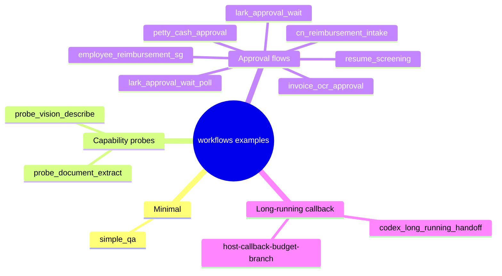
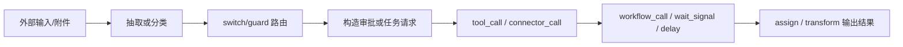
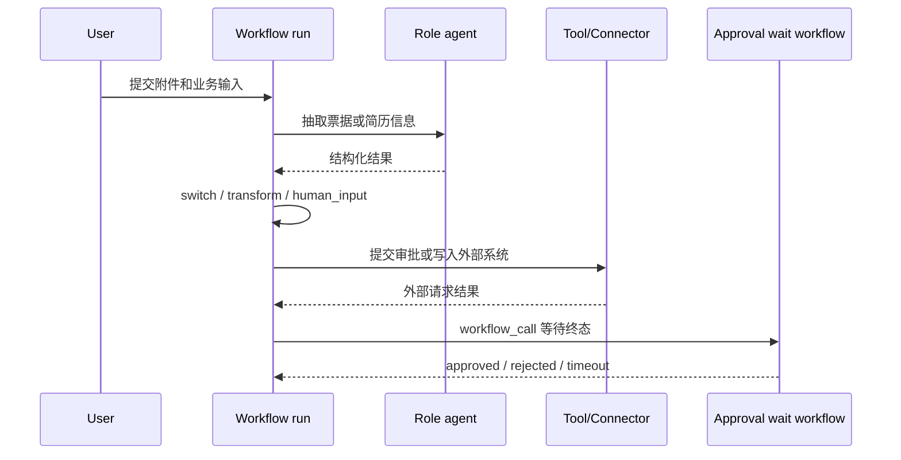
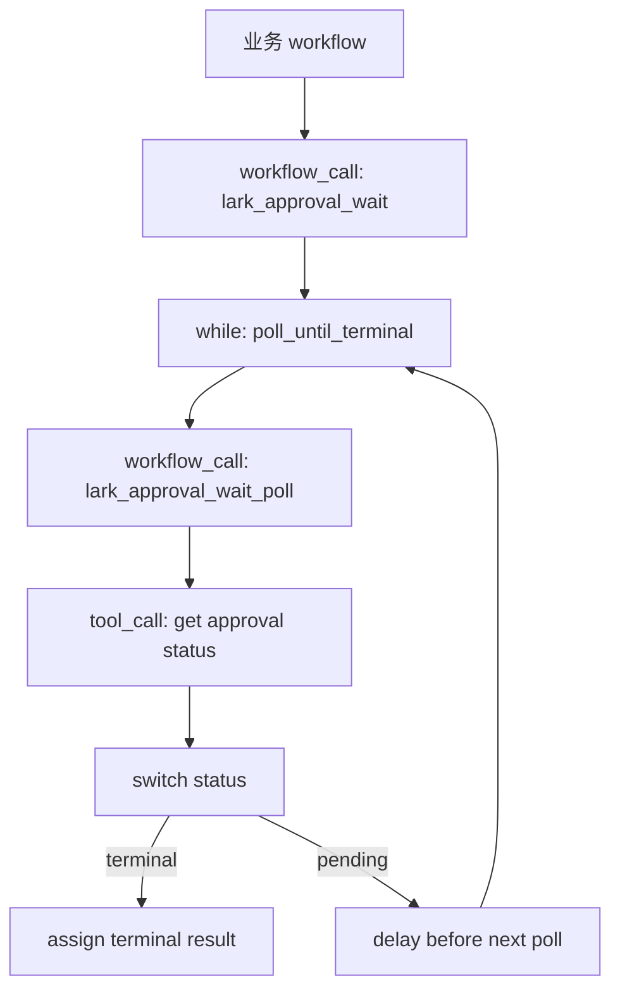
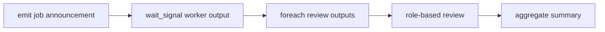

# workflows 示例：从 12 个 YAML 读出常见编排形状

## 事实源/设计抽象(以 ~/Code/aevatar 为准)

- `workflows/simple_qa.yaml`: 最小单角色、单步骤 workflow。
- `workflows/cn_reimbursement_intake.yaml`: 报销 intake 的多角色、多路由、人工输入和子 workflow 组合。
- `workflows/codex_long_running_handoff.yaml`: 长任务回调、等待信号和 fan-out 审阅形状。

---

## 一句话模型

`workflows/` 目录里的示例不只是 demo 清单，它们覆盖了三类编排问题：最小问答、业务审批、长任务协作。读这些 YAML 时，先看模式，再看字段。





## 先读 simple_qa：最小可运行形状

`simple_qa` 只有一个 role 和一个 `llm_call` step。它说明了 workflow 的最小闭环：

- role 提供模型角色。
- step 指向 role。
- 没有 `next` 时，单 step 完成即 workflow 完成。

```yaml
name: simple_qa
roles:
  - id: assistant
    name: Assistant
    system_prompt: "You are a helpful assistant."
steps:
  - id: answer
    type: llm_call
    role: assistant
```

如果一个新 workflow 连这个形状都解释不清，后面的路由、工具和补偿只会更难排查。

## 能力探针：确认输入通道能不能走通

`probe_vision_describe` 和 `probe_document_extract` 不是复杂业务流，它们用于验证能力面：

| 示例 | 主要问题 | 关键 primitive |
|---|---|---|
| `probe_vision_describe` | 图片附件能否进入视觉模型路径 | `llm_call`、`assign` |
| `probe_document_extract` | 文件能否被工具抽取并交给 LLM 总结 | `tool_call`、`llm_call`、`assign` |

这类 YAML 的价值在于缩小故障边界：先证明输入能力可用，再把它放进更长的业务 workflow。

## 审批流：抽取、路由、提交、等待

报销和审批类示例共享一个骨架：先抽取业务字段，再用 `switch` 或 `guard` 决定路径，然后调用外部系统，最后等待审批结果并生成报告。



`cn_reimbursement_intake` 是这类模式里信息量最高的例子：它把抽取、币种汇总、人工审核、审批构造、外部提交和子 workflow 等待连在一起。读它时不要逐行背字段，而是画出“抽取 -> 审核 -> 提交 -> 等待 -> 汇报”的阶段图。

## 审批等待模板：把轮询封进子 workflow

`lark_approval_wait` 和 `lark_approval_wait_poll` 展示了“长等待不要塞进一个同步步骤”的写法。父 workflow 通过 `workflow_call` 进入等待模板，模板内部用 `while` 加单次 poll 叶子 workflow，叶子里再用 `delay` 做下一轮节奏。



这个模式比在一个 module 内部死等更符合 actor/event 模型：等待状态成为 workflow 事实，重启后也能继续。

## 长任务回调：emit、wait_signal、foreach

`codex_long_running_handoff` 展示的是另一个长任务形状：先 `emit` 宣告外部工作，再 `wait_signal` 等待外部 worker 回来，最后用 `foreach` fan-out 审阅结果。



和审批轮询相比，它不是主动 poll，而是等外部信号。这两个模式都把“不确定等待”建模成 workflow 节点，而不是同步阻塞。

## host callback + budget guard

`host-callback-budget-branch` 把 host 回调、connector 调用和预算守卫放在一个短流程里。它适合读 `connector_call` 和 `guard` 的组合：host 提供已发布回调面，workflow 自己决定后续分支，不让 host 变成 controller。

## 模式索引

| 想学什么 | 先看哪些示例 |
|---|---|
| 最小 workflow | `simple_qa` |
| 附件/文件能力探针 | `probe_vision_describe`、`probe_document_extract` |
| 多路由业务审批 | `resume_screening`、`petty_cash_approval`、`invoice_ocr_approval` |
| 人工审核和汇总 | `employee_reimbursement_sg`、`cn_reimbursement_intake` |
| 子 workflow 轮询 | `lark_approval_wait`、`lark_approval_wait_poll` |
| 外部 worker 回调 | `codex_long_running_handoff` |
| host callback 和预算守卫 | `host-callback-budget-branch` |

## 验收

1. 最小 workflow 看哪个？`simple_qa`。
2. 审批等待为什么拆成子 workflow？为了把轮询状态事件化、可恢复，而不是同步阻塞。
3. 长任务回调的核心 primitive 是什么？`emit`、`wait_signal`、`foreach`。

⟦AI:AUTO-LOOP⟧
