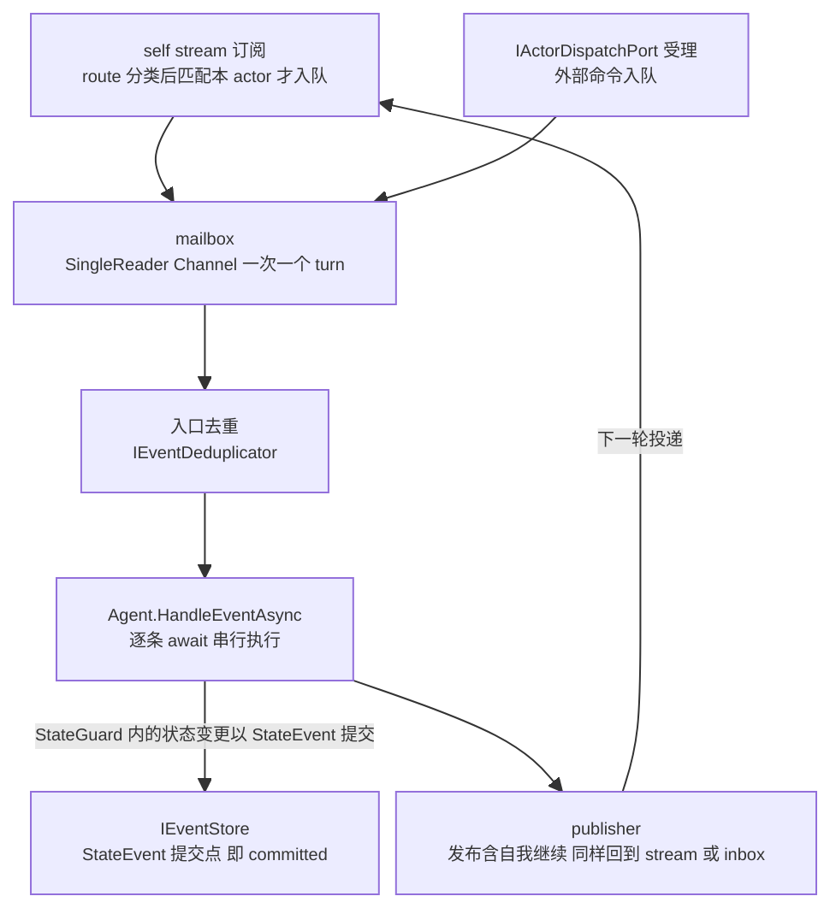
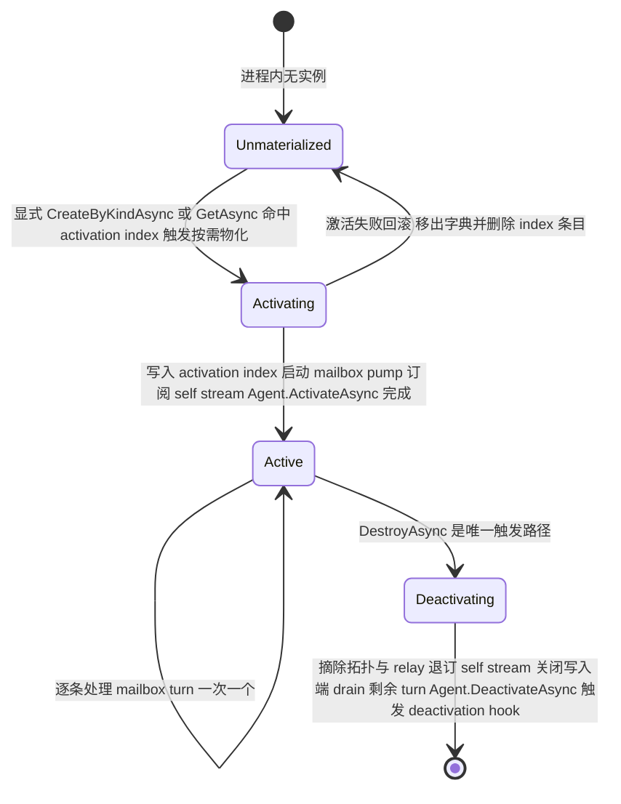

# Local Runtime 与 Actor 生命周期

> 版本与结论：本章描述 `current`；当前行为以 `f02aa690` 为准。两条脊柱结论：其一，Local runtime 用
> 一个 single-reader mailbox 把"一次一个 turn"的串行语义落地，activation 由显式创建或 activation index
> 驱动的按需物化触发，deactivation 只有显式销毁一条路径；其二，Local 的全部限制都是**部署形态**，
> 不是业务语义——迁到 Orleans 只换宿主装配与配置，Agent 业务代码与消息协议不变。

## 设计抽象与事实源

- `src/Aevatar.Foundation.Runtime.Implementations.Local/Actors/LocalActor.cs:13`：`LocalActor` 的 mailbox 是一个
  `SingleReader = true` 的 unbounded `Channel`，它是整章"一次一个 turn"串行语义的物理载体。
- `src/Aevatar.Foundation.Runtime.Implementations.Local/Actors/LocalActorRuntime.cs:280`：`EnsureActorMaterializedAsync`
  展示了 activation 的隐式触发路径——按 activation index 中记录的 agent kind 把 actor 按需物化回本进程。
- `src/Aevatar.Foundation.Runtime.Implementations.Local/README.md:3`：Local 项目把 Runtime、Dispatch、mailbox、Publisher 与一键装配的职责集中列出，并声明与 Orleans 保持对称，是"换部署形态不换业务协议"的边界锚点。

## 先建立模型

LocalActor 是 Agent 的运行容器：它持有 mailbox、订阅关系与 parent/children 拓扑状态，Agent 本体不感知
容器细节。入站有两个来源——self stream 订阅（direct / self / parent-children 拓扑 / 转发的 observer
发布都要先经 route 分类，匹配本 actor 才入队）与 dispatch port 受理的外部命令——但两个入口最终写进
**同一个** mailbox，因此不存在两套并发模型。



三个所有权边界值得钉死：

- **状态所有权**：handler 里的状态变更必须经 StateGuard 以 StateEvent 形式提交到 EventStore，提交即
  committed；mailbox 串行只保证"不并发"，不保证"已持久化"，持久化点在上图的 EventStore 一侧。
- **自我继续无快捷路径**：actor 给自己的消息同样经 publish 走 stream 回 inbox，重新排队、重新去重，
  不存在内联自我调用。
- **actorId 不透明**：runtime 用它做字典键与 index 键，业务侧不得解析其字符串结构。

## 沿一条链路走读

一个 LocalActor 的生命周期有四个阶段，触发点全部在 runtime 一侧，Agent 只收到 `ActivateAsync` /
`DeactivateAsync` 两个回调：



**Activation 的两条触发路径**：

1. **显式创建**：`CreateAsync` / `CreateByKindAsync` 解析 agent kind、生成 actorId、向 activation index
   upsert一条 actorId→kind 记录，然后执行激活序列——启动 mailbox pump、订阅 self stream、最后调用
   `Agent.ActivateAsync`（有状态 Agent 在此回放 committed StateEvent 恢复状态，细节见事件溯源章）。
   激活序列任何一步失败都会回滚：actor 移出进程内字典、index 条目删除，不留半成品。
2. **按需物化**：`GetAsync` 在字典里找不到 actor 时，查 activation index；index 里有这个 actorId 的
   kind 记录，就按 kind 重新走一遍创建流程。同一 actorId 已存在同类型 actor 时直接返回现有实例，
   保证进程内单激活；并发物化竞争由"已存在者为准"兜底。

**Deactivation 只有一条触发路径**：`DestroyAsync`。它先清理该 actor 的回调定时器，再摘除 parent/children
拓扑与双向 stream relay，然后执行退役序列——退订 self stream、关闭 mailbox 写入端、**等待 pump 把已排队
的 turn 全部处理完**（drain 而非丢弃）、调用 `Agent.DeactivateAsync`、最后异步触发 deactivation hook
（默认装配下挂的是 EventStore 压缩钩子）。此后 stream 移除、index 条目删除，actorId 回到"未物化"。

注意 drain 语义：关闭写入端之后新消息入队会抛"mailbox is closed"，但已入队的 turn 会被处理完毕——
deactivation 不是中断，是有终点的排空。

## 为什么是它，不是别的

**为什么用 single-reader Channel 而不是锁或并发字典调度？** 替代方案是"多线程并发投递 + handler 内部
加锁"：它把串行责任推给每个 Agent 作者，锁的粒度、重入、死锁全部变成业务代码的负担。Channel 方案把
串行收敛为容器的一条不变量——只有一个 reader、逐条 await 完成才取下一条——Agent 作者写 handler 时永远
不用考虑并发。代价是吞吐上限为单 actor 串行速度，以及 unbounded 队列在极端积压下没有背压；这是
actor 模型的标准取舍， Orleans 一侧以 grain 的 turn-based 调度表达同一条不变量，语义对齐。

**为什么需要 Local 这个实现存在？** Local 项目的自我定位是与 Orleans 实现**保持对称**的可读参照：
同一组 `IActorRuntime` / `IActorDispatchPort` / `IActor` 契约、同一套 route 分类与拓扑 relay 规则，用
进程内字典和内存 stream 跑起来。它让开发、单元测试和语义验证不必起立一个 silo；同时也充当回归
基准——Orleans 实现若偏离 Local 的语义，先怀疑 Orleans。

## 协议与状态深入

- **turn 的完成语义**：每个入队项携带一个 completion。正常处理或去重丢弃都置为成功；handler 抛异常时，
  只有经 `HandleEventAsync` 入口且要求传播失败的调用方才收到异常，dispatch port 入口的异常只记日志、
  投递仍算受理。这正是术语表里的分界：dispatch port 返回的是 **accepted**（inbox 准入回执），永远不等于
  committed；committed 只发生在 StateEvent 写入 EventStore 之后。
- **入口去重**：mailbox 取出条目后、调用 handler 前，先按 envelope 构建 dedup key 查 `IEventDeduplicator`，
  重复投递直接置成功返回。去重发生在"串行点之后、handler 之前"，因此不会破坏 turn 顺序。
- **拓扑不是生命周期**：`LinkAsync` / `UnlinkAsync` 只改 parent/children 关系与 stream relay 绑定，不触发
  activation 或 deactivation；`DestroyAsync` 则负责在退役前先摘除这些绑定，避免悬挂 relay。
- **deactivation hook**：退役收尾动作（默认是 EventStore 压缩）挂在 hook dispatcher 上异步触发，不阻塞
  drain；hook 是 runtime 设施的扩展点，不得被业务用来绕过 StateGuard 改写状态。

## 最小示例

> Demo status：`verified-static`（仅静态对照两侧实现与配置的公开面，未实际启动宿主；Orleans 路径需要
> 真实 silo 与可选的 Garnet/Kafka 外部服务，属于缺失前提。）

从 Local 迁到 Orleans，**业务代码零改动**：Agent 子类、handler、EventEnvelope 发布与路由、拓扑 link
全部原样。差异只在宿主装配与配置：

| 维度 | Local（Provider = `InMemory`） | Orleans（Provider = `Orleans`） |
|---|---|---|
| runtime 装配 | `AddAevatarActorRuntime(configuration)` 同一入口 | 同一入口，配置切换 provider |
| actor 载体 | 进程内 `LocalActor` + 字典 | `RuntimeActorGrain` + 客户端侧 `IActor` 代理 |
| stream backend | `InMemory` | `InMemory` 或 `KafkaProvider` |
| 持久化 | 默认 `InMemoryEventStore`，可换 `AddFileEventStore` | `InMemory` 或 `Garnet`（选 Garnet 时 `IEventStore` 自动切 `GarnetEventStore`） |
| 激活治理 | 显式创建 / 按需物化；无闲置回收 | grain 激活由 silo 治理 |

配置面差异（节选自两侧 README 与 options 类型的公开用法）：

```csharp
// Local：默认即此形态
services.AddAevatarActorRuntime(configuration);
// appsettings: { "ActorRuntime": { "Provider": "InMemory" } }
```

```csharp
// Orleans：同一入口换 provider，silo 侧补一行装配
siloBuilder.AddAevatarFoundationRuntimeOrleans(options =>
{
    options.PersistenceBackend = AevatarOrleansRuntimeOptions.PersistenceBackendGarnet;
    options.GarnetConnectionString = "localhost:6379";
});
// appsettings: { "ActorRuntime": { "Provider": "Orleans" } }
```

一个文档化的真实边界：Orleans 模式下 `IActor.Agent` 返回的是远程代理，不保证可向下转型为具体
`GAgent` 实现；依赖 `actor.Agent is SomeConcreteAgent` 的调用路径应留在 InMemory provider。这不是迁移
要改业务协议，而是一条本来就违反"Agent 不感知容器"原则的先有代码气味——迁移时它会被暴露出来。

## 边界与演进

- **current（Local 部署形态的限制，全部不是业务语义）**：单进程——actor 存于进程内字典，activation
  index 默认也是内存实现，无跨进程单激活与分布式 placement；默认 stream 与 EventStore 为内存实现，
  进程退出即失；无闲置自动回收，deactivation 只有显式 `DestroyAsync` 一条路径。这些限制描述"这个
  进程能撑多久、多大规模"，不描述"消息怎么路由、状态怎么提交"——后者在 Local 与 Orleans 之间逐条对齐。
- **current（并行实现）**：Orleans 实现存在且 README 自述与 Local 对称；Hosting 层用一个 provider
  选项做装配选择，印证"业务协议不变、部署形态可换"是设计目标而非事后巧合。
- **open gap**：Local 无闲置回收意味着长跑宿主需要调用方自己管理 `DestroyAsync` 时机；把闲置回收
  引入 Local 属于部署形态增强，不影响本章任何业务语义结论。

## 读完应能回答

1. LocalActor 用什么机制保证同一 actor 的 handler 一次只处理一个 turn？两条入站来源为什么不会形成两套并发模型？
2. Activation 有哪两条触发路径，各自的语义与失败回滚是什么？
3. Deactivation 由谁触发？drain 语义保证什么、不保证什么？
4. Local runtime 的限制里，哪些是部署形态、哪些（如果有）是业务语义？为什么说 accepted 不等于 committed 与运行时实现无关？
5. 从 Local 迁到 Orleans 时，哪些代码不用改、哪些配置要换？唯一文档化的代码层边界是什么？

<details>
<summary>论断—证据映射</summary>

| 论断 | 等级 | 证据 |
|---|---|---|
| mailbox 是 SingleReader unbounded Channel，多写入者单读取者 | E1 | `src/Aevatar.Foundation.Runtime.Implementations.Local/Actors/LocalActor.cs:13` |
| pump 逐条 await `Agent.HandleEventAsync`，一次一个 turn | E1 | `src/Aevatar.Foundation.Runtime.Implementations.Local/Actors/LocalActor.cs:183` |
| 入站两入口（self stream 订阅经 route 分类 / dispatch port 受理）汇入同一 mailbox | E1 | `src/Aevatar.Foundation.Runtime.Implementations.Local/Actors/LocalActor.cs:53`、`src/Aevatar.Foundation.Runtime.Implementations.Local/Actors/LocalActorDispatchPort.cs:20` |
| 入口去重发生在 handler 之前，重复投递置成功返回 | E1 | `src/Aevatar.Foundation.Runtime.Implementations.Local/Actors/LocalActor.cs:195` |
| 异常仅对 propagateFailure 的入口传播，其余记日志置成功 | E1 | `src/Aevatar.Foundation.Runtime.Implementations.Local/Actors/LocalActor.cs:213` |
| 显式创建：upsert activation index 后执行激活序列，失败回滚字典与 index | E1 | `src/Aevatar.Foundation.Runtime.Implementations.Local/Actors/LocalActorRuntime.cs:134`、`src/Aevatar.Foundation.Runtime.Implementations.Local/Actors/LocalActorRuntime.cs:141` |
| 激活序列 = 启动 pump、订阅 self stream、Agent.ActivateAsync | E1 | `src/Aevatar.Foundation.Runtime.Implementations.Local/Actors/LocalActor.cs:48` |
| 按需物化：GetAsync 未命中时按 activation index 的 kind 记录重建 | E1 | `src/Aevatar.Foundation.Runtime.Implementations.Local/Actors/LocalActorRuntime.cs:206`、`src/Aevatar.Foundation.Runtime.Implementations.Local/Actors/LocalActorRuntime.cs:280` |
| 同 actorId 同类型返回现有实例，并发物化以已存在者为准 | E1 | `src/Aevatar.Foundation.Runtime.Implementations.Local/Actors/LocalActorRuntime.cs:76`、`src/Aevatar.Foundation.Runtime.Implementations.Local/Actors/LocalActorRuntime.cs:297` |
| DeactivateAsync 唯一调用方是 DestroyAsync；退役先摘拓扑与 relay，drain 后触发 hook | E1 | `src/Aevatar.Foundation.Runtime.Implementations.Local/Actors/LocalActorRuntime.cs:151`、`src/Aevatar.Foundation.Runtime.Implementations.Local/Actors/LocalActor.cs:114` |
| 关闭写入端后新入队抛错、已排队条目处理完毕 | E1 | `src/Aevatar.Foundation.Runtime.Implementations.Local/Actors/LocalActor.cs:117`、`src/Aevatar.Foundation.Runtime.Implementations.Local/Actors/LocalActor.cs:177` |
| 默认装配：InMemory stream / InMemoryEventStore / 内存 activation index / 压缩 deactivation hook；可换 FileEventStore | E1 | `src/Aevatar.Foundation.Runtime.Implementations.Local/DependencyInjection/ServiceCollectionExtensions.cs:81`、`src/Aevatar.Foundation.Runtime.Implementations.Local/DependencyInjection/ServiceCollectionExtensions.cs:85`、`src/Aevatar.Foundation.Runtime.Implementations.Local/DependencyInjection/ServiceCollectionExtensions.cs:111` |
| activation index 默认实现为进程内 ConcurrentDictionary | E1 | `src/Aevatar.Foundation.Runtime.Implementations.Local/ActivationIndex/ILocalActivationIndexStore.cs:14` |
| Local 与 Orleans 是同一契约的对称实现，provider 分支在宿主装配层选择 | E1 | `src/Aevatar.Foundation.Runtime.Implementations.Local/README.md:12`、`src/Aevatar.Foundation.Runtime.Hosting/DependencyInjection/ServiceCollectionExtensions.cs:33` |
| Orleans 模式下 `IActor.Agent` 是远程代理，不保证可向下转型 | E1 | `src/Aevatar.Foundation.Runtime.Implementations.Orleans/README.md:21` |
| Orleans 选 Garnet 持久化时 IEventStore 自动切 GarnetEventStore | E1 | `src/Aevatar.Foundation.Runtime.Implementations.Orleans/README.md:57` |

</details>
