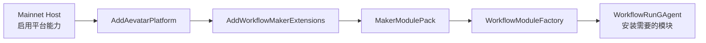
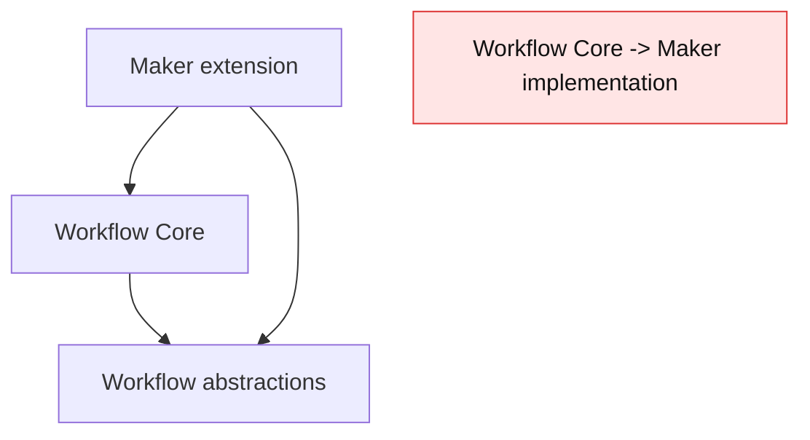
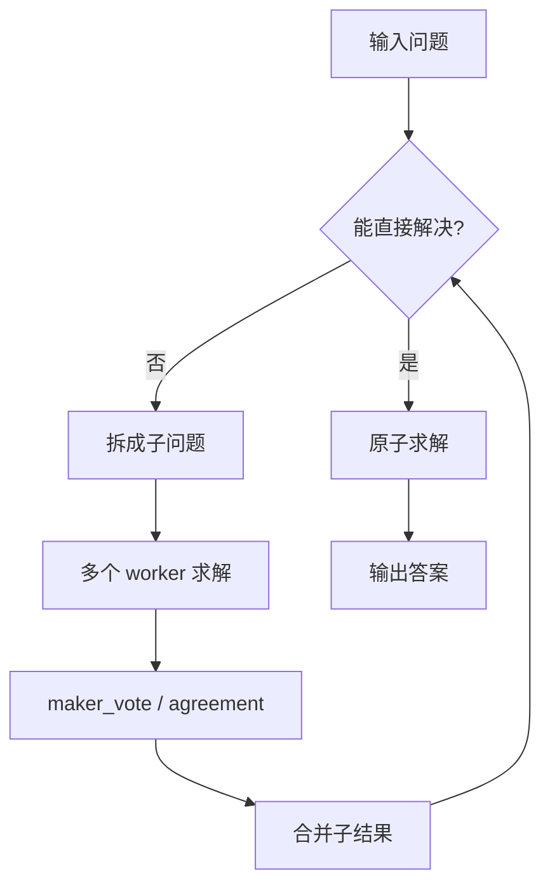
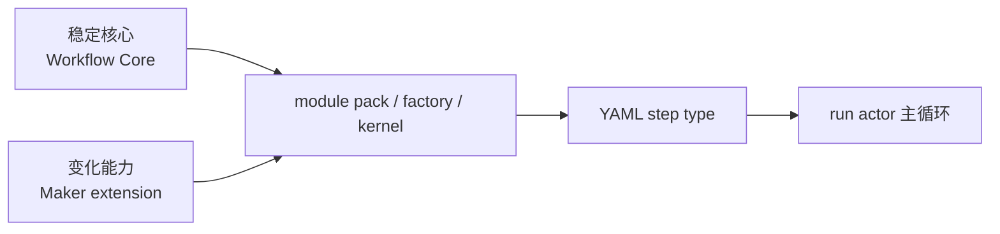

# Maker 插件边界：把多 Agent 求解放进 Workflow 扩展

## 事实源/设计抽象(以 ~/Code/aevatar 为准)

- `MakerModulePack`: Maker 通过 `IWorkflowModulePack` 贡献 workflow 模块。
- `src/workflow/extensions/Aevatar.Workflow.Extensions.Maker/Modules/`: `maker_vote` 与 `maker_recursive` 的模块实现目录。
- `overview`: Maker 是 workflow 插件扩展，依赖方向是 plugin 到 Workflow Core。

---

## 一句话模型

Maker 不是平行于 Workflow 的第二套 Host，而是挂在 Workflow 模块体系上的扩展包。它提供多 Agent 协作求解能力，但入口仍是普通 workflow step，状态仍由 run actor 承载。





## Maker 提供什么能力

从 workflow 作者视角看，Maker 主要暴露两类 step：

| primitive | 用途 | 适合场景 |
|---|---|---|
| `maker_vote` | 多个候选回答投票，按 ahead-by-k 收敛 | 需要快速达成多数或领先结论 |
| `maker_recursive` | 把复杂问题递归拆解、求解、汇总 | 问题可分解，且每层需要多 Agent 审视 |

这两者都是模块，不是新的 controller。它们和 `llm_call`、`parallel`、`vote` 一样被 workflow 主循环调度。

## maker_recursive 的执行心智模型



这张图只表达设计形状：递归求解仍发生在 workflow 模块边界内，不能越过 run actor 自己管理一套并行状态权威。

## 为什么不是独立 Maker Host

独立 Host 会带来三类额外复杂度：

- 第二套入口和生命周期。
- 第二套状态和投影边界。
- Workflow 与 Maker 之间的反向依赖风险。

插件化后，Maker 只贡献模块，Workflow Core 只依赖抽象和注册机制。依赖方向清楚，架构门禁也更容易判断。



## 和普通 primitive 的关系

Maker 可以被看作组合型能力：

- 它复用 workflow 的 step 调度、重试、timeout 和状态宿主。
- 它可以和普通控制流 primitive 放在同一张 YAML 图里。
- 它不要求调用方知道内部 worker 怎么组织，只需要理解输入、输出和失败语义。

```yaml
steps:
  - id: solve_hard_problem
    type: maker_recursive
    prompt: "{{input.problem}}"

  - id: summarize
    type: llm_call
    role: reporter
```

## 边界规则

1. Workflow Core 可以定义模块机制，不能反向引用 Maker 实现。
2. Maker 可以依赖 Workflow Core / Abstractions 来贡献模块。
3. Mainnet Host 通过平台装配启用 Maker，而不是新增 `/api/maker/*` 这类平行入口。
4. Maker 的运行结果仍应进入 workflow run 的事件和状态链路。

## 验收

1. Maker 的定位是什么？Workflow 插件扩展，不是独立 Host。
2. Maker 通过什么机制接入？`IWorkflowModulePack`。
3. 为什么禁止 Workflow Core 反向依赖 Maker？会破坏“稳定核心 + 插件扩展”的方向。

⟦AI:AUTO-LOOP⟧
