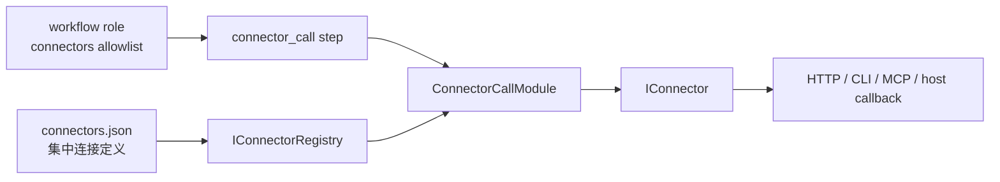
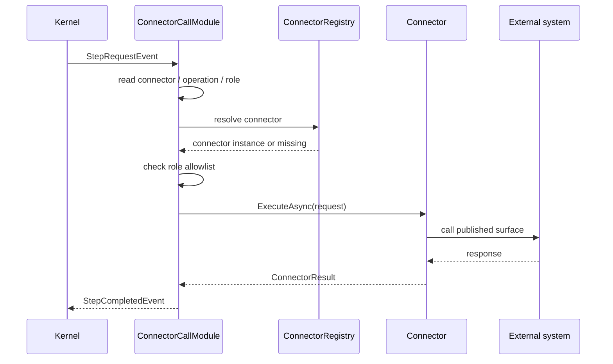
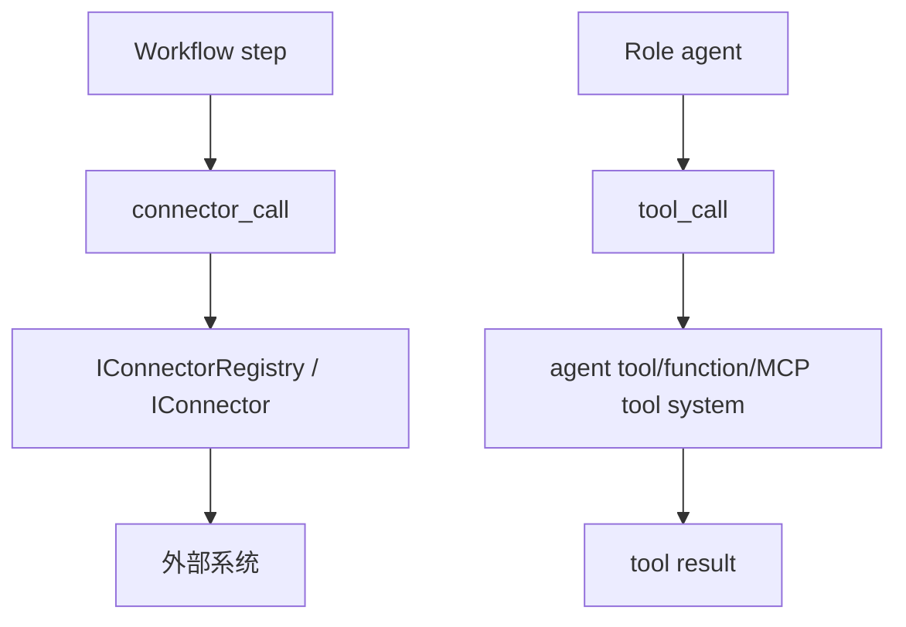
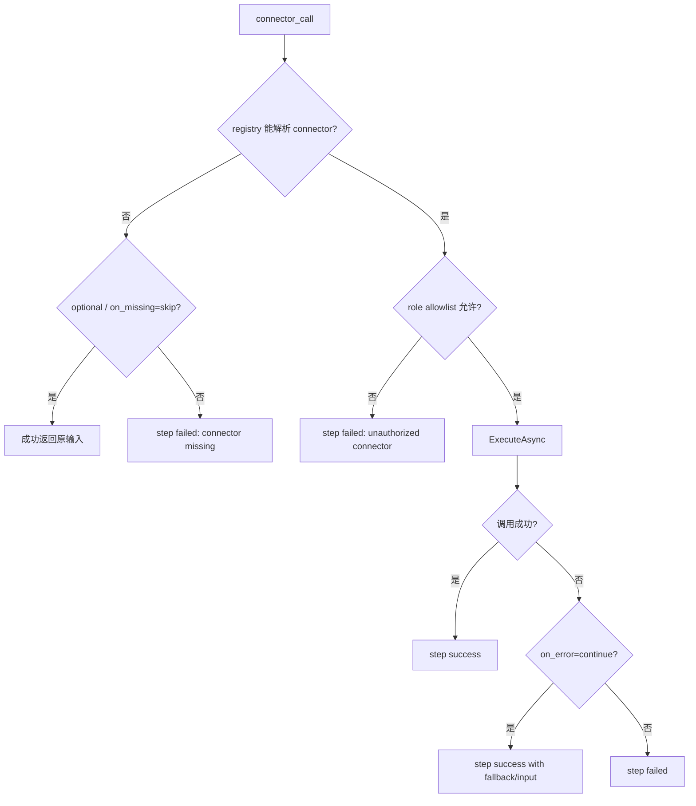

# Connector：Workflow 调外部系统的受控出口

## 事实源/设计抽象(以 ~/Code/aevatar 为准)

- `connector`: connector 契约、配置形状、执行流程、host 边界和 `connector_call` / `tool_call` 区分。
- `src/Aevatar.Configuration/README.md`: role 与 connector 的集中配置和 allowlist 分配方式。
- `ConnectorCallModule`: `connector_call` 模块的参数读取、registry 解析、allowlist 和容错执行。

---

## 一句话模型

Connector 是 workflow 调外部系统的受控出口：连接定义集中在 host 配置，workflow step 只声明“我要用哪个 connector 做什么操作”，role 的 `connectors` 决定谁有权用。





## 配置和授权分开

`connectors.json` 解决“连接是什么”，role 的 `connectors` 解决“谁可以用”。这两个问题分开后，YAML 不需要携带密钥、base URL 或命令细节。

```yaml
roles:
  - id: coordinator
    name: Coordinator
    connectors: [github_router]

steps:
  - id: classify_host_signal
    type: connector_call
    role: coordinator
    connector: github_router
    operation: classify
```

如果 step 写了 `role` 或 `target_role`，运行时会按 role allowlist 检查 connector 名称。省略 role 是兼容路径，不应作为新 workflow 的默认写法。

## connector 类型按运行边界理解

| 类型 | 运行边界 | 常见用途 |
|---|---|---|
| `http` | 受限 HTTP surface | REST API、内部已发布服务 |
| `cli` | host 配置允许的命令 | 本机工具、受控脚本 |
| `mcp` | AI 扩展启用后的 MCP server | 工具协议集成 |
| `host_callback` | host 已发布回调面 | 让 workflow 触达宿主公开能力 |
| `telegram_user` | bootstrap 提供的用户通道 | Telegram 用户交互 |

重点不是记 builder 名称，而是确认边界：workflow 只调用已配置、已注册、已授权的 connector。

## connector_call 与 tool_call

这两个名字容易混：



`connector_call` 是 workflow 步骤侧的外部出口，role connector allowlist 在这里真正生效。`tool_call` 是 agent 工具系统的一部分，适合表达“让角色调用工具完成任务”。

## 容错语义

Connector 缺失、外部调用失败和权限不匹配不能混成一个错误。读 YAML 时要区分：

- connector 缺失是否允许跳过。
- 外部调用失败是否允许继续。
- role 是否真的授权使用该 connector。
- retry 次数是否属于 connector call 自己的参数，还是 step 级 retry。



## host 责任边界

host 可以提供 connector 配置、builder 注册和 callback surface，但不应变成 workflow controller。也就是说，host 提供“可调用的面”，workflow 自己通过 step 图表达何时调用、如何分支、失败后怎么办。

这条边界能防止 connector 变成绕过编排层的后门：外部系统调用仍然要经过 YAML、role allowlist、kernel 主循环和 run actor 状态。

## 验收

1. connector 定义和授权分别在哪里？定义在 host 配置，授权在 workflow role 的 `connectors` allowlist。
2. `connector_call` 和 `tool_call` 的区别是什么？前者是 workflow 外部出口，后者是 agent 工具系统。
3. host callback 的边界是什么？host 暴露已发布面，不接管 workflow 执行。

⟦AI:AUTO-LOOP⟧
