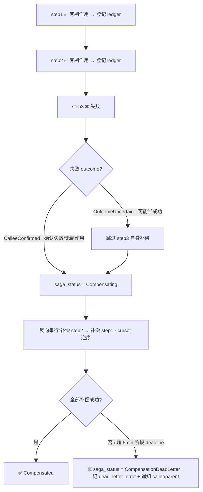
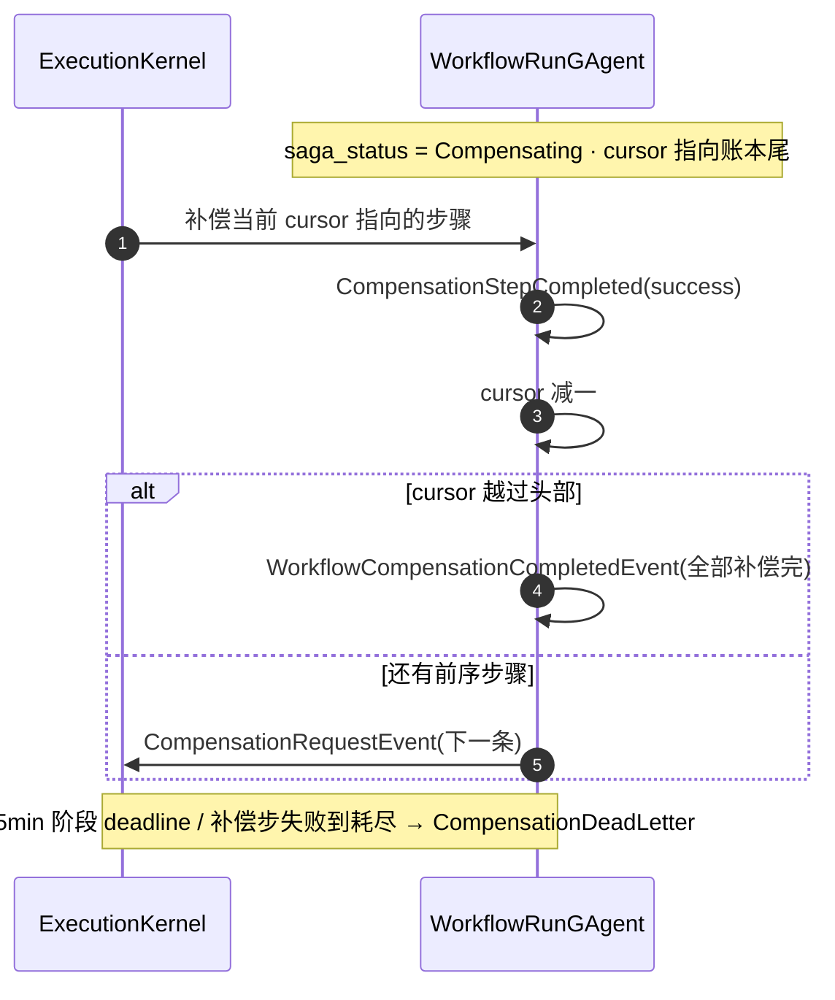
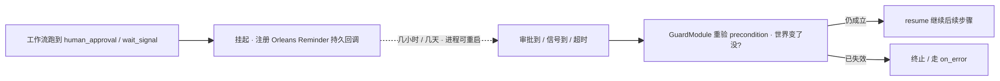

# saga 补偿 + dead-letter + 持久挂起:长在 agent 编排上的 durable execution

> 本篇是 02 编排层的**亮点收口**:[02/03 执行内核](03-execution-kernel.md) 讲了主循环怎么推进步骤,本篇讲它失败时怎么**优雅地回滚副作用、把补偿也失败的情况钉成终态、以及挂起数天再 resume**——这是 Temporal / Restate 级的 durable execution,但直接长在 agent 编排上。注意:**这套 saga 代码已全量落地,但 ADR-0034 仍写 `proposed`**,而且有两处精妙边界完全没文档化,本篇补齐。

## 本篇涉及的设计抽象

> 以下是本篇的**事实源脊柱**(以 `~/Code/aevatar` 为准,核对基线 `feature/integrate @ efaee423d`;非正文骨架):正文用设计语言论证,代码摘抄一律折叠。

- **saga 状态自持(无外部 coordinator)**:`src/workflow/Aevatar.Workflow.Core/workflow_state.proto`(`compensable_ledger` / `compensation_cursor` / `saga_status` / `dead_letter_*` 字段)、状态/结果枚举 `src/workflow/Aevatar.Workflow.Abstractions/workflow_execution_messages.proto`(`WorkflowSagaStatus` / `WorkflowStepFailureOutcome`)。
- **反向串行补偿 + 有界阶段**:`src/workflow/Aevatar.Workflow.Core/Execution/WorkflowExecutionKernel.cs`(`HandleCompensationRequestAsync` / `HandleCompensationPhaseDeadlineFiredAsync`)、`src/workflow/Aevatar.Workflow.Core/WorkflowRunGAgent.cs`(游标推进 + 终态)。
- **持久挂起 / 人在环**:`src/workflow/Aevatar.Workflow.Core/Modules/HumanApprovalModule.cs`、`src/workflow/Aevatar.Workflow.Core/Modules/WaitSignalModule.cs`、`src/workflow/Aevatar.Workflow.Core/Modules/GuardModule.cs`;底层持久回调 `src/Aevatar.Foundation.Runtime.Implementations.Orleans/Grains/Callbacks/RuntimeCallbackSchedulerGrain.cs`。
- **ADR 漂移**:`docs/adr/0034-workflow-saga-compensation-protocol.md`(当前 `status: proposed`,但代码已落地)。

---

## 一句话先把 saga 钉住

> **每个有副作用的步骤在派发时就被登记进 `compensable_ledger`(连同它的补偿步 id);一旦工作流整体失败,run actor 用 `compensation_cursor` 逆序把账本里的步骤一个个补偿回去;补偿也失败到耗尽,就把 `saga_status` 钉成 `CompensationDeadLetter` 终态、记下 `dead_letter_error` 并通知调用方/父工作流。** 整个 saga 状态由 **run actor 自持**(就在它自己的 event-sourced state 里),**没有外部 saga coordinator**——这正是 Actor + ES 地基"免费"换来的:补偿进度本身就是可重放的事实。



---

## 1. saga 状态由 run actor 自持——没有外部 coordinator

传统 saga 实现要么靠一个中心化编排器(saga coordinator)记进度,要么靠一张外部状态表。aevatar 都不要:**补偿所需的全部事实都在 `WorkflowRunGAgent` 自己的 event-sourced state 里**(`workflow_state.proto`)。

| 字段(`workflow_state.proto`) | 作用 |
|---|---|
| `compensable_ledger`(repeated) | 已派发的、可补偿步骤的账本:每条记 `step_id` / `compensation_step_id` / `idempotency_key` / 捕获的输出 / ledger 状态 |
| `compensation_cursor` | 反向补偿的遍历指针(从账本尾部往前走) |
| `saga_status` | saga 生命周期:`Compensating` / `CompensatedFailed` / `CompensationDeadLetter` |
| `dead_letter_failed_compensation_step_id` / `dead_letter_remaining_uncompensated` / `dead_letter_error` | 死信终态的取证记录 |

**为什么是"自持"而不是"外部 coordinator"**:run actor 本来就是单激活 + 邮箱串行 + event-sourced 的(见 [03/01 Agent/Actor/Runtime](../03/01-agent-actor-runtime.md))。把 saga 进度放进它自己的状态,补偿进度就**自动获得了和业务状态同等的持久性、确定性重放、崩溃恢复**——actor 重启后从事件流 reduce 回来,`compensation_cursor` 走到哪就接着走,不需要任何额外的一致性协议。这是 **FI-004**(事实必须有权威记录)与 **FI-005**(边界清楚,不引入多余中间层)的直接红利:saga 不是加在系统上的新组件,而是 ES 地基([03/08 ES 三重红利](../03/08-event-sourcing-dividends.md))长出来的能力。

---

## 2. 反向串行补偿 + 有界补偿阶段

补偿的语义是**反向、串行、逐步**:`WorkflowExecutionKernel` 收到 `CompensationRequestEvent` 后执行单步补偿(`HandleCompensationRequestAsync`),run actor 在补偿步完成后把 `compensation_cursor` 减一、指向账本里前一条,直到游标越过头部 → 发 `WorkflowCompensationCompletedEvent`(全部补偿完成)。任一补偿步失败 → `WorkflowCompensationFailedEvent`。

补偿阶段是**有界**的:内核里有 `CompensationPhaseDeadlineMs`(5 分钟)和单步 `DefaultCompensationTimeoutMs`(30 秒),超时由 `HandleCompensationPhaseDeadlineFiredAsync` 收口,避免补偿阶段无限拖。补偿耗尽 / 超时 → `saga_status` 进 `CompensationDeadLetter` 终态,并通知调用方 / 父工作流,而不是静默卡死。



**为什么逆序串行**:副作用之间常有依赖(先建单才能付款),回滚必须按相反顺序、且不能并发互相打架。串行 + 逆序是补偿语义的正确性下限,而非性能选择;有界 deadline 则保证"补偿本身也会失败"这一现实被显式处理成终态,不拖垮 actor。

---

## 3. 两个"已实现但没文档化"的精妙边界

这两处是 saga 真正见功力的地方,代码已落地却没写进任何设计文档——它们都是为了 **replay 正确性**。

### 3a. 两阶段账本:`Provisional → Confirmed`

`CompensableLedgerEntryStatus` 有两个有效态:`Provisional` 和 `Confirmed`。一条可补偿步骤在**派发那一刻**(还没确认成功)就以 `Provisional` 入账;**成功回执到了**才升级成 `Confirmed`;若步骤**确认失败且无副作用**(`CalleeConfirmed`),则把对应的 `Provisional` 条目删掉。

<details>
<summary>账本与 saga 状态枚举(proto)</summary>

```protobuf
// src/workflow/Aevatar.Workflow.Core/workflow_state.proto
enum CompensableLedgerEntryStatus {
  COMPENSABLE_LEDGER_ENTRY_STATUS_UNSPECIFIED = 0;
  COMPENSABLE_LEDGER_ENTRY_STATUS_CONFIRMED   = 1;  // 副作用已确认生效
  COMPENSABLE_LEDGER_ENTRY_STATUS_PROVISIONAL = 2;  // 派发了,但 in-flight,可能已提交
}

// src/workflow/Aevatar.Workflow.Abstractions/workflow_execution_messages.proto
enum WorkflowSagaStatus {
  WORKFLOW_SAGA_STATUS_UNSPECIFIED              = 0;
  WORKFLOW_SAGA_STATUS_COMPENSATING             = 1;
  WORKFLOW_SAGA_STATUS_COMPENSATED_FAILED       = 2;
  WORKFLOW_SAGA_STATUS_COMPENSATION_DEAD_LETTER = 3;  // 死信终态
}
```
</details>

**为什么需要两阶段**:考虑"派发了一个会发款的步骤,回执还没回来,actor 就崩了"。如果账本只在**成功后**才记,崩溃恢复后这笔款的副作用就成了**孤儿**——没人知道要补偿它。两阶段把"我**派发过**这个副作用"在 dispatch 时就钉进 event-sourced 账本(`Provisional`),于是即便成功事件没落地,补偿阶段也知道"这一步可能已经在世界上留下痕迹,得纳入补偿考量"。这正是 git 历史 `feat(workflow): compensate in-flight side-effecting steps on saga trigger`(#2202)要解决的问题,是 saga 在 ES 模型下做到**崩溃安全**的关键齿轮。

### 3b. `OutcomeUncertain` 故意跳过补偿

构造补偿起点时,run actor 对**终态失败步骤**做了一个反直觉的判断:如果该步的失败结果是 `OutcomeUncertain`(不确定是否产生了副作用),就**故意不把它纳入补偿**。

<details>
<summary>OutcomeUncertain 跳过(WorkflowRunGAgent)</summary>

```csharp
// src/workflow/Aevatar.Workflow.Core/WorkflowRunGAgent.cs
private WorkflowRunState BuildCompensationStartState(WorkflowRunState current, StepCompletedEvent? terminalStep)
{
    if (terminalStep == null || terminalStep.Success)
        return current;

    // 失败但"结果不确定"→ 不纳入补偿(避免补偿一个可能半成功的 step)
    if (NormalizeFailureOutcome(terminalStep.FailureOutcome) == WorkflowStepFailureOutcome.OutcomeUncertain)
        return current;

    return ApplyStepCompleted(current, terminalStep);
}
```
</details>

**为什么"不确定就不补"**:补偿一个**半成功**的步骤可能比不补更糟——你不知道它做到哪一步,盲目执行逆操作可能把一个其实没生效的副作用"补"出一个新的错误状态(例如对一笔根本没扣成功的款发起退款)。`WorkflowStepFailureOutcome` 把失败显式分成 `CalleeConfirmed`(被调方确认失败、无副作用,安全)与 `OutcomeUncertain`(结果不明,危险),让补偿决策**基于证据而非假设**——`CalleeConfirmed` 才删 `Provisional`、`OutcomeUncertain` 则保守保留。这是 **FI-006**(基于 evidence、显式暴露不确定)在事务语义层的体现。

---

## 4. 持久挂起:工作流能停在那里等几天

durable execution 的另一半是**长时间挂起后可靠 resume**。aevatar 的工作流可以停在一个步骤上等人审、等外部信号,中间进程重启也不丢:

- `HumanApprovalModule`——挂起等人工审批(批准则继续,拒绝则终止);git 历史里还专门加了 skill 驱动的审批超时(#2136)和外部审批续跑回调(#2241)。
- `WaitSignalModule`——挂起等一个外部信号到达。
- `GuardModule`——断言/前置条件校验,可在 resume 后**重新核验**输入是否仍然成立(数天后世界可能已变,不能拿过期前提继续)。

这些挂起之所以"持久",靠的是底层 `RuntimeCallbackSchedulerGrain`——用 **Orleans Reminder** 做的持久回调,到点重投、进程重启不丢(同一套 Orleans 运行时语义见 [06/02 Orleans Runtime](../06/02-orleans-runtime.md))。



**为什么这是"长在 agent 编排上"的 durable execution**:Temporal / Restate 提供的是通用 durable workflow,但你得把 agent 逻辑塞进它的编程模型。aevatar 反过来——durable 能力(持久定时、可补偿事务、崩溃恢复)是 Actor + ES 地基自带的,**agent 编排(role / llm_call / tool_call)和 saga / 持久挂起共用同一套 run actor**。这就是 [08/05 结晶梯度路线图](../08/05-crystallization-roadmap.md) 说的竞争站位:不和 Temporal 拼通用 workflow,而是把 durable execution 直接做进 agent runtime。凭证在挂起/触发期怎么避免 raw secret 进入事实层,见 [06/06 凭证边界](../06/06-credentials-zero-standing-secrets.md)。

---

## 为什么是这样设计(正当性小结)

- **为什么 saga 不要外部 coordinator?** run actor 已是 event-sourced 单激活体,补偿进度放进它自己状态即免费获得持久 + 重放 + 崩溃恢复;外部 coordinator 反而引入第二事实源(违 FI-004)。
- **为什么补偿要反向、串行、有界?** 逆序串行是副作用依赖关系的正确性下限;有界 deadline 把"补偿也会失败"显式收成终态而非无限拖。
- **为什么 `Provisional/Confirmed` 两阶段、`OutcomeUncertain` 跳过?** 都是让补偿决策在崩溃/不确定下仍**基于证据**:派发即记账(不漏孤儿副作用)、结果不明则不乱补(不制造新错误)。

!!! warning "ADR-0034 严重滞后(全书最高优先文档修)"
    `docs/adr/0034-workflow-saga-compensation-protocol.md` 当前仍 `status: proposed`、正文用将来时,但**代码已全量落地**(git 历史 #2111 → #2115 → #2116 → #2165 → #2202 → "bound saga compensation phase" 一路实现)。ADR-0006/0017 等交叉引用还称其"rejected / 未实现"。这属于 canon 漂移,登记在 [08/04 P1-1](../08/04-todo-list.md):应把 ADR 提 `accepted` 并补两阶段账本 / 游标 / `OutcomeUncertain` 细节。本仓只读解读,不改 `~/Code/aevatar`,此处仅标注。

> ⚠️ 其它边界:① 死信是**终态**(5min 阶段 deadline + 30s 单步超时耗尽),通知 caller/parent 但**不自动重跑**;② 终态以 `saga_status = CompensationDeadLetter` 表达,配套事件是 `WorkflowCompensationFailedEvent` / `CompletedEvent`,别找一个叫 `CompensationDeadLetteredEvent` 的类型;③ 仓库无可跑的 saga 补偿示例 YAML(`demos/` 已大量退役,见 [08/03](../08/03-demo-cookbook.md)),验证故障恢复路径只能读测试与源码。

---

## 验收

1. saga 状态为什么由 run actor 自持、不要外部 coordinator?(run actor 已 event-sourced,补偿进度即免费持久+重放+崩溃恢复;外部 coordinator 是第二事实源)
2. 补偿为什么必须反向串行、为什么要给补偿阶段设 deadline?(副作用依赖需逆序回滚、不能并发;deadline 把"补偿也失败"收成终态)
3. 两阶段账本 `Provisional → Confirmed` 解决的是哪种崩溃场景?(派发后、成功回执前 actor 崩溃 → 副作用孤儿;dispatch 即记 Provisional 避免漏补)
4. 为什么"失败结果不确定"时反而**不**补偿?(半成功盲补可能制造新错误;`OutcomeUncertain` 保守保留,`CalleeConfirmed` 才安全删账)
5. 工作流挂起数天还能可靠 resume 靠什么、resume 前为什么要 `GuardModule` 重验?(Orleans Reminder 持久回调;数天后前提可能失效,需重验 precondition)
6. ADR-0034 的"proposed vs 已落地"漂移是怎么回事?(代码全量实现,ADR 头与正文未更新,需提 accepted)

⟦AI:AUTO-LOOP⟧
