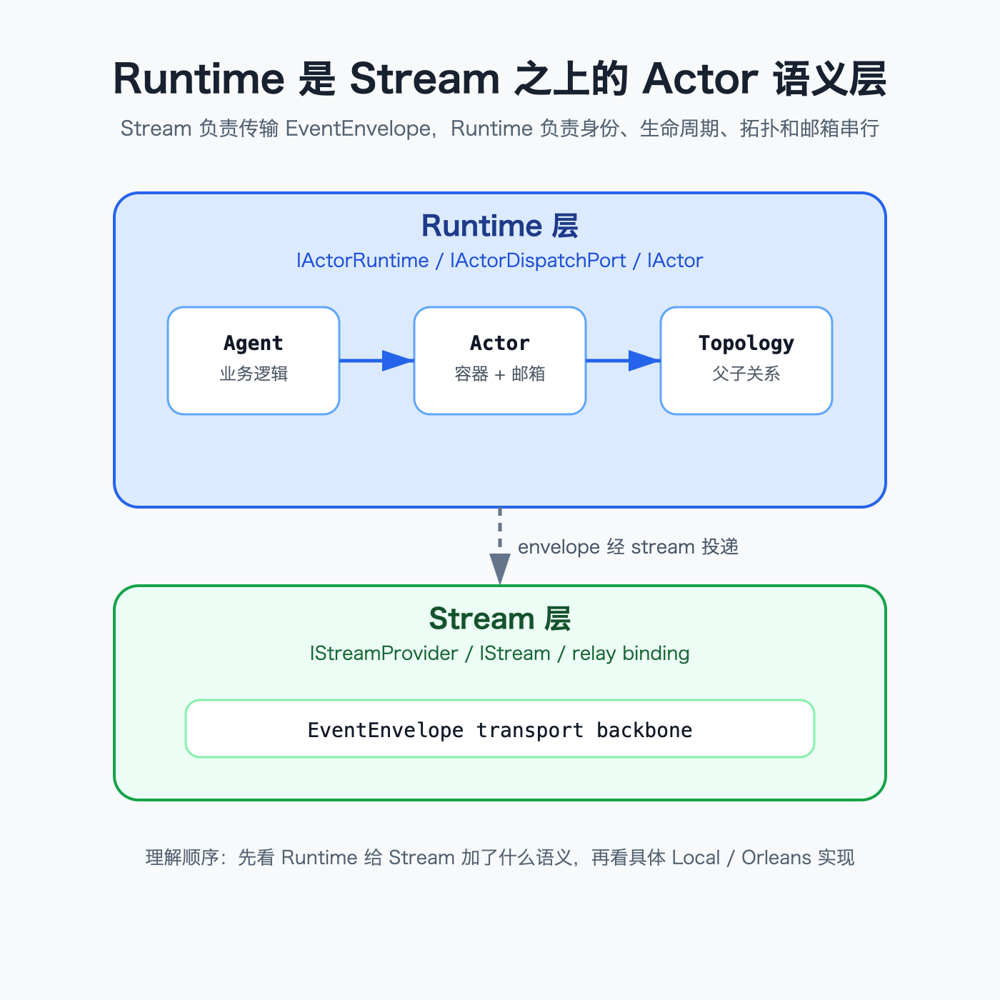

# 核心概念辨析:Agent / Actor / Runtime / Stream

## 关键代码(事实源,以 ~/Code/aevatar 为准)

- `src/Aevatar.Foundation.Abstractions/IAgent.cs` 第 13-32 行:`IAgent` 的身份、事件处理、订阅与生命周期;第 38-42 行:`IAgent<TState>` 的 typed state。
- `src/Aevatar.Foundation.Abstractions/IActor.cs` 第 11-33 行:`IActor` 是包住 `IAgent` 的运行容器,同时暴露父子拓扑读取。
- `src/Aevatar.Foundation.Abstractions/IActorRuntime.cs` 第 11-43 行:`IActorRuntime` 负责创建、销毁、查找、链接与取消链接 actor。
- `src/Aevatar.Foundation.Abstractions/IStream.cs` 第 14-36 行:`IStream` 负责 produce、subscribe 与 relay binding。
- `src/Aevatar.Foundation.Abstractions/IActorDispatchPort.cs` 第 68-76 行:外部 dispatch 只返回 admission,不是处理完成承诺。
- `docs/canon/architecture.md` 第 21-29 行:五个核心概念;第 27 行明确 Runtime 是 Stream 之上的 Actor 语义层。
- `src/Aevatar.Foundation.Runtime.Implementations.Local/Actors/LocalActorRuntime.cs` 第 102-107 行:Local runtime 为 actor 注入基于 stream 的 publisher。

---

## 先抓住一条主线

Aevatar 的 Foundation 不是把业务对象直接塞进消息总线。它分两层:下面是 Stream,负责把 `EventEnvelope` 送到对应通道;上面是 Runtime,把这些通道组织成 actor 的身份、生命周期、拓扑和串行处理语义。

这句话的重点是“之上”。Stream 只知道有消息被 produce、subscribe、relay;它不天然知道哪个业务实体应该被创建、谁是谁的 parent、同一个 actor 的消息是否应该串行。Runtime 补上这些语义,于是上层可以用 `IActorRuntime` / `IActorDispatchPort` / `IEventPublisher` 说话,而不是直接操作一堆 stream。

---

## 四个词不要混在一起

Agent 是业务逻辑:它知道收到某种 payload 后要做什么。Actor 是运行容器:它持有一个 Agent,还承担生命周期、邮箱和父子拓扑。Runtime 管 actor 的创建、查找、链接和外部投递。Stream 是消息传输骨架,不负责解释业务含义。

用一个请求来想会更直观:API 侧把消息交给 dispatch port;Runtime 找到目标 actor;actor 把消息放进自己的处理路径;Agent 里真正执行业务 handler。下面的 Stream 仍然参与投递,但读者不需要先理解所有 relay 细节,才能理解“这个消息最终进了哪个 actor”。

---

## Dispatch 不是完成保证

`IActorDispatchPort` 的返回语义很克制:它只表示消息已经被受理进入 dispatch 路径,不表示 handler 已经执行完,也不表示领域事件已经提交,更不表示 projection 已经观察到结果。

这个边界很重要。Aevatar 后续的 run 完成、SSE 输出、CQRS 查询,都不能把 dispatch 返回当作业务完成。真正的完成语义要看 actor 后续发出的事实事件和投影收敛结果。

---

## 为什么要这样分层

如果没有 Runtime 层,上层就会直接依赖 stream 的具体实现,生命周期、拓扑和串行保证会散落在业务代码里。Aevatar 把这些收回到 Runtime,所以 Local、Orleans、Kafka/Garnet 等实现可以替换,而业务仍然面对同一组 Actor 原语。

这也是后面几篇的入口:`03/02` 先拆消息层和事实层,`03/05` 再拆 route 语义,`03/06` 最后看 LocalRuntime 怎样用本地 mailbox 实现这套模型。

---

## 验收

1. Agent 和 Actor 的关系是什么?(Agent 是业务逻辑;Actor 是运行容器,持有 Agent 并承载拓扑/生命周期)
2. Runtime 在 Stream 之上是什么意思?(Stream 只传 envelope;Runtime 在其上提供 Actor 身份、寻址、拓扑和串行语义)
3. `DispatchAsync` 完成意味着什么?(只表示 accepted-for-dispatch,不承诺已处理、已提交或已投影)

⟦AI:AUTO-LOOP⟧
