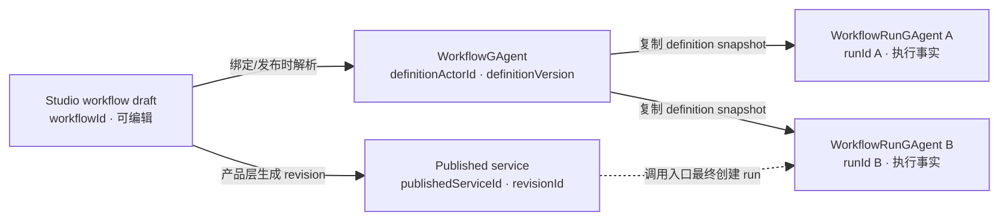
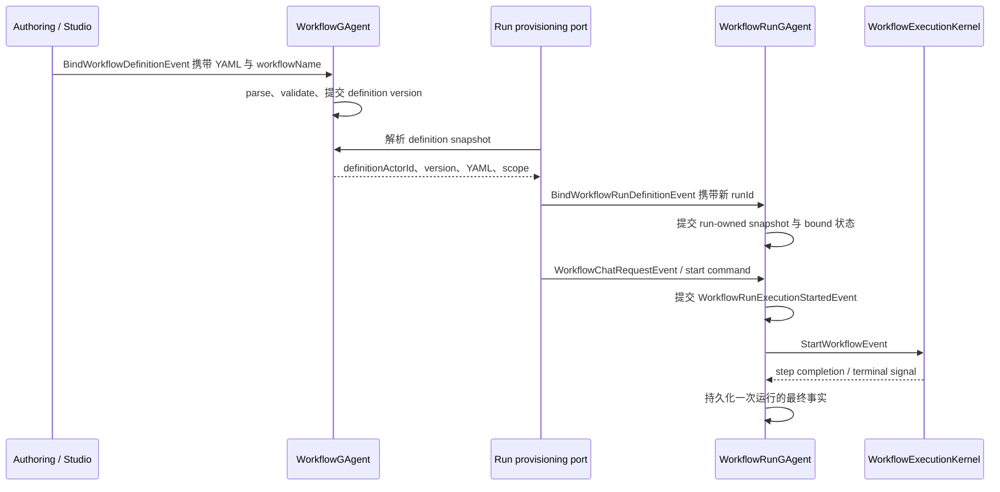

# Workflow 模型与身份：定义、运行、草稿与发布物不是同一个对象

> 版本与结论：本章描述 `current`；当前行为以 `f02aa690` 为准。Workflow Core 把“可复用定义”和“一次执行”交给两个不同 actor；Studio 的草稿、绑定 revision 与 published service 又属于产品资源层。它们可以互相引用，但任何两个 ID 都不能混用。

## 设计抽象与事实源

- `src/workflow/Aevatar.Workflow.Core/WorkflowGAgent.cs:13`：`WorkflowGAgent` 明确只拥有 definition YAML 与编译结果。
- `src/workflow/Aevatar.Workflow.Core/WorkflowRunGAgent.cs:397`：`WorkflowRunGAgent` 在绑定时复制定义内容，并以自己的 `run_id` 承载一次执行。
- `src/workflow/Aevatar.Workflow.Core/workflow_state.proto:86`：`WorkflowRunState` 把 definition identity、run identity、执行状态与恢复游标放进同一个 run-owned 事实边界。

## 先建立模型

先按“谁能改变这项事实”区分五类身份：

| 身份 | 所有者 | 代表什么 | 不能冒充什么 |
|---|---|---|---|
| `workflowId`（Studio draft） | Studio workspace 资源 | 可编辑 YAML 草稿 | definition actor id、run id |
| `definitionActorId` | `WorkflowGAgent` | 已绑定并编译的 definition 权威 | 某次运行、published service |
| `definitionVersion` | definition actor | definition actor 内单调版本 | service revision |
| `runId` / run actor id | `WorkflowRunGAgent` | 一次执行及其恢复事实 | workflow 草稿或定义 |
| `publishedServiceId` / `revisionId` | Studio member + service 平台 | 可发现、可调用的发布资源与版本 | definition/run identity |



箭头表示引用或转换，不表示同一身份。尤其是 `workflowId == definitionActorId == runId` 这种偶然相等也没有契约意义；调用方不得靠字符串格式推导它们之间的关系。

## 沿一次运行走读

definition actor 收到 YAML 后先解析、校验并提交 `BindWorkflowDefinitionEvent`。它保存的是可复用定义，不执行步骤。创建一次运行时，应用层把 `definitionActorId`、YAML、name 与可选 inline definitions 绑定到新的 run actor；run actor 把快照写进 `WorkflowRunState`，此后步骤、重试、挂起、补偿与终态都由这个 run 独占。



关键不变量有三条：

1. definition 更新不会热替换已经绑定并开始的 run；run 依赖自己的 definition snapshot。
2. 同一 definition 可以产生多个 run；每个 run 的状态、命令去重、文件归属和补偿游标互不共享。
3. published service 是调用和版本治理资源，不是执行容器；一次 service 调用仍要落到新的或明确复用的 run identity。

## 为什么是它，不是别的

**为什么不让 `WorkflowGAgent` 同时执行所有 run？** 单个 definition actor 会把多个调用的步骤、重试和挂起塞进同一 mailbox 与状态树：一个慢 run 会阻塞所有调用，清理一个 run 也可能误伤另一个。拆出 run actor 后，definition 负责复用，run 负责隔离，生命周期和故障半径都与一次执行对齐。

**为什么 run 要复制 snapshot，而不是每一步回读最新 definition？** 每一步回读会让一次运行在中途跨版本：恢复后可能走另一张图，审计也无法回答“当时执行的是哪份定义”。snapshot 增加一份有限的 YAML/identity 复制，却换来确定性恢复和版本诚实。

**为什么产品发布身份不能直接复用 actorId？** `publishedServiceId` 要满足可发现、revision 激活/退役和 rename-safe 调用，而 actorId 只是不透明运行地址。把两者绑死会让服务版本治理侵入 runtime identity；当前 Studio facade 因此由 member 内部解析 published service，调用者不传 serviceId。

## 协议与状态深入

- `WorkflowState` 保存 definition YAML、name、version、编译状态、scope、inline definitions 与 capability admission plan；不保存某次运行的 step 状态。
- `WorkflowRunState` 保存 `definition_actor_id`、definition snapshot、`run_id`、status、input/output/error、execution states、child-run handoff、saga ledger 与通知目标。它是一次运行恢复的唯一权威。
- `WorkflowDefinitionSnapshot` 显式携带 `definition_actor_id / workflow_name / workflow_yaml / inline_workflow_yamls / scope_id / definition_version`，说明子工作流解析同样绑定版本化快照，而非只传 name。
- run actor 将收到的 command identity 记录为 `last_command_id`；同一 run 若收到不同 command 会拒绝，重投同一 command 则按已持久化状态幂等恢复。
- Studio draft 的稳定 `workflowId` 在 workspace 侧创建；member 绑定后才拥有 published service 和 revisions。`src/Aevatar.Studio.Application/Studio/Abstractions/IStudioMemberService.cs:68` 明确 published service identity 由 member facade 内部解析。

## 最小示例

> Demo status：`verified-static`（按冻结 proto 与 bind 方法静态推演，未启动 Host。）

```yaml
name: summarize
steps:
  - id: answer
    type: llm_call
    parameters:
      prompt: "${input}"
```

同一 YAML 可以经历这些互不等价的标识：

```text
draft workflowId      = wf_01
definitionActorId     = 5c...a9
definitionVersion     = 3
publishedServiceId    = svc_73...
revisionId            = rev_4
runId                 = run_20260728_001
```

静态验算：若再次调用同一 revision，应产生另一个 `runId`；若 draft 更新为 version 4，已启动的 version 3 run 仍按其 snapshot 恢复。

## 边界与演进

- **current**：definition/run actor 分离、run-owned snapshot、command identity 与子运行 version binding 均在冻结代码落地。
- **current，但属于产品层**：draft、member binding、published service 与 service revision 已有独立契约；详细发布链路在 `06/02-draft-revision-binding-and-published-service.md` 解释。
- **边界**：`WorkflowRunGAgent` 是 run-scoped orchestration boundary，类本身很大是当前实现事实；这不授权把 definition、Studio draft 或 service catalog 事实塞回 run。
- **演进规则**：定义升级默认前滚——新 run 取新快照，存量 run 不热换实现；需要热迁移时必须先有显式状态迁移协议。

## 读完应能回答

1. definition actor 与 run actor 分别拥有哪类事实？
2. 为什么同一 definition 可以对应多个 run，而一个 run 只能绑定一个 command identity？
3. definition snapshot 为什么必须带 actor id、version 与 YAML？
4. Studio draft、published service、service revision 和 runId 为什么不能互换？
5. definition 更新后，已开始的 run 应继续用旧快照还是读取最新 YAML？为什么？

<details>
<summary>论断—证据映射</summary>

| 论断 | 等级 | 证据 |
|---|---|---|
| definition actor 只拥有 YAML 与编译结果 | E1 | `src/workflow/Aevatar.Workflow.Core/WorkflowGAgent.cs:13` |
| definition bind 先编译并以领域事件提交版本 | E1 | `src/workflow/Aevatar.Workflow.Core/WorkflowGAgent.cs:45` |
| run bind 复制 definition identity、YAML 与独立 runId | E1 | `src/workflow/Aevatar.Workflow.Core/WorkflowRunGAgent.cs:397` |
| run 状态独占执行、补偿与终态事实 | E1 | `src/workflow/Aevatar.Workflow.Core/workflow_state.proto:138` |
| definition snapshot 携带版本与完整定义引用 | E1 | `src/workflow/Aevatar.Workflow.Abstractions/workflow_execution_messages.proto:597` |
| Studio member facade 内部解析 published service，并单独管理 revision | E1 | `src/Aevatar.Studio.Application/Studio/Abstractions/IStudioMemberService.cs:68`、`src/Aevatar.Studio.Application/Studio/Abstractions/IStudioMemberService.cs:83` |
| draft workflowId 由 workspace 单独创建和保存 | E1 | `src/Aevatar.Studio.Application/Studio/Services/WorkspaceService.cs:168` |

</details>
