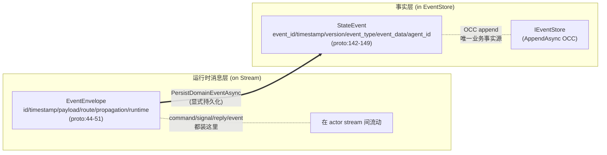

# ★ 最易误解的边界:EventEnvelope(runtime message) vs StateEvent(事实源)

## 关键代码(事实源,以 ~/Code/aevatar 为准)

- `src/Aevatar.Foundation.Abstractions/agent_messages.proto` 第 44-51 行:`EventEnvelope`(id/timestamp/payload/route/propagation/runtime);第 142-149 行:`StateEvent`(event_id/timestamp/version/event_type/event_data/agent_id)。
- `agent_messages.proto` 第 53-60 行:`EnvelopeRoute`;第 62-64 行:`DirectRoute`;第 66-79 行:`PublicationRoute`(topology/observer);第 29-40 行:`TopologyAudience`/`ObserverAudience` 枚举。
- `agent_messages.proto` 第 151-160 行:`EventStoreCommitResult`/`CommittedStateEventPublished`。
- `src/Aevatar.Foundation.Abstractions/Persistence/IStateStore.cs` 第 11-21 行:简单 snapshot(Load/Save/Delete)。
- `src/Aevatar.Foundation.Abstractions/Persistence/IEventStore.cs` 第 11-41 行:Event Sourcing append log(AppendAsync OCC → EventStoreCommitResult;GetEventsAsync;DeleteEventsUpToAsync 压缩)。
- `src/Aevatar.Foundation.Core/GAgentBase.TState.cs` 第 205-230 行:`PersistDomainEventsAsync`(核心 commit 路径);第 276-309 行:`PublishCommittedDomainEventsAsync`。
- `docs/canon/architecture.md` 第 51-55 行、第 71 行:EventEnvelope vs StateEvent 边界。
- `docs/canon/event-sourcing.md` 第 13 行、第 23-27 行:§2.1 与 Runtime 消息流的边界。

---

## 全书最容易踩坑的概念

`EventEnvelope` 名字里有 "Event",但在 Foundation 语义上它是 **runtime message envelope** —— payload 既可能是 command-like request/signal/reply/timeout,也可能是业务事件。**Event Sourcing 的持久化事实是 `StateEvent` + `EventStore`,不是运行时消息流。** 两者有关联但不是一回事。

`docs/canon/event-sourcing.md` 第 23-27 行的四条边界:
1. EventEnvelope = runtime message envelope(第 24 行)
2. payload 可能是 command/signal/reply/timeout/业务事件(第 25 行)
3. 只有显式持久化的领域事件才成为 EventStore 里的 StateEvent(第 26 行)
4. 两条流是不同的层(第 27 行)

---

## 两层分开画

| | `EventEnvelope` | `StateEvent` |
|---|---|---|
| 是什么 | Actor runtime 的消息信封 | Event Sourcing 写侧事实 |
| proto 行号 | 第 44-51 行 | 第 142-149 行 |
| 字段 | id/timestamp/payload/route/propagation/runtime | event_id/timestamp/**version**/event_type/event_data/agent_id |
| 装什么 | command/signal/reply/timeout/业务事件 | 已提交的领域事件 |
| 存哪 | Stream(运行时传输) | EventStore(持久化,带 OCC version) |
| 关系 | 只有 `PersistDomainEventAsync` 后才进入事实层 | 是 EventEnvelope payload 的持久化投影 |

---

## 一个具体例子:它如何同时出现在两层

以 `WorkflowRunGAgent` 处理 `ChatRequestEvent` 为例:

1. **运行时层**:`ChatRequestEvent` 作为 `EventEnvelope.payload` 从 API 经 dispatch port 进入 run actor 的 inbox(消息流)。
2. **事实层**:run actor 决定持久化 `WorkflowRunExecutionStartedEvent` → 调 `PersistDomainEventAsync` → 该事件成为 `StateEvent`(带 version)存入 EventStore。

两个事件都"叫 event",但 `ChatRequestEvent` 是运行时消息(command-like),`WorkflowRunExecutionStartedEvent` 是已提交事实。前者可以丢弃/重放;后者是权威业务记录。

---

## IStateStore vs IEventStore

| | `IStateStore<TState>` | `IEventStore` |
|---|---|---|
| 文件 | `Persistence/IStateStore.cs:11-21` | `Persistence/IEventStore.cs:11-41` |
| 用途 | 简单 key/value snapshot(Load/Save/Delete) | Event Sourcing append log |
| 特性 | 无版本 | OCC append(`AppendAsync(agentId, events, expectedVersion)` → `EventStoreCommitResult`,第 17-21 行)+ range query + 压缩(`DeleteEventsUpToAsync`) |
| 角色 | 快照/恢复 | **唯一业务事实源** |

`docs/canon/event-sourcing.md` 第 16-17 行明确:`EventStore`/`StateEvent` 是唯一业务事实源;`GAgentBase<TState>` 不用 `StateStore` 存事实(只用于恢复)。

---

## PersistDomainEventAsync:从消息层到事实层的桥

`GAgentBase<TState>.PersistDomainEventsAsync`(`GAgentBase.TState.cs` 第 205-230 行):

1. `eventSourcing.RaiseEvent(evt)` 缓冲到 `_pending`(第 220 行)
2. `eventSourcing.ConfirmEventsAsync(ct)` 原子 append `StateEvent` 到 `IEventStore`(OCC,第 222 行)
3. 在 `StateGuard.BeginWriteScope()`(第 224 行)内,逐个 `eventSourcing.TransitionState(_state, evt)` fold(第 226 行)
4. `OnStateChangedAsync` hook(第 228 行)+ `PublishCommittedDomainEventsAsync`(第 229 行)

`PublishCommittedDomainEventsAsync`(第 276-309 行):把每个 committed `StateEvent` 包成 `CommittedStateEventPublished`(第 282-286 行),经 `CommittedStateEventPublisher.PublishAsync` 以 `ObserverAudience.CommittedFacts`(第 287、303-307 行)发布。这是从事实层回到运行时观察的桥。

---

## 验收

1. EventEnvelope 是 Event Sourcing 的事实吗?(不是,是 runtime message envelope;事实是 StateEvent + EventStore)
2. 一个事件怎么从消息层进入事实层?(显式 `PersistDomainEventAsync`,`GAgentBase.TState.cs:205`)
3. IStateStore 和 IEventStore 区别?(前者 snapshot;后者 OCC append log,唯一事实源)
4. StateEvent 的 version 字段做什么?(OCC 乐观并发控制)

⟦AI:AUTO-LOOP⟧
