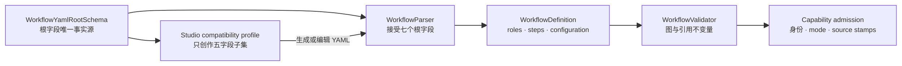
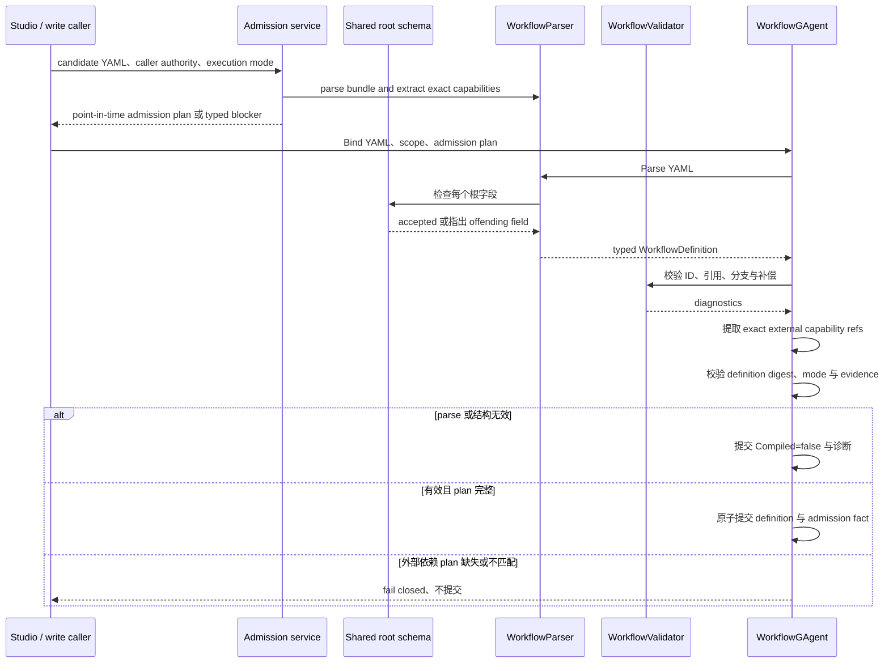

# Workflow YAML：一个根模式，四道不同的关

> 版本与结论：本章描述 `current`；当前行为以 `f02aa690` 为准。Workflow YAML 只有一份根字段契约，但“能解析”“图结构有效”“运行时认识这些原语”“外部能力已获准”是四个不同结论，任何一关都不能替下一关背书。

## 设计抽象与事实源

- `src/workflow/Aevatar.Workflow.Abstractions/Workflows/WorkflowYamlRootSchema.cs:5`：集中定义 parser 接受的根字段，以及 Studio 可创作的子集。
- `src/workflow/Aevatar.Workflow.Core/Primitives/WorkflowParser.cs:86`：先拒绝未知根字段，再映射 `roles`、`steps`、路由、参数与运行配置。
- `src/workflow/Aevatar.Workflow.Core/WorkflowGAgent.cs:193`：definition actor 记录编译结果，并对已生成的外部能力 admission plan 做独立完整性校验。

## 先建立模型

权威根模式接受七个字段：`name`、`description`、`when_to_use`、`configuration`、`roles`、`steps`、`on_failure`。Studio 的可创作面是其中更窄的五项：`name`、`description`、`configuration`、`roles`、`steps`。这是同一契约中的有意子集，不是第二套 YAML 方言。



四道关分别回答：

| 阶段 | 输入与输出 | 能证明什么 | 不能证明什么 |
|---|---|---|---|
| 根模式与语法 | YAML 文本 → 可接受文档 | YAML 可读、根字段属于 Aevatar 方言 | step 引用正确、能力可用 |
| 强类型映射 | 原始节点 → `WorkflowDefinition` | 字段、别名和默认值已归一化 | 整张图连通且可执行 |
| 结构校验 | typed definition → diagnostics | ID、角色、后继、分支和补偿满足当前规则 | 运行节点已加载原语、外部授权已就绪 |
| capability admission | definition + caller/mode/evidence → plan | 精确外部能力在指定执行模式下被准入 | 未来永远可用 |

## 沿一次 bind 走读

`WorkflowYamlValidatorImpl` 是轻量 parse 入口：成功时返回 definition name、role/step 数量；它没有调用完整的 `WorkflowValidator`，所以不能被表述为“已可执行”。普通 write 入口先由应用层对 external capability 做 live admission，再把 plan 连同 YAML 交给 definition actor。actor 自己重新解析 typed model、检查图结构、提取依赖并校验 plan 完整性，caller 的结论不能覆盖 actor 的解析结果。

definition actor 对两类失败的处理不同：语法或结构错误会形成 `Compiled=false` 与 `CompilationError`，使该 definition 不可解析为可运行快照；如果定义本身有效，但外部依赖缺少 plan 或 plan 与 YAML 不匹配，则 bind 在持久化前直接抛错。前者保留无效定义的诊断事实，后者防止伪造授权证据落库。



失败必须由其所属边界解释：`version`、`inputs` 等外来根字段由 parser 明确报错；不存在的 `next` 或 role 由结构校验报告；缺失或不匹配的外部能力 plan 由 admission 拒绝。查询接口不得为了“让校验通过”暗中刷新、激活或补种授权状态。

## 为什么是它，不是别的

**为什么未知根字段要 fail fast，而不是忽略？** LLM 很容易生成 GitHub Actions 风格的 `version`、`inputs`、`jobs`。静默丢弃会让作者看到“解析成功”，运行时却没有那些语义；指出 offending field 才能让人或生成器修复方言。

**为什么 Studio 不能维护自己的根字段常量？** 两份白名单迟早漂移，结果就是 UI 能保存、runtime 不能解析，或 runtime 已支持而 UI 拒绝。Studio profile 直接消费共享根模式，并用测试保证 authorable 集合始终是 parser-accepted 集合的子集。

**为什么 parser 不顺便访问 connector 或 NyxID？** parse 应对同一文本给出稳定结果；外部 readiness 依赖 authenticated caller、执行模式和时点。把网络与授权读取塞进 parser 会让预览、重放和启动得到不同定义，也会诱发 query-time refresh。

**为什么参数归一为字符串？** primitive 模块获得稳定的 `Dictionary<string, string>`，无需面对 YAML 库的多种标量类型。布尔值使用小写、数值使用 invariant culture；mapping/list 会递归规范化后序列化为 JSON 字符串，因此复杂值不会被静默丢掉。代价是模块必须显式解析它声明的结构化参数。

## 协议与状态深入

### 根、角色与步骤

- `name` 是必填 definition name；`description` 是说明；`when_to_use` 是 skill 触发提示，runtime 不消费。
- `configuration.closed_world_mode` 是当前 typed runtime configuration；不能把任意 Host 配置塞进 YAML。
- `roles[]` 以 `id` 建立引用边界，可携带 `agent_kind`、模型参数、`allowed_tools`、event modules/routes 与 connector scope。省略 `name` 时 parser 回退到 role id。
- `steps[]` 以 `id` 建图；`type` 会归一为 canonical primitive，省略时当前默认是 `llm_call`，但文档和人工评审仍应显式填写。
- `target_role` 是规范字段，`role` 是兼容别名。`next` 表示显式后继；未写 `next` 时 typed model 按顶层列表顺序取下一步。`branches` 可写 mapping，也可写带 condition/next 的 list，最终都归一为 label → step id。
- `retry`、`on_error`、`timeout_ms` 属于 step 执行政策；`compensation` 是另一个 step id 的引用，不是 parser 自动生成的撤销逻辑。

### 参数不会悄悄消失

下面的完整 YAML 把标量和复合值同时放进一个 step：

```yaml
name: parameter_shapes
steps:
  - id: preserve_values
    type: transform
    parameters:
      temperature: 0.2
      strict: true
      response_shape:
        type: object
        required: [category]
```

会进入 typed parameter map，语义等价于：

```text
temperature    = "0.2"
strict         = "true"
response_shape = "{\"type\":\"object\",\"required\":[\"category\"]}"
```

部分常用 primitive 参数也允许写在 step 根级，parser 会提升进 `parameters`；已有同名 `parameters` 值优先。这个兼容面适合读取既有 YAML，不应成为 UI 自创字段的理由。

### “已知原语”是较晚的运行时问题

definition actor 的基础编译允许暂不要求全部 type 已注册，用于保存和解析定义；run bind 会结合 built-in catalog、模块清单与 factory 再做 known-step-type 校验。因此 `WorkflowYamlValidatorImpl.Success` 只代表 parse 成功，不能冒充 run 已具备执行模块。

## 最小示例

> Demo status：`verified-static`（按冻结 parser/root schema/validator 静态核对，未启动 Host，也未请求外部 capability readiness。）

```yaml
name: ticket_triage
description: Classify one ticket and normalize the result.
configuration:
  closed_world_mode: true
roles:
  - id: triager
    name: Triager
    allowed_tools:
      - search_docs
steps:
  - id: classify
    type: llm_call
    target_role: triager
    parameters:
      prompt: "Classify: ${input}"
      response_shape:
        type: object
        required: [category]
    next: normalize
  - id: normalize
    type: transform
    parameters:
      op: identity
```

静态验算：根字段均在共享模式内；role 与 step id 唯一；`target_role` 和 `next` 都能解析；嵌套 `response_shape` 被保存为 JSON 字符串。示例没有外部 connector/NyxID 引用，所以不声称验证过任何外部授权。

## 边界与演进

- 共享根模式是顶层字段 SSOT，不表示 Studio 必须暴露 parser 的每个维护者字段；authorable 子集应保持显式且可测试。
- Studio 还有 role/step 字段 compatibility profile，用于编辑反馈；最终 runtime 事实仍由 platform parser 与 bind validation 决定。
- parse 结果不是 capability readiness。外部能力的 typed listing、interactive/durable 差异、source stamp 与 persisted revalidation 在 `03/07-connectors-and-capability-admission.md` 展开。
- 增加根字段时必须先改共享模式，再让 parser、Studio profile、生成提示与契约测试一起演进；不能只放宽某一个入口。
- admission 是 point-in-time 决策。即使定义已 bind，执行前仍应按其协议验证持久化 plan，而不是把一次 READY 写成永久保证。

## 读完应能回答

1. parser-accepted 与 Studio-authorable 根字段为何不是两套 schema？
2. `WorkflowYamlValidatorImpl.Success` 为什么不能证明 workflow 已可执行？
3. `next`、`branches`、列表顺序分别怎样决定后继？
4. YAML 的布尔、数值、mapping 与 list 怎样进入 `StepDefinition.Parameters`？
5. 为什么 external capability admission 必须晚于 parse/structure validation，且不能藏进查询刷新？

<details>
<summary>论断—证据映射</summary>

| 论断 | 等级 | 证据 |
|---|---|---|
| parser 与 Studio profile 消费同一根模式，authorable 字段是 accepted 字段的子集 | E1 | `src/workflow/Aevatar.Workflow.Abstractions/Workflows/WorkflowYamlRootSchema.cs:11`、`src/Aevatar.Studio.Domain/Studio/Compatibility/WorkflowCompatibilityProfile.cs:172` |
| parser 在 typed deserialize 前拒绝未知根字段 | E1 | `src/workflow/Aevatar.Workflow.Core/Primitives/WorkflowParser.cs:86` |
| roles、steps、configuration 与路由被映射成 typed definition | E1 | `src/workflow/Aevatar.Workflow.Core/Primitives/WorkflowParser.cs:90`、`src/workflow/Aevatar.Workflow.Core/Primitives/WorkflowParser.cs:170` |
| scalar 以稳定字符串保存，mapping/list 递归规范化为 JSON | E1 | `src/workflow/Aevatar.Workflow.Core/Primitives/WorkflowParser.cs:910`、`src/workflow/Aevatar.Workflow.Core/Primitives/WorkflowParser.cs:1239` |
| 结构校验检查 step/role/next/branch/compensation 关系 | E1 | `src/workflow/Aevatar.Workflow.Core/Validation/WorkflowValidator.cs:28` |
| definition bind 记录编译结果；有效定义在提交前提取依赖并校验 admission plan | E1 | `src/workflow/Aevatar.Workflow.Core/WorkflowGAgent.cs:45`、`src/workflow/Aevatar.Workflow.Core/WorkflowGAgent.cs:89`、`src/workflow/Aevatar.Workflow.Core/WorkflowGAgent.cs:172` |
| run 侧会结合真实模块集合拒绝未知原语 | E1 | `src/workflow/Aevatar.Workflow.Core/WorkflowRunDefinitionValidationSupport.cs:9` |
| Studio 生成 YAML 会回到 platform parser 验证，外来根字段触发修复重试 | E1 | `test/Aevatar.Studio.Tests/StudioAuthoringPreviewApplicationServiceTests.cs:38` |

</details>
