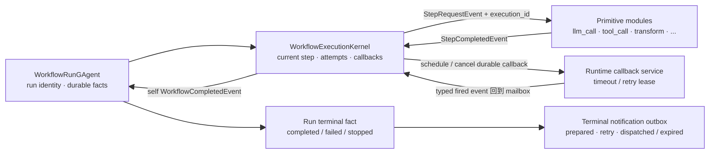
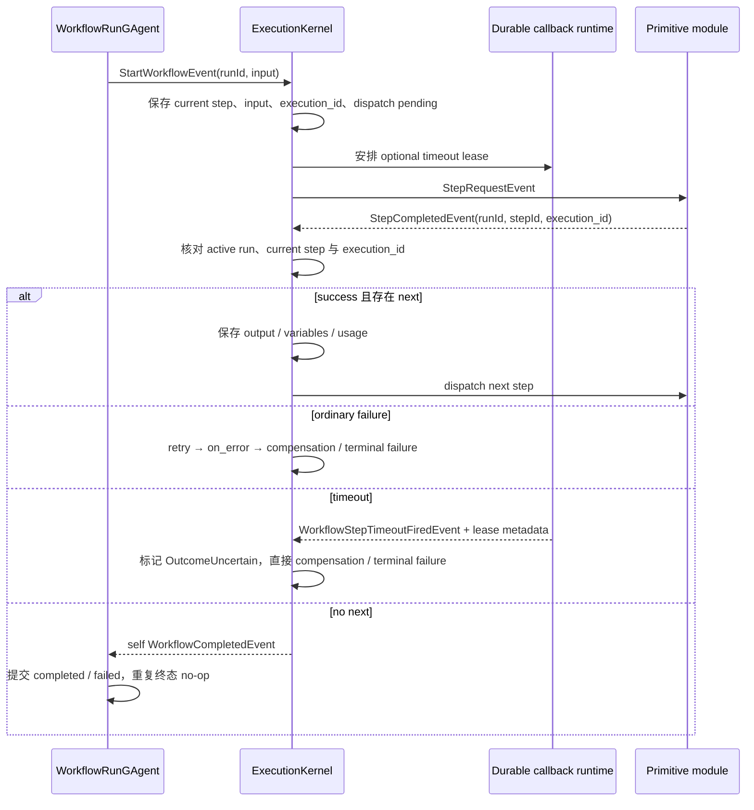

# Workflow 执行内核：把异步步骤收敛成一个 run 终态

> 版本与结论：本章描述 `current`；当前行为以 `f02aa690` 为准。`WorkflowExecutionKernel` 不直接拥有另一份 run，而是安装在 `WorkflowRunGAgent` 内，用 actor-owned execution state 协调步骤、回调和失败政策；最终只有 run actor 能把一次执行提交为 `completed`、`failed` 或 `stopped`。

## 设计抽象与事实源

- `src/workflow/Aevatar.Workflow.Core/Execution/WorkflowExecutionKernel.cs:14`：actor 内的执行模块，统一消费 start、step completion、timeout、retry 与 compensation 信号。
- `src/workflow/Aevatar.Workflow.Abstractions/workflow_execution_messages.proto:536`：`StepRequestEvent` / `StepCompletedEvent` 定义一次 step attempt 的 typed 请求与结果。
- `src/workflow/Aevatar.Workflow.Core/WorkflowRunGAgent.cs:1006`：run actor 去重 completion、提交终态，再驱动清理与外部通知。

## 先建立模型

执行链不是调用栈，而是一组在同一 run actor mailbox 内对账的事实与信号：



这里有三层所有权：

| 层 | 拥有什么 | 不拥有什么 |
|---|---|---|
| primitive module | 一类 step 的执行语义，并产出 typed completion / suspension | 下一步选择、run 终态 |
| execution kernel | 当前 step、attempt、`execution_id`、变量、timeout/retry lease 与路由决策 | 独立 actor identity、对外查询真相 |
| run actor | definition snapshot、execution state、saga 与最终状态 | 每种 primitive 的业务实现 |

## 沿一次执行走读

start 先初始化 kernel state，再选择入口 step。每次 dispatch 都生成新的 `execution_id`，把 current step、输入、pending flag 和 callback identity 先写入 actor-owned execution state，然后安排 timeout lease，最后发布 `StepRequestEvent`。这样 actor 在发布边界崩溃后，仍知道应该恢复哪次 dispatch。



### completion 必须先对账

kernel 不按“最先到达者获胜”处理 completion：

1. 缺少 `run_id`、run 已非 active、或 step 不是 current step，信号被忽略。
2. 每次 dispatch 都生成新的 `execution_id`；completion 携带非空 `execution_id` 且与当前值不等时，发布 `StaleStepCompletionRejectedEvent`，不改变量、不推进图。
3. 匹配的 completion 才取消 timeout lease，写 output、usage、annotations 和 assigned variable。
4. `next_step_id` 可由 primitive 明确给出；否则根据 `branch_key`、definition 的 `next` 或列表顺序选后继。没有后继才是成功终止。

这套对账用 current step 与非空 `execution_id` 同时处理“timeout 已触发，但旧外部调用稍后又返回”和“retry 已开始，上一 attempt 才完成”两类竞态。旧模块若省略 `execution_id`，只能获得 current-step 防护，不能宣称具备 attempt-level fencing。

有些 primitive 会产生不对应 definition step id 的内部 completion。kernel 只把这类 output 写入同名变量便返回，不取消或推进当前顶层 step。内部子操作因此不能靠伪造 `StepCompletedEvent` 越过外层 primitive 的聚合/终止语义。

## 为什么是它，不是别的

**为什么主循环放在 run actor，而不是 Host 里的 `while`？** Host 内循环一旦进程重启，就丢失 current step、attempt 和已安排回调；多个并发 run 还要自己加锁。actor mailbox 提供每个 run 的串行边界，execution state 又能被持久化和恢复。

**为什么 module 只产出 `StepCompletedEvent`，不直接调用下一 module？** 直接调用会绕过 retry、timeout、branch、usage、saga 和终态去重。所有结果回到 kernel 后，跨 primitive 的政策只实现一次。

**为什么 timeout 不沿用普通 retry？** timeout 表示 callee 可能已经产生副作用，只是 caller 没看到结果。立即重试会与迟到 completion 或已发生的外部效果竞态；当前 kernel 因此把 timeout 标成 `OutcomeUncertain`，绕过普通 retry / `on_error`，进入 compensation 或失败收敛。

**为什么终态通知另做 outbox？** run 的 `completed` / `failed` / `stopped` 是本 actor 已提交的事实；通知只是把这个事实送给另一个 actor。若把两者绑成一个同步成功，网络故障会让已经结束的 run 看起来仍在 running。

## 协议与状态深入

### 普通失败的决策顺序

非 timeout 的 `Success=false` 按固定顺序处理：

1. **retry**：`max_attempts` 含首次，当前限制在 `1..10`；`fixed` 或 `exponential` delay 被限制到最多 60 秒。正 delay 通过 durable self-callback lease 触发，不用进程内 timer。
2. **`on_error`**：`skip` 用 default/output 继续下一步；`fallback` 跳到显式 fallback step。两者都是作者明确选择的“把失败转成继续”，因此之后可能得到成功终态。
3. **compensation / terminal failure**：前两项都不接管时，若存在可补偿 ledger 则先补偿，否则发布失败 completion。补偿细节见 `03/06-saga-compensation-and-recovery.md`。

step dispatch 或 completion handler 自身抛错也必须转成 typed failure 路径，不能只记日志后把 run 留在 `running`。

### typed tool failure 不是 error-shaped JSON

`IWorkflowTool` 返回 `WorkflowToolExecutionResult`。成功与 `Failure(errorCode, errorMessage)` 是显式分支；`ToolCallModule` 将后者同时映射为 `WorkflowToolCallCompletedEvent.Success=false` 和 `StepCompletedEvent.Success=false`。kernel 不解析任意 JSON 来猜成功或失败。

!!! warning "冻结基线仍有失败传播缺口"

    冻结 issue 账本把 [#2936](https://github.com/aevatarAI/aevatar/issues/2936) 归为 `confirmed-bug`：仍存在被报告的 tool step 报错后继续并得到成功终态。核心 typed failure 路径已经存在，但这不足以证明每个 tool adapter 都正确构造 `Failure`。因此本章只断言 typed contract 与主收敛路径已落地，不宣称所有 adapter 已无假成功；该缺口最终登记在 `12/05-open-gaps-and-canon-drift.md`。

### `CalleeConfirmed` 与 `OutcomeUncertain`

`StepCompletedEvent.failure_outcome` 只区分两种失败知识：

- `CalleeConfirmed`：callee 明确返回失败；未填写的失败按这一类归一。
- `OutcomeUncertain`：caller 不能确定副作用是否发生；kernel timeout 与 dispatch 边界的不确定失败使用这一类。

这个字段不是展示标签，它影响 saga 对 provisional ledger 的处理。内核不能把“没收到成功”自动等价成“什么都没发生”。

### run 终态与交付状态分开

kernel 只向 self 发布 `WorkflowCompletedEvent`。run actor 验证 publisher/run 归属，第一次处理时先提交事件，使 state 收敛为：

| run status | 来源 | 核心事实 |
|---|---|---|
| `completed` | `WorkflowCompletedEvent.Success=true` | `FinalOutput` |
| `failed` | `WorkflowCompletedEvent.Success=false` 或补偿 dead letter | `FinalError` |
| `stopped` | stop contract | stop reason |

后续重复 completion 会被忽略，但 actor 仍会恢复未完成的终态通知。通知自身有 `prepared`、`retry_scheduled`、`dispatched`、`expired` 状态和 delivery id；它们描述交付尝试，不会倒写 run 终态。

## 最小示例

> Demo status：`verified-static`（YAML 按冻结 parser/validator 静态核对；未启动 Host，未制造真实 timeout。）

```yaml
name: parse_or_fallback
steps:
  - id: parse
    type: transform
    parameters:
      op: json_parse
    retry:
      max_attempts: 2
      backoff: fixed
      delay_ms: 250
    on_error:
      strategy: fallback
      fallback_step: fallback
    timeout_ms: 5000
    next: done
  - id: fallback
    type: assign
    parameters:
      variable: normalized
      value: "{}"
    next: done
  - id: done
    type: transform
    parameters:
      op: identity
```

静态推演：合法 JSON 从 `parse` 直接到 `done`；普通 parse failure 最多尝试两次，再进入 `fallback`；若收到 kernel timeout，则不会走这条 retry / fallback 链，而是直接进入补偿或失败终态。每次 attempt 的 `execution_id` 都不同。

## 边界与演进

- execution kernel 只协调当前 run，不承担跨 run 调度、读模型查询或 Host streaming。live observation 在 `05/05-workflow-agui-and-live-observation.md` 展开。
- `WorkflowCompletedEvent` 是 actor 内收敛信号，不等于 HTTP/SSE 已向客户端完整交付；transport closeout 仍是另一层协议。
- `#2108` 的通用 artifact/file port、`#2658` 的 pinned step artifact 与 `#2699` 的 foreach aggregate/消息大小问题在冻结账本仍是缺口。当前 `WorkflowFileRef` 和 step result 字段不应被夸大成这些能力已经完整落地。
- 在 `#2936` 有 E1/E3 证据证明解决前，新增 tool adapter 必须以 typed `Failure` 接入并验证 run 终态，不能返回 error-shaped success JSON。
- timeout 当前不重试是明确的竞态安全选择。若未来允许 retry，必须先有 callee cancellation/fencing 或可证明的幂等协议。

## 读完应能回答

1. primitive module、execution kernel 与 run actor 分别拥有什么状态？
2. 为什么 `run_id + step_id` 仍不足以拒绝迟到 completion，还需要 `execution_id`？
3. 普通失败、timeout 与 tool typed failure 分别怎样进入收敛路径？
4. `on_error=skip/fallback` 为什么可能把局部失败转成成功 run？
5. run 已 `failed` 与终态通知仍在 retry 为什么不矛盾？

<details>
<summary>论断—证据映射</summary>

| 论断 | 等级 | 证据 |
|---|---|---|
| kernel 统一消费 start、completion、timeout、retry 与 stop 信号 | E1 | `src/workflow/Aevatar.Workflow.Core/Execution/WorkflowExecutionKernel.cs:47` |
| 每次 dispatch 先保存新的 execution id 与 pending/callback 状态，再发布 request | E1 | `src/workflow/Aevatar.Workflow.Core/Execution/WorkflowExecutionKernel.cs:1140` |
| stale execution id 被拒绝且不推进当前 step | E1 | `src/workflow/Aevatar.Workflow.Core/Execution/WorkflowExecutionKernel.cs:315` |
| 不对应 definition step 的内部 completion 只更新变量，不推进主图 | E1 | `src/workflow/Aevatar.Workflow.Core/Execution/WorkflowExecutionKernel.cs:292` |
| 普通失败按 retry、on_error、compensation/terminal 顺序收敛，timeout 绕过普通 retry | E1 | `src/workflow/Aevatar.Workflow.Core/Execution/WorkflowExecutionKernel.cs:391`、`src/workflow/Aevatar.Workflow.Core/Execution/WorkflowExecutionKernel.cs:845` |
| timeout callback 是 durable lease，并产生 OutcomeUncertain completion | E1 | `src/workflow/Aevatar.Workflow.Core/Execution/WorkflowExecutionKernel.cs:213`、`src/workflow/Aevatar.Workflow.Core/Execution/WorkflowExecutionKernel.cs:1341` |
| tool result 用 typed Failure 映射 tool 与 step 的失败结果 | E1 | `src/workflow/Aevatar.Workflow.Core/Modules/IWorkflowToolSource.cs:12`、`src/workflow/Aevatar.Workflow.Core/Modules/ToolCallModule.cs:308` |
| run actor 先提交首次 completion，重复 completion no-op | E1 | `src/workflow/Aevatar.Workflow.Core/WorkflowRunGAgent.cs:1006` |
| run state 由 completion 收敛为 completed/failed，并清理 execution context | E1 | `src/workflow/Aevatar.Workflow.Core/WorkflowRunGAgent.cs:1983` |
| 终态通知是 terminal fact 之后可恢复的 actor-owned outbox | E1 | `src/workflow/Aevatar.Workflow.Core/WorkflowRunGAgent.cs:2095` |
| #2936 在冻结证据中仍是 step failure propagation confirmed bug | E6 | [upstream issue #2936](https://github.com/aevatarAI/aevatar/issues/2936) |

</details>
