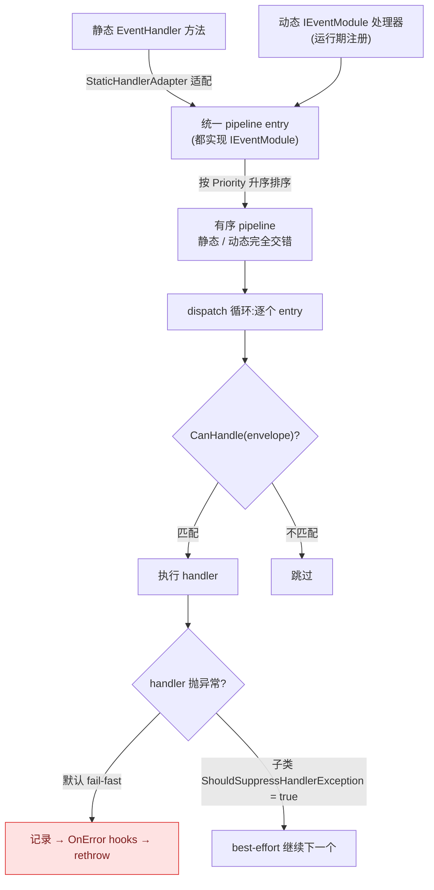
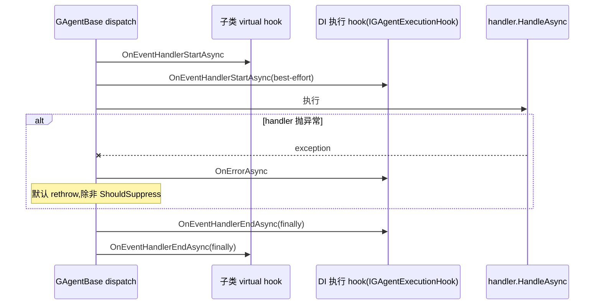

# GAgentBase 统一事件 pipeline:静态[EventHandler] + 动态 IEventModule + 双 Hook

## 本篇涉及的设计抽象

> 以下论断均可回指 `~/Code/aevatar` 源码验证,但本篇用设计语言描述,不贴文件路径/行号。

---

## GAgentBase 解决的问题

Actor runtime 只负责把 envelope 交给 Agent。到了 Agent 内部,还需要一个稳定规则回答三个问题:哪些 handler 参与处理?动态能力怎么插进来?日志、追踪、指标这类横切逻辑放在哪里?

`GAgentBase` 的答案是一条统一 pipeline。开发者写在类上的 `[EventHandler]` 是静态处理器;运行期注册的 `IEventModule<IEventHandlerContext>` 是动态处理器。二者都会被适配成同一种 pipeline entry,再按 priority 合并执行。

---

## 为什么静态和动态要合并

如果静态 handler 和动态 module 各跑一套链路,优先级、错误处理和观测点就会分叉。Aevatar 把它们合并后,一个 envelope 进入 Agent 时只有一套顺序、一套 fail-fast 策略、一套 hook 观测面。

这里的设计收益不是“少写几行反射代码”,而是把 Agent 的可扩展性变成可推理的顺序语义:priority 小的先执行;handler 是否能处理由 `CanHandle` 决定;异常默认中断,除非子类明确选择 suppress。

> 注:dispatch 循环若**全程没有任何 entry 匹配**,这封 envelope 会在 Debug 级别被静默丢弃——这条策略是为修一个「voice session-lease 消息被悄悄吞掉」的真实 bug 而显式加上的(源码注释里有记)。所以"静默丢弃"是有意为之而非疏漏,但它也意味着:发错 envelope 类型不会报错,只会在 Debug 日志里留痕。

---

## 双 Hook 的位置

GAgentBase 留了两条 hook 通道。第一条是子类 override 的 virtual hook,适合 agent 自己的局部扩展。第二条是 DI 注入的 `IGAgentExecutionHook`,适合 tracing、metrics、审计这类跨 agent 的横切能力。

这两条通道共享同一个 handler 生命周期,所以观察到的是同一条 pipeline,不会出现“静态 handler 有日志、动态 module 没日志”这类分裂。

注意两处不对称,读源码时容易看漏:

- **顺序不对称**:进入时是「子类 virtual → DI hook」,退出时反过来是「DI hook → 子类 virtual」(标准的栈式 enter/exit)。
- **失败语义不对称**:handler 异常默认中断整条 pipeline;但 **DI hook 自身抛异常只会被记成 warning,绝不会打断 dispatch**。也就是说 tracing/metrics 坏掉不应该拖垮业务处理——这是把横切能力做成"尽力而为"的有意取舍。

---

## 和状态写保护的关系

`HandleEventAsync` 进入时会打开 StateGuard 的 writable scope。也就是说,pipeline 不是任意业务代码的集合,而是 actor 串行 mailbox 内、被框架允许修改状态的执行区。下一篇会专门讲这个 AsyncLocal 闸门为什么存在。

---

## 验收

1. 静态 `[EventHandler]` 和动态 `IEventModule` 怎么合并?(适配成同一种 pipeline entry 后按 priority 升序排序)
2. Priority 小的先还是后执行?(先执行)
3. 双 Hook 通道是什么?(子类 virtual hook + DI `IGAgentExecutionHook` pipeline)

⟦AI:AUTO-LOOP⟧
