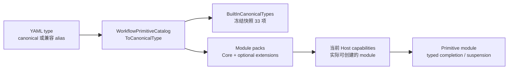
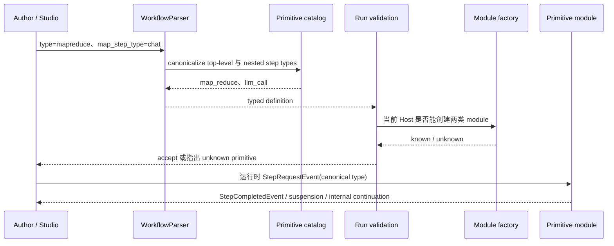

# Workflow 原语目录：canonical type、模块与输出契约

> 版本与结论：本章描述 `current`；当前行为以 `f02aa690` 为准。冻结 `WorkflowPrimitiveCatalog` 派生出 **33 个** built-in canonical type；这是该提交的精确快照，不是“30+”的永久承诺。canonical policy、实际 module pack 与某个 Host 的已安装能力是三件不同的事。

## 设计抽象与事实源

- `src/workflow/Aevatar.Workflow.Core/Primitives/WorkflowPrimitiveCatalog.cs:12`：集中拥有 alias → canonical 映射，并从两个 seed 集合及 alias values 派生 33 项基础集合。
- `src/workflow/Aevatar.Workflow.Core/WorkflowCoreModulePack.cs:8`：把 Core runtime module 注册到一个或多个 step type 名称。
- `docs/canon/workflow-primitives.md:148`：按 data/control/AI/composition/integration/human 解释参数、行为与最小用法。

## 先建立模型



- **catalog** 回答“这个 spelling 归一成什么、基础 policy 认识哪些 canonical type”。
- **module pack** 回答“哪个 CLR module 可以处理哪些名称”。`self_reschedule` 例如来自 schedules extension，不在 Core pack。
- **Host capabilities** 回答“当前部署实际装了什么”。run bind 会用 module pack/factory 再校验 known step type；不能只看 catalog 就保证可执行。

反例同样重要：Core pack 注册 `actor_send`，但它不在本章的 33 项 `BuiltInCanonicalTypes`；`workflow_loop` 在 catalog 中，却是 kernel 内部主循环标识，不是作者应写进 `steps[]` 的业务节点。

## 冻结清单：33 个 canonical type

表中“最小写法”默认还需要 step `id`，并省略图中被引用的目标步骤；“输出”指交给 execution kernel 的主要结果，不等于外部系统已经完成最终交付。

| 分类 | Canonical type | 最小写法 / 必要运行输入 | 主要输出或边界 |
|---|---|---|---|
| Data | `transform` | `type: transform`，可选 `op`，默认 `identity` | 变换后的 string；typed 数值操作失败则 `Success=false` |
| Data | `assign` | `type: assign`；实用配置 `target` + `value` | resolved value，并可写 `AssignedVariable` |
| Data | `retrieve_facts` | `type: retrieve_facts`；input 为行/数组，可选 `query/top_k` | 按相关度取出的换行文本 |
| Data | `cache` | `type: cache`；建议显式 `child_step_type` | child output；`cache.hit/key` annotations |
| Control | `guard` | `type: guard`；默认 `check=not_empty` | 原 input；失败可 fail/skip/branch |
| Control | `conditional` | `type: conditional` + `true/false` branches | 原 input + `BranchKey=true|false` |
| Control | `switch` | `type: switch` + `_default` branch | 原 input + 命中的 branch key |
| Control | `while` | `type: while` + `condition` 或 `max_iterations`；可选 `step` | 最后一次子步骤 output |
| Control | `delay` | `type: delay`，可选 `duration_ms` | durable callback 后透传 input |
| Control | `wait_signal` | `type: wait_signal` + `signal_name` | signal payload；空 payload 时透传 input |
| Control | `checkpoint` | `type: checkpoint` | 当前实现透传 input；不是独立外部快照服务 |
| Control | `workflow_yaml_validate` | `type: workflow_yaml_validate`；input 含 fenced YAML | canonical fenced YAML，或修复 diagnostics |
| Control | `workflow_loop` | **内部安装，不在业务 YAML 中直接创作** | 派发/收敛主循环，无普通作者输出 |
| AI | `llm_call` | `type: llm_call`；`target_role` 可选，缺省采用隐式 `assistant` role | LLM content + usage |
| AI | `tool_call` | `type: tool_call` + `parameters.tool` | JSON string；typed tool failure 转 step failure |
| AI | `evaluate` | `type: evaluate`；`target_role` 可选，缺省以当前 actor 为 target | 原 input + score/passed annotations，可带 branch |
| AI | `reflect` | `type: reflect`；`target_role` 可选，缺省以当前 actor 为 target | PASS 或达到轮数上限时的 final draft |
| Composition | `foreach` | `type: foreach`；input/items + `sub_step_type` | 子结果按 `\n---\n` 合并，另有 item results |
| Composition | `parallel` | `type: parallel` + `workers` 或 `target_role` | 汇总结果，或配置 vote 后的 agreement 结果 |
| Composition | `race` | `type: race` + `workers` 或 `target_role` | 首个成功 output + `race.winner`；全失败则失败 |
| Composition | `map_reduce` | `type: map_reduce` + items/input；建议显式 map/reduce type 与 role | reducer output；无 reducer 时为合并 map output |
| Composition | `workflow_call` | `type: workflow_call` + `parameters.workflow` | child workflow 的 typed completion |
| Composition | `vote` | `type: vote`；input/typed candidates 至少一项 | decision output、branch、typed agreement decision |
| Composition | `dynamic_workflow` | `type: dynamic_workflow`；input 含 fenced YAML | 校验后发布 replace-and-execute，不是普通 string completion |
| Composition | `self_reschedule` | `type: self_reschedule` + `schedule_id`、`cron_expression`、`scope_id`，以及 `workflow_name` 或 `service_id` | accepted schedule id + actor/command/correlation annotations |
| Integration | `connector_call` | `type: connector_call` + `connector`，通常还需 exact `operation` | connector output + typed annotations/failure |
| Integration | `secure_connector_call` | 与 `connector_call` 同形，但走 secure payload handling | redaction-aware connector outcome；仍需 capability admission |
| Integration | `emit` | `type: emit`；可选 `event_type/payload` | 透传 input；向 `ParentAndChildren` 发布带 `emit.*` annotations 的 `StepCompletedEvent` |
| Human | `human_input` | `type: human_input`；可选 prompt/variable/timeout | resume 的 user input，或 timeout policy 结果 |
| Human | `human_approval` | `type: human_approval`；可选 prompt/timeout/delivery target | approved content/input，或 reject/timeout 结果 |
| Human | `secure_input` | `type: secure_input`；可选 variable/timeout | **masked output**；真实值以 typed reference 留在 runtime context |
| General | `lease` | `type: lease` + `key`；renew/release 另需 token + generation | holder token + lease annotations |
| General | `notify` | `type: notify` + `delivery_target_id` + 且仅一个 typed interaction payload | `accepted` + annotation；不代表渠道送达或已读 |

## Alias 只负责兼容，不创造新语义

冻结 catalog 有 26 个 alias key，归一到 17 个 canonical type：

| Canonical | Accepted aliases |
|---|---|
| `while` | `loop` |
| `workflow_call` | `sub_workflow` |
| `foreach` | `for_each`、`foreach_llm` |
| `parallel` | `parallel_fanout`、`fan_out` |
| `map_reduce` | `mapreduce`、`map_reduce_llm` |
| `evaluate` | `judge` |
| `race` | `select` |
| `guard` | `assert` |
| `delay` | `sleep` |
| `emit` | `publish` |
| `wait_signal` | `wait` |
| `connector_call` | `bridge_call`、`cli_call`、`mcp_call`、`http_get`、`http_post`、`http_put`、`http_delete` |
| `secure_connector_call` | `secure_connector` |
| `secure_input` | `secret_input` |
| `vote` | `vote_consensus` |
| `lease` | `mutex` |
| `self_reschedule` | `schedule_workflow` |

这些数量只描述冻结提交，权威值仍是源码映射本身。新 YAML 应写 canonical spelling；alias 仅让既有定义继续可读。parser 还会对 `step`、`*_step_type` 参数里的嵌套原语做相同归一化，避免父节点 canonical、子节点仍残留旧 alias。

## 沿一次原语选择走读



这个时序说明“parser 接受”不是“Host 能运行”。扩展原语必须进入 module pack/factory；动态 workflow 还会按当前实际 module set 再验证其生成内容。

## 为什么是它，不是别的

**为什么要 canonical type，而不让每个 module 自己认别名？** alias 若散在 module 中，validator、Studio、nested step type 和 capability API 会得到不同答案。先统一 canonicalize 后，执行层只需处理一个稳定 token。

**为什么不从 `Modules/*.cs` 文件名生成公开目录？** 一个 module 可注册多个名称，extension module 不在 Core 目录，辅助类又不代表原语；`ActorSendModule` 更证明“存在模块文件”不等于“属于基础公开 catalog”。

**为什么 catalog 不能直接等同于部署能力？** `self_reschedule` 只有安装 schedules pack 才可执行；不同 Host 还可能装额外 pack。将 catalog 当部署事实会让 YAML 在预览时通过、run bind 时才发现没有 executor。

**为什么输出形状属于原语契约？** composition 后续步骤必须知道拿到 winner、merged text、decision 还是 masked reference。只列名称而不列 output，会把数据耦合藏到运行时字符串猜测中。

## 最小组合示例

> Demo status：`verified-static`（按冻结 parser、validator 与 module 参数静态核对；未启动 Host，未调用 LLM 或 connector。）

```yaml
name: classify_and_notify
roles:
  - id: classifier
    name: Classifier
steps:
  - id: classify
    type: llm_call
    target_role: classifier
    parameters:
      prompt: "Return urgent or normal: ${input}"
    next: route
  - id: route
    type: switch
    parameters:
      on: "$input"
    branches:
      urgent: announce
      _default: finish
  - id: announce
    type: emit
    parameters:
      event_type: ticket.urgent
      payload: "$input"
    next: finish
  - id: finish
    type: checkpoint
```

示例只用 canonical spelling；`emit` 完成表示带 `emit.*` annotations 的 `StepCompletedEvent` 已向 actor topology 发布，`checkpoint` 当前只是带日志语义的 input 透传，不声称外部通知已送达。

## 边界与演进

- 33 与 26 都属于 `f02aa690`；升级后必须重新从 `WorkflowPrimitiveCatalog.cs` 机械生成，不手改“约有多少”。
- `BuiltInCanonicalTypes` 是基础 policy，不是安全分级。是否外部副作用、是否需要 capability admission、是否挂起必须回到具体协议。
- `dynamic_workflow` 在某些 validation context 被显式禁止递归生成自身；它不是绕过 authoring/admission 的逃生口。
- `notify`、human suspension 与 signal 的 delivery/resume 细节见 `03/05-pause-signal-approval-and-resume.md`；connector authority 见 `03/07-connectors-and-capability-admission.md`。
- `foreach` 的大 aggregate/broker size 与跨 primitive output contract 在冻结 issue 中仍有缺口；不能因本章列出 output 形状就宣称大结果交付已解决。

## 读完应能回答

1. canonical catalog、module pack 与当前 Host capabilities 为什么不能互换？
2. 冻结提交准确包含多少 canonical type，`workflow_loop` 与 `self_reschedule` 各有什么特殊边界？
3. alias 在 top-level type 与 nested `*_step_type` 中怎样归一？
4. `race`、`vote`、`secure_input` 与 `notify` 的输出分别能证明什么？
5. 为什么模块文件存在不能证明它属于公开 built-in catalog？

<details>
<summary>论断—证据映射</summary>

| 论断 | 等级 | 证据 |
|---|---|---|
| 33 项集合由 capability、identity 与 alias canonical values 去重派生 | E1 | `src/workflow/Aevatar.Workflow.Core/Primitives/WorkflowPrimitiveCatalog.cs:43` |
| alias 与 nested step-type 参数都统一 canonicalize | E1 | `src/workflow/Aevatar.Workflow.Core/Primitives/WorkflowPrimitiveCatalog.cs:71`、`src/workflow/Aevatar.Workflow.Core/Primitives/WorkflowPrimitiveCatalog.cs:121` |
| Core pack 注册 module 名称，但不等同于基础 catalog | E1 | `src/workflow/Aevatar.Workflow.Core/WorkflowCoreModulePack.cs:8` |
| capability provider 合并 catalog 与实际 module packs，并暴露 runtime module | E1 | `src/workflow/Aevatar.Workflow.Infrastructure/Capabilities/WorkflowInfrastructureCapabilitiesProvider.cs:128` |
| self_reschedule 由 schedules extension 实现并要求 schedule/scope/target identity | E1 | `src/workflow/extensions/Aevatar.Workflow.Extensions.Schedules/Modules/WorkflowSelfRescheduleModule.cs:9` |
| run validation 用当前 module/factory 集合检查 known step types | E1 | `src/workflow/Aevatar.Workflow.Core/WorkflowRunDefinitionValidationSupport.cs:9` |
| notify 要求 delivery target 与唯一 typed payload，只返回 accepted | E1 | `src/workflow/Aevatar.Workflow.Core/Modules/NotifyModule.cs:31` |
| secure_input 的真实值写 typed reference，普通 step output 只给 masked value | E1 | `src/workflow/Aevatar.Workflow.Core/Modules/SecureInputModule.cs:167` |
| vote 产生 typed decision、branch 与 annotations | E1 | `src/workflow/Aevatar.Workflow.Core/Modules/VoteAgreementModule.cs:67` |
| workflow_yaml_validate 返回 fenced YAML 或明确 diagnostics | E1 | `src/workflow/Aevatar.Workflow.Core/Modules/WorkflowYamlValidateModule.cs:28` |

</details>
