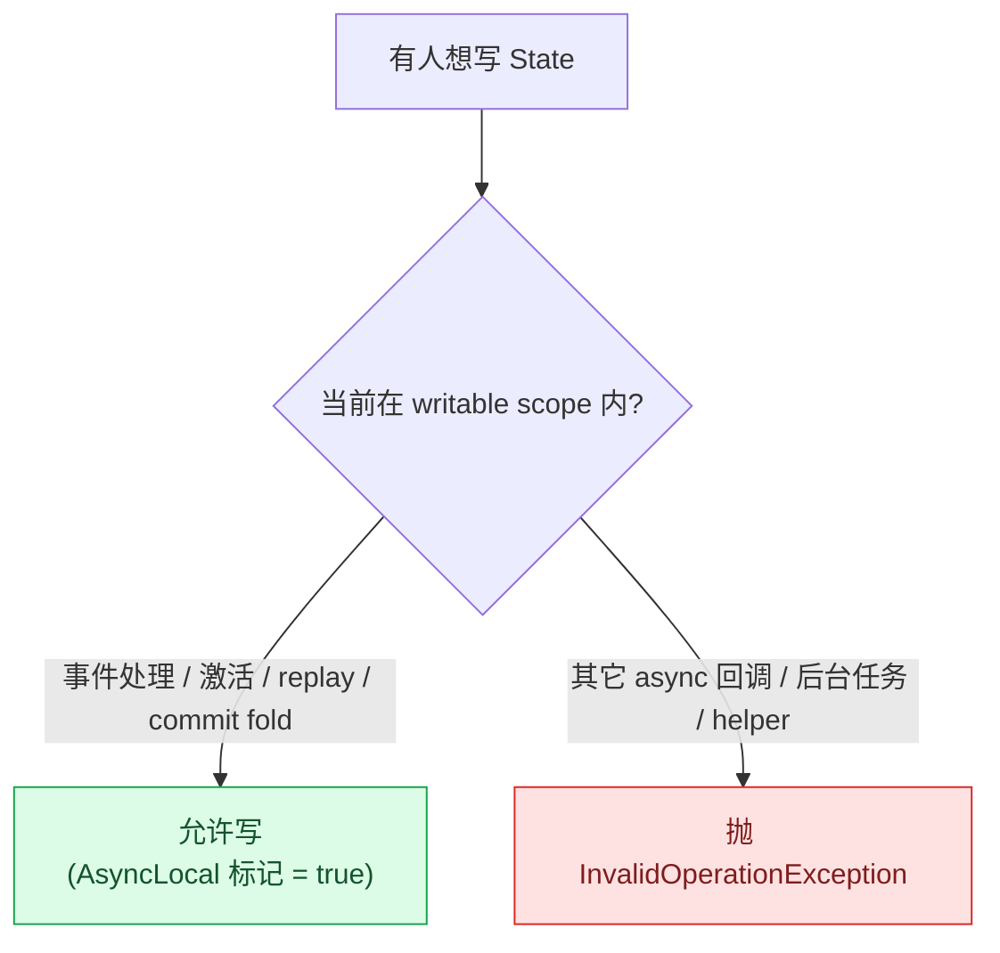
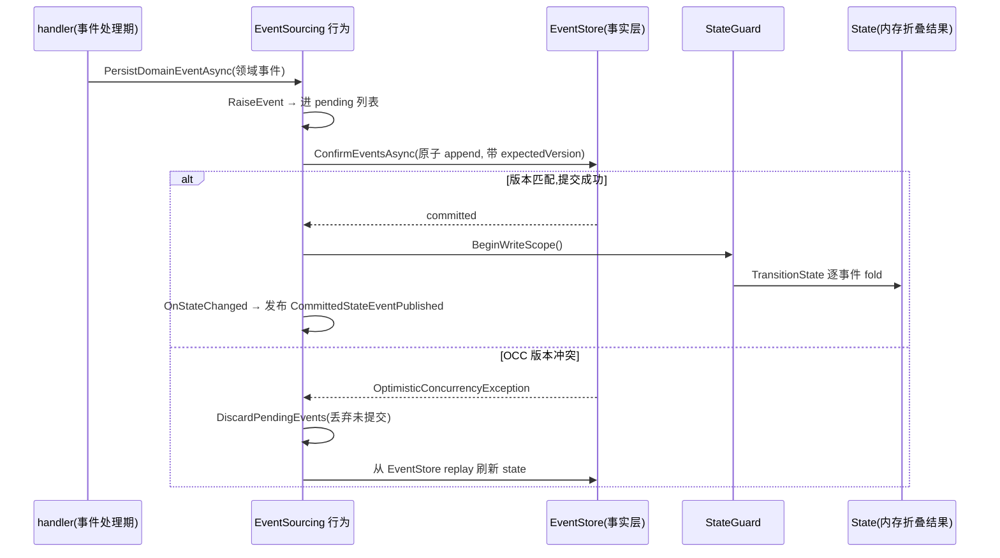

# StateGuard(AsyncLocal 写权限闸门) + EventStore + reducer

## 本篇涉及的设计抽象

> 以下论断均可回指 `~/Code/aevatar` 源码验证,但本篇用设计语言描述,不贴文件路径/行号。

---

## 先问“为什么要拦 State 写入”

Actor 模型的核心承诺是同一个 actor 的消息串行处理。可如果任意 async 回调、后台任务或 helper 都能直接改 `State`,这个承诺就会被绕开:状态变化看起来发生在 actor 里,实际却不一定发生在 mailbox 正在处理的那一封消息里。

StateGuard 用 `AsyncLocal` 做一个写权限闸门。只有框架打开 writable scope 的调用链可以改 state;离开事件处理、激活、replay 或 commit fold 的路径,写入会直接失败。它保护的不是语法洁癖,而是“状态变化必须落在 actor 串行处理语义里”。

> 这里有个常被写窄的点:writable scope **不只**在事件处理期打开,**激活(`ActivateAsync`)和 replay 重建**时也会打开——因为 replay 本质就是"重放历史事件、重新 fold 出 state",同样要写 state。闸门拦的是那些**绕过 actor 串行语义**的写(随手在某个 async 回调里改 `State`),而不是所有写。

---

## EventStore 是事实,State 是折叠结果

有状态 Agent 的正确路径不是“先改 State,再想办法保存”。Aevatar 反过来:handler 先构造领域事件,提交到 `EventStore`;提交成功后,框架再用 reducer 把这些事件 fold 回内存 state。

这样做有三个收益。第一,写侧事实有版本,可以做 OCC 并发控制。第二,replay 和在线运行走同一套 reducer,状态可恢复。第三,projection 读侧消费的是已提交事实,不会把半路失败的业务决定投出去。

这张图点出关键时序:**state 的 fold 发生在 `ConfirmEventsAsync` 提交成功之后**,而不是之前。所以即使 fold 阶段或 publish 阶段出问题,EventStore 里的事实也已经落定;反过来,只要提交失败(典型是 OCC 冲突),pending 事件被丢弃、state 从事实源重放,绝不会出现"事件没提交但 state 已经改了"的脏状态。

---

## AsyncLocal 闸门和 commit 路径怎样配合

handler 运行时有 writable scope,但权威状态仍来自领域事件。commit 成功后,框架在受控 scope 内执行 `TransitionState`,再触发 state changed hook 和 committed-state publication。OCC 冲突时,框架会丢弃悬挂 pending events、从 EventStore replay 刷新状态,再由调用方决定是否吸收冲突。

换句话说,AsyncLocal 闸门管“什么时候能写”,EventStore 管“什么算事实”,reducer 管“事实怎样折叠成状态”。三者缺一块,actor 状态就会变得难以审计。

---

## ⚠️ owner 待确认:RunManager latest-wins

`architecture` 和 `src/Aevatar.Foundation.Core/README.md` 都提到 `RunManager` / `RunContextScope` 的 latest-wins 运行管理,但当前 `src/` 没有对应类型定义。当前实际落点是 `AsyncLocalAgentContext` / `IAgentContextAccessor` 这条上下文传播链。

所以本文只把 RunManager 作为文档中的设计意图记录,不把它写成已经落地的运行机制。这个 owner 待确认点需要后续由维护者确认:是补实现、改 canon 口径,还是保留为目标态说明。

---

!!! warning "设计待论证 / 已知缺口"
    RunManager:文档提到 latest-wins 但代码只有 AsyncLocalAgentContext。详见附录 TODO List(08/04)。

## 验收

1. 状态为什么只能在事件处理期写?(StateGuard 用 AsyncLocal 闸门防止绕过 actor 串行语义)
2. EventStore 和 State 的关系是什么?(EventStore/StateEvent 是事实;State 是 reducer fold 出来的当前形状)
3. OCC 冲突为什么要 replay?(用事实源刷新 state,避免基于旧状态继续提交)
4. RunManager 当前能否当成已实现机制?(不能;它是 ⚠️ owner 待确认的 latest-wins 设计口径)

⟦AI:AUTO-LOOP⟧
