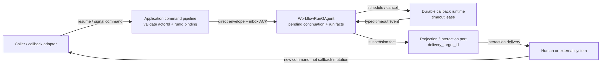
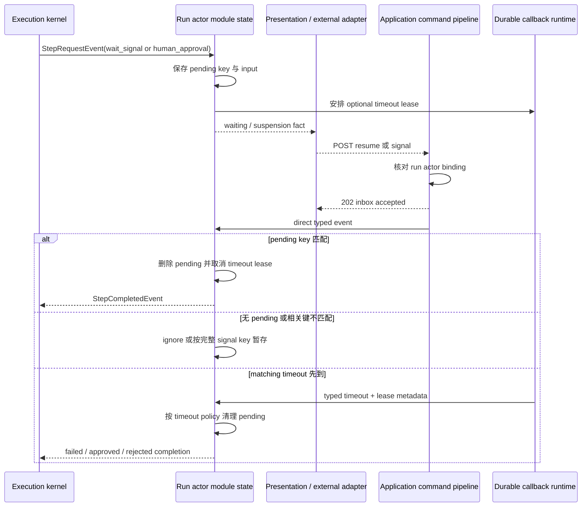

# Workflow 暂停与恢复：signal、人工审批和 delivery 边界

> 版本与结论：本章描述 `current`；当前行为以 `f02aa690` 为准。暂停不是把调用线程挂住，而是让 run actor 保存 pending continuation，并等待一个带相关键的 typed event 回到同一 mailbox。`wait_signal` 与 `human_approval` 使用不同恢复协议；presentation delivery 只负责把交互送到指定目标，不拥有审批结论。

## 设计抽象与事实源

- `src/workflow/Aevatar.Workflow.Core/Modules/WaitSignalModule.cs:47`：保存 signal waiter、安排 durable timeout，并按 run / signal / step 三元组匹配或缓冲回调。
- `src/workflow/Aevatar.Workflow.Core/Modules/HumanApprovalModule.cs:66`：保存审批 pending state，用 `WorkflowResumedEvent` 或匹配的 timeout lease 收敛为 step completion。
- `src/workflow/Aevatar.Workflow.Core/workflow_state.proto:86`：run state 的 `execution_states` 持有 module state；pending signal 与 approval 的 typed 字段定义在同一状态协议中。

## 先建立所有权边界



边界由三类证据面组成；其中只有第一项是 run 的持久状态：

| 证据面 | 所有者 | 能证明什么 | 不能证明什么 |
|---|---|---|---|
| pending continuation | run actor 的 `execution_states` | 哪个 run / step 正在等什么，以及 timeout lease | UI 已展示、外部系统已处理 |
| delivery attempt | projection 与 interaction port | suspension 被交给哪个 `delivery_target_id` | 用户已经批准、run 已继续 |
| `202 Accepted` receipt | Application command pipeline | direct envelope 已被目标 run actor inbox 接纳 | pending key 已匹配、step 已完成 |

`actorId` 必须指向 run actor，而不是 definition actor；target resolver 还会核对 binding 中的 `runId`。因此恢复命令不能只靠一个业务 `runId` 猜目标，也不能让 presentation 直接改 actor state。

## 两种暂停协议

### `wait_signal`：按相关键等待 typed signal

激活步骤时，module 将 input、规范化后的 `runId`、小写 `signalName`、`stepId`、optional external-approval reference 与 timeout lease 写入 `WaitSignalModuleState`。随后发布 `WaitingForSignalEvent`；没有 `StepCompletedEvent`，所以 execution kernel 不会推进主图。

匹配规则是：

1. `SignalReceivedEvent.run_id` 必填。
2. 有 `step_id` 时，必须精确命中 `run_id + signal_name + step_id`。
3. 没有 `step_id` 时，只有同一 run 与 signal name 恰好存在一个 pending waiter 才可恢复；零个或多个候选都不处理。
4. signal payload 非空时成为 step output；空 payload 时沿用等待前的 input。

早到 callback 也有明确边界：只有 signal 同时携带 `run_id` 和 `step_id` 才能按完整键缓存，冻结实现的 retention 为 600,000 ms；waiter 在过期前激活会消费一次。缺少 `step_id` 的未匹配 signal 不缓存。这个设计支持“外部 callback 比 actor 的 waiter 激活更早”，同时拒绝把模糊 signal 留给未来任意步骤。

若 YAML 携带 external approval reference，module 会在保存 pending 后发布 `WorkflowExternalApprovalContinuationRegisteredEvent`，完成或 timeout 后发布对应 cleared fact。`source_id`、external id、request id 与 callback idempotency key 用于关联和对账；它们不是“供应商已送达”或“审批已授权”的证明。

### `human_approval`：approve / reject 是 step outcome

审批步骤保存 `runId + stepId`、原 input、`on_reject`、delivery target、timeout decision 与 durable timeout lease，并发布 typed `WorkflowSuspendedEvent`。`WorkflowResumedEvent` 必须命中同一个 pending key，才能产生结果：

| 决策 | `StepCompletedEvent` | 后续语义 |
|---|---|---|
| approve | `Success=true`、`BranchKey=true` | edited content 优先，否则 user input，再否则原 input |
| reject + `on_reject=fail` | `Success=false`、`BranchKey=false` | 进入 kernel 的普通失败政策 |
| reject + 其他值 | `Success=true`、`BranchKey=false` | 带原内容/feedback 继续，由 branch/next 决定后继 |
| timeout | 按 typed default decision 执行 | 未显式设为 approve 时默认 reject |

`human_approval` 默认 timeout 为 3600 秒；作者提供的值会收敛到至少 1 秒，冻结实现上限为 5400 秒，因此当前 YAML 路径没有“用 `0` 关闭审批 timeout”的语义。timeout event 还必须匹配当前 lease，旧 waiter 遗留的 callback 才不会结束新一轮审批。

## 动态恢复与竞态



这个时序刻意把 HTTP ACK 放在 actor 对账之前。调用方收到 202 后必须查询 run current-state/read model，不能把它显示成"审批完成"。pending 已清除且没有同键新 waiter 时，迟到 resume 是 no-op；迟到 timeout 在 pending 不存在或 lease 不匹配时也是 no-op。带完整键的迟到 signal 则可能进入短期 buffer，因此 callback producer 仍应为重试复用稳定 command identity，并以 run 状态判断是否真正生效。

!!! warning "HEAD 漂移（2026-08-05 登记）"
    同步目标之后的 HEAD（`origin/feature/integrate`，以 feature/integrate checkout 核验为准）对 **tool approval resume** 从静默 no-op 收紧为显式拒绝：resume 的 typed approval identity（`executionId/toolCallId/approvalRequestId`）若与 run actor 当前持有的 pending 调用不再匹配，则保留 pending 并提交 `WorkflowToolApprovalResumeRejectedEvent`，run timeline 与 Observatory 以 `tool_approval_resume_rejected` 呈现（`c8f46a3c6` Reject invalid workflow approval resumes；`docs/canon/workflow-runtime.md`）。resume 请求把 `executionId/toolCallId/approvalRequestId` 放在顶层是无效别名，返回 `400 INVALID_TOOL_APPROVAL_RESUME_REQUEST`；`toolApproval` 内嵌时必须三字段齐备；不带 `toolApproval` 的 resume 仍走普通 human input / human approval 路径。上述"迟到 resume 是 no-op"仅适用于 human approval / human input；以 HEAD 为准。

## 为什么是它，不是别的

**为什么把 pending continuation 放在 run actor，而不是 Web API 内存？** 人工审批和外部 callback 常跨进程重启、部署与长时间空闲。pending 与 timeout lease 跟随 actor state 才能在 Host 重启后继续对账，也保留“一个 run 只有一个状态写入者”的边界。

**为什么 signal 需要 `run_id + signal_name + step_id`，而不只用 signal name？** 同一服务可并发运行多个 run，一个 run 也可能存在同名 waiter。完整键避免跨 run/step 误唤醒；省略 step id 只在唯一候选时兼容，是 fail-closed 收窄，不是宽松广播。

**为什么 delivery target 不等于审批主体？** delivery target 只是 presentation routing key。审批结论必须重新进入 Application command pipeline，再由 run actor 依据 pending state 接受；UI、IM channel 或 projection 不能因“卡片已发出”直接宣告批准。

**为什么 timeout 使用 durable lease，而不是 `Task.Delay`？** 进程内 timer 在重启后消失，旧 timer 又可能在 waiter 被替换后迟到。durable callback 提供可恢复触发，lease match 提供当前轮次 fencing。

## 最小 YAML 与恢复请求

> Demo status：`verified-static`（YAML 已按冻结 parser、typed parameters 与 module 分支静态核对；未启动 Host，也未向真实 delivery target 投递。）

```yaml
name: approve_then_wait
steps:
  - id: approve_plan
    type: human_approval
    parameters:
      prompt: "Approve this plan?"
      delivery_target_id: review-inbox-1
      timeout_seconds: 300
      timeout_default_decision: reject
      on_reject: fail
    next: wait_receipt
  - id: wait_receipt
    type: wait_signal
    parameters:
      signal_name: receipt_ready
      timeout_ms: 60000
```

审批 UI 应向 run actor 发送：

```json
{
  "actorId": "<run-actor-id>",
  "runId": "<run-id>",
  "stepId": "approve_plan",
  "commandId": "approve-command-1",
  "approved": true,
  "editedContent": "approved plan"
}
```

之后外部 worker 向同一个 run actor 发送：

```json
{
  "actorId": "<run-actor-id>",
  "runId": "<run-id>",
  "stepId": "wait_receipt",
  "signalName": "receipt_ready",
  "commandId": "receipt-command-1",
  "payload": "receipt-42"
}
```

两次 POST 分别使用 `/api/workflows/resume` 与 `/api/workflows/signal`。成功响应的 202 与 status URL 只表明 inbox admission；`approve_plan` 或 `wait_receipt` 是否完成，以 run current-state/read model 为准。

## 边界与演进

- `wait_signal` 的 early buffer 解决有限时间内的 arrival-order 竞态，不是无限 inbox，也不是外部 broker；超过 retention 的 signal 会被清理。
- `wait_signal` 的 pending/buffer key 没有 execution epoch；同一 run、step 与 signal name 再次激活时，旧 callback 若以新的 command identity 重投，可能被当成早到 signal 消费。producer 应为同一 callback 重试复用 command identity，并在重投前观察 run 状态。
- `human_approval` 当前拒绝 `interaction_template_spec`，只能使用 typed `interaction_spec`；把 template 写进 YAML 会得到明确 step failure。
- 普通 human approval resume 只按 `runId + stepId` 匹配，没有 approval request id 或 execution id。若同一步骤的 pending 被替换，旧交互面的回复可能命中新一轮；当前集成必须撤销旧交互并避免重用，不能声称已有 attempt-level fencing。
- 缺少 `delivery_target_id` 不会阻止 run actor 保存审批 pending，但 presentation projector 会跳过外部交互投递；这会形成只能由其他控制面恢复的悬挂风险，部署前应校验交互路由。
- `WorkflowHumanApprovalResolvedEvent` 只在存在 delivery target 时发布，用于把 actor 已决定的结果送回 presentation/audit 面；它不是第二个状态所有者。
- 外部审批 callback 的供应商鉴权、source stamp 与 capability admission 属于 connector/authority 边界，见 `03/07-connectors-and-capability-admission.md`。
- tool approval 也使用 `WorkflowResumedEvent`，但还要求 `execution_id + tool_call_id + approval_request_id` fencing；它在 `04/04-tool-approval-and-authorization.md` 单独展开，不能套用本章较窄的 human approval key。
- 冻结 open issues [#2182](https://github.com/aevatarAI/aevatar/issues/2182) 与 [#2788](https://github.com/aevatarAI/aevatar/issues/2788) 仍分别登记通用外部门控资源闭环、deterministic connector approval 缺口；本章现有 signal/human 协议不能替它们宣告完成。

## 读完应能回答

1. run actor pending state、presentation delivery 与 HTTP 202 receipt 分别能证明什么？
2. `wait_signal` 在有/无 `step_id` 时怎样匹配，什么情况下会缓存早到 signal？
3. approve、reject 与 timeout 如何映射成 `StepCompletedEvent`？
4. 为什么旧 timeout callback 不会结束替换后的 waiter？
5. 为什么 `delivery_target_id` 不能被当作审批身份或审批事实？

<details>
<summary>论断—证据映射</summary>

| 论断 | 等级 | 证据 |
|---|---|---|
| wait_signal pending key 由 run、signal、step 构成，省略 step 只接受唯一候选 | E1 | `src/workflow/Aevatar.Workflow.Core/Modules/WaitSignalModule.cs:239`、`src/workflow/Aevatar.Workflow.Core/Modules/WaitSignalModule.cs:413` |
| 完整键的早到 signal 保存 10 分钟，缺 step id 不缓存 | E1 | `src/workflow/Aevatar.Workflow.Core/Modules/WaitSignalModule.cs:481` |
| signal 与 approval timeout 都要求匹配当前 durable callback lease | E1 | `src/workflow/Aevatar.Workflow.Core/Modules/WaitSignalModule.cs:396`、`src/workflow/Aevatar.Workflow.Core/Modules/HumanApprovalModule.cs:376` |
| approval 默认 reject，approve/reject 分别产生 true/false branch | E1 | `src/workflow/Aevatar.Workflow.Core/Modules/HumanApprovalModule.cs:195`、`src/workflow/Aevatar.Workflow.Core/Modules/HumanApprovalModule.cs:367` |
| pending signal、buffer 与 approval 都是 run execution state 的 typed message | E1 | `src/workflow/Aevatar.Workflow.Core/workflow_state.proto:364`、`src/workflow/Aevatar.Workflow.Core/workflow_state.proto:454` |
| module state 通过 execution context upsert 到 run actor state | E1 | `src/workflow/Aevatar.Workflow.Core/Execution/WorkflowExecutionContextAdapter.cs:118`、`src/workflow/Aevatar.Workflow.Core/WorkflowRunGAgent.cs:1765` |
| resume/signal command 只投递到 binding 匹配的 run actor | E1 | `src/workflow/Aevatar.Workflow.Application/Runs/WorkflowRunControlCommandTargetResolverBase.cs:45`、`src/workflow/Aevatar.Workflow.Application/Runs/WorkflowSignalCommandEnvelopeFactory.cs:27` |
| resume/signal API 的 202 只证明 inbox admission | E1 | `src/workflow/Aevatar.Workflow.Infrastructure/CapabilityApi/ChatEndpoints.cs:440`、`src/workflow/Aevatar.Workflow.Infrastructure/CapabilityApi/ChatEndpoints.cs:507` |
| delivery target 由 presentation projector 用于 interaction port 投递 | E1 | `src/workflow/Aevatar.Workflow.Presentation.AGUIAdapter/WorkflowHumanInteractionProjector.cs:57` |
| external approval waiter 发布 registered / cleared continuation facts | E1 | `src/workflow/Aevatar.Workflow.Core/Modules/WaitSignalModule.cs:305` |

</details>
