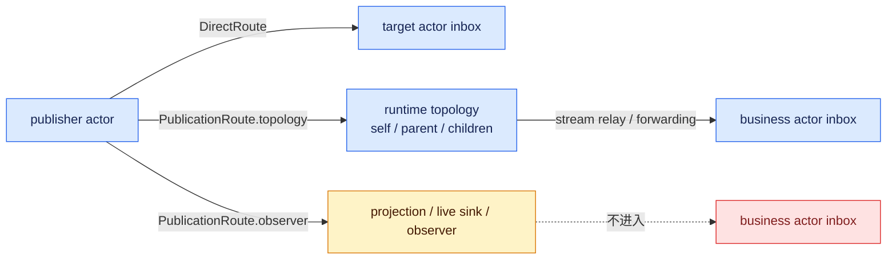
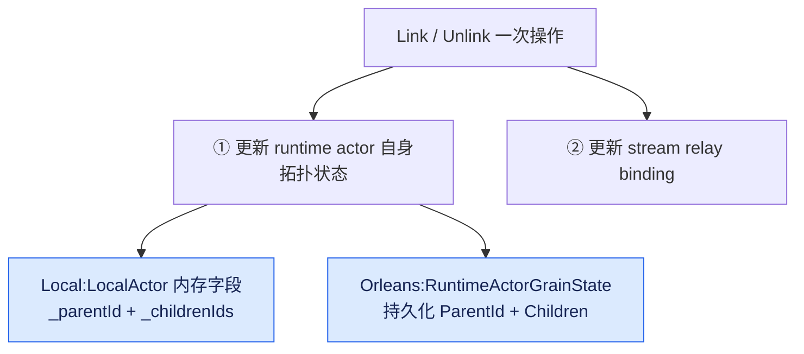

# 路由与拓扑:DirectRoute / topology publication / observer publication

## 本篇涉及的设计抽象

> 以下论断均可回指 `~/Code/aevatar` 源码验证,但本篇用设计语言描述,不贴文件路径/行号。

---

## 先把三种投递语义分开

`DirectRoute` 是点对点:明确目标 actor id,Runtime 把 envelope 送进目标 inbox。`PublicationRoute.topology` 是按父子拓扑传播:self、parent、children、parent-and-children 这些 audience 最终通过 runtime topology 和 stream relay 执行。`PublicationRoute.observer` 是观察分支:给 projection、live sink、observer 看 committed facts,不进入业务 actor inbox。

---

## 为什么 observer 必须隔离

Event Sourcing commit 后,框架需要把已提交事实发给读侧。如果这类 observer publication 又被业务 actor 当普通消息处理,就会出现两个问题:读侧观察消息可能反过来驱动写侧业务;已提交事实的投影链路和业务命令链路会互相污染。

所以 observer route 的语义是“可见但不业务处理”。它让 projection 能消费 committed facts,同时避免业务 actor 因观察消息再次产生领域行为。这条隔离线是 CQRS 能成立的前提之一。

---

## 拓扑事实在哪里

拓扑不是一个额外 EventRouter 对象在外面维护。Local runtime 把 parent/children 放在 `LocalActor`;Orleans runtime 把 parent/children 放在 `RuntimeActorGrainState`。Link/Unlink 同时更新 runtime actor 自己的拓扑状态和 stream relay binding。

注意一次 Link/Unlink 要同时落两处:**权威拓扑状态**(actor 自己持有)和**relay binding**(stream 层据此 fan-out)。前者是"谁是谁的父子"的事实,后者是"消息实际怎么转发"的执行;两者由 runtime 一起维护,避免上层或中间服务各存一份拓扑、然后对不上。

这种收口方式让“谁是谁的 parent/children”跟 actor runtime 生命周期绑定,避免上层业务或中间服务各存一份拓扑事实。真正 fan-out 仍由 stream forwarding / relay binding 执行,但权威拓扑在 runtime actor 自身。

---

## ⚠️ owner 待确认:ICommittedStateEventPublisher internal

`ICommittedStateEventPublisher` 当前是 `internal interface`,由框架在 committed state event 发布时使用,不暴露成业务 actor 公共能力面。这个边界和 observer 隔离是一致的:业务代码可以发布 topology/direct 消息,但 committed facts 的 observer publication 应由框架控制。

⚠️ 这里保留 owner 待确认点:如果未来要扩展 committed-state observation 的能力面,需要维护者确认它仍应保持 internal,还是引入新的受控 port。本文不把它扩展为公开业务 API。

---

## 验收

1. 三种路由分别是什么?(DirectRoute 直投;topology 按父子拓扑传播;observer 只给读侧观察)
2. observer route 为什么不进业务 actor inbox?(避免读侧观察反向驱动写侧业务,保持 CQRS 隔离)
3. 拓扑事实在 Local 和 Orleans 各存哪?(LocalActor 字段 / RuntimeActorGrainState)
4. `ICommittedStateEventPublisher` 当前是什么边界?(internal,⚠️ owner 待确认)

⟦AI:AUTO-LOOP⟧
