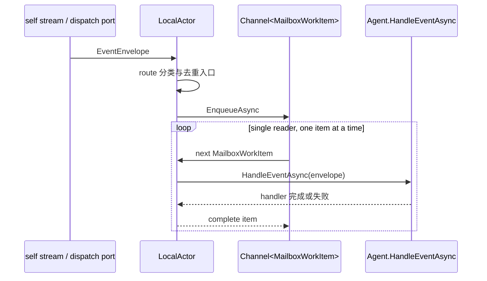

# Local Runtime 深入:LocalActorRuntime / LocalActor 邮箱串行 / LocalActorPublisher

## 关键代码(事实源,以 ~/Code/aevatar 为准)

- `src/Aevatar.Foundation.Runtime.Implementations.Local/Actors/LocalActorRuntime.cs` 第 23-331 行:本地 `IActorRuntime`;第 25 行:本地 actor 字典;第 231-251 行:Link 同时更新拓扑和 relay。
- `src/Aevatar.Foundation.Runtime.Implementations.Local/Actors/LocalActor.cs` 第 11-242 行:本地 actor;第 13-17 行:single-reader mailbox;第 48-112 行:激活与 stream 订阅;第 174-228 行:入队与逐条处理。
- `src/Aevatar.Foundation.Runtime.Implementations.Local/Actors/LocalActorPublisher.cs` 第 15-151 行:direct/topology/observer 三类发送实现。
- `src/Aevatar.Foundation.Runtime.Implementations.Local/Actors/LocalActorDispatchPort.cs` 第 5-26 行:外部 dispatch 进入本地 actor。
- `src/Aevatar.Foundation.Runtime.Implementations.Local/DependencyInjection/ServiceCollectionExtensions.cs` 第 37-106 行:`AddAevatarRuntime()` 的本地运行时装配。
- `src/Aevatar.Foundation.Runtime/Streaming/InMemoryStream.cs` 第 14 行:DEV/TEST ONLY;第 52-62 行:ingress/dispatch 双 channel;第 169-220 行:stream pump 与 subscriber dispatch。
- `docs/canon/architecture.md` 第 128-138 行:InMemory 仅 dev/test,生产目标是 Orleans + 持久化后端。

---

## LocalRuntime 是可读实现,不是生产目标

LocalRuntime 的价值是把 Runtime-on-Stream 这套语义用最小本地实现跑起来:actor 存在进程内字典里,stream 是 InMemory,EventStore 默认也是 InMemory。它非常适合开发、单元测试和理解模型,但不能给生产提供跨进程单激活、持久化容量治理和分布式容错。

所以本篇看 LocalRuntime,重点不是“生产就这么部署”,而是看 Actor mailbox、route demux、topology relay 这些语义在最小实现里怎样落地。生产态要看 Orleans + Garnet/Kafka 那条线。

---

## LocalActor 的邮箱串行

`LocalActor` 的 mailbox 是 single-reader channel。多个入口可以同时写入,但只有一个 reader 逐条取出并 await 处理完成,所以同一个 actor 的 handler 不会并发执行。这正是前几篇一直说的 actor 串行语义。

---

## 入站不是只有一条路

LocalActor 收消息有两个入口。一个是自己的 stream subscription:direct、self、parent/children topology、forwarded observer 都会先被 route 判断,匹配当前 actor 才入队。另一个是 dispatch port:外部命令被 runtime 受理后,直接交给 actor 的 admission 入口。

这两个入口最后都落到同一个 mailbox,因此“从 stream 来”和“从 dispatch port 来”不会形成两套并发模型。它们只是入站来源不同,处理顺序仍由 actor mailbox 统一决定。

---

## 为什么 InMemory 只能 dev/test

InMemoryStream 自己的注释已经写明是 DEV/TEST ONLY。原因也很直接:它是进程内 channel 和内存 registry,进程一挂就丢;它没有跨节点 actor 单激活;默认 InMemoryEventStore 也不是生产持久化事实源。

生产目标需要同一组 `IActorRuntime` 原语,但底层换成分布式 runtime 和持久化后端。这样上层仍然用 Actor/Runtime/Publisher 说话,不把本地实现细节写进业务。

---

## 验收

1. LocalActor 怎么保证串行?(single-reader mailbox,逐条 await `Agent.HandleEventAsync`)
2. 为什么 LocalRuntime/InMemory 只限 dev/test?(进程内、非生产持久化、无分布式单激活)
3. 两个入站入口是什么?(self stream subscription 和 dispatch port admission)
4. 生产目标是什么?(Orleans runtime + 持久化后端,保持同一组 Runtime 原语)

⟦AI:AUTO-LOOP⟧
