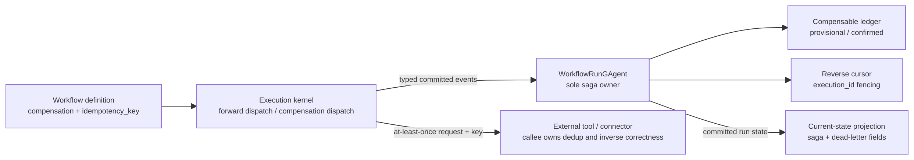
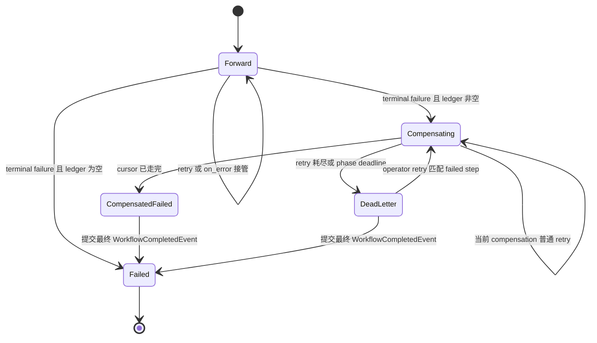

# Workflow Saga：反向补偿、OutcomeUncertain 与恢复

> 版本与结论：本章为 `mixed`。冻结代码已经实现 run-owned compensable ledger、反向补偿、dead letter、activation recovery 与人工 retry；但 ADR-0034 的 frontmatter 仍是 `status: proposed`，且前半段“尚未实现”的历史审计已经落后于代码。这里以 E1 代码说明 current 行为，以 ADR 状态说明尚未完成的治理收敛，不把两者互相覆盖。

## 设计抽象与事实源

- `src/workflow/Aevatar.Workflow.Core/workflow_state.proto:163`：run state 持有 compensable ledger、反向 cursor、saga status、当前 compensation execution id 与 dead-letter detail。
- `src/workflow/Aevatar.Workflow.Core/WorkflowRunGAgent.cs:224`：同一个 run actor 提交 provisional/confirmed effect、推进补偿 cursor，并拥有 dead letter 与 recovery。
- `docs/adr/0034-workflow-saga-compensation-protocol.md:1`：记录 saga 设计、约束和后续更新，但治理状态在冻结提交仍为 `proposed`。

## 先建立模型：run 就是 saga owner



这里没有第二个 saga coordinator actor。run actor 已经拥有 definition snapshot、execution state 与终态；把补偿拆给另一个 actor 会制造“谁能决定 run 已结束”的双写。kernel 负责执行步骤和把结果送回，run actor 负责 ledger、cursor 与状态转换，外部 callee 负责实际副作用的幂等与逆操作正确性。

三个概念不能混用：

| 概念 | 当前含义 | 不是 |
|---|---|---|
| `idempotency_key` | engine 随 side-effect request 与 compensation 携带的稳定业务键 | engine 自己完成外部去重 |
| compensation | 作者显式声明的逆向 step，以 at-least-once 方式调度 | 分布式事务回滚或自动推导 inverse |
| `compensated_failed` | 原 run 失败，但全部已登记 effect 已完成逆向处理 | run 重新变成成功 |

## Ledger 为什么同时有 provisional 与 confirmed

仅在 step 成功后记账，会漏掉最危险的窗口：request 已进入外部 executor，但 caller 在收到结果前崩溃或 timeout。冻结实现因此分两条路径：

1. 声明了 `compensation` 的 `tool_call`、`connector_call`、`secure_connector_call` 在 request publish 成功后先提交 `CompensableStepDispatchedEvent`，形成 **provisional** entry。
2. 匹配的成功 completion 将 provisional 升为 **confirmed**，并写入 captured output。
3. callee 明确失败（`CalleeConfirmed`）会移除匹配的 provisional，因为已有证据证明该 attempt 没有成功完成。
4. timeout 或 publish 后的 dispatch 边界失败是 `OutcomeUncertain`；provisional 被保留，因为系统不能证明副作用没有发生。

非 side-effecting primitive 不走 dispatch-time provisional 路径；若它声明了 compensation 并成功完成，run actor仍可直接追加 confirmed entry。current side-effect policy 只把上述三类外部 dispatch primitive 纳入 provisional 保护，不能推断所有未来 primitive 自动具备相同边界。

ledger 的顺序就是 effect 提交顺序。terminal failure 发生时，cursor 从末尾开始，因此后发生的 effect 先 undo。每个 entry 保存 original step、compensation step、idempotency key、captured output 与 provisional/confirmed status；没有 wall-clock 排序依赖。

## 从失败到恢复的状态机



### terminal failure 何时启动补偿

普通 step failure 仍先走 retry 与 `on_error=skip/fallback`；只有这些 forward recovery 没有接管，或 timeout/dispatch uncertainty 直接进入 terminal path 时，kernel 才询问 run actor 是否有 ledger。无 ledger 就保持普通失败形状；有 ledger 才提交第一条 `CompensationRequestEvent`，把 `saga_status` 设为 `Compensating`。

`OutcomeUncertain` 不表示“effect 已发生”，只表示“不能证明未发生”。因此它保留 provisional entry 并进入补偿，是风险最小化选择。补偿本身仍可能发现资源不存在；inverse 必须把这种业务结果设计成幂等可接受，而不是让 engine 猜测外部世界。

### 反向 step 怎样执行

每次 request 携带 `run_id`、origin failed step、compensation step、captured output、idempotency key 与新的 `execution_id`。kernel 通过 self continuation 把 compensation target 当普通 step 执行：

- captured output 非空时作为 undo input；
- compensation step 复用普通 retry 与 step timeout；
- compensation 失败不会走其 `on_error=fallback/skip`，retry 耗尽后直接 dead-letter；
- completion 必须同时匹配 run、cursor 指向的 compensation step 和 current compensation `execution_id`，否则提交 stale rejection，不推进 cursor。

全阶段还有固定 300,000 ms durable deadline。它跨多个 compensation request 只安排一次；匹配 lease 的 deadline 触发时，run 写 `WorkflowCompensationFailedEvent` 与剩余数量。这个 deadline 防止某个 module 没有正常 completion 时 saga 永久停在 `Compensating`。

### crash recovery 与 operator retry

actor activation 时，若 state 仍为 `Compensating`、cursor 有效且 current execution id 非空，run actor 重新向 self 发布同一 `CompensationRequestEvent`，不追加第二条 request fact，也不移动 cursor。外部边界仍必须按 idempotency key 收敛重复 delivery。

dead letter 不是日志字符串，而是 run state：failed compensation step、remaining uncompensated、error 与 cursor 都可投影查询。人工 retry 只有在：

1. 目标 binding 是同一个 run actor；
2. 当前 saga 正是 `CompensationDeadLetter`；
3. 请求的 failed step 同时匹配 dead-letter 字段与 cursor；

才会提交 retry fact、生成新的 compensation execution id 并重发当前 request。API 返回的 202 仍只证明 inbox admission；是否重新进入 `Compensating` 要观察 current-state read model。

## 为什么是它，不是别的

**为什么反向、串行，而不是并行 undo？** effect 之间可能有依赖，例如必须先 refund 才能 cancel order。ledger 反向 walk 保留原提交顺序的逆序，避免再引入一套补偿依赖图与并发冲突。

**为什么在 dispatch 后先记 provisional，而不是等成功？** 外部副作用最难处理的正是“请求可能已执行、结果却丢失”。先记 provisional 把不确定性保存为可恢复事实；callee confirmed failure 才有足够证据删除它。

**为什么 compensation 仍是普通 step，而不是专用 connector API？** 复用 step dispatch 可以共享 timeout、retry、capability admission、idempotency 与 typed completion；专用旁路会绕过所有这些边界。author 必须显式指定 inverse，因为任意 tool/connector 不存在安全的自动逆函数。

**为什么 dead letter 后由 operator 显式 retry？** 自动无限重试会反复触碰外部系统，也会掩盖持续的权限、凭证或业务冲突。durable dead letter 让失败可查询，再由有上下文的人修复外部条件并针对精确 cursor 重试。

## 最小 Saga YAML

> Demo status：`verified-static`（按冻结 parser、validator、side-effect catalog 与 saga tests 静态核对；未连接真实 order/payment tools，不能证明业务 inverse 正确。）

```yaml
name: order_saga
steps:
  - id: create_order
    type: tool_call
    idempotency_key: "${run_id}:${step_id}"
    compensation: cancel_order
    parameters:
      tool: orders.create
    next: charge_payment
  - id: charge_payment
    type: tool_call
    idempotency_key: "${run_id}:${step_id}"
    compensation: refund_payment
    parameters:
      tool: payments.charge
    next: ship_order
  - id: cancel_order
    type: tool_call
    parameters:
      tool: orders.cancel
    retry:
      max_attempts: 2
      backoff: fixed
      delay_ms: 500
  - id: refund_payment
    type: tool_call
    parameters:
      tool: payments.refund
    retry:
      max_attempts: 2
      backoff: fixed
      delay_ms: 500
  - id: ship_order
    type: tool_call
    parameters:
      tool: shipping.create
```

正向路径由显式 `next` 从 `create_order` 跳到 `charge_payment`，再跳过两个 compensation target 到列表末尾的 `ship_order`。validator 还会拒绝 missing/self/cyclic compensation、把 compensation target 放进 `next/branches`，以及让 compensation target 再声明 compensation。若 `ship_order` terminal failure，reverse order 是 `refund_payment` 后 `cancel_order`；两者都成功后，run 仍以 failed 终止，只把 `saga_status` 记为 `CompensatedFailed`。

## 当前实现与 proposed ADR 的漂移

ADR-0034 的前半段按当时审计写着 forward-only、无 ledger、无 compensation event；冻结代码已经与这些历史句子冲突。ADR 后续 update 又记录了 typed saga enum、provisional ledger 等演进，但 frontmatter 仍未从 `proposed` 转为 `accepted`。因此：

- **可以断言 current**：typed authoring、validation、ledger、reverse cursor、stale fencing、deadline、dead letter、projection、activation recovery 与 retry endpoint 都有 E1。
- **不能断言治理已完成**：ADR 仍 proposed，旧 Context/Cutover/Outcome 与当前代码并存，canon/ADR 需要一次状态与叙述收敛。
- **不能从 ADR 扩张 current**：ADR 提到的 exactly-once、跨 run/global saga、自动 inverse、parallel undo 明确不在当前协议内。

这正是本章使用 `mixed` 而非 `current` 的原因：功能落地与设计决议状态是两条独立证据流。

## 边界与演进

- engine 只保证携带稳定 idempotency key 与可重放顺序；tool/connector/platform 是否真正去重、inverse 是否语义正确仍在外部边界。不要写“exactly once”或“事务回滚”。
- provisional policy 当前只覆盖 catalog 明确列出的三类 side-effect primitive；新增外部副作用 primitive 必须显式加入 policy 和测试，不能靠 `compensation` 字段自动获得 dispatch-window 保护。
- compensation target 不得出现在 forward `next/branches`，但作者仍应像示例一样显式布置正向拓扑，避免顺序 fallback 把列表中的 undo step 当普通后继。
- child run 先补偿自己，再以 `SubWorkflowInvocationCompletedEvent.Compensated=true` 报告 parent；没有跨 parent/child 的全局 saga log 或 two-phase commit。
- 当前 read model 投影 saga status 与 dead-letter detail，但 operator retry 的 202 不是修复成功；仍需观察同一 run 的版本化 current state。
- 冻结 open issue [#2182](https://github.com/aevatarAI/aevatar/issues/2182) 要求更完整的“前置校验→外部确认→幂等提交/回滚→回写通知”资源闭环。本章的通用 saga 不能替外部资源协议、鉴权与 provider evidence 宣告该缺口已关闭。

## 读完应能回答

1. provisional 与 confirmed ledger entry 分别解决什么证据问题？
2. `CalleeConfirmed` 与 `OutcomeUncertain` 为什么对 provisional entry 的处理不同？
3. run actor、kernel 与外部 callee 各自负责补偿链路的哪一段？
4. compensation retry、phase deadline、dead letter 与 operator retry 怎样衔接？
5. 为什么代码大量落地后，本章仍必须标为 `mixed`？

<details>
<summary>论断—证据映射</summary>

| 论断 | 等级 | 证据 |
|---|---|---|
| run state 持有 ledger、cursor、saga status、execution id 与 dead-letter detail | E1 | `src/workflow/Aevatar.Workflow.Core/workflow_state.proto:163` |
| side-effecting dispatch 先提交 provisional，success 升 confirmed，callee failure 删除 provisional | E1 | `src/workflow/Aevatar.Workflow.Core/Execution/WorkflowExecutionKernel.cs:1285`、`src/workflow/Aevatar.Workflow.Core/WorkflowRunGAgent.cs:1780` |
| terminal uncertainty 保留 provisional，并从 ledger 末尾启动补偿 | E1 | `src/workflow/Aevatar.Workflow.Core/WorkflowRunGAgent.cs:232`、`src/workflow/Aevatar.Workflow.Core/WorkflowRunGAgent.cs:1834` |
| compensation completion 用 run、step 与 execution id 拒绝 stale/duplicate | E1 | `src/workflow/Aevatar.Workflow.Core/WorkflowRunGAgent.cs:267`、`src/workflow/Aevatar.Workflow.Core/WorkflowRunGAgent.cs:2502` |
| compensation step 复用普通 retry，失败后不走 on_error 而进入 dead letter | E1 | `src/workflow/Aevatar.Workflow.Core/Execution/WorkflowExecutionKernel.cs:391`、`src/workflow/Aevatar.Workflow.Core/Execution/WorkflowExecutionKernel.cs:628` |
| 全补偿阶段有 300 秒 durable deadline | E1 | `src/workflow/Aevatar.Workflow.Core/Execution/WorkflowExecutionKernel.cs:25`、`src/workflow/Aevatar.Workflow.Core/Execution/WorkflowExecutionKernel.cs:1405` |
| activation 会重放当前 compensation request 而不重复提交 request fact | E1 | `src/workflow/Aevatar.Workflow.Core/WorkflowRunGAgent.cs:374`、`src/workflow/Aevatar.Workflow.Core/WorkflowRunGAgent.cs:2403` |
| operator retry 只接受 matching dead-letter cursor，并生成新 execution id | E1 | `src/workflow/Aevatar.Workflow.Core/WorkflowRunGAgent.cs:1239` |
| saga status 与 dead-letter detail 已进入 current-state projection | E1 | `src/workflow/Aevatar.Workflow.Projection/workflow_projection_transport.proto:64` |
| ADR-0034 在冻结提交仍为 proposed，且保留早期 forward-only 历史叙述 | E2 | `docs/adr/0034-workflow-saga-compensation-protocol.md:1`、`docs/adr/0034-workflow-saga-compensation-protocol.md:9` |

</details>
