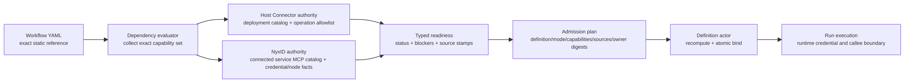
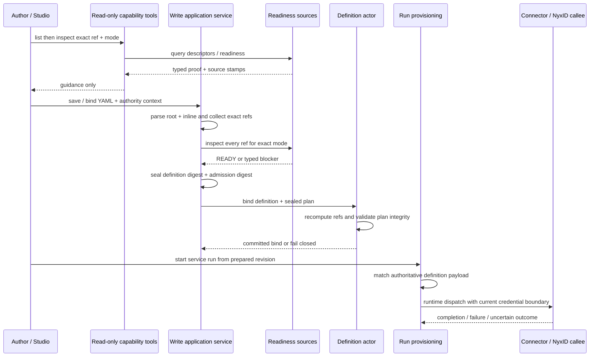

# Connector 与外部能力准入：所有权、readiness 和证据时效

> 版本与结论：本章描述 `current`。冻结实现把 Host Connector 与 NyxID UserService 建模为两种不同 authority 的 typed capability，写入时以 point-in-time readiness 生成 admission plan，并在应用层复用、definition bind 时校验完整性。它没有把一次 `READY` 变成永久授权，也没有在每个 run startup 重新读取外部 source。

## 设计抽象与事实源

- `src/workflow/Aevatar.Workflow.Abstractions/workflow_capability_admission.proto:9`：定义 execution mode、两类 capability ref、typed readiness、source stamp 与持久化 admission plan。
- `src/workflow/Aevatar.Workflow.Application/ExternalCapabilities/WorkflowExternalCapabilityAdmissionService.cs:25`：重新解析 definition，逐项验证 readiness proof、source evidence、owner 与时效。
- `docs/canon/connector.md:115`：说明 Host Connector catalog、Workflow 授权、运行调用与 durable approval 的当前边界。

## 先分所有权，再谈“能不能调用”



两类 capability 都可能最终发出 HTTP 请求，但 transport 形状不决定 authority。所有权决定引用键、readiness 证据、credential 来源和 durable 约束。

| 能力种类 | 权威所有者 | exact ref | readiness 主要证明 | 不应被改写成 |
|---|---|---|---|---|
| Host Connector | 当前部署的 Connector catalog | `connector_capability_ref + operation_id + contract_digest` | connector 存在、启用、operation 仍在 allowlist、contract 未漂移 | 某个用户的 NyxID service，仅因为 connector 带认证 |
| NyxID UserService | NyxID 的 connected service、MCP operation catalog 与 credential/node authority | `user_service_id + endpoint_id`（`NyxIdOperationSelector`） | 精确 connected service 可见且可用、credential/node 条件满足、endpoint contract 未漂移 | Host Connector，仅因为 operation 看起来像普通 HTTP |

NyxID 的身份维度已从 operation_id/OpenAPI 时代收敛为 `user_service_id + endpoint_id`：identity 由 connected service 的 MCP operation catalog 给出，endpoint 是 catalog 里一个可寻址 operation。两个用户服务可以有相同 slug，不能按显示名合并。Host Connector 也不是任意 URL：ref 指向部署 catalog 中已发布的命名 operation。

## 从 YAML 提取的是静态 capability set

准入服务不信任调用者提交的“我需要哪些能力”清单。它重新 parse root、inline workflow 或 bundle，再从所有顶层和嵌套 step 提取依赖：

- canonical `connector_call` 必须有静态 `connector`；`operation/action` 缺省为 `__default__`，`contract_digest` 可选（缺省为空串）。包含 `${...}` 的动态 connector identity 会被拒绝。
- NyxID 路径是 `tool_call` + `tool: nyxid_proxy`，identity 放在 step 级 `capability: {nyxid_operation: {user_service_id, endpoint_id}}`；`arguments` 必须是静态 JSON object，且只允许运行时参数 `path_params`、`query`、`headers`、`body`、`response_mode`。
- NyxID YAML 不能携带 `Authorization`、cookie、API key 或 token 类敏感 header。credential 属于运行边界，不属于 definition。
- 所有 invocation 按 `call_site_id` 排序且必须唯一；root 与 inline definition 一起进入 `definition_digest`，不能只替换子 workflow 后继续沿用旧 plan。

冻结实现还有一个不能隐藏的覆盖缺口：`secure_connector_call` 虽与 `connector_call` 共用 `ConnectorCallModule`，但 canonical type 保持独立，而 dependency evaluator 只匹配 `connector_call`。因此 `secure_connector_call` 当前不会贡献 Host Connector capability，也不会因它本身要求 admission plan；不能把本章的 connector 准入口径泛化到这个 primitive。

这里选择静态 identity，而不是运行时字符串模板，是为了让 bind 前就能回答“将调用哪个 authority 下的哪个 operation”。如果 identity 到运行时才展开，admission digest 无法绑定真实目标，preview 也无法和执行达成同一答案。业务 payload 仍可动态；安全身份不能动态漂移。

## Readiness 是带来源的短期证明

`ExternalCapabilityReadiness` 不是布尔值。它同时包含 execution mode、selected exact capability、typed status、safe blocker、trusted remediation 和 source stamps。每个 stamp 至少携带：

```text
source_kind + source_id + source_version
observed_at + fresh_until + content_digest
```

Host source 从 Connector catalog 读 enabled connectors 和 allowlisted operations，冻结实现给 evidence 五分钟 freshness window。NyxID source 读取 NyxID live MCP operation catalog（connected services + endpoints，source kind 为 `NYX_ID_MCP_CONFIG`）；`HasRequiredSourceEvidence` 只认 `NyxIdMcpConfig`，durable 时再加 `DurableAuthorizationCatalog`。operation contract digest 绑定整个 operation contract（method/path/参数/request-body/response/execution policy），schema 只支持受控关键字子集、深度不超过 16，composed schema（oneOf/anyOf/allOf/not）fail closed 为 `ENDPOINT_CONTRACT_REQUIRED`。`READY` 只有在 returned execution mode、selected ref、required source kinds 与请求完全匹配时才会被准入服务接受。

常见 fail-closed 状态包括 `CONNECTOR_NOT_FOUND`、`CONTRACT_DRIFT`、`CREDENTIAL_CONNECTION_REQUIRED`、`NODE_BINDING_REQUIRED`、`ENDPOINT_CONTRACT_REQUIRED`、`SOURCE_STALE` 与 `DURABLE_AUTHORIZATION_UNAVAILABLE`。remediation 只返回可信 locator，例如 `studio:connectors`；它不是在 Chat 或 query path 中接收 secret 的入口。

### 查询工具为什么必须只读

`list_external_workflow_capabilities` 和 `inspect_external_workflow_capability_readiness` 都声明 `IsReadOnly=true`。前者聚合 sources 的 typed descriptors，后者只把一个 exact ref 路由给对应 source。Connector source 只调用 catalog query port；NyxID source只做服务、OpenAPI 和 durable catalog 的读取。当前调用链没有 refresh、prime、register connector、连接 credential 或写授权目录的 command port。

因此 listing/inspection 是 authoring UX，不是安全边界。LLM 即使跳过 inspect，write path 仍会重算 exact capability set 并执行 admission；反过来，inspect 返回 `READY` 也不能绕过 write admission。把 query 做成隐式修复会让一次“看看有什么”悄悄改变 credential 或 catalog，既不可审计，也会让后续 plan 的 source version 无法解释。

## Interactive 与 durable 的证据不同

`ExternalWorkflowCapabilityAccessContext` 可以携带 transient caller / organization bearer token；它的 `ToString()` 固定把 credential 写成 `[REDACTED]`，这些 token 不进入 Protobuf plan、actor state 或 receipt。两种 execution mode 的差异集中在“未来没有当前 HTTP session 时，谁还能证明有权执行”。

| 模式 | Host Connector | NyxID UserService | 持久化 owner |
|---|---|---|---|
| `INTERACTIVE` | 当前 Host catalog proof | 可使用当前 caller/session credential 读取 service 与 MCP catalog readiness | 不写 durable owner |
| `DURABLE` | 仍由当前 Host catalog proof | 除 MCP catalog 外，必须有 caller-owned `DurableAuthorizationCatalog` proof，且 operation 的 `execution_policy` 必须声明允许 Durable | 当前实现固定为 `authority=nyxid`、`owner_kind=personal`、`owner_subject=verified caller id` |

operation-level `execution_policy`（risk/approval/enforcement_owner/allowed_execution_modes）是 durable catalog 之外的另一个准入 gate：Write/Destructive 强制 `approval=REQUIRED` 且不允许 Durable，enforcement_owner 必须为 Aevatar；不满足时分别以 `NYXID_OPERATION_DURABLE_EXECUTION_NOT_ALLOWED` 等稳定状态 fail closed。

durable catalog 必须 activated、未 invalidated/cleaned、digest 可重算、仍在 freshness window，并且包含唯一匹配 service 的 permitted grant。catalog source id 还必须等于这个 personal owner 的 canonical actor id；把 caller A 的 plan 改成 caller B，即使重算 admission digest，也会因 owner/source mismatch 被拒绝。

这不等于 plan 保存 bearer token。plan 保存“谁拥有哪份 durable authorization evidence”；真正执行时的 credential issuance 是下一层。冻结实现的长 run token provider 会按 authority 获取 fresh token，但 capability admission、credential issuance、外部调用结果仍是三项不同事实。

## 写入、bind 与 startup：三层 gate



### 1. 应用层 admission

scope workflow、scope binding、Studio member binding、Studio provisioning 和 service revision prepare 都走同一个 admission service。没有 existing plan 时，`AdmitAsync` 实时 inspect 每个 exact capability，并按 call site 逐条生成 `invocation_admissions`；有 plan 时，`RevalidatePersistedAsync` 检查：

- schema（`external-capability-admission.v4`）、`definition_digest`、expected execution mode 和 call-site invocation 集合；
- required source kinds、durable owner/catalog source 一致性；
- `admission_digest` 完整性及每个 source 的当前 freshness。

v2/v3 旧 plan 在 `RevalidatePersistedAsync`/`ValidateOrThrow` 直接抛 `AdmissionRebindRequired`（remediation = `REBIND_WORKFLOW`），不会静默迁移。

`RevalidatePersistedAsync` **不会**重新读取外部 source；冻结测试明确断言 revalidation 不增加 readiness port call。它证明“这份仍在有效期内的 evidence 没被换 definition/mode/owner”，不是 refresh。source 已过期时必须先走新 admission 获得新 evidence。

### 2. Definition actor bind

definition actor 重新从 root + inline definitions 计算 authorization dependencies。存在 external capability 却没有 plan 时直接拒绝；有 plan 时用相同 integrity contract 校验 definition、mode、capability set、required sources、owner 和 admission digest，然后才把 definition、dependencies 与 plan 放入同一个 `BindWorkflowDefinitionEvent` transition。

这个 actor gate 防止应用层正确、入 actor 前 payload 却被替换。它不调用 readiness source，也不按 wall clock 检查 `fresh_until`；时效 gate 位于调用 `AdmitAsync/RevalidatePersistedAsync` 的应用路径。

### 3. Runtime activation 与 run startup

service activation 把 prepared revision 中的 plan 原样传给 definition provisioning，definition actor 再做上述 integrity gate。definition provisioning 路径比较 `IsSameDefinition`（含 `AdmissionDigest`），不一致会重新 bind。run provisioning 要求已存在、scope/name/definition payload 匹配的 definition actor，随后创建 run 并 dispatch execution request。

冻结代码没有在每个 run startup 调用 `RevalidatePersistedAsync`：run resolution 只比较 workflow name/YAML/inline YAML，不重新读取 Connector/NyxID catalogs，也不比较传入 plan 与已绑定 plan 的 `admission_digest`（digest 比对发生在 definition provisioning 路径）。因此正确口径是：**write/prepare 时验证 freshness，bind 时验证 sealed plan 完整性，startup 只依赖已准备的 revision 与既有 definition payload**。不能写成“每次运行都会刷新 readiness”。对长期存活 deployment，如何在每次 run 前强制 source freshness 并再次确认 plan identity，是当前边界，而不是本章替实现补出的保证。

## 最小 YAML：exact ref 来自查询结果

> Demo status：`verified-static`（两个形状均按冻结 parser、dependency evaluator 与 tests 静态核对；示例 identity/digest 是测试值，未连接真实 catalog/NyxID，不能得到 `READY`，更不能证明外部副作用完成。）

Host Connector：

```yaml
name: host_connector_example
steps:
  - id: send_summary
    type: connector_call
    parameters:
      connector: connector-home-alpha
      operation: send-summary
      contract_digest: sha256:connector-home-v1
```

NyxID UserService：

```yaml
name: nyxid_service_example
steps:
  - id: list_items
    type: tool_call
    capability:
      nyxid_operation:
        user_service_id: us-home-alpha
        endpoint_id: ep-list-items
    parameters:
      tool: nyxid_proxy
      arguments: '{"query":{"limit":10}}'
```

`capability.nyxid_operation` 承载身份（`user_service_id + endpoint_id`，来自 list/inspect 返回的 catalog 条目）；`arguments` 只允许运行时参数。把 `service_id`、`slug`、`operation_id`、`method`、`path`、`contract_digest` 写进 arguments 会被 evaluator 以 `NYXID_OPERATION_AUTHORING_MIGRATION_REQUIRED` 拒绝。

真实 authoring 必须把 list/inspect 返回的整个 exact ref 原样映射进 YAML，不能手猜 digest，也不能只保留 slug。`verified-static` 只证明 YAML 能被当前 dependency evaluator 解析；是否 ready 要由目标环境的 source stamps 决定。

## 为什么是它，不是别的

**为什么 capability ref 要带 contract digest？** 名称仍可能指向已经变化的 method、path、参数 allowlist 或 OpenAPI schema。digest 把“叫这个名字”提升为“还是我审过的那份契约”，漂移时要求重新选择和准入。

**为什么 source stamp 有 `fresh_until`，不只记 version？** 外部 catalog、credential、node 和 grant 会失效；一个历史 version 完整不代表今天仍可执行。时间边界让 stale evidence fail closed，也让 operator 知道应刷新哪种 source。

**为什么 durable NyxID 需要 owner-bound catalog？** 定时或长 run 不能依赖创建请求那一刻的 bearer token。持久化的是 owner 与授权目录证据，而不是可泄漏、会过期的 token；执行边界再按 owner 获取当前 credential。

**为什么 query 与 admission 分开？** query 可以被 LLM 或 UI 多次调用，必须安全、无隐藏写入；admission 属于 command path，必须重新解析真实 definition、验证全部 capability，并把 evidence 与写入原子绑定。

## 边界与演进

- admission 证明 exact capability 在某一时点、某种 mode 下 ready；它不证明 connector/NyxID 调用已经发生，更不证明外部副作用成功。HTTP 202 或 actor inbox acceptance 只证明 command 被接纳，最终结果要观察 run/step outcome。
- Host Connector runtime 仍按 registry、operation/path/method allowlist 执行；NyxID runtime 仍按 credential/node/endpoint authority 执行。plan 不是绕过这些 runtime checks 的通行证。
- `secure_connector_call` 当前未被 dependency evaluator 纳入 external capability set，尽管它仍走 connector 执行模块。这是 admission coverage gap，不是“secure”名称提供了额外授权保证；修复应在共享 evaluator 增加同形提取并留下 bind/admission test。
- open [#2104](https://github.com/aevatarAI/aevatar/issues/2104) 与 [#2656](https://github.com/aevatarAI/aevatar/issues/2656) 仍要求更完整的 typed connector operation schema 和 schema-driven forms；当前 exact ref/digest 不能冒充完整表单契约。
- open [#2838](https://github.com/aevatarAI/aevatar/issues/2838) 记录 Team/Scope connector authoring 到 runtime registry 的闭环缺口；readiness catalog 有条目不自动证明目标 runtime 已发布同一 connector。
- open [#2944](https://github.com/aevatarAI/aevatar/issues/2944) 说明存量 NyxID service 缺 published OpenAPI 时无法形成 exact operation；fail closed 是当前设计结果，迁移路径仍待补。
- open [#2788](https://github.com/aevatarAI/aevatar/issues/2788) 的状态不能用来断言 durable connector approval 尚未实现：冻结 E1 已有 actor-owned action plan、digest binding、waiting/recovery 与 idempotent dispatch。approval 是某次外部 action 的 execution gate，仍不等于本章的 capability admission；issue 与实现的剩余差距需要单独对账。
- open [#2949](https://github.com/aevatarAI/aevatar/issues/2949) 是更大的智能家居 capability/intent 目标；本章的通用 admission 不替它宣告产品语义、设备 ACK 或 durable intent 已完成。

## 读完应能回答

1. 为什么一个看起来像 HTTP 的 operation 仍可能属于 NyxID，而不是 Host Connector？
2. exact capability ref、source stamp、definition digest 与 admission digest 分别约束哪类漂移？
3. `INTERACTIVE` 与 `DURABLE` 对 NyxID readiness 的证据要求为什么不同？
4. list/inspect、write admission、definition bind 与 run startup 各自能证明什么？
5. 为什么 `RevalidatePersistedAsync` 和 run startup 都不能被描述成自动 refresh 外部授权？

<details>
<summary>论断—证据映射</summary>

| 论断 | 等级 | 证据 |
|---|---|---|
| proto 区分两类 exact capability、两种 execution mode、typed readiness、source stamp 与 v4 call-site invocation plan | E1 | `src/workflow/Aevatar.Workflow.Abstractions/workflow_capability_admission.proto:9`、`:70-109`、`:130-135`、`:267-277` |
| YAML evaluator 从 nested steps 提取静态 connector/NyxID ref，并拒绝动态 identity 与敏感 header | E1 | `src/workflow/Aevatar.Workflow.Core/WorkflowAuthorizationDependencyEvaluator.cs:16` |
| evaluator 只匹配 canonical `connector_call`；`secure_connector_call` 共用执行模块却未进入 capability set | E1 | `src/workflow/Aevatar.Workflow.Core/WorkflowAuthorizationDependencyEvaluator.cs:39`、`src/workflow/Aevatar.Workflow.Core/WorkflowCoreModulePack.cs:23` |
| Connector source 只读 catalog，验证 enabled/operation/digest，并产生五分钟 source stamp | E1 | `src/Aevatar.Studio.Application/Studio/Services/ConnectorExternalWorkflowCapabilitySource.cs:26`、`:42`、`:128` |
| NyxID source 不缓存，读取 MCP operation catalog；durable 另查 owner-bound authorization catalog，并受 operation execution policy 门控 | E1 | `src/Aevatar.AI.ToolProviders.NyxId/NyxIdExternalWorkflowCapabilitySource.cs:12-17`、`:42-86`、`:276-301`；`src/workflow/Aevatar.Workflow.Abstractions/WorkflowCapabilityAdmissionPlanIntegrity.cs:277-312` |
| list/inspect tools 标为只读，并只调用 list/readiness ports | E1 | `src/Aevatar.AI.ToolProviders.Binding/Tools/ListExternalWorkflowCapabilitiesTool.cs:39`、`src/Aevatar.AI.ToolProviders.Binding/Tools/InspectExternalWorkflowCapabilityReadinessTool.cs:56` |
| Admit 重新 parse definition，要求 exact READY proof、required sources 与 freshness，再 seal owner/digests | E1 | `src/workflow/Aevatar.Workflow.Application/ExternalCapabilities/WorkflowExternalCapabilityAdmissionService.cs:25` |
| persisted revalidation 检查 integrity/owner/freshness，但不重复 readiness read；v2/v3 旧 plan 直接要求 rebind | E1 | `src/workflow/Aevatar.Workflow.Application/ExternalCapabilities/WorkflowExternalCapabilityAdmissionService.cs:73`、`test/Aevatar.Workflow.Application.Tests/WorkflowExternalCapabilityAdmissionServiceTests.cs:588-605` |
| definition actor 重算 dependencies，缺 plan 或 plan 不匹配时在 commit 前拒绝 | E1 | `src/workflow/Aevatar.Workflow.Core/WorkflowGAgent.cs:21`、`:178-197` |
| runtime activation 传递 sealed plan；run resolution 只匹配已存在 definition payload，不比较 plan digest，也不重新读取 sources；provisioning 路径按 AdmissionDigest 比对并 rebind | E1 | `src/platform/Aevatar.GAgentService.Infrastructure/Activation/DefaultServiceRuntimeActivator.cs:123`、`src/workflow/Aevatar.Workflow.Infrastructure/Runs/WorkflowRunActorPort.cs:268-314`、`:490-501` |
| fresh caller token issuance 已进入 connector/LLM/tool runtime 边界 | E1 | `src/platform/Aevatar.GAgentService.Infrastructure/Credentials/NyxIdWorkflowCallerAccessTokenProvider.cs:1` |

</details>
