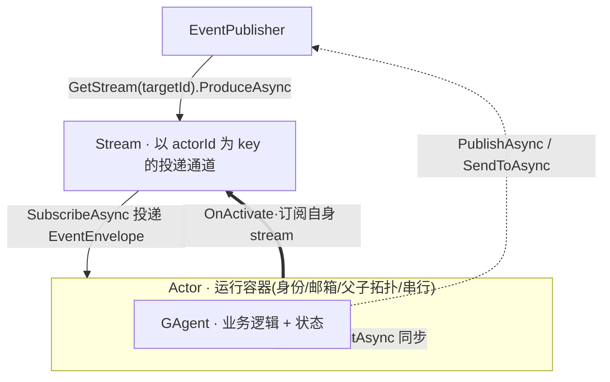
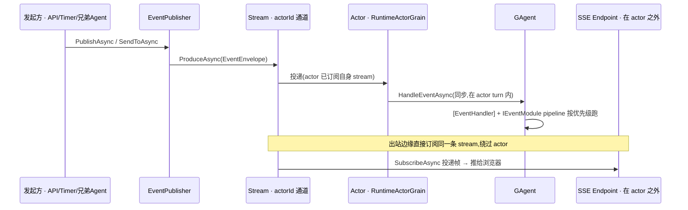
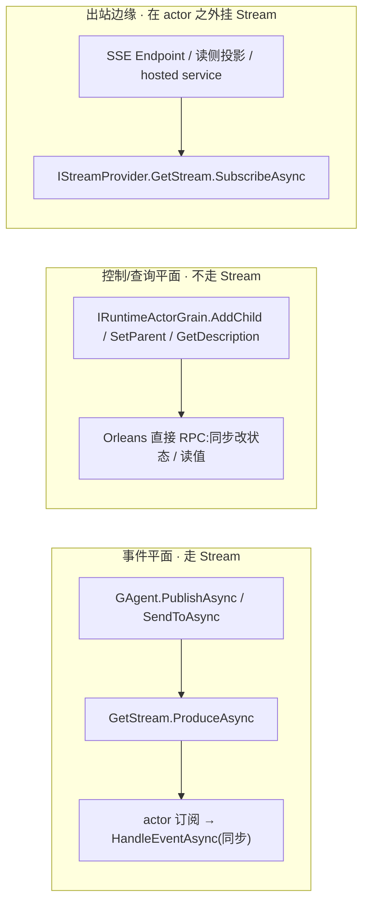

# Stream × Actor × GAgent:三者关系与事实清单

> 本篇是 03 运行内核的**收口速查**:把 Stream / Actor / GAgent 三个最常被混说的词,连同它们之间被源码确证的事实,集中成一份可逐条核对的清单。概念辨析见 [03/01](01-agent-actor-runtime.md),pipeline 细节见 [03/03](03-gagent-base.md),消息层 vs 事实层见 [03/02](02-event-envelope-vs-state-event.md)。

## 本篇涉及的设计抽象

> 以下是本篇的**事实源脊柱**(以 `~/Code/aevatar` 为准,非正文骨架):正文用设计语言论证,代码摘抄一律折叠。

- **Stream 抽象契约**:`src/Aevatar.Foundation.Abstractions/IStream.cs`、`src/Aevatar.Foundation.Abstractions/IStreamProvider.cs` —— `GetStream(actorId)` → `ProduceAsync` / `SubscribeAsync`。
- **事件→stream 的统一发布器**:`src/Aevatar.Foundation.Runtime.Implementations.Orleans/Actors/OrleansGrainEventPublisher.cs` —— 所有发布分支最终都落到 `GetStream(...).ProduceAsync`。
- **Actor 容器 + 订阅自身 stream**:`src/Aevatar.Foundation.Runtime.Implementations.Orleans/Grains/RuntimeActorGrain.cs`(激活时订阅 self-stream);非事件的控制/查询 RPC 面在 `src/Aevatar.Foundation.Runtime.Implementations.Orleans/Grains/IRuntimeActorGrain.cs`。
- **GAgent 处理 pipeline**:`src/Aevatar.Foundation.Core/GAgentBase.cs` —— `[EventHandler]` + `IEventModule` 在 actor turn 内同步分发。
- **actor 之外触碰 stream 的反例**:`src/platform/Aevatar.GAgentService.Hosting/Endpoints/ScopeGAgentEndpoints.cs`(HTTP/SSE 出口直接 `SubscribeAsync`)、`src/Aevatar.CQRS.Projection.Core/Streaming/ProjectionSessionEventHub.cs`(读侧直接 produce/subscribe)。
- **同一套模型的进程内实现**:`src/Aevatar.Foundation.Runtime.Implementations.Local/Actors/LocalActor.cs`、`LocalActorPublisher.cs`。

---

## 一句话先把三者钉住

> **GAgent 是业务逻辑,被装在 Actor 这个运行容器里;Actor 在激活时订阅一条以自己 `actorId` 为 key 的 Stream;事件的"投递"走 Stream,事件的"处理"在 Actor 的一次 turn 内同步发生。** Stream 是传输骨架,不解释业务;Actor 补上身份/生命周期/串行;GAgent 才知道"收到这个 payload 要做什么"。

三者不是同义词,也不是简单的上下层包含,而是"**容器装逻辑、容器挂在总线上**"的关系:



---

## 三者各是什么(边界)

| 概念 | 是什么 | 不负责什么 |
|---|---|---|
| **Stream** | 消息传输骨架:`ProduceAsync` / `SubscribeAsync` / relay。每个 actor 一条以 `actorId` 为 key 的通道。 | 不解释业务含义、不决定谁创建谁、不天然保证串行。 |
| **Actor** | 运行容器:持有一个 GAgent,承担身份寻址、生命周期、邮箱串行、父子拓扑;激活时订阅自身 stream。 | 不写业务 handler(那是 GAgent 的事)。 |
| **GAgent** | 业务逻辑层:`[EventHandler]` 静态处理器 + `IEventModule` 动态模块按优先级合并的统一 pipeline,持有 typed 状态。 | 不直接操作 stream relay,也不管自己被调度到哪个进程。 |

Runtime(`IActorRuntime` / `IActorDispatchPort` / `IEventPublisher`)是把 Stream 组织成上面这套 Actor 语义的中间层 —— 详见 [03/01](01-agent-actor-runtime.md)。

---

## 事件怎么流过三者(投递 vs 处理)



关键在那条 `Note`:**stream 是"投递平面",处理发生在 actor turn 内**;而出站边缘(SSE)可以在 actor 之外直接挂到同一条 stream 上 —— 这正是下面 F5 要纠的偏。

<details>
<summary>事实源摘抄:所有发布分支都落到 <code>ProduceAsync</code>(OrleansGrainEventPublisher)</summary>

```csharp
switch (audience)
{
    case TopologyAudience.Self:
        await _streams.GetStream(_actorId).ProduceAsync(envelope, ct); break;
    case TopologyAudience.Children:
        await _streams.GetStream(_actorId).ProduceAsync(envelope, ct); break;
    case TopologyAudience.Parent:
        // 有 parent 走 DispatchAsync,无 parent 退回自身 stream —— 两路最终都是 ProduceAsync
        ...
}
// SendToAsync / committed-state 发布同理,DispatchAsync 内部即 GetStream(targetActorId).ProduceAsync
```
</details>

---

## 事实清单(逐条带判定)

> 判定口径:✅ 成立 / ⚠️ 需收紧措辞 / ❌ 不成立。

| # | 论断 | 判定 | 依据 |
|---|---|---|---|
| F1 | 每个 actor 一条以 `actorId` 为 key 的 self-stream,actor 激活时订阅它 | ✅ | `RuntimeActorGrain` 在 `OnActivateAsync` 里 `GetStream(self).SubscribeAsync(...)`;Local 端 `LocalActor` 同形。 |
| F2 | agent 之间发事件,全部经发布器 → `GetStream(targetId).ProduceAsync`,事件**投递平面**就是 stream | ✅ | `OrleansGrainEventPublisher` 的每个 audience 分支、`SendToAsync`、committed-state 发布无一例外。 |
| F3 | 事件**处理**也"在 stream 上" | ⚠️ | 收紧:stream 只负责投递;`[EventHandler]` 分发是 `GAgentBase.HandleEventAsync` 在 **actor turn 内同步**跑的,不是 stream 在处理。"传输在 stream,处理在 actor turn"。 |
| F4 | 所有 grain 交互都是事件、都走 stream | ❌ | `IRuntimeActorGrain` 的 `AddChild/SetParent/GetDescription` 等是 Orleans 直接 RPC,**完全不进事件系统、不碰 stream**。 |
| F5 | stream 都封在 actor 里 | ❌ | `IStreamProvider` 是 DI 共享单例:HTTP/SSE 出口(`ScopeGAgentEndpoints`)、读侧投影(`ProjectionSessionEventHub`)、后台 hosted service 都能**在 actor 之外**订阅/发布。SSE 流式输出正依赖这一点。 |
| F6 | stream 是抽象契约,可换 transport | ✅ | `IStream`/`IStreamProvider` 之下:Local(进程内 mailbox)、Memory、Orleans、Kafka 可替换;`LocalActorPublisher` 用本地实现同一套模型。 |

<details>
<summary>事实源摘抄:actor 之外直接订阅 stream(SSE 出口)</summary>

```csharp
// ScopeGAgentEndpoints.HandleExecutionEventsAsync —— 这是 HTTP endpoint,不是 grain
[FromServices] IStreamProvider streamProvider, ...
var streamId = ExecutionActivityStreamTopics.ForScope(scopeId);
await using var subscription = await streamProvider
    .GetStream(streamId)
    .SubscribeAsync<ExecutionActivityEvent>(
        evt => WriteExecutionActivityFrameAsync(writer, scopeId, evt, ct), ct);
```
注释自陈:"the host only adapts scoped stream subscription to SSE" —— 这是有意的出站适配,不是越界。
</details>

---

## 把开头那句"事实"纠正成准确版

两个常见说法,逐个收口:

- **"所有的事件处理都在 stream 上"** → 准确版:**事件的传输/投递统一在 stream 上;处理在 actor turn 内;且不是所有 grain 调用都是"事件"——控制/查询类是直接 RPC,根本不走 stream。**
- **"stream 都包在 actor 里"** → **不成立**:stream 抽象是 DI 共享的总线,出站边缘(SSE/WS)、读侧投影、后台服务都能在 actor 之外订阅/发布。



---

## 为什么是这样设计(正当性)

- **为什么用 per-actor stream,而不是发布者直接 grain 调用?** 发布时并不知道有几个订阅者(children 是 fan-out)。用以 `actorId` 为 key 的 stream 把"发布者"和"订阅者数量/位置"解耦:relay 拓扑可演化、跨进程位置透明、并由 actor 邮箱给出同 actorId 的串行语义;换 transport(Local↔Orleans↔Kafka)时业务面不动。
- **为什么把"处理"留在 actor turn 内,而不是让 stream handler 自由并发?** 串行 turn 是状态一致性的前提 —— `StateGuard` 限定状态只在事件处理期写入(见 [03/04](04-state-guard-and-event-sourcing.md));若处理在 stream 层并发跑,这条不变量就守不住。
- **为什么不把 stream 封死在 actor 里?** 出站边缘(SSE/WS 推流、CQRS 读模型)需要把 actor 内产生的事实桥到外部 sink。aevatar 专门用 observer 路由把这类"只给 projection / live sink"的事件分出来(见 [03/05](05-routing-and-topology.md)、[05/02](../05/02-two-projection-modes.md)),host 侧只做薄适配。这是**有意的出站缝**,不是封装泄漏。

!!! warning "设计待论证 / 信任边界"
    F5 的"actor 之外直接订阅 stream"是一条 **trust boundary**:谁能订阅某个 `scopeId`/`actorId` 的 stream、能看到哪些帧,必须在 endpoint 侧用 scope 鉴权守住(`ScopeGAgentEndpoints` 里有 `AevatarScopeAccessGuard`)。一旦出站订阅绕过这层 guard,就等于把 actor 内部事件平面直接暴露给外部。这条缝的鉴权充分性应持续核对,登记到 [08/04 TODO](../08/04-todo-list.md)。

---

## 验收

1. Stream、Actor、GAgent 三者是什么关系?(GAgent 业务逻辑 → 装进 Actor 运行容器 → Actor 订阅以 actorId 为 key 的 Stream;投递走 Stream,处理在 actor turn 内)
2. "所有事件处理都在 stream 上"哪里需要收紧?(stream 只投递;处理在 actor turn 同步跑;且非事件的控制/查询 RPC 不走 stream)
3. "stream 都包在 actor 里"成立吗?(❌;SSE 出口 / 读侧投影 / hosted service 都能在 actor 之外订阅/发布同一套 stream 抽象)
4. 为什么处理必须留在 actor turn 内?(串行 turn 是 `StateGuard` 状态一致性不变量的前提)

⟦AI:AUTO-LOOP⟧
