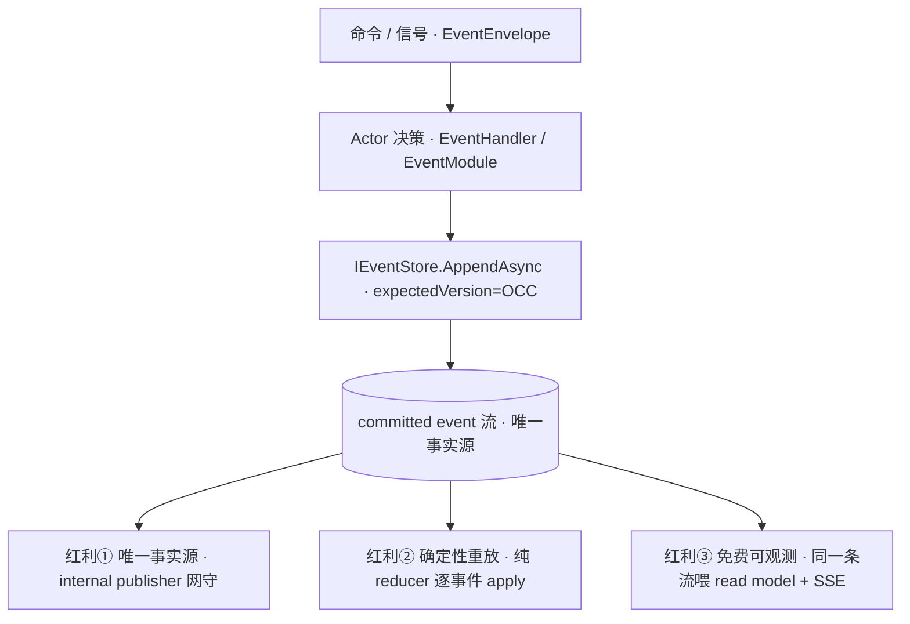
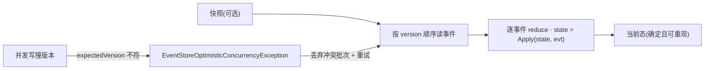
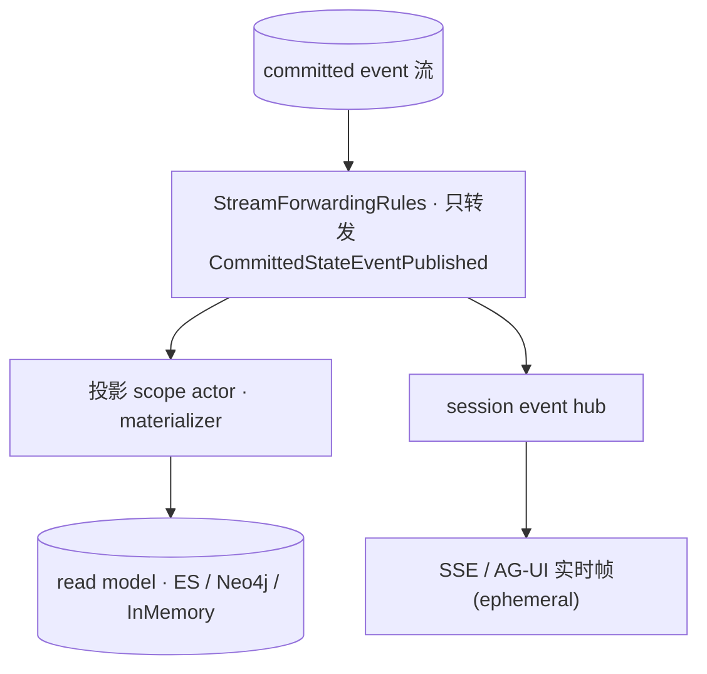
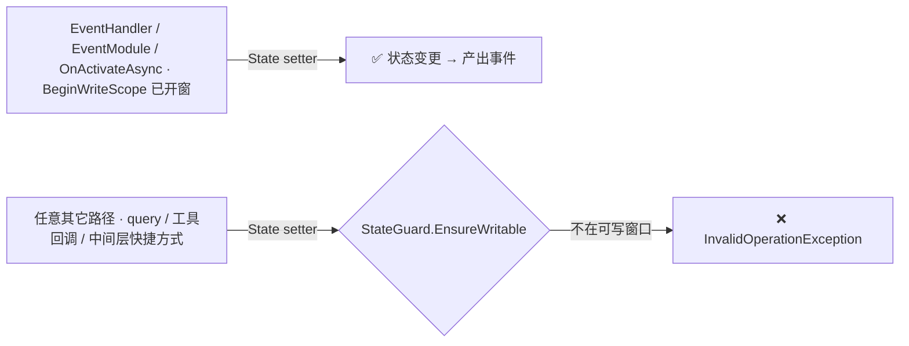

# Event Sourcing 的三重红利:唯一事实源 / 确定性重放 / 免费可观测性

> 本篇是 03 运行内核的**亮点收口**:把 Event Sourcing 从"一种存储方式"提升回它在 aevatar 里真正的位置——**整座架构的事实地基**。机制边界见 [03/02 EventEnvelope vs StateEvent](02-event-envelope-vs-state-event.md) 与 [03/04 StateGuard + Event Sourcing](04-state-guard-and-event-sourcing.md);本篇只论证一件事:**这块地基一次性换回了普通 Agent 框架买不到的三样东西,以及那套让红利成立的纪律。**

## 本篇涉及的设计抽象

> 以下是本篇的**事实源脊柱**(以 `~/Code/aevatar` 为准,核对基线 `feature/integrate @ efaee423d`;非正文骨架):正文用设计语言论证,代码摘抄一律折叠。

- **写入(事实源)**:`src/Aevatar.Foundation.Abstractions/Persistence/IEventStore.cs`(`AppendAsync` 带 `expectedVersion` 的 OCC 写)、`src/Aevatar.Foundation.Abstractions/Persistence/EventStoreOptimisticConcurrencyException.cs`、committed 事件协议 `src/Aevatar.Foundation.Abstractions/agent_messages.proto`。
- **发射(网守)**:`src/Aevatar.Foundation.Core/EventSourcing/ICommittedStateEventPublisher.cs`(framework-internal 发布者)、装配点 `src/Aevatar.Foundation.Core/GAgentBase.cs`。
- **重放(纯函数)**:`src/Aevatar.Foundation.Core/EventSourcing/IStateEventApplier.cs` + `src/Aevatar.Foundation.Core/EventSourcing/StateEventApplierBase.cs`。
- **投影/可观测(同一条流)**:`src/Aevatar.CQRS.Projection.Core/Orchestration/ProjectionScopeObservationRelayBinding.cs`、`src/Aevatar.Foundation.Abstractions/Streaming/StreamForwardingRules.cs`、`src/Aevatar.CQRS.Projection.Core/README.md`。
- **纪律(写栅栏)**:`src/Aevatar.Foundation.Core/StateGuard.cs`、唯一的 AsyncLocal 容器 `src/Aevatar.Foundation.Core/Context/AsyncLocalAgentContext.cs`。

---

## 一句话先把红利钉住

> **Actor 不直接改自己的字段;它只产出一条 committed 领域事件,落进 `IEventStore`。这条事件流是唯一被信任的"过去"。** 因为"事实只有一种产生方式",aevatar 才能一次性收下三样红利:任何时刻的状态都能从流里**机械重放**(确定性);read model 和实时 SSE 都只是这条流的**下游消费者**(免费可观测);而谁都不能绕过事件偷改状态(`StateGuard` 写栅栏强制)。



---

## 红利①:唯一事实源——只有一个"过去"的产生口

aevatar 的 Actor(`GAgentBase`)从不把"写状态"当成普通赋值。状态变更只能表达为**领域事件**,经 `IEventStore.AppendAsync` 原子写入;append 接受一个 `expectedVersion`,以**乐观并发控制(OCC)**保证"我读到的版本"和"我要写的版本"一致,否则抛 `EventStoreOptimisticConcurrencyException`。这就把"事实"收口成**单一、版本化、不可篡改的追加序列**。

更关键的是发射这条流的**网守是框架内部的**:`ICommittedStateEventPublisher` 是 `internal` 接口,Agent 代码拿不到它、也无法手动"宣布一个 committed 事实"。对外公开的只有 **observer route**(`ObserverAudience.CommittedFacts`),即"想听已提交事实的人来订阅",而不是"任何人都能发布事实"。

<details>
<summary>事实源协议:<code>IEventStore</code> + internal 发布者</summary>

```csharp
// src/Aevatar.Foundation.Abstractions/Persistence/IEventStore.cs
public interface IEventStore
{
    // expectedVersion 即 OCC:版本对不上就拒绝写入
    Task<EventStoreCommitResult> AppendAsync(
        string agentId, IEnumerable<StateEvent> events, long expectedVersion,
        CancellationToken ct = default);

    Task<IReadOnlyList<StateEvent>> GetEventsAsync(
        string agentId, long? fromVersion = null, CancellationToken ct = default);

    Task<long> GetVersionAsync(string agentId, CancellationToken ct = default);

    // 快照压实:删 <= toVersion 的历史事件,控制流长度
    Task<long> DeleteEventsUpToAsync(string agentId, long toVersion, CancellationToken ct = default);
}

// src/Aevatar.Foundation.Core/EventSourcing/ICommittedStateEventPublisher.cs
// internal:Agent 无法越过状态机"伪造"一个已提交事实
internal interface ICommittedStateEventPublisher
{
    Task PublishAsync(CommittedStateEventPublished evt,
        ObserverAudience audience = ObserverAudience.CommittedFacts, /* ... */);
}
```
</details>

**为什么是它,不是别的**:Agent 框架最常见的事实漂移,是"内存里的对象状态"和"落库的记录"各说各话——崩溃、并发、重试都会让两者分叉。aevatar 用"事实只能以追加事件的形式产生 + 发布口 internal"两道闸,堵死了第二个事实源。这正是仓库不动点 **FI-004**(跨进程/跨 turn 的事实必须有权威记录,内存/cache 不能冒充事实源)落在代码层的样子。

---

## 红利②:确定性重放——状态是事件流的纯函数

既然状态只由事件产生,那么**任意时刻的状态 = 初始态 + 按序 apply 全部事件**。aevatar 把"apply"抽象成 reducer:`IStateEventApplier<TState>`,其基类 `StateEventApplierBase<TState,TEvent>` 强制实现一个**纯函数** `Apply(current, evt) → next`——给定相同的 `(当前态, 事件)`,永远得到相同的下一个态,无副作用、无外部依赖。

<details>
<summary>reducer 抽象:纯函数式 apply</summary>

```csharp
// src/Aevatar.Foundation.Core/EventSourcing/StateEventApplierBase.cs
public abstract class StateEventApplierBase<TState, TEvent> : IStateEventApplier<TState>
    where TState : class, IMessage<TState>, new()
    where TEvent : class, IMessage<TEvent>, new()
{
    public virtual int Order => 0;            // applier 间可重复排序

    public bool TryApply(TState current, IMessage evt, out TState next)
    {
        if (StateTransitionMatcher.TryExtract<TEvent>(evt, out var typed))
        {
            next = Apply(current, typed);     // ← 纯函数
            return true;
        }
        next = current;
        return false;
    }

    protected abstract TState Apply(TState current, TEvent evt);
}
```
</details>

这把"恢复"变成了一件**机械且可预测**的事:Actor 激活时,从快照(若有)起读事件、逐个 reduce 回当前态;`DeleteEventsUpToAsync` 做快照压实控制流长度。并发写撞了版本就靠 OCC 抛异常、由 runtime 的信封重试策略重放——而不是让两个写各自留下半截事实。



**为什么是它,不是别的**:Agent 系统天生充满不确定(LLM 采样、工具时序、网络抖动)。把**业务事实层**做成确定性重放,等于在一片不确定里钉下一块可审计的硬地:任何线上状态都能被解释成"哪几个事件按什么顺序发生过",事故复盘不靠猜。reducer 必须纯,正是为了让"重放第二遍"和"第一遍"逐字节一致——这是 **FI-006**(变更基于 evidence、可验证)的底层保证。

> ⚠️ 投影侧并发不是"全局单线程",而是 **OCC-retry**(`EventStoreOptimisticConcurrencyException` 驱动重试),别按单线程模型推容量,见 [05/02](../05/02-two-projection-modes.md)。

---

## 红利③:免费可观测性——read model 与实时 SSE 是同一条流的下游

最被低估的一条:aevatar **没有为"可观测性"单独埋点**。因为 committed 事实是一条公开可订阅的流,**读模型(CQRS 的 read side)和给前端推的实时事件(SSE / AG-UI),消费的是同一条 committed observation**——通过 stream forwarding 规则把这条流复制给两类下游,各自加工。

- **耐久物化**:投影 scope actor 订阅 committed observation,喂给 materializer 落成 read model。`ProjectionScopeObservationRelayBinding` 明确把转发过滤器钉死在 `CommittedStateEventPublished` 这一种事件上——投影**只**消费已提交事实,看不到未 commit 的中间态。
- **实时会话流**:session hub 订阅同一条流,做协议序列化后推给前端(SSE / AG-UI)。



**为什么是它,不是别的**:大多数系统的"可观测性"是事后补的旁路埋点,既要维护一致性又容易和真实状态漂移。aevatar 反过来——**事实流本身就是可观测性资产**,read model 和 live 推送都只是它的纯下游投影,天然和事实一致。这也是 [08/05 结晶梯度路线图](../08/05-crystallization-roadmap.md) 反复强调的"ES 免费送 observability":未来要做的 trajectory 归纳,语料早就躺在这条流里了。代价(也是纪律,见 [05/02](../05/02-two-projection-modes.md))是**归纳/重建只能走后台 materializer,不能在 query path 重放 ES**——这是 **FI-004** 的红线。

---

## 让三样红利成立的纪律:`StateGuard` 写栅栏

三样红利全都建立在一个前提上:**没有任何人能绕过事件去偷改状态**。一旦允许"直接赋值",事实源、重放、可观测性同时崩塌。aevatar 用一个极小但不可绕过的机制守住它——`StateGuard`:用 `AsyncLocal<bool>` 标记"当前异步流是否处在可写窗口",状态 setter 在写之前调 `EnsureWritable()`,只有处于 `EventHandler` / `EventModule` / `OnActivateAsync` 这些**正当事件处理作用域**(由 `BeginWriteScope()` 开窗)时才放行,否则当场抛 `InvalidOperationException`。

<details>
<summary><code>StateGuard</code>:AsyncLocal 写栅栏(全文仅 37 行)</summary>

```csharp
// src/Aevatar.Foundation.Core/StateGuard.cs
internal static class StateGuard
{
    private static readonly AsyncLocal<bool> Writable = new();

    public static bool IsWritable => Writable.Value;
    public static WriteScope BeginWriteScope() => new();

    public static void EnsureWritable()
    {
        if (!Writable.Value)
            throw new InvalidOperationException(
                "State can only be modified inside EventHandler / EventModule / OnActivateAsync scopes.");
    }

    public readonly struct WriteScope : IDisposable
    {
        private readonly bool _previous;
        public WriteScope() { _previous = Writable.Value; Writable.Value = true; }
        public void Dispose() => Writable.Value = _previous;
    }
}
```
</details>



**为什么用 `AsyncLocal` 而不是普通标志位**:Actor 的事件处理是异步的,跨 `await` 仍要保持"这一条逻辑流是否可写"的判断;`AsyncLocal` 正好按异步执行流隔离,子任务继承、互不串味。一个 37 行的静态类,就把"状态只在事件期可写"这条不变量做成了**运行期硬约束**——这是 **FI-005**(边界优先于便利,禁止用中间层快捷方式绕过主链路)最锋利的一处体现。

---

## 为什么是这样设计(正当性小结)

- **为什么把一切押在 committed event 流上?** 因为它同时是事实源、重放素材、可观测性素材——一份数据三种红利,且三者天然一致。换成"对象状态 + 旁路审计"则要维护多份且必然漂移。
- **为什么发布者 internal、reducer 必须纯、写口必须栅栏?** 这三条不是洁癖,而是红利的**充要条件**:任一被破坏(能伪造事实 / apply 有副作用 / 能绕过事件写状态),"唯一事实源 + 确定性重放"立刻不成立。

!!! warning "诚实标注:canon 幽灵 RunManager"
    已核实(HEAD `efaee423d`):`src/` 全仓 grep 不到 `class RunManager` / `class RunContextScope` / `interface IRunManager`,`Context/` 目录下只有 `AsyncLocalAgentContext.cs`。但 `docs/canon/architecture.md` 仍把 `RunManager` / `RunContextScope`(latest-wins)列成现役类型——这是 **canon 漂移**,登记在 [08/04 P1-2](../08/04-todo-list.md)。读源码时以 `StateGuard` + `AsyncLocalAgentContext` 为准。另:`ICommittedStateEventPublisher` 的 `internal` 是有意封装(公开面走 observer route),非历史遗留,见 [08/04 P2-3](../08/04-todo-list.md)。

---

## 验收

1. 为什么说 Event Sourcing 在 aevatar 是地基而非存储细节?(事实只能以追加事件产生 → 同一份数据兑现三重红利)
2. committed 事件流凭哪两道闸成为唯一事实源、发布者为何 `internal`?(OCC 追加写 + internal 发布口,Agent 无法伪造已提交事实,公开面只给 observer route)
3. "确定性重放"靠 reducer 的什么性质保证?(`Apply(current,evt)→next` 是纯函数,无副作用;OCC 撞版本则丢冲突批次重放)
4. read model 和实时 SSE 为什么是"免费"得到的、代价是什么?(同一条 committed observation 的两个纯下游;代价红线 = 归纳/重建只能走后台 materializer,不在 query path 重放 ES)
5. 一个 37 行的 `StateGuard` 如何用 `AsyncLocal` 守住"状态只在事件期可写"?(可写窗口随异步流隔离,窗外 setter 直接抛 `InvalidOperationException`)

⟦AI:AUTO-LOOP⟧
