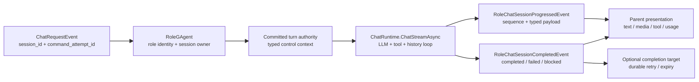
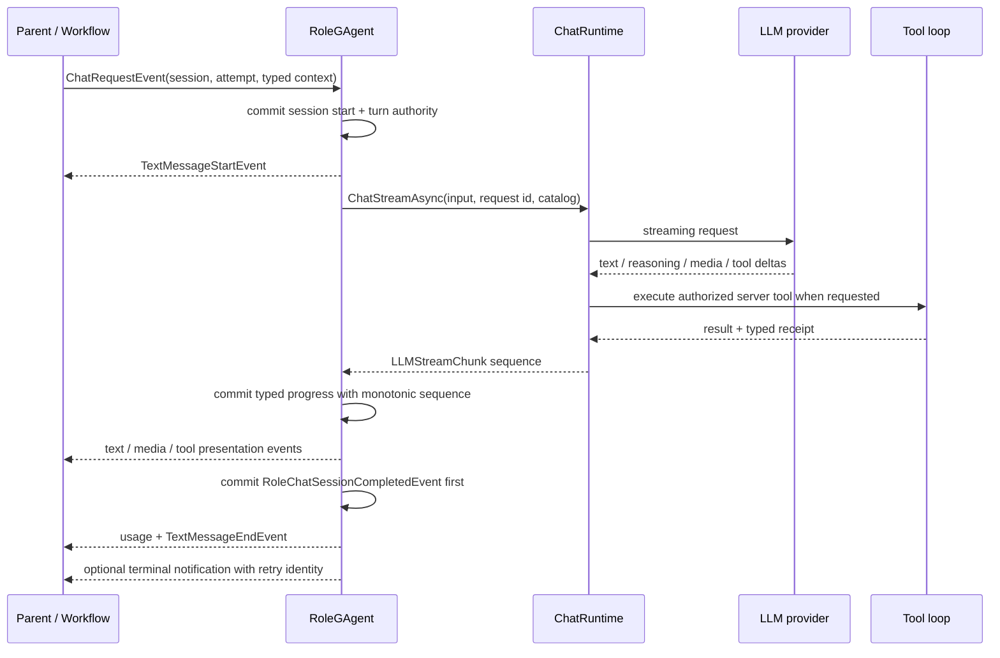

# RoleGAgent 与流式执行：actor turn、会话事实和终态重放

> 版本与结论：本章描述 `current`。`RoleGAgent` 是带 typed role identity、配置和 session state 的 actor；它在一个 actor turn 内直接拥有 `ChatStreamAsync` 的 LLM/tool/history 循环，把流式进度提交为 typed facts 并向 parent 发布展示事件。独立的 Responses session 才把长 run 交给 off-actor worker，但 worker 不能直接改状态，只能向 session actor 投递 typed `Record*` command。

## 设计抽象与事实源

- `src/Aevatar.AI.Core/RoleGAgent.cs:39`：role actor 持有身份、配置、session、stream 映射、终态与完成通知恢复。
- `src/Aevatar.AI.Abstractions/ai_messages.proto:388`：定义 session start/progress/completion、typed outcome、run context 与重放协议。
- `src/Aevatar.AI.Core/Chat/ChatRuntime.cs:95`：实时公共面只暴露 `ChatStreamAsync`，并在同一 stream flow 中驱动 middleware、LLM 与 tool rounds。

## 一次 role turn 的所有权



`RoleGAgent` 的 actor id 是运行身份，`role_id` 是业务 role identity，`role_name` 是展示名称，三者不能互换。初始化事件把 `role_id/name`、provider/model/system prompt、token/tool/history limits、event modules/routes 等写入 actor state；activation 从已提交 state 恢复身份和 history，而不是从 actor id 字符串反推 role。

一次 `ChatRequestEvent` 还分两类 id：

| 字段 | 所有权 | 作用 |
|---|---|---|
| `session_id` | role actor | 幂等 turn identity；已完成 session 可重放 |
| `command_attempt_id` | caller/dispatch attempt | 区分同一 session 的某次投递尝试 |
| `run_context.run_id/command_id/correlation_id` | workflow/service caller | 把 role terminal 关联回上游 run |
| `completion_notification_*` | role actor + target actor | terminal delivery identity、目标与期限 |

同一个 `session_id` 再次出现时，prompt、multimodal input 或 run context 有任何不同都会提交 `RoleChatCommandAttemptRejectedEvent`，不会覆盖既有 session。相同且已完成的请求不再调用 provider，而是从 committed snapshot 重放。

## 为什么 realtime 只保留 stream path

冻结 `ChatRuntime` 的公共实时面只有 `ChatStreamAsync`。此前用 `Task.Run + Channel` 把 LLM/tool/history 业务循环偷偷挪出 actor turn，会让 history、hook 和 tool state 脱离 actor 的串行所有权；当前实现删除了 owned-stream background loop，由 async iterator 直接拥有每一轮 provider stream。

这不表示所有长 LLM 工作都必须在 actor turn 内完成。边界按 actor 类型区分：

- `RoleGAgent` 的 chat turn：stream、tool loop、history 和 terminal 都在 role actor turn 内收敛。
- Responses direct session：session actor 只做短调度 turn，向有界进程内 queue 非阻塞入队；host worker 在 actor 外跑 LLM loop。
- off-actor worker 的 chunk/tool/terminal 不能直接写 state；它必须 dispatch `RecordLlmStreamChunkObserved`、`RecordLlmToolCallObserved`、`RecordLlmRunCompleted/Failed/Cancelled` 回 session actor FIFO inbox。

这是“执行可以外置，事实所有权不能外置”的分界。把所有 RoleGAgent 都机械改成 background worker，会额外引入 queue durability、record fencing 和 observation routing，却没有证明能带来收益；把 Responses 的长 run 塞回 grain turn，又会阻塞它需要交错处理的 record delivery。

## 从 chunk 到 committed terminal



RoleGAgent 会把不同 chunk 映射成不同的事实与展示：

- text、reasoning、media 先提交带单调 `sequence` 的 `RoleChatSessionProgressedEvent`，再向 parent 发布对应 presentation event；
- tool start 保存 tool name 与 typed presentation descriptor；tool completion 保存 result、success/error 和 receipt；
- tool arguments 在 receipt 要求 redaction 时不会进入对 parent 的 `ToolCallEvent`；
- usage、model、final content、reasoning、output parts、tool calls/results/receipts 最终收进 session completion。

terminal outcome 只有 `Completed`、`Failed`、`Blocked` 三类。`Blocked` 当前用于 typed authorization requirement。`ApprovalRequired` 则先持久化独立的 pending approval 与 progress，随后当前 chat session 仍可能以 `Completed` 关闭；这里的 `Completed` 只表示当前 chat turn / handoff 已结束，不证明 approval 已通过、tool 已执行或副作用成功。顺序上先落 `RoleChatToolApprovalRequiredProgress`，pending approval 事实由 `SuspendForToolApprovalAsync` 随后持久化并发布 approval request、调度超时；approval 通过后的 continuation request 携带 `WorkflowLlmToolApprovalContinuation`（`ai_messages.proto` 新增 `workflow_llm_tool_approval_continuation=15` 与同名 message，`PendingToolApprovalState` 新增 `workflow_llm_continuation=16`）。审批通过后会执行 yielded tool 并向自身 inbox 投递新的 continuation turn；拒绝或 continuation 失败则另行提交 `Failed` 终态。完整 continuation 见 `04/04-tool-approval-and-authorization.md`。

### 先提交终态，再发布结束帧

`RoleChatSessionCompletedEvent` 连同 usage、text-ended 和 terminal progress 先作为一个 committed terminal fact 落下；之后才补发未展示的 content、usage 与 `TextMessageEndEvent`。因此：

- `TextMessageEndEvent` 是 presentation，不是权威完成事实；
- commit 失败不能靠一个已经发出的结束帧冒充成功；
- actor 重启后可以从 completion snapshot 合成 replay progress，而不重新请求 LLM。

若 run context 指定 completion target，role actor 会用稳定 delivery id 投递 terminal，并把状态记为 `Prepared / RetryScheduled / Dispatched / Expired`。activation 会重试仍未 dispatched/expired 的 completion；只有 delivery 已完成或过期的旧 session 才允许在超过 128 个 tracked sessions 时被裁剪。

## Off-actor Responses 如何折回 actor facts

```mermaid
%%{init: {"maxTextSize": 100000, "flowchart": {"useMaxWidth": false, "nodeSpacing": 12, "rankSpacing": 48}, "themeVariables": {"fontSize": "10px"}}}%%
flowchart LR
    S["LlmSessionGAgent\nshort scheduling turn"]
    Q["Bounded in-process queue\nTryWrite or fail fast"]
    W["LlmRunExecutionWorker\noff actor/grain turn"]
    E["LLM run executor"]
    D["Typed Record* commands\ncorrelation_id = response_id"]
    A["Session actor FIFO inbox\nordering + idempotency"]
    O["Committed observation\nclient stream"]
    S --> Q
    Q --> W
    W --> E
    E --> D
    D --> A
    A --> O
```



queue 满时 scheduler 立即抛错，session actor 写 `execution_dispatch_failed` terminal；它不等待空位而占住 actor turn。worker 的 queue 是瞬态 handoff，不是事实源。真正的顺序、record idempotency、terminal 和 client observation 仍由 session actor 的 committed facts 所有。

每个 `Record*` envelope 的 id 使用独立 record id 做 dispatch 幂等，但 `CorrelationId` 必须等于 response/session id，才能进入对应 observation hub。worker 只等待 inbox admission，不做“提交一条后再订阅回读自己”的 per-record round trip。

## 最小消息示例

> Demo status：`verified-static`（按冻结 Protobuf、RoleGAgent handler、ChatRuntime 与 replay tests 静态核对；未配置真实 LLM provider，不能证明某个模型的内容、延迟或可用性。）

```text
InitializeRoleAgentEvent
  role_id:    triager
  role_name:  Ticket Triager
  provider_name: default
  model:      <host-selected>

ChatRequestEvent
  session_id:         turn-42
  command_attempt_id: attempt-1
  prompt:             Classify ticket 42
  run_context.run_id: workflow-run-7
```

预期静态协议是：同一 `turn-42` + 相同 input 可以 replay；同一 id + 不同 prompt/input/run context 被拒绝；provider/tool stream 收敛后先提交 `RoleChatSessionCompletedEvent`，再发布 terminal presentation。示例中的 `default` 只是 provider key，实际 provider/model 选择见下一章。

## 为什么是它，不是别的

**为什么 role/session 都由 actor 持有？** role config、history、tool receipts 与 terminal replay 必须共享串行版本。拆成多个进程内 manager 会让“已经回复但还没提交”“工具做完但 history 未追加”等窗口失去单一 owner。

**为什么 progress 也要 typed fact，不只推 AG-UI？** presentation 可能断线或重复；typed progress 带 session + sequence，projection 和 replay 才能区分事实顺序。AG-UI 是消费者协议，不是 state SSOT。

**为什么 completed request 要 replay，而不是再次调用 LLM？** `session_id` 是幂等 identity；重新采样会产生另一份内容和副作用。保存 terminal snapshot 让重试只补交付，不重做业务。

**为什么 off-actor worker 仍要回 actor inbox？** worker 适合长 I/O，不适合拥有 durable version。所有结果折回 typed command，actor 才能按 FIFO、record id 和 terminal state 拒绝 stale/duplicate。

## 边界与演进

- RoleGAgent 的 `ChatStreamAsync` 当前直接占有 actor turn；这保住执行完整性，也意味着同一 actor 的其他 command 需等待该 turn。只有出现可测量的吞吐/延迟问题，才值得引入像 Responses session 那样完整的 handoff + record protocol。
- parent 收到 text/tool/end frame 不证明 completion notification 已送达 workflow/service run；后者有独立 `Prepared/RetryScheduled/Dispatched/Expired` 状态。
- session state 最多保留 128 项是内存/快照上限，不是全局审计保留策略；仍待投递 terminal 的 session不会为了限额被裁掉。
- direct Responses worker 的 in-process queue 在 host crash 时会丢 handoff；durable run timeout 负责把未终止 run 收敛为失败，它不是 durable job queue。
- provider route、tool catalog/ownership、approval continuation、prompt overlays 分别见 `04/02`、`04/03`、`04/04`、`04/05`；本章不让 metadata bag 替代这些 typed authority。

## 读完应能回答

1. actor id、`role_id`、`role_name` 与 `session_id` 分别是谁的身份？
2. 为什么 RoleGAgent 的 stream loop 留在 actor turn，而 Responses direct run 可以在 worker 中执行？
3. text/media/tool/usage presentation 与 committed session facts 是什么关系？
4. 相同 `session_id` 的重试、冲突与 completed replay 怎样处理？
5. off-actor worker 为什么只能发 `Record*` command，不能直接更新 session state？

<details>
<summary>论断—证据映射</summary>

| 论断 | 等级 | 证据 |
|---|---|---|
| RoleGAgent 持有 typed role identity、session、pending approval 与配置 state | E1 | `src/Aevatar.AI.Core/RoleGAgent.cs:39`、`src/Aevatar.AI.Abstractions/ai_messages.proto:812` |
| `session_id` 是幂等 turn，`command_attempt_id` 是投递尝试；冲突 input 被拒绝 | E1 | `src/Aevatar.AI.Abstractions/ai_messages.proto:53`、`src/Aevatar.AI.Core/RoleGAgent.cs:2263` |
| ChatRuntime 实时公共面只暴露 stream，并直接拥有 middleware/provider/tool flow | E1 | `src/Aevatar.AI.Core/Chat/ChatRuntime.cs:95`、`:230` |
| RoleGAgent 将 stream chunk 提交为 typed progress 并发布 text/media/tool presentation | E1 | `src/Aevatar.AI.Core/RoleGAgent.cs:1343` |
| `ApprovalRequired` 持久化 pending approval，但当前 session 仍可为 `Completed`；`Blocked` 只由 typed authorization requirement 决定 | E1 | `src/Aevatar.AI.Core/RoleGAgent.cs:532`、`:1127`、`:1550` |
| terminal fact 先提交，再发布 missing content、usage 与 text end | E1 | `src/Aevatar.AI.Core/RoleGAgent.cs:1140`、`src/Aevatar.AI.Abstractions/ai_messages.proto:429` |
| completed session 重试走 snapshot replay，不重复调用 provider | E1 | `src/Aevatar.AI.Core/RoleGAgent.cs:1021`、`:1878` |
| completion notification 状态可重试/过期，并在 activation 恢复 | E1 | `src/Aevatar.AI.Core/RoleGAgent.cs:105`、`:2012`、`src/Aevatar.AI.Abstractions/ai_messages.proto:529` |
| Responses direct run 经有界 queue 在 worker 执行，并用 typed Record commands 回 session actor | E1 | `src/platform/Aevatar.GAgentService.Application/Responses/LlmRunExecutionQueue.cs:7`、`src/platform/Aevatar.GAgentService.Hosting/Responses/LlmRunExecutionWorker.cs:9`、`src/platform/Aevatar.GAgentService.Application/Responses/LlmRunExecutor.cs:161` |

</details>
