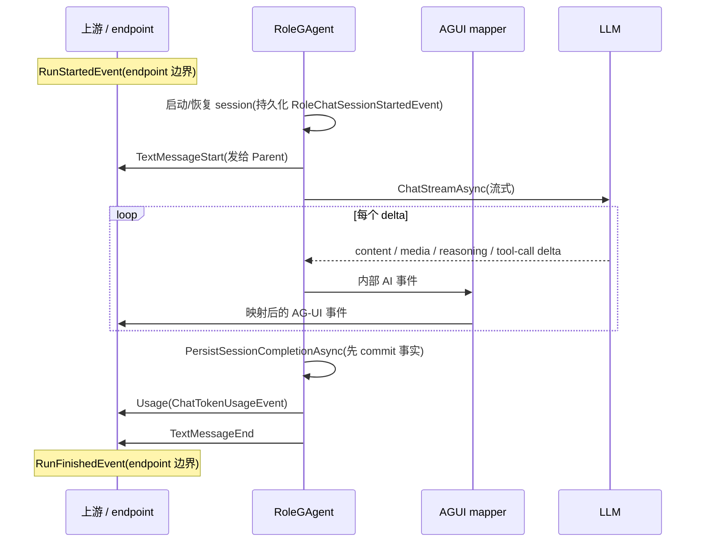
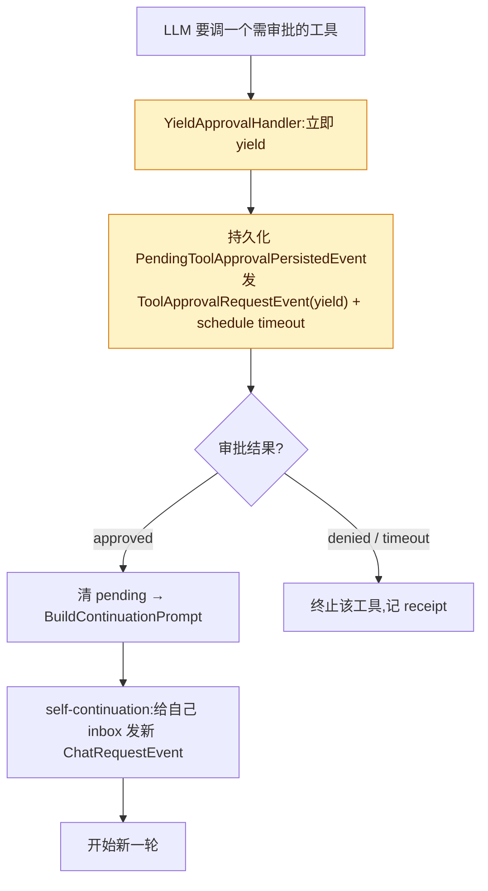

# RoleGAgent:处理 ChatRequestEvent、流式调 LLM、发 AG-UI 事件

## 本篇涉及的设计抽象

> 以下论断均可回指 `~/Code/aevatar` 源码验证,但本篇用设计语言描述,不贴文件路径/行号。

---

## RoleGAgent 是什么

`RoleGAgent` 是 aevatar 的 AI 角色 actor(kind `ai.role-agent`),继承 `AIGAgentBase<RoleGAgentState>`。它的契约可以压成三步:

1. 经 `ChatStreamAsync` 流式调 LLM;
2. 把流式结果翻译成 AG-UI 事件序列,推给上游;
3. 把稳定 id、长度、状态、脱敏标记记进 actor-owned state。

**Role 身份是 typed actor-owned fact**:旧模式从 child actor id 前缀解析 role 身份;新模式把 `RoleId`/`RoleName` 作为持久化的 actor-owned fact,不再依赖 id 命名约定。

---

## 一次流式回合:从 ChatRequestEvent 到 AG-UI

`HandleChatRequest` 标了 `[EventHandler(AllowSelfHandling = true)]`——允许 self-continuation(审批通过后给自己再发一条 `ChatRequestEvent`,见下一节)。一条请求进来后大致经过:

- **completed-session replay fast path**:已结束的 session 直接重放结果,不再调 LLM;
- **启动 / 恢复 session**:遇到新 SessionId 时持久化 `RoleChatSessionStartedEvent`;
- **解析 per-request LLM timeout**(`ResolveLlmTimeoutMs` + `CancellationTokenSource`);
- 流式开始前,先发 `TextMessageStartEvent` 给 `TopologyAudience.Parent`;
- 进入 `ExecuteStreamingChatAsync`,逐 delta 发事件。

> **两层事件,别混为一谈**:`RoleGAgent` 本身发的是**内部 AI 事件**(`ai_messages.proto` 定义);它们由一个 mapper(`ScopeGAgentAguiEventMapper`)翻译成 **AG-UI 线上事件**(`agui_events.proto`)后才到前端。下表左边是内部事件,右边是它映射到的 AG-UI 事件。

| 内部 AI 事件(RoleGAgent 发) | 映射到的 AG-UI 线上事件 |
|---|---|
| content delta | `TextMessageContentEvent { Delta }` |
| media delta | `MediaContentEvent` |
| reasoning delta | `CustomEvent("TEXT_MESSAGE_REASONING")` |
| 累积的 `ToolCallEvent { CallId, ToolName, ArgumentsJson }` | `ToolCallStartEvent` |
| `ToolResultEvent`(带 `AgentToolReceipt`) | `ToolCallEndEvent` |

两点容易踩的细节:

- **没有 `ToolCallArgs` 这类事件**。一次工具调用在 AG-UI 线上只有 `ToolCallStartEvent` + `ToolCallEndEvent` 两帧;参数 JSON 塞在 Start 帧里,不是单独一帧 args delta。画时序图时别凭印象加一个 args 帧。
- **`RunStartedEvent` / `RunFinishedEvent` 不是 RoleGAgent 发的**:它们在 HTTP/endpoint 边界产生(actor 回合之外)。RoleGAgent 只负责 turn 内的 `TextMessage*` / `ToolCall*` / `Usage`。

终端序列:`PersistSessionCompletionAsync`(**先 commit 事实**)→ `PublishMissingDisplayContentAsync` → `PublishUsageAsync`(`ChatTokenUsageEvent` → `UsageEvent`)→ `PublishCompletionAsync`(发 `TextMessageEndEvent`)。先 commit 再发完成事件,是为了让"会话已结束"先成为事实,再被读侧观察到。

---

## 工具审批与 self-continuation

工具调用需要审批时,RoleGAgent 不阻塞 actor:它持久化 `PendingToolApprovalPersistedEvent`,发出 `ToolApprovalRequestEvent`(mode `"yield"`),并 schedule 一个 timeout。默认审批 handler 是 `YieldApprovalHandler`——立即 yield,把"待审批"做成**持久化的 continuation**(state + 远程升级通道 + timeout),而不是占着 mailbox 干等。

审批通过后:清掉 pending approval → `BuildContinuationPrompt` → **self-continuation**:给自己 inbox 发一条新的 `ChatRequestEvent`(`SendToAsync(Id, continuationRequest)`),开始新一轮。这正是 `AllowSelfHandling = true` 的用处——让 actor 在不破坏"邮箱串行"前提下,把一次被审批打断的对话接着跑下去。

---

## 验收

1. RoleGAgent 的事件序列是什么?(turn 内:`TextMessageStart → Content*/Media*/Reasoning* → ToolCall(Start/End)* → Usage → TextMessageEnd`;`Run` 级事件在 endpoint 边界)
2. Role 身份存哪?(typed actor-owned fact,`RoleId`/`RoleName` 持久化在 state,不靠 id 前缀解析)
3. 工具审批后怎么继续?(yield 成持久化 continuation;审批通过后 self-continuation,给自己发新 `ChatRequestEvent`)

⟦AI:AUTO-LOOP⟧
