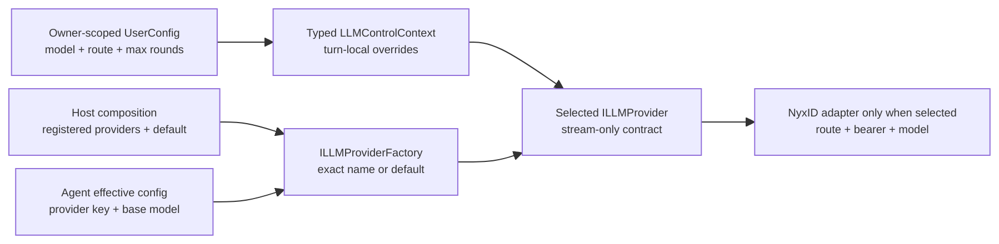
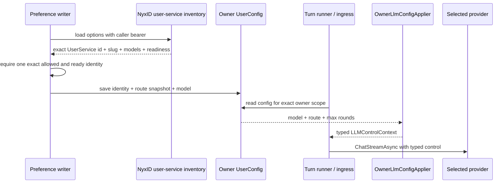
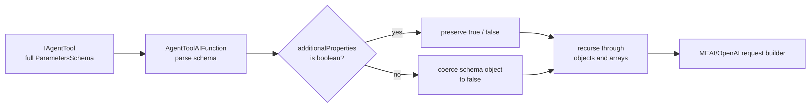
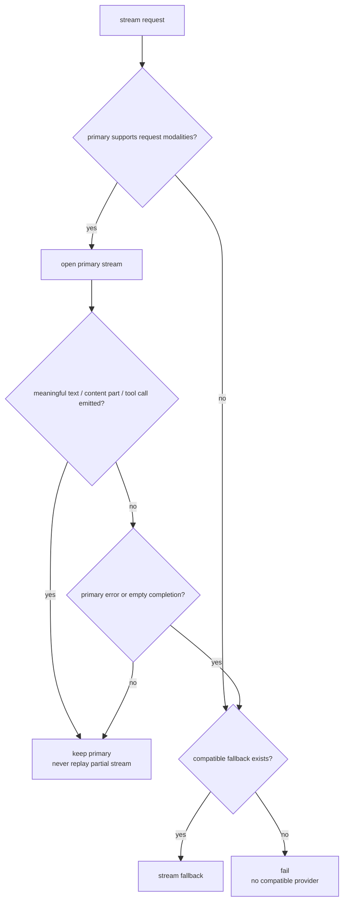

# LLM Provider 与路由选择：四类身份、owner 覆盖和安全 failover

> 版本与结论：本章描述 `current`。Aevatar 把“由谁执行”“请求哪个模型”“经哪条 NyxID route”“用户选中了哪一个 UserService”分成四个字段域：Host 组合 `ILLMProviderFactory`，agent 选择 provider key，typed `LLMControlContext` 覆盖 model/route，Studio 在保存偏好时用 exact NyxID `UserService.id` 校验选择。NyxID provider 只是把同一个 stream contract 适配到 gateway/proxy，不是所有 LLM 的通用后端。

## 设计抽象与事实源

- `src/Aevatar.AI.Abstractions/LLMProviders/ILLMProvider.cs:9`：provider 只有命名、能力声明和 stream-only 调用契约。
- `src/Aevatar.AI.Core/LLMProviders/OwnerLlmConfigApplier.cs:20`：按 owner scope 把 model、NyxID route 与 tool-round cap 合入 typed control。
- `src/Aevatar.Bootstrap.Extensions.AI/CompositeLLMProviderFactory.cs:31`：Host 把标准 provider 与额外 provider 合成一个按名解析、带显式 default 的目录。

## 先把四个名字拆开

`provider`、`model`、`route` 和 `UserService` 常一起出现在 UI，却属于不同 owner：

| 名字 | 例子 | 决策 owner | 不代表什么 |
|---|---|---|---|
| provider key | `nyxid`、`openai` | Host provider factory + agent config | 不是模型 id，也不是 NyxID service |
| model id | `gpt-5`、`vendor/model` | turn typed control / agent request / provider default | 不携带 service authorization |
| NyxID route | `/api/v1/llm/gateway/v1`、`/api/v1/proxy/s/chrono-llm` | owner preference 或请求期 typed control | route/slug 不是稳定授权身份 |
| UserService identity | exact `NyxIdUserServiceId` | NyxID inventory，在偏好写入边界核验 | 不等同于 slug、route 或 model |



agent 的 `EffectiveConfig.ProviderName` 为空时取 factory default；非空且出现在 available providers 中时按名获取；配置名不存在时记录 warning，再回到 default。owner overlay **不会**修改 provider key，它只覆盖 `ModelOverride`、`NyxIdRoutePreference` 和 `MaxToolRoundsOverride`。因此“选择 `chrono-llm` route”不能被解释成“把 provider 改成 `chrono-llm`”。只有 Host/agent 已选中 `nyxid` provider 时，该 route 才由 NyxID adapter 消费。

## Host 先决定 provider 目录与 default

冻结树包含三个 LLM provider package：`Aevatar.AI.LLMProviders.MEAI`、`Aevatar.AI.LLMProviders.Tornado`、`Aevatar.AI.LLMProviders.NyxId`。package 存在只说明实现可组合，不代表每个 Host 都注册或启用了它。

Bootstrap 的组合顺序是：

1. 从 secrets/config 读取已配置 providers；没有条目时才尝试配置化 fallback registration。
2. default provider name 依次取 secrets default、`Models:DefaultProvider`、feature option，并要求命中已配置名字；否则取第一项。
3. 标准 providers 进入 primary factory；启用时由 MEAI primary 与 Tornado fallback 组成 failover factory。
4. NyxID 配置存在时建立独立 NyxID factory；标准 providers 也存在时，用 `CompositeLLMProviderFactory` 合并。按名命中额外 NyxID provider，否则委托 primary factory；`GetDefault` 仍按已解析的 default name 获取。

这套目录是 Host 事实，不能由 prompt、metadata 或 UI 随意新增。provider 未注册时，系统只能按既定 default/failover 规则处理，不能把任意 URL 当 provider。

## owner preference 怎样进入一次 turn

Mainnet Host 用一个窄 bridge 按 `UserConfigResourceKey.ForOwnerScope(scopeId)` 读取 Studio UserConfig，再把选择映射成 `OwnerLlmConfig`：Gateway 对应 canonical gateway route，NyxID UserService 对应已保存 `RouteValue`，model 与 max rounds 保持独立字段。Channel turn runner 以 registration owner scope 调用共享 applier；Responses/Messages/Chat Completions ingress 也按 caller scope 读取同一 port，但拥有各自的 ingress 优先级逻辑，不能假设所有 surface 都调用同一个 helper 方法。



保存 NyxID service preference 时，writer 不接受一个裸 slug 冒充选择。它先用 bearer 读取 inventory，再按 case-sensitive exact `NyxIdUserServiceId` 要求唯一匹配，且 option 必须 `Allowed`、`Ready`；route-prefixed model 还必须与所选 service slug 相符。成功后同时保存：

- selection kind = `NyxIdUserService`；
- exact `UserService.id` 与 service slug；
- 从该 option 生成的 `/api/v1/proxy/s/{slug}` route snapshot；
- 选定 model 或该 option 的 default model。

这是“exact owner selection”的准入点。当前 turn 执行时，owner bridge 只把已保存的 model/route/max-rounds 投影为 typed control；它**不会每次重新读取 NyxID inventory、也不会重新验证已保存 UserService 的 readiness**。service 被撤销、route 失效或授权不足时，当前执行会从 NyxID 调用返回失败；不能把“曾经保存成功”当成永久 readiness 证明。

owner config 不存在、scope 为空或 port 未装配时，原 control 保持不变。非取消类读取异常会 warning 后回落到原 control/provider defaults；调用方 cancellation 则继续抛出。这里的“回落”是配置读取可用性策略，不等于 provider stream failover，也不允许换成另一个人的 owner config。

## NyxID 是 adapter，不是 universal backend

`NyxIdLLMProvider` 实现同一个 `ILLMProvider.ChatStreamAsync`，内部才把请求适配成 OpenAI-compatible client。它做三项局部解析：

- model：`LLMControlContext.ModelOverride` > routing context override > request model > provider default；
- bearer：typed caller credential > `LLMControlContext.NyxIdAccessToken` > host accessor；Bootstrap 的 NyxID registration 明确把 host accessor 设为 null，所以该组合没有本地 secret fallback；
- route：typed LLM control > routing context；只接受 gateway alias、canonical lowercase service slug 或 `/api/v1/proxy/s/{slug}`，并把 endpoint 限制在配置的 NyxID authority 内。

route 为空且请求没有显式 route 时，provider 可使用部署配置的 default route；否则回到默认 gateway endpoint。NyxID 返回的 401/403、429、503 与其他 4xx/5xx 会被分类成 typed upstream failure，提示重新认证、等待、换 route/model 或检查请求；adapter 本身不会遍历用户目录并偷偷选择另一项 UserService。

因此 NyxID 在这里拥有 credential/route proxy 边界，不拥有 Aevatar 的 provider catalog、agent identity、tool authorization 或所有模型实现。MEAI/Tornado 可以作为 Host 内其他 provider 路径存在，且不经过 NyxID。

## MEAI 在 provider 边界收窄 tool schema 方言

MEAI 不只适配 stream，也负责把 `IAgentTool.ParametersSchema` 交给 OpenAI-compatible 请求构造器。两侧接受的 JSON Schema 方言并不完全相同：调用方工具可以用 schema object 形式的 `additionalProperties` 表达 map value 类型，而当前 MEAI/OpenAI adapter 在这个位置读取的是 boolean。若直接透传，对象值会在请求发出前触发类型转换异常，使整个 turn 失败。



归一化发生在 `AgentToolAIFunction` 的 provider adapter 边界，并递归遍历 object 与 array：已有 boolean 保持不变，任何非 boolean 的 `additionalProperties` 改为 `false`。空白、无法解析或空节点 schema 则退回最小 object schema。这样 caller-supplied tool 不会因为 adapter 的窄方言在序列化阶段击穿整个 turn，同时也不会把不受支持的开放字段悄悄放行。

例如，工具原本声明：

```json
{
  "type": "object",
  "properties": {
    "env": {
      "type": "object",
      "additionalProperties": { "type": "string" }
    }
  },
  "additionalProperties": false
}
```

进入 MEAI 请求后，嵌套 `env.additionalProperties` 会变成 `false`，根部本来就是 boolean 的限制保持不变。这是有意的有损降级：请求能按目标 adapter 的契约构造，但 map value schema 的表达能力不会被保留。因此工具设计不能依赖 MEAI 路径替它完整承载任意 JSON Schema 方言；若 map 的动态 key 是业务必需能力，应改成目标方言可表达的显式数组/键值对象，或选择真正支持该 schema 的 provider。

**为什么在 provider adapter 归一化，而不是改写 `IAgentTool`？** `IAgentTool` 是跨 provider 的工具契约，提前收窄会把 MEAI/OpenAI 的限制错误扩散给其他实现。边界适配让损失只发生在需要它的出口，也使测试能从 tool contract 一直验证到实际 HTTP request body。

## failover 只在尚未产生有意义输出时发生

标准 provider 路径启用 MEAI→Tornado failover 时，factory 先解析 primary/fallback，并用两侧 capability 判断请求模态是否兼容。运行时的切换点非常窄：



- primary 在任何 meaningful text/content/tool chunk **之前**抛出可切换异常，或正常结束却没有 meaningful chunk，才调用 fallback；
- primary 一旦产生 meaningful chunk，后续异常原样上抛，不再换 provider，以免把半条回答、已开始的 tool call 或副作用重放到第二个后端；
- caller cancellation 不触发 failover；primary/fallback 均不支持请求模态时明确失败；
- factory 可以按配置让 named lookup 的 fallback 使用 fallback default，但这是 Host 组合策略，不是模型根据内容自行路由。

当前 MEAI→Tornado failover 只包裹标准 provider factory；作为 additional provider 合入的 NyxID provider 不自动进入这条跨实现 failover。NyxID route 失败时不会静默跳到 MEAI/Tornado，也不会自动换另一个 UserService。

## 最小配置与解析示例

> Demo status：`verified-static`（按冻结 provider registration、owner preference writer、typed control、NyxID route resolver 与 failover tests 静态核对；未携带真实 bearer 调用任何外部模型，不能证明 route 的在线可用性或模型输出。）

```yaml
Models:
  DefaultProvider: nyxid
Aevatar:
  NyxId:
    Authority: https://id.example.invalid
    DefaultRoute: chrono-llm
    DefaultModel: gpt-5
```

若 Host 注册了名为 `nyxid` 的 provider，owner config 保存 `UserService.id = usvc-42`、route `/api/v1/proxy/s/team-llm` 与 model `vendor/model-a`，一次 turn 的解析结果是：provider key 仍为 `nyxid`，model 为 `vendor/model-a`，endpoint 位于同一 authority 的 service proxy route，bearer 来自该请求的 typed credential。`usvc-42` 是写入准入证据，不会被发送给 provider 当作 model 或 route。

## 为什么是它，不是别的

**为什么 provider 和 route 不合成一个字符串？** provider 是 Host 装配的执行实现，route 是某个 provider 内的请求目的地。合并后，owner preference 就能越权创建实现或外连任意 authority。

**为什么保存 UserService 必须 exact id？** slug 可重名、改名或只代表转发路径；inventory id 才能证明用户当时确实选择了一个可用、被允许的服务。route snapshot 负责执行，exact id 负责选择可审计性，两者不可互换。

**为什么配置读取异常允许回到 default？** owner preference 是定制层，不是 credential 或 authorization。短暂 projection 故障不应让所有 turn 停摆；但回落只能使用同一 Host 的公开 default，不能借机换 owner 或伪造 service grant。

**为什么已有输出后不 failover？** 两个 provider 对同一 prompt 不会生成同一事实；partial stream 后重跑会重复文本、tool call 或副作用。宁可暴露失败，也不拼接两次执行。

## 边界与演进

- provider package、注册实例、default provider 与 per-owner route 是四份不同事实；运维排障必须分别观察，不能用“模型名正确”推导“provider/route 正确”。
- 当前 exact UserService 检查发生在偏好写入时，turn 不做 live revalidation。若需要撤销后即时阻断，应增加带版本/digest 的请求期 revalidation，而不是从 slug 猜 identity。
- owner config helper 与 Responses ingress 的读取策略共享同一 port/字段，但入口优先级不完全相同；explicit caller model、route policy、owner default 的具体关系应以各入口契约为准。
- channel sender preference 可以在有 binding 的 turn 对 owner snapshot 做字段级覆盖；这是 conversation/identity 层规则，见后续 `07` 章节，不改变 provider/route/UserService 四分法。
- route/model failure 不是 authorization approval。credential、tool admission 与 side-effect boundary 见 `04/04-tool-approval-and-authorization.md`。

## 读完应能回答

1. provider key、model id、NyxID route 与 exact UserService identity 分别由谁拥有？
2. owner preference 为什么能覆盖 model/route，却不能创建或切换一个未注册 provider？
3. NyxID preference 在保存时怎样证明 exact service，运行时又有哪些不再验证的边界？
4. MEAI→Tornado failover 在什么时刻允许发生，为什么 meaningful output 后必须停止切换？
5. 为什么 NyxID provider 是 adapter，而不是 Aevatar 所有 LLM 的 universal backend？
6. MEAI 为什么要在自身 adapter 边界收窄 `additionalProperties`，这种兼容处理损失了什么？

<details>
<summary>论断—证据映射</summary>

| 论断 | 等级 | 证据 |
|---|---|---|
| provider contract 只暴露命名、能力与 `ChatStreamAsync` | E1 | `src/Aevatar.AI.Abstractions/LLMProviders/ILLMProvider.cs:9` |
| agent 按 effective provider key 获取实例，空或不可用时回到 Host default | E1 | `src/Aevatar.AI.Core/AIGAgentBase.cs:363` |
| Host 分离标准/NyxID providers，并用 composite 保持按名解析与显式 default | E1 | `src/Aevatar.Bootstrap.Extensions.AI/ServiceCollectionExtensions.cs:663`、`src/Aevatar.Bootstrap.Extensions.AI/CompositeLLMProviderFactory.cs:31` |
| owner bridge 按 exact owner scope 读取 UserConfig，applier 只合入 model/route/max rounds | E1 | `src/Aevatar.Mainnet.Host.Api/Hosting/StudioUserConfigOwnerLlmConfigSource.cs:22`、`src/Aevatar.AI.Core/LLMProviders/OwnerLlmConfigApplier.cs:31` |
| preference writer 要求 exact inventory identity、allowed/ready，并分别保存 id、slug、route 与 model | E1 | `src/Aevatar.Studio.Application.Abstractions/Studio/Abstractions/UserLlmPreferenceWriteCore.cs:17`、`:40`、`src/Aevatar.Studio.Application/Studio/Services/UserLlmPreferenceWriter.cs:59` |
| NyxID adapter 分别解析 model、bearer、route，并把 endpoint 限制在配置 authority | E1 | `src/Aevatar.AI.LLMProviders.NyxId/NyxIdLLMProvider.cs:267`、`:405`、`:424`、`:441` |
| MEAI adapter 递归把非 boolean `additionalProperties` 收窄为 `false`，并保留已有 boolean | E1 | `src/Aevatar.AI.LLMProviders.MEAI/AgentToolAIFunction.cs:52`、`test/Aevatar.AI.Tests/AgentToolAIFunctionSchemaSanitizationTests.cs:21` |
| standard provider 仅在 meaningful output 前失败/空流或 capability 不兼容时切 fallback | E1 | `src/Aevatar.AI.Core/LLMProviders/FailoverLLMProviderFactory.cs:194`、`:230`、`:263`、`:281` |
| 当前 turn owner overlay 消费保存的 route/model，不重新读取 UserService inventory | E1 | `src/Aevatar.Mainnet.Host.Api/Hosting/StudioUserConfigOwnerLlmConfigSource.cs:24`、`src/Aevatar.AI.Core/LLMProviders/OwnerLlmConfigApplier.cs:37` |

</details>
