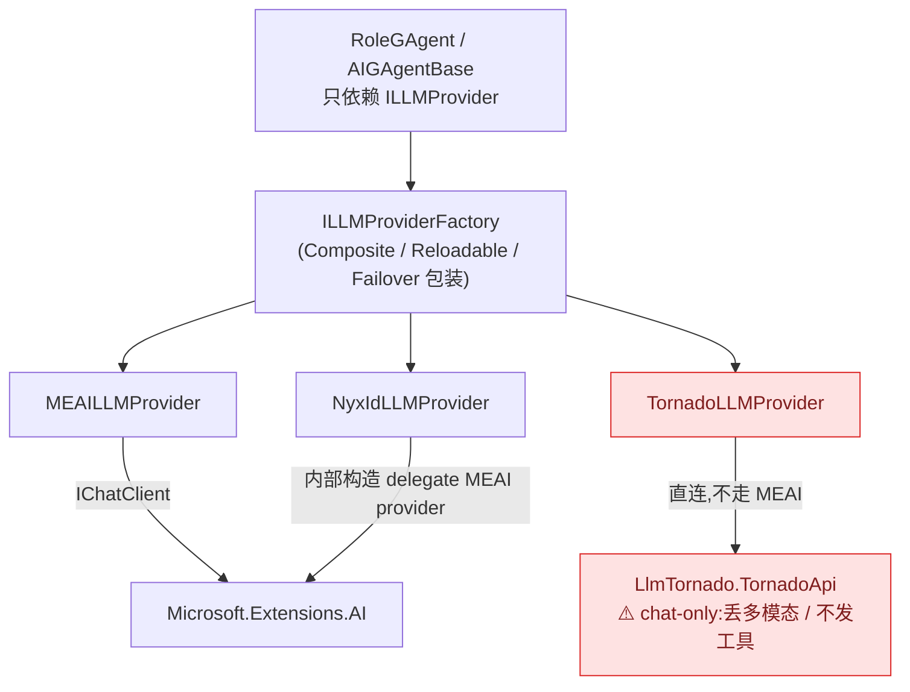
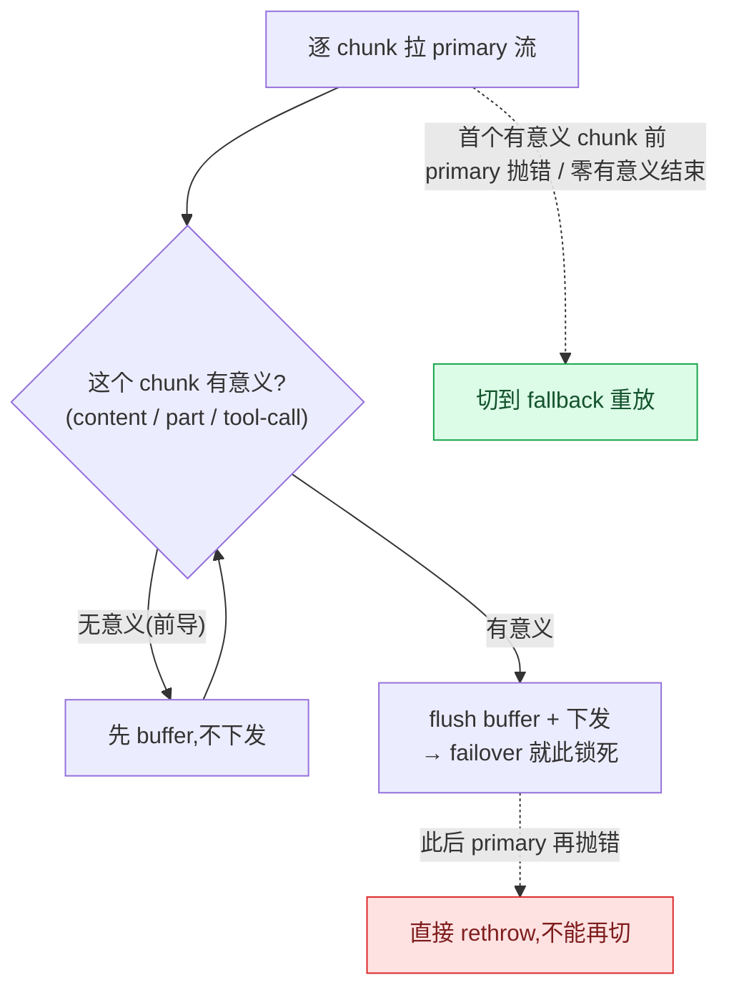

# LLM Provider 抽象与实现:MEAI / NyxId / Tornado / Failover

## 本篇涉及的设计抽象

> 以下论断均可回指 `~/Code/aevatar` 源码验证,但本篇用设计语言描述,不贴文件路径/行号。

---

## Provider 契约

`ILLMProvider` 刻意只暴露一个流式方法:

- `string Name`
- `LLMProviderCapabilities Capabilities`(默认 `TextOnly`)
- `IAsyncEnumerable<LLMStreamChunk> ChatStreamAsync(LLMRequest, CancellationToken)`——**唯一调用方式**(非流式 `ChatAsync` 已移除;需要整段结果时由 `ChatStreamContentAggregator` 把流折叠起来)

`ILLMProviderFactory`:`GetProvider(name)` / `GetDefault()` / `GetAvailableProviders()`。

---

## 四个 Provider 实现

全仓共 **4 个** `ILLMProvider` 实现。这里要纠正一个常见误解:**不是"NyxId 和 Tornado 都桥接 MEAI"——只有 NyxId 经 MEAI,Tornado 是直连、且能力降级**。

| Provider | 桥接方式 | 能力 |
|---|---|---|
| **MEAILLMProvider** | `Microsoft.Extensions.AI` 的 `IChatClient` | 通用桥接;`MEAILLMProviderFactory` 持 `ImmutableDictionary` + `Register`/`SetDefault` |
| **NyxIdLLMProvider** | 每路由构造一个 delegate MEAI provider(`CreateDelegateProvider` → `new MEAILLMProvider`) | 经 MEAI,full 能力;NyxId 网关路由 |
| **TornadoLLMProvider** | **直接实现 `ILLMProvider`**,内部包 `LlmTornado.TornadoApi` | ⚠️ **纯 chat 降级路径**(见下) |
| **FailoverLLMProvider** | 包两个 factory(primary + fallback) | 容错包装(见下) |

三个 provider 都对外暴露同一个 `ILLMProvider`,所以 `RoleGAgent` 只依赖 `ILLMProvider`、不关心背后是谁——这是好的抽象。但**对等的只是接口,不是能力**:

> ⚠️ **Tornado 是降级旁路,不是对等实现**。它直接实现 `ILLMProvider`(不走 MEAI),capabilities 声明 text-only:
> - **多模态被静默丢弃**:`MapRequest` 检测到非文本 content part,会调 `StripNonTextContentParts` 只保留文本,并附一句 `"[Note: ... content was attached but this model only supports text]"`,不报错。
> - **工具调用不发送**:`MapRequest` 从不把 tools 挂到请求上;源码注释明说"Tool Calling:推荐使用 MEAI Provider / LlmTornado Provider 主要用于纯 Chat 场景"。
>
> 后果:**任何挂在 Tornado 上的 role 会静默失去 tool use 和多模态**。除非确认只做纯文本 chat,否则不要把带工具的 role 路由到 Tornado。落地前若要继续用,04 这条 ⚠️ 应保留(已登记到 [08/04 TODO List](../08/04-todo-list.md) P2-2)。

---

## Composite + Reloadable + Failover 工厂

**CompositeLLMProviderFactory**:包装 primary factory + additional providers;`GetProvider` 先查 additional 再回退 primary;`GetAvailableProviders` 合并去重。

**ReloadableLLMProviderFactory**:热重载。用 `Snapshot(Factory, Version, LastFailedVersion)` record 做原子 swap;`GetCurrentFactory` 在 version 匹配时走无锁 fast path,否则 `RebuildFactory`(`Interlocked.CompareExchange` swap;异常时记 `LastFailedVersion` 抑制重复日志、保留旧 snapshot)。

**FailoverLLMProviderFactory**(原文档遗漏,补上):主→备容错。primary 来自 `_primaryFactory`、fallback 来自 `_fallbackFactory`(各自 try-resolve,失败吞成 `null`;两者都 `null` 才抛)。它最关键的语义是**"首个有意义 chunk 之前才能中途切换"**:

判定"有意义"= `DeltaContent` 非空、或有 content part、或有 tool-call。无意义的前导 chunk 先 buffer 不下发;一旦下发了首个有意义 chunk,failover 锁死——因为已经吐了一半给用户,这时再切 provider 会产生不一致输出。另有 per-request 模态门控:`Capabilities.SupportsRequest(request)` 为 false 的 provider 会被跳过。

---

## 验收

1. `ILLMProvider` 唯一调用方式?(`ChatStreamAsync`,流式;需要整段由 `ChatStreamContentAggregator` 聚合)
2. NyxId、Tornado 跟 MEAI 的关系?(只有 NyxId 经 MEAI;Tornado 直连,且是 chat-only 降级路径,丢多模态、不发工具)
3. `FailoverLLMProvider` 什么时候还能切到 fallback?(首个有意义 chunk 下发之前;之后锁死,直接 rethrow)
4. `ReloadableLLMProviderFactory` 怎么热重载?(version-stamp + 原子 `CompareExchange` swap)

⟦AI:AUTO-LOOP⟧
