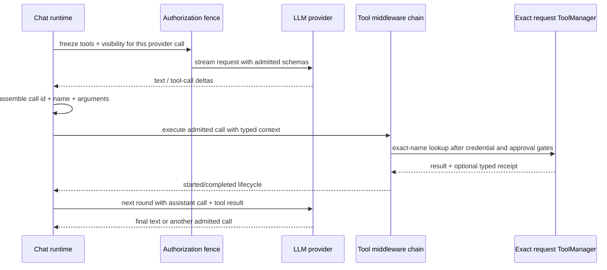
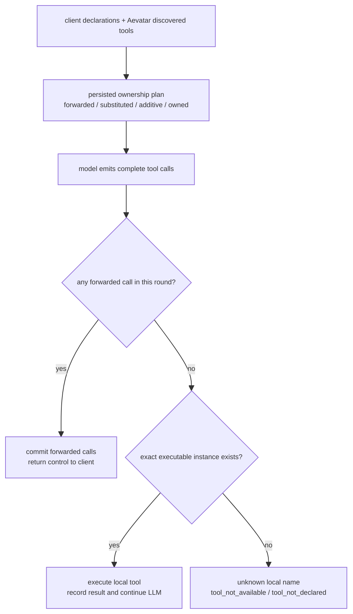

# Tool loop、请求目录与展示事实：先冻结权力，再执行调用

> 版本与结论：本章描述 `current`。Aevatar 的工具链不是“扫描到什么就让模型调用什么”：`IAgentToolSource` 只负责发现候选，route/profile/visibility 在一次 turn 内收敛成请求目录，authorization fence 再把 exact tool instance 与可见性冻结。普通 chat 只执行这个目录中的 server tools；Responses surface 另行区分 Aevatar-owned 与 client-forwarded tools。presentation descriptor 负责稳定展示，receipt 负责结果与副作用事实，两者都不授予执行权。

## 设计抽象与事实源

- `src/Aevatar.AI.Core/Tools/ToolCallLoop.cs:20`：定义 LLM → tool call → middleware/execution → tool result → 下一轮 LLM 的受限循环。
- `src/Aevatar.Foundation.Abstractions/Tools/tool_presentation.proto:22`：定义 tool card 的 invocation identity、kind、availability 与 typed source reference。
- `src/Aevatar.AI.Abstractions/ToolProviders/IAgentToolSource.cs:11`：定义候选工具的异步发现口，不承诺 Host 注册或 turn 准入。

## 从 package 到一次 turn 的请求目录

冻结树当前有 18 个 `Aevatar.AI.ToolProviders.*` package。按主要所有权可以作如下基线盘点；这是代码库存，不是“每个 Host 默认启用”的清单：

| 主要边界 | package |
|---|---|
| Aevatar 控制面与 actor 能力 | `AevatarInvocation`、`AgentCatalog`、`Binding`、`Channel`、`ChannelAdmin`、`StudioProvisioning`、`Workflow` |
| 外部系统 adapter | `ChronoStorage`、`Lark`、`MCP`、`NyxId`、`Ornn`、`ServiceInvoke`、`Telegram`、`Web` |
| 可扩展执行与目录组合 | `Scripting`、`Skills`、`ToolSetRegistry` |

一个 package 可以提供一个或多个 source；Host feature flag、DI composition、tool set、caller credential、profile policy 与 turn visibility 还会继续收窄。目录存在、source 被注册、tool 被发现、tool 对本 turn 可见、tool 获准执行，是五个不同事实。

```mermaid
%%{init: {"maxTextSize": 100000, "flowchart": {"useMaxWidth": false, "nodeSpacing": 12, "rankSpacing": 48}, "themeVariables": {"fontSize": "10px"}}}%%
flowchart LR
    P["Tool provider packages<br/>implementation inventory"]
    S["IAgentToolSource<br/>discover candidates"]
    H["Host DI + named tool set<br/>composition boundary"]
    R["Route/profile policy<br/>maximum + recovery + task"]
    V["Caller tool visibility<br/>typed attenuation"]
    C["AgentProfileTurnCatalog<br/>frozen names + exact route tools"]
    Q["LLM request<br/>schemas visible to model"]
    P --> S
    S --> H
    H --> R
    R --> V
    V --> C
    C --> Q
```



有 profile 的 turn 会先准备并提交 authority ceiling，再物化 `AgentProfileTurnCatalog`。catalog 持有：

- `FinalAllowedToolNames`：maximum policy、recovery/task policy、caller visibility 与 committed authority ceiling 的交集；
- `RouteOwnedTools`：本 route 物化出的 exact `IAgentTool` 实例，按名字冻结；
- profile/selected-skill prompt layer、selected/candidate intent 与有界 diagnostics。

任一 profile digest 不匹配、tool set/discovery/policy 失败都会降到 recovery 或 restricted-empty，而不是扩大目录。不同实例发生同名 collision 时，该名字从 exact map 移除；catalog materialization 还拒绝任何超出 reconcile proposal ceiling 的名字。

没有 profile catalog 不等于“任意工具可用”：基础 request 的 tools 与 typed `ToolVisibility` 仍是边界。catalog 只是更具体的 turn-local ceiling，不是唯一安全层。

## authorization fence 为什么必须在 middleware 两侧

`ChatRuntimeRequestBuilder` 先把基础 tools 与 route-owned tools 做 exact merge，再按 visibility 过滤。进入一次 provider call 前，`AuthorizationFence` 对当时的 schema tool instances 与 visibility 做冻结；hook/LLM middleware 运行前后都会重新应用：

- 新塞入的名字不在冻结 schema map 中，会被删掉；
- 同名但换成另一个 object instance，会被删掉；
- middleware 想扩大 visibility，只能得到与原 ceiling 的交集；
- 最终用于执行的 `ToolManager` 从重放 fence 后的 request tools 构建，不从全局 manager 回查同名工具。

这解决的是 TOCTOU：模型看到的 schema 与稍后被执行的 implementation 必须是同一份 exact request catalog。若 middleware 能在采样后换掉同名工具，模型以为调用只读工具，运行时却可能命中另一个副作用实现。

## LLM → tool → result 的受限循环



每一轮生成稳定 call id，把 request/caller/tool/routing typed context 原样带入 provider call。模型的 structured tool calls 与兼容的 text-call parser 都必须经过同一 post-sampling gate 与 execution path。工具结果作为 `tool` role message回灌 history，再进入下一轮。

max rounds 耗尽时，runtime 发一次不带 tools 的 final request，强制模型用已有结果收敛成文本；它不会在限制之外继续执行新工具。实时 RoleGAgent 路径由 `ChatRuntime` 直接流式推进，并复用 `ToolCallLoop` 的 middleware/receipt 语义；`ToolCallLoop.ExecuteAsync` 是聚合式入口，不能拿它的同步返回形态反推 realtime presentation 时序。

## Responses 的非对称所有权

普通 agent catalog 中的 `IAgentTool` 都是 server executable。Responses/Chat Completions/Messages 还允许客户端声明只能在客户端环境执行的 tools，因此 ingress 必须先分类：

| 分类 | 来源 | model 可见 | 谁执行 | 对客户端结果 |
|---|---|---|---|---|
| forwarded | client 声明，名字不属于 Aevatar | 是 | client | terminal 返回 call id/name/arguments；actor forwarded record 另存 schema hash |
| substitute | client 声明撞到 Aevatar substitute | 用 Aevatar schema | Aevatar | 本地结果回灌 loop，不转发 |
| additive | Aevatar 独有 tool | 是 | Aevatar | 本地结果回灌 loop，不转发 |

Aevatar-owned name set 由 substitute + additive discovery 产生。撞名时 owned 优先：client declaration 不会取得执行权；substitute schema 与 client schema 不同则记录 warning，并使用 Aevatar schema。真正 forwarded 的 declaration 被包装为一个“执行即抛错”的 stub，只供 provider 看 schema，明确禁止 Aevatar 调用。

classification 会把 `forwarded_tools`、`substituted_tool_names`、`additive_tool_names`、`owned_tool_names` 与 `tool_set_name` 写入 typed run command。off-actor executor 按 tool-set name 重新物化同一 sources，但只有非-forwarded tool 才进入 executable map；ownership plan 再按 persisted owned/forwarded names 分流 model output。



只要同一 round 含 forwarded call，run 就先提交 forwarded terminal 并返回，不会先执行该 round 的 local calls。这是保守的 side-effect fence：客户端接手前，服务端不偷偷完成同批副作用。客户端提交 tool result 后会通过 previous-response continuation 进入后续 run，而不是让不可执行 stub 在服务器上运行。

早期“把每个 raw tool-call delta 都透给客户端”的做法会泄漏 additive/owned calls；当前权威输出是 ownership plan 路由后的 forwarded completion。内部 observation 仍可记录 raw delta 做 actor/run 事实，但 endpoint 不应把它解释为“客户端必须执行”。

## presentation 与 receipt 是两种事实

`IAgentTool` 拥有 presentation identity：默认是 generic，也可按 invocation arguments 解析 built-in、NyxID operation、MCP 或 skill descriptor。开始执行前，runtime 对 descriptor 做 snapshot，固定 `invocation_name`、display/description、kind、availability 与 typed `source_ref`；历史 tool card 不需要重新查询今天的 live catalog 才知道当时调用的是什么。

完成时另产出 `ToolCallCompletedChunk`：call id、tool name、safe result、success/error 与 optional receipt。receipt status 可为 `Success`、`ApprovalRequired`、`Denied`、`Error`、`AuthorizationRequired`，并能携带 approval mode、destructive/side-effect classification、subject version/hash、approval request id、error、result 以及 typed workflow handoff/authorization details。

两者的边界是：

- presentation 回答“这张 card 应怎样识别与展示”，不是“允许执行”；
- receipt 回答“这次调用发生了什么、有哪些 typed outcome”，不是可重放 credential；
- ordinary、非 destructive、`NeverRequire` 且无 side-effect declaration 的成功工具可以没有 receipt；`ToolResultEvent.success` 仍表达本次结果，不能把 receipt 缺失写成执行缺失；
- arguments 是否对 parent/client 展示还受 redaction 与 ownership 控制，descriptor 本身不豁免敏感字段。

## 最小目录与调用示例

> Demo status：`verified-static`（按冻结 catalog、authorization fence、Responses ownership plan、presentation proto 与 tool-loop tests 静态核对；未连接真实 MCP/NyxID service，也未执行外部副作用。）

```json
{
  "request_id": "turn-42",
  "final_allowed_tools": ["search_docs", "client_shell"],
  "responses_ownership": {
    "owned_tool_names": ["search_docs"],
    "forwarded_tools": [
      {"tool_name": "client_shell", "schema_hash": "<sha256>"}
    ]
  }
}
```

静态预期：模型调用 `search_docs` 时，服务器用该 request catalog 的 exact instance 执行、把结果回灌下一轮；模型调用 `client_shell` 时，服务器向客户端返回 call id/name/arguments，并在 actor-owned forwarded record 中持久化 schema hash，等待客户端后续结果。若 middleware 把 `search_docs` 换成另一个同名 instance，authorization fence 会把它删掉而不是执行。

## 为什么是它，不是别的

**为什么不用一个全局 mutable ToolManager？** discovery、profile 与 caller scope 会随请求变化。全局目录让上一位用户的动态工具或后一次 refresh 污染当前 turn；request-local exact catalog把选择和执行绑在同一快照。

**为什么 client/server ownership 必须非对称？** shell/本地文件工具只有 client 能执行；Aevatar invocation/skills 又只有 server 拥有 credential 与 actor context。全转发会泄漏服务端能力，全本地会废掉 agentic client。

**为什么 presentation 由 provider/tool 提供？** renderer 不应靠 tool-name prefix 猜 MCP、skill 或 NyxID operation。typed source ref 能稳定展示，provider 又可以按 arguments 决定具体 operation card。

**为什么 receipt 不是所有成功调用都强制生成？** 审批、破坏性和声明副作用需要可审计 outcome；普通纯读工具已有 call/result lifecycle。把每个读取结果复制进重型 receipt 只会制造重复事实。

## 边界与演进

- package 清单是实现库存；实际 Host enablement 以 DI/feature/tool-set composition 为准。新增 package 不等于进入 `workspace.default` 或任一 profile。
- profile catalog 是 turn-local materialization，committed authority ceiling 才能跨 turn 恢复；process-local tool object 不是长期 SSOT。
- Responses 的 tool-set resolution 失败当前降级到 always-on DI providers；persisted owned name 无 executable instance 时返回 `tool_not_available`，不会把它改判为 client-forwarded。
- forwarded-first 会放弃同一 round 尚未执行的 local calls；若未来要并行混合执行，必须先定义副作用顺序、重试与 continuation fencing，不能只改循环顺序。
- approval/credential policy 和 pending continuation 见 `04/04-tool-approval-and-authorization.md`；prompt/tool catalog layering 见 `04/05-prompt-overlays-and-agent-context.md`。

## 读完应能回答

1. source 被发现、Host 注册、进入 tool set、对 turn 可见、最终可执行为什么是五个不同事实？
2. authorization fence 怎样阻止 hook/middleware 用同名新实例扩大工具权力？
3. Responses 怎样区分 forwarded、substitute 与 additive，撞名时谁拥有执行权？
4. 同一 round 同时有 forwarded/local calls 时，为什么先返回 forwarded 而不执行 local？
5. presentation descriptor 与 receipt 分别证明什么，又分别不能证明什么？

<details>
<summary>论断—证据映射</summary>

| 论断 | 等级 | 证据 |
|---|---|---|
| `IAgentToolSource` 只定义候选发现，`IAgentTool` 定义 schema、presentation、安全和执行 | E1 | `src/Aevatar.AI.Abstractions/ToolProviders/IAgentToolSource.cs:11`、`src/Aevatar.AI.Abstractions/ToolProviders/IAgentTool.cs:12` |
| turn catalog 冻结 allowed names 与 exact route tools，拒绝超出 committed ceiling | E1 | `src/Aevatar.AI.Core/AgentProfiles/AgentProfileTurnCatalog.cs:28`、`src/Aevatar.AI.Core/AgentProfiles/AgentProfileTurnCatalogMaterialization.cs:47` |
| request builder 交集化 visibility、移除 collision，authorization fence拒绝新名字/同名新实例 | E1 | `src/Aevatar.AI.Core/Chat/ChatRuntimeRequestBuilder.cs:34`、`:63`、`:206` |
| tool loop 从 fenced request 建 authorized manager，再执行 call 并回灌结果 | E1 | `src/Aevatar.AI.Core/Tools/ToolCallLoop.cs:294`、`:589`、`:597` |
| Responses classifier 将 client-only tool forward，owned collision 留在 Aevatar | E1 | `src/platform/Aevatar.GAgentService.Application/Responses/ResponsesToolClassificationService.cs:56`、`:136` |
| off-actor ownership plan 排除 forwarded stub；有 forwarded call 时先提交并结束该 round | E1 | `src/platform/Aevatar.GAgentService.Application/Responses/LlmRunCore.cs:134`、`:659`、`:698` |
| actor forwarded record 保存 schema hash；client boundary 丢弃 raw tool deltas，只从 completion forwarded calls 重建 call id/name/arguments | E1 | `src/platform/Aevatar.GAgentService.Application/Responses/LlmRunCore.cs:621`、`src/platform/Aevatar.GAgentService.Application/Responses/LlmSessionRunObservationAccumulator.cs:18`、`:42` |
| presentation snapshot 与 completion receipt 分别进入 typed tool lifecycle | E1 | `src/Aevatar.AI.Core/Chat/ChatRuntime.cs:906`、`:938`、`src/Aevatar.Foundation.Abstractions/Tools/tool_presentation.proto:22` |
| receipt 区分 success/approval/denial/error/authorization，并只为自定义或 receipt-worthy 调用生成 | E1 | `src/Aevatar.AI.Abstractions/ai_messages.proto:277`、`:302`、`src/Aevatar.AI.Core/Tools/AgentToolReceiptFactory.cs:8` |

</details>
